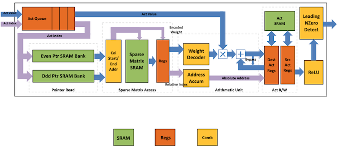
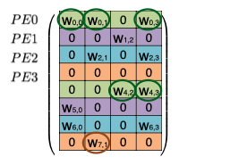
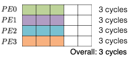

# Lecture 04 - Pruning and Sparsity (Part II)

> [Lecture 04 - Pruning and Sparsity (Part II) | MIT 6.S965](https://youtu.be/1njtOcYNAmg)

> [EfficientML.ai Lecture 4 - Pruning and Sparsity (Part II) (MIT 6.5940, Fall 2023, Zoom recording)](https://youtu.be/sDJymyfAOKY)

weight 혹은 activation 값 중 하나가 0이면, 다음과 같이 곱 연산을 생략할 수 있다.

---

## 4.5 EIE: Parallelization on Sparsity

> [EIE: Efficient Inference Engine on Compressed Deep Neural Network 논문(2016)](https://arxiv.org/abs/1602.01528)

EIE 논문은 weight sparsity 및 activation sparsity를 모두 활용하며, 다음과 같은 이점을 획득했다.

| |  **weight sparsity** (0 $\times$ A = 0) | **activation sparsity** (W $\times$ 0 = 0) |
| :---:| --- | --- |
|  | 90% sparsity 기준 | 70% sparsity 기준 |
| (+) | computation 10배 감소 memory footprint 5배 감소 | computation 3배 감소  | 

> 구체적으로는 sparsity를 활용하는 압축 알고리즘을 통해, DRAM memory access 비용을 절감했다.
> 
> 
>
> > 45NM CMOS process 기준으로, SRAM에 비해  DRAM access가 128배나 되는 에너지를 소모한다.

---

### 4.5.1 Computation and Representation

다음 예시를 통해 EIE의 동작을 살펴보자.

> 기본적으로 weight matrix $W$ 의 행을 interleaving하여 연산을 병렬화한다.

| Processing Element(PE) ( $N=4$ ) | Sparse Matrix $\times$ Sparse Vector Operation ( Input Activation Vector $a$ $\times$ Weight Matrix $W$ )  |
| :---: | :---: |
|  |  |

> 동일한 PE에 저장되는 값은 동일한 색상으로 표기 (색상별로 하나의 큰 배열에 저장된다.)

> (mod N) 연산을 통해 $N$ 개의 PE에 각각 대응되는 $W_i$ 를 분배한다.

모든 $PE$ 는 $W_i$ (weight row), $a_i$ (input activation) $b_i$ (output activation)를 보유하며, 가중치 행렬에서 non-zero 가중치만 벡터에 저장된다. 연산은 다음과 같은 순서로 진행된다.

| Step | Description |
| :---: | --- |
| (i) | 입력에서 non-zero $a_j$ 를 찾은 뒤, PE에게 해당 index $j$ 를 broadcast한다. |
| (ii) | 각 PE는 $a_j$ 와 column $W_j$ 의 non-zero 값과 곱한 뒤, 결과를 output activation $b$ 에 누적한다.(MAC 연산) |

---

### 4.5.2 Compressing Sparse Matrix

> [Matt Eding: Sparse Matrices](https://matteding.github.io/2019/04/25/sparse-matrices/)

EIE 논문은 CSC(Compressed Sparse Column) 포맷을 활용해 sparse weight matrix를 encoding한다. 먼저, 하나의 column을 encoding하는 예시를 살펴보자.

> EIE처럼 $v, z$ entry는 4-bit 값(0~15)으로 양자화된다고 가정하며, 앞에 위치한 0의 개수가 15개를 넘어가는 부분에 주목하자. ( $v$ 는 이후 LUT를 참조하여, 16-bit fixed-point로 decoding된다.)

$$ [0,0,1,2,0,0,0,0,0,0,0,0,0,0,0,0,0,0,0,0,0,0,3] $$

| | | |
| :---: | --- | --- | 
| $v$ | non-zero 값을 담는 벡터 (**Virtual Weight**) | $v = [1,2,\mathsf{0},3]$
| $z$ | $v$ 와 동일한 길이를 가지며, 각 $v$ entry마다 앞에 위치한 0의 개수(distance)를 담는다. (**Relative Index**) | $z = [2,0,\mathsf{15},2]$ |

추가로 $v$ 와 $z$ 를 하나의 큰 배열 쌍에 저장하기 위해, 각 column의 첫 entry 위치를 가리키는 pointer vector $p$ 를 둔다. (**Column Pointer**)

> column $j$ 에 위치한 모든 entry를 불러오려면, $p_j$ index부터 $(p_{j+1} -1)$ index까지 값을 모두 읽으면 된다. 

다음은 sparse weight matrix에 CSC format encoding을 수행한 예시다.

| | |
| :---: | :---: |
| Logically |  |
| Physically |  |

> column $j$ \#nonzero = $p_{j+1} - p_{j}$

---

### 4.5.3 Micro Architecture for each PE

다음은 PE의 micro architecture를 나타낸 도식이다.

> PE array를 제어하는 `Central Control Unit(CCU)`가, PE 내부의 큐로 non-zero activation을 broadcast한다. (queue가 가득차면 broadcast 중단)
>
> > **load imbalance**에 의한 문제를 방지하기 위한 구현으로, PE는 큐에서 계속해서 activation을 읽어와 작업을 수행할 수 있다.(FIFO)

> 1 cycle에 2개 pointer를 모두 읽을 수 있도록, 두 `Ptr SRAM Bank`에서 각자 $p_j$ , $p_{j+1}$ 를 처리한다. (즉, $p_j$ , $p_{j+1}$ 는 항상 다른 bank에 위치한다.)

> `Sparse Matrix SRAM`의 각 entry는 8 bit로 구성되며, 4-bit인 $v$ 와 $z$ 를 하나씩 포함한다. 
>
> > SRAM 자체의 width는 64-bit이므로 8개 entry를 한 번에 가져온다.

| Layout of PE | PE architecture |
| :---: | :---: |
|  |  |

흐름을 단계별로 파악해 보자.

<table>
<tr>
<td>  </td> 
</tr>
<tr>
<td> 

1. **Sparse Matrix Read Unit**

     

    
  
    - 포인터 $p_j, p_{j+1}$ 를 활용해, (SRAM에서) column $j$ 의 nonzero 값을 읽어온다. 

    - $(v, x)$ 를 전달한다. 

      - $x$ : accumulator array index

      - $v$ : weight value

    > pointer $p$ (16 bits): 상위 13 bit는 SRAM row를 가리키고, 하위 3 bit는 entry(8개 원소) 중 하나를 가리킨다.

</td>
</tr>
<tr>
<td> 

2. **Arithmetic Unit**

    

    

    - Sparse Matrix Read Unit에서 $(v, z)$ 값을 받아, MAC 연산( $b_{z} = b_{z} + v \times a_{j}$ )을 수행한다.

    > 이때, 4-bit로 사전에 양자화된 $v$ 를, LUT를 조회하여 16 bits로 decoding하는 과정을 거친다.

</td>
</tr>
<tr>
<td> 

3. **Write Back**

    

    - 연산 결과를 SRAM에 저장한다.

</td>
</tr>
<tr>
<td> 

4. **ReLU**, **Non-zero Detection**

    

    - ReLU 연산을 수행한다.
    
    > Leading Non-zero Detection Node(LNZD) 노드에서 nonzero activation를 찾아낸다.(다음 stage에서 활용)

</td>
</tr>
</table>

---

### 4.5.4 Benchmark of EIE

다음은 EIE를 활용해 다양한 모델을 추론한 결과이다. 

- 특히, 0의 값을 갖는 weight나 activation 대상으로 연산을 생략하기 때문에, 극적인 연산량(FLOPs) 감소를 달성했다.

다음은 지연시간 및 에너지 관점에서, EIE와 다양한 하드웨어 추론 결과를 비교한 도표이다.

> Intel Core i7-5930k CPU, NVIDIA TitanX GPU, NVIDIA Jetson TK1 Mobile GPU

| | |
| :---: | :---: |
| speedup |  |
| energy |  |

---

### 4.5.5 EIE: Pros and Cons

> [Retrospective: EIE: Efficient Inference Engine on Sparse and Compressed Neural Network 논문(2023)](https://arxiv.org/abs/2306.09552)

위 논문에서는, EIE 접근법의 장단점을 다음과 같이 요약하고 있다. 

| 장점 | 단점 |
| --- | --- |
| 연산량, 에너지 효율 fine-grained sparsity 지원 INT4까지 aggressive한 양자화 지원  | control flow 관점에서 overhead, storage overhead structured sparsity 활용 불가 FC layers만 지원 SRAM에 주목한 최적화이므로, LLM 등 큰 모델에 비적합

---

## 4.6 ESE: Load Balance Aware Pruning

> [ESE: Efficient Speech Recognition Engine with Sparse LSTM on FPGA 논문(2016)](https://arxiv.org/abs/1612.00694)

더 나아가 ESE 논문에서는, load balance를 고려하는 weight pruning 알고리즘을 제안했다.

- 모든 submatrix 단위에서 동일한 sparsity ratio를 갖도록 pruning한다.

| Unbalanced | Balanced |
| :---: | :---: |
|  |  |
|  |  |

(생략)

---

