# Lecture 04 - Pruning and Sparsity (Part II)

> [Lecture 04 - Pruning and Sparsity (Part II) | MIT 6.S965](https://youtu.be/1njtOcYNAmg)

> [EfficientML.ai Lecture 4 - Pruning and Sparsity (Part II) (MIT 6.5940, Fall 2023, Zoom recording)](https://youtu.be/sDJymyfAOKY)

sparsity(희소도)를 유용하게 활용하는 연산으로, 메모리 및 지연시간 등 다양한 자원 소모를 절감할 수 있다.

> | Abbreviation | Meaning |
> | --- | --- |
> | **SpMM** | Sparse Matrix-Dense Matrix Multiplication |
> | **SpGEMM** | Sparse GEneral Matrix-Matrix Multiplication |
> | **SDDMM** | Sampled Dense-Dense Matrix Multiplication |
> | **SpMV** | Sparse Matrix-Dense Vector Multiplication |
> | **SpMSpV** | Sparse Matrix-Sparse Vector Multiplication |

---

## 4.7 Sparse Matrix-Matrix Multiplication (SpMM)

다음은 표준 Dense matrix multiplication과 Sparse matrix multiplication(**SpMM**)의 코드를 비교한 도표다.

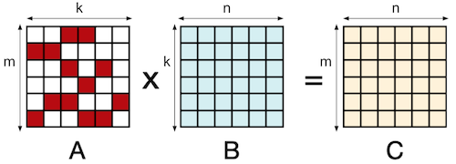


<table>
<tr>
<td> Dense Matrix Multiplication </td> <td> Sparse Matrix Multiplication </td>
</tr>
<tr>
<td> 

```c
for m in range(m):
    for n in range(N):
        for k in range(A[m].size):
            C[m][n] = A[m][k] * B[k][n]
```


</td>
<td> 

```c
for m in range(m):
    for n in range(N):
        for k in range(A[m].nonzero):
            C[m][n] = A[m][k] * B[k][n]
```

</td>
</tr>
</table>

따라서, 행렬이 희소할수록(= \#nonzero가 많을수록) 연산량은 줄어든다.

---

### 4.7.1 CSR Format for Sparse matrices

**CSR**(Compressed Sparse Row) format을 활용하는 연산 예제를 살펴보자.

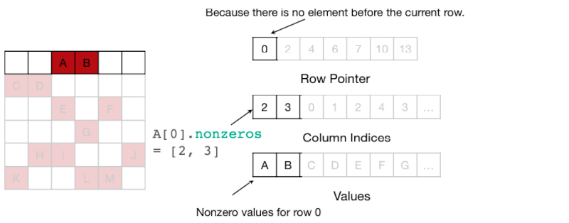

| | |
| --- | --- |
| Row Pointer | 0, 2(`A,B`), 4(`C,D`), 6(`E,F`), 7(`G`), 10(`H,I,J`), 13(`K,L,M`) |
| Column Index | 2(`A`),3(`B`), 0(`C`),1(`D`), 2(`E`),4(`F`), 3(`G`), ... |
| Value | `A,B`, `C,D`, `E,F`, `G`, ... |

따라서 $m_i$ 행의 \#nonzero는 다음 계산으로 구할 수 있다.

```c
for i in range(m):
    nnz = row_ptr[i+1] - row_ptr[i]
```

---

## 4.8 (Background) GPU Thread Hierarchy

> [CUTLASS: Fast Linear Algebra in CUDA C++](https://developer.nvidia.com/blog/cutlass-linear-algebra-cuda/)

CUDA는 data parallelism과 thread parallelism의 병렬 처리를 지원한다. 이때 프로그램은 thread block로 병렬화되며, 블록은 1~3차원의 **grid of thread blocks**으로 구성된다.

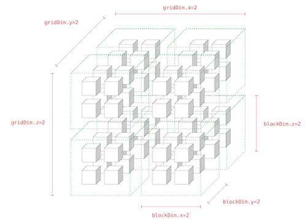

그리고 **SM**(Streaming Multiprocessor)에서 하나 이상의 thread block이 실행되면, multiprocessor는 이를 32개 thread로 구성된 **warp**라는 단위로 나누어 스케줄러에 전달한다.

>  warp는 한 번에 하나의 instruction을 실행하며, 내부의 모든 thread에서 동일한 instruction을 수행한다.

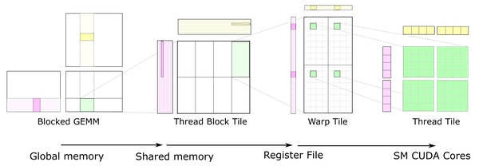

참고로 SM당 max warp 수는 일반적으로 32~64개이다. 만약 max warp 수가 64개라면, SM당 max thread 수는 32\*64=2,048개가 된다.

> 또한 로컬 범위(k < 32)의 병렬 처리가 중요한 특정한 연산에서는, GPU 하드웨어의 최소 실행 단위인 warp보다 작은 **sub-warp** 단위에서, 병목을 해결해야 하는 필요성이 대두되었다.

---

## 4.9 GPU Support for SpMM

> [Sparse GPU Kernels for Deep Learning 논문(2020)](https://arxiv.org/abs/2006.10901)

위 논문에서는 **SpMM**과 **SDDMM** 연산을 위한 효율적인 GPU 커널이 제안되었다. 논문에서는 71% 이상의 희소한 행렬에서 dense matrix multiplication보다 runtime을 줄일 수 있었다.

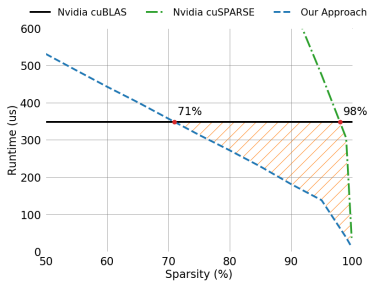

> NVIDIA V100 GPU(CUDA 10.1) 추론 기준

---

### 4.9.1 Hierarchical 1-Dimensional Tiling

SpMM과 SDDMM 연산을 효율적으로 수행하기 위한 **Hierarchical 1-Dimensional Tiling**이 제안되었다.

- 각 thread block은 효율적으로 CSR format을 처리할 수 있도록, (기존의 2D tiling이 아닌) 1D tiling 단위의 계산을 수행한다.

- tile은 row-splitting을 통해 생성하고, 각각에 독립적인 thread block을 매핑한다.

| 2D tiling(GEMM) | 1D tiling(SpMM) |
| :---: | :---: |
| 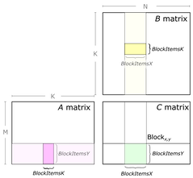 |  |

> $A$ : CSR format으로 압축된 sparse matrix, $B$ : dense matrix, $C$ : output matrix

해당 설계는 딥러닝 학습의 GEMM 연산에서 행렬이 갖는 열의 수가 매우 다양할 수 있다는 점에서 착안하였다. 1D tiling은 다양한 타일 크기에 대응하도록 커널을 쉽게 변형할 수 있으며, loop unrolling 등의 최적화 기법을 적극적으로 활용할 수 있다는 장점을 갖는다.

> - RNN: 일반적으로 16-128개 열을 갖는다. (`batch size`)
>
> - Transformer: 256-2048개 열 이상. (`batch size * sequence length`)
> 
> - 1x1 Convolution: EfficientNet 아키텍처 기준으로 64-14,400개 열을 가진다. (`height * width * batch size`)

참고로 희소 행렬 $A$ 의 행은 모든 thread의 계산에서 사용하므로 shared memory에 저장되며, 각 thread의 local register에서는 $B$ 의 벡터를 불러오게 된다.

---

### 4.9.2 Load Balancing Sparse Matrix Computation

하지만 sparse computation에서 종종 발생하는 문제로 **load imbalance**가 있다.

| Source | Description | Solution |
| --- | --- | --- |
| between warps or thread blocks | 다른 워프/스레드 블록보다 작업이 적게 할당된 경우 | Row Binning |
| within a warp or thread block | 워프 내 일부 스레드가, 다른 스레드보다 적은 작업이 할당된 경우 | Row Bundling |

논문에서는 load imbalance 문제를 해결하기 위해, 2단계(Row Binning, Row Bundling)로 구성되는 **row swizzle** 기법을 제안했다.


> 동일 색상 = 동일 warp에서 처리되는 rows. (동일한 길이의 rows를 *bundle*이라는 단위로 그룹화한 뒤, 길이가 작은 row bundle부터 처리하는 것으로 SM 간의 load balance를 맞춘다.)

- Row Binning: 각 SM에서 거의 동일한 양의 작업을 처리하도록 행을 분할

- Row Bundling: 각 subwarp에서 동일한 양의 작업을 처리하도록 tile mapping을 변경

해당 기법은 balanced sparse matrix(모든 행에서 동일한 수의 nonzero를 갖는 설정) 연산에서 96.5%의 처리율(throughput)을 달성하였다.

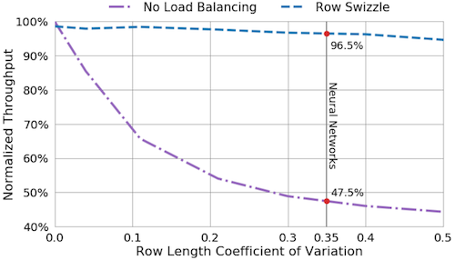

> row length(=\#nonzero) **CoV**(Coefficient of Variation): `Std(row length)/Mean(row length)`

> 검은색 실선: 데이터셋에서 sparse matrix의 평균 CoV를 나나탠다.

---

## 4.10 NVIDIA Tensor core: M:N Sparsity

> [Accelerating Sparse Deep Neural Networks 논문(2021)](https://arxiv.org/abs/2104.08378)

위 논문에서 **M:N sparsity**를 활용한 커널 최적화 기법이 제안되었다. (NVIDIA Ampere GPU 이상에서 지원)

대표적으로 **2:4 sparsity**는, 파라미터 4개 중에서 zero인 원소를 최소한 2개 포함하는 패턴을 의미한다. (50%) 다음은 2:4 sparsity pattern의 가중치 행렬 $W$ 을 압축한 도식이다.

> \#zero > 2 경우에도 압축 행렬은 반드시 값 2개를 보관한다.

|| structured-sparse matrix $W$ | | structured-sparse<br/>compressed matrix $W$ |
| :---: | --- | :---: | --- | 
|| 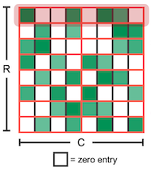 | $\rightarrow$ | 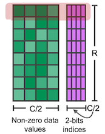 |
| \#elements | $R \times C$ <br> | | (Data) $R \times C/2$ + <br> (Indice) $R \times C/2$ (**2-bits**) |

해당 indice를 사용해 입력을 마스킹하는 것으로, 입력인 Dense matrix( $K$ elements )에서 오로지 $K/2$ 개의 원소만으로 GEMM 연산을 수행할 수 있다.

| Dense $M \times N \times K$ GEMM | Sparse $M \times N \times K$ GEMM |
| :---: | :---: |
|  | 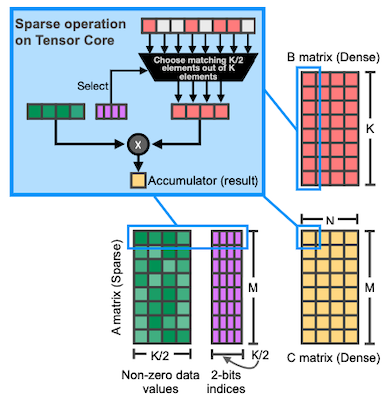 |

---

### 4.10.1 Benchmark of M:N Sparsity

다음은 NVIDIA A100 GPU에서 M:N Sparsity를 적용한 벤치마크이다. INT8 GEMM에서 기존보다 거의 2배의 speedup을 달성할 수 있었다. (특히 matrix 크기가 클수록 효율적이다.)

| | |
| :---: | --- |
| Speedup |  |
| Accuracy<br/>(FP16,INT8) | 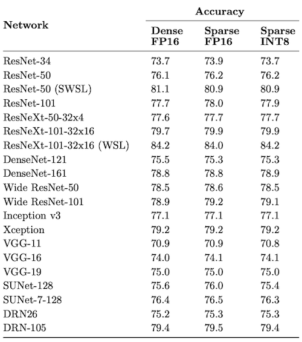 |

---

## 4.11 Block-wise SpMM

> [Accelerating Matrix Multiplication with Block Sparse Format and NVIDIA Tensor Cores(2021)](https://developer.nvidia.com/blog/accelerating-matrix-multiplication-with-block-sparse-format-and-nvidia-tensor-cores/)

NVIDIA는 최적화를 위한 또 하나의 대안으로 **block sparse matrix multiplication** 연산을 제안하였다. (`cuSPARSE 11.4.0`부터 지원)

다음은 block sparse format를 사용한 GEMM 연산을 기존과 비교한 도식이다. 이때 blockwise SpMM에서는 기존 SpMM과 달리, $B$ 행렬에서 element 일부만 연산에 사용하며 불필요한 계산을 생략한다.

| Conventional GEMM | GEMM using Blockwise SpMM |
| :---: | :---: |
| 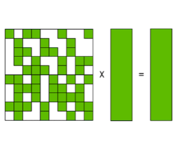 | 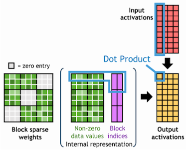 |

> sparse weights $A(M \times K)$ , dense input activations $B(K \times N)$ , dense output activations $C(M \times N)$

---

### 4.11.1 Blocked-Ellpack Format

희소 행렬은 두 개의 2D 배열로 구성된 **Blocked-Ellpack**(Blocked-ELL) format으로 저장된다.

> CSR format처럼 row-major order를 따라 저장되며, 희소 행렬의 각 row는 반드시 동일한 수의 block을 가져야 한다. (수가 적다면 zero padding으로 충족 가능)

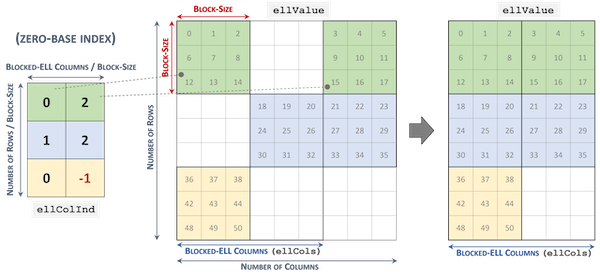

| Array | Description |
| --- | --- |
| `ellColIdx` | non-zero column index |
| `ellValue` | non-zero block value |

---

## 4.12 PatDNN: GPU Support for Pattern-based Sparsity

> [PatDNN: Achieving Real-Time DNN Execution on Mobile Devices with Pattern-based Weight Pruning 논문(2020)](https://arxiv.org/abs/2001.00138)

PatDNN에서는 pattern-based pruning 알고리즘과, pattern-based sparsity에 최적화된 GPU 커널을 공동으로 설계하였다.

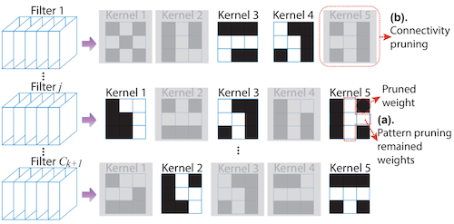

---

### 4.12.1 Filter-Kernel-Weight (FKW) Format

이어서 load imbalance를 해결하기 위해, pruning을 마친 CNN filter를 대상으로 row length에 따라 grouping 및 reordering을 수행한다.

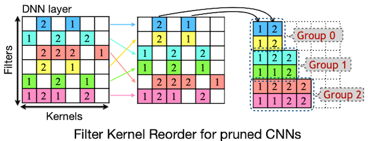

이후 논문에서 제안한 Filter-Kernel-Weight (FKW) format에 따라 저장된다.

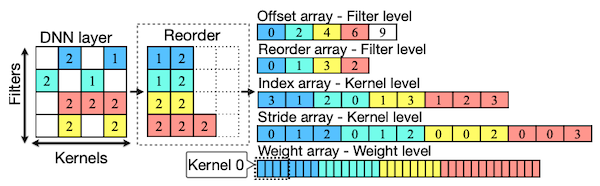

---

### 4.12.2 Load Redundancy Elimination

Convolution 연산에서 두 가지 load redundancy(kernel-level, filter-level)를 제거하기 위해, 논문에서는 다음과 같이 커널을 최적화하였다.

- kernel-level: `값 1`(입력 행렬의 1,2번 row 필요), `값 2`(입력 행렬의 2,3번 row 필요)

  $\Rightarrow$ 따라서 SIMD 레지스터에 저장된 2번 행 값을 재사용하는 것으로 load redundancy를 제거한다.

- filter-level: `Filter 0`, `Filter 1` 모두 입력 행렬의 회색 영역(trunk) 필요

| | |
| --- | :---: |
| kernel-level | 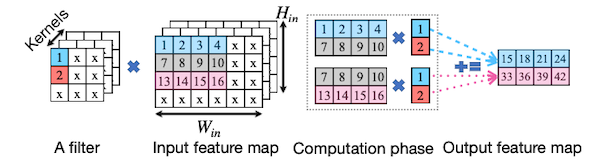 |
| filter-level | 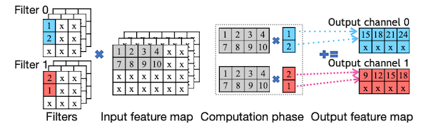 |

---