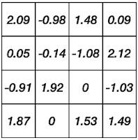
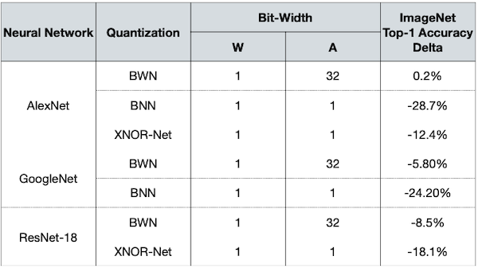

# Lecture 06 - Quantization (Part II)

> [Lecture 06 - Quantization (Part II) | MIT 6.S965](https://youtu.be/3nqUFSSJYKQ)

> [Neural Network Quantization Technique - Post Training Quantization](https://medium.com/mbeddedwithai/neural-network-quantization-technique-post-training-quantization-ff747ed9aa95)

---

## 6.6 Quantization-Aware Training(QAT)

**Quantization-Aware Training**(QAT)이란 training 혹은 re-training(fine-tuning)을 통해, 최적의 quantization scheme을 찾는 방법이다.

| | PTQ | QAT |
| :---: | :---: | :---: |
| 속도 | 대체로 빠르다 | 느리다 |
| re-training | 불필요 | 필요 |
| Plug and Play | 가능 | re-training 필요 |
| accuracy drop | 조절하기 힘들다. | 어느 정도 조절할 수 있다. |

> Plug and Play(PnP): 별다른 설정없이 적용 가능

---

### 6.6.1 Simulated/Fake Quantization

모델의 학습 과정에서, 양자화 후 정확도를 미리 확인하는 simulation을 통해 최적의 양자화 정책을 결정할 수 있다. (**simulated quantization** = **fake quantization**)

- 훈련 중 weight W의 full precision copy는 유지된다.

- 정수 값을 사용하면 포착하지 못할 small gradient를 문제 없이 반영할 수 있다.

- 훈련 후 실제 추론에서는 quantized weight를 사용한다.

다음은 simulated quantization 방법을 통해, linear quantization 기반 weight, activation quantization을 수행하는 연산 그래프다.


- Weight quantization

$$ W \rightarrow S_{W}(q_{W} - Z_{W}) = Q(W) $$

- Activation quantization

$$ Y \rightarrow S_{Y}(q_{Y} - Z_{Y}) = Q(Y) $$

---

### 6.6.2 Straight-Through Estimator(STE)

> [Estimating or Propagating Gradients Through Stochastic Neurons for Conditional Computation 논문(2013)](https://arxiv.org/abs/1308.3432)

> [UNDERSTANDING STRAIGHT-THROUGH ESTIMATOR IN TRAINING ACTIVATION QUANTIZED NEURAL NETS 논문(2019)](https://arxiv.org/abs/1903.05662)

하지만 양자화된 값은 discrete하므로, 거의 대부분의 경우에서 미분 값은 0이 된다.

$$ {{\partial Q(W)} \over {\partial W}} = 0 $$

따라서 다음과 같이 gradient update 과정 역시 불가능하게 된다.

$$ g_{W} = {{\partial L} \over {\partial W}} = {{\partial L} \over {\partial Q(W)}} \cdot {{\partial Q(W)} \over {\partial W}} = 0 $$

이러한 문제를 해결하기 위해 등장한 방법이 **Straight-Through Estimator**(STE)이다.

- ${{\partial Q(W)}/{\partial W}}$ deriative를 무시하고, identity function처럼 고려한다. 

- 따라서 quantized weight만으로 바로 gradient update를 수행한다.

$$ g_{W} = {{\partial L} \over {\partial W}} = {{\partial L} \over {\partial Q(W)}} $$

---

### 6.6.3 INT8 Linear Quantization-Aware Training

> [Quantizing deep convolutional networks for efficient inference: A whitepaper 논문(2017)](https://arxiv.org/abs/1806.08342)

작은 모델에서는 INT8 linear QAT 방법이, PTQ보다 훨씬 더 좋은 정확도를 갖는 것을 알 수 있다.


---

## 6.7 Binary Quantization

**Binary Quantization**은 더 나아가 1 bit만을 사용하는 양자화 방식이다. 

- storage: binary weights

- computation: bit operation

real number weight 연산과, binary quantizated weight 연산을 비교해 보자.

| baseline | Real Number Weights | Binary Quantized Weights |
| :---: | :---: | :---: |
|  |  |  |
| $y_i = \sum_{j}{W_{ij} \cdot x_{j}}$ | $8 \times 5 + (-3) \times 2 + 5 \times 0 + (-1) \times 1$ | $5 - 2 + 0 - 1$ |
| operation | + x | + - |
| memory | 1x | ~32x less |
| computation | 1x | ~2x less |

**Binarization**은 크게 deterministic binarization, stochastic binarizaion 방법으로 나뉜다.

- **Deterministic Binarization**

    정해둔 threshold 이상인 값은 1, 미만인 값은 -1로 양자화한다.(sign function)

```math
q = sign(r) = \begin{cases} +1, & r \ge 0 \\ -1, & r < 0 \end{cases}
```

- **Stochastic Binarization**

    global statistics 혹은 input data를 바탕으로, 양자화 시 -1, +1 probability를 결정한다.

---

### 6.7.1 Binarize the weights

> [BinaryConnect: Training Deep Neural Networks with binary weights during propagations 논문(2015)](https://arxiv.org/abs/1511.00363)

대표적으로 BinaryConnection 논문은 다음과 같이 양자화한다.
 
- discrete한 정도를 averaging할 수 있도록, **hard sigmoid**를 이용해서 probability를 결정한다.( $\sigma (r)$ ) 

  

```math
q = \begin{cases} +1, & with \, probability \, p = \sigma(r) \\ -1, & with \, probability \, 1 - p \end{cases}
```

$$ \sigma (r) = \min (\max ({{r+1} \over {2}}), 1) $$

- (-) 하지만 정확도 손실이 크다. (ImageNet 대상 AlexNet Top-1 accuracy: -21.2%p)

- (-) 하드웨어에서 probability 계산을 위한 함수를 지원하지 않을 수 있다.

---

### 6.7.2 Binarize the weights with scaling factor

> [XNOR-Net: ImageNet Classification Using Binary Convolutional Neural Networks 논문(2016)](https://arxiv.org/abs/1603.05279)

XNOR-Net 논문에서는 weight binarization에 따른 정확도를 회복하기 위해, binarized weight tensor(`fp32`)에 FP32 scaling factor를 추가한다.

$$ W \approx \alpha W^{\mathbb{B}} $$

| weights<br/>(32bit float) | BinaryConnection | XNOR-Net |
| :---: | :---: | :---: |
|  |  |  |

이러한 scaling factor $\alpha$ 는, 양자화 전 가중치 행렬 원소(FP32)의 절대값 평균을 사용한다.

$$ \alpha = {1 \over n}||W||_1 $$

---

### 6.7.3 Binarize the weights and activations

혹은 weight과 activation에 모두 binary quantization을 적용할 수 있다. 이 경우 모든 연산을 XNOR 연산으로 대체할 수 있다. 가령 다음과 같은 연산을 생각해 보자.

$$ y_i = \sum_{j}{W_{ij} \cdot x_{j}} $$

- 연산의 가능한 경우의 수는 다음과 같다.

    | W | X | Y=WX |
    | :---: | :---: | :---: |
    | 1 | 1 | 1 |
    | 1 | -1 | -1 |
    | -1 | -1 | 1 |
    | -1 | 1 | -1 |

- -1 대신 0으로 바꾸면, XNOR 진리표와 완전히 일치한다.

    | $b_w$ | $b_x$ | XNOR( $b_w, b_x$ ) |
    | :---: | :---: | :---: |
    | 1 | 1 | 1 |
    | 1 | 0 | 0 |
    | 0 | 0 | 1 |
    | 0 | 1 | 0 |

앞선 예시와 비교 시, 메모리는 32배 이상, 연산은 58배 이상 줄어든다.

| input | weight | operations | memory | computation |
| :---: | :---: | :---: | :---: | :---: |
| $\mathbb{R}$ | $\mathbb{R}$ | + x | 1x | 1x |
| $\mathbb{R}$ | $\mathbb{B}$ | + - | ~32x less | ~2x less |
| $\mathbb{B}$ | $\mathbb{B}$ | xnor, popcount | ~32x less | ~58x less |

### <span style='background-color: #393E46; color: #F7F7F7'>&nbsp;&nbsp;&nbsp;📝 예제 1: Binary Weight Quantization &nbsp;&nbsp;&nbsp;</span>

다음 행렬 연산을 xnor 연산으로 계산하라.


### <span style='background-color: #C2B2B2; color: #F7F7F7'>&nbsp;&nbsp;&nbsp;🔍 풀이&nbsp;&nbsp;&nbsp;</span>

$$ = 1 \times 1 + (-1) \times 1 + 1 \times (-1) + (-1) \times 1 = -2 $$

$$ = 1 \, \mathrm{xnor} \, 1 + 0 \, \mathrm{xnor} \, 1 + 1  \, \mathrm{xnor} \, 0 + 0 \, \mathrm{xnor} \, 1 = 1 $$

하지만 단순히 -1을 0으로 치환해서는 다른 결과가 나오게 된다. 따라서 다음과 같은 보정을 거쳐야 한다.

- 1: 본래 -1, 1의 차이인 2를, 1의 개수만큼 더해준다.

- 0: -1을 치환한 값이므로, 0의 개수만큼 -1을 더해준다.

$$ -4 + 2 \times (1 + 0 + 0 + 0) = -2 $$

위 식을 다음과 같이 일반화할 수 있다.

$$ y_i = -n + 2 \cdot \sum_{j} W_{ij} \, \mathrm{xnor} \, x_j $$

이는 원소 중 1의 개수가 얼마나 있는지를 파악하는, **popcount** 연산으로 대신할 수 있다.

$$ y_i = -n + \mathrm{popcount}(W_i \, \mathrm{xnor} \, x) \ll 1$$

---

### 6.7.3 Accuracy Degradation of Binarization

다음은 다양한 binary quantization에 따른 정확도 변화를 정리한 도표이다.

- BWN: scaling factor를 사용하는 **Binary Weight Network**

- BNN: scale factors를 사용하지 않는 **Binarized Neural Network** 



---

## 6.8 Ternary Quantization

> [Ternary Weight Networks 논문(2016)](https://arxiv.org/abs/1605.04711)

1bit만을 사용하는 binary quantization보다 정확도를 보존하기 위해, 2bit(-1, 0, 1)를 사용한 quantization **Ternary Weight Networks**(TWN)가 등장했다.

```math
q = \begin{cases} r_t, & r > \triangle \\ 0, & |r| \le \triangle \\ -r_t, & r < - \triangle \end{cases}
```

- $\triangle = 0.7 \times \mathbb{E}(|r|)$

- $r_t = \mathbb{E_{|r| > \triangle}}(r)$

앞선 예시에 ternary quantization을 적용해 보자.

- threshold $\triangle$

$$\triangle = 0.7 \times {{1}\over{16}}||W||_1 = 0.73$$

- scaling factor $r_t$

  non-zero 값을 바탕으로 l1 norm을 계산한다.

$$ {{1} \over {11}}||W_{W^T \neq 0} ||_1 = 1.5 $$

| weights $W$ <br/>(32bit float) | ternary weights $W^T$ <br/>(2bit) |
| :---: | :---: |
|  |  |

---

### 6.8.1 Trained Ternary Quantization(TTQ)

> [Trained Ternary Quantization 논문(2016)](https://arxiv.org/abs/1612.01064)

Trained Ternary Quantization(TTQ) 논문에서는, 기존의 -1, 0, 1 대신 훈련 가능한 $w_{p}$ , $w_{n}$ 패러미터를 도입한 ternary quantization을 적용한다.


1. full precision 가중치를 [-1, 1] 사이로 normalize한다.

2. threshold에 따라 -1, 0, 1로 ternary quantization을 수행한다.

3. scale parameter $w_n$ , $w_p$ 를 훈련한다.

```math
q = \begin{cases} w_p, & r > \triangle \\ 0, & |r| \le \triangle \\ -w_p, & r < - \triangle \end{cases}
```

다음은 ImageNet 대상 ResNet-18 모델에서, full precision, BWN, TWN 각각의 Top-1 accuracy를 비교한 도표다.

| ImageNet Top-1</br>Accuracy | Full Precision | BWN(1 bit) | TWN(2 bit) | TTQ |
| :---: | :---: | :---: | :---: | :---: |
| ResNet-18 | 69.6 | 60.8 | 65.3 | 66.7 |

---