# 7 Neural Architecture Search (Part I)

> [Lecture 07 - Neural Architecture Search (Part I) | MIT 6.S965](https://www.youtube.com/watch?v=NQj5TkqX48Q)

AutoML은 크게 세 가지 process를 통칭하는 용어다. 이번 챕터는 그 중 **Neural Architecture Search**(NAS)에 대해 다룬다.

| feature engineering | Hyper-Parameter Optimization(HPO) | Neural Architecture Search |
| :---: | :---: | :---: |
| 도메인 지식에 기반한 feature engineering | hyperparameter의 meta-optimization | 최적 model architecture를 탐색 |

---

## 7.1 Basic Concepts

NAS는 모델 구조를 나누어 부를 때, 다음과 같이 input stem, stage, head 세 가지 용어를 주로 사용한다.

- **Input Stem** 

  - 주로 큰 커널 크기( $7 \times 7$ )를 사용한다.

    > channel 수가 3개(RGB)로 적기 때문에, 계산량 자체는 적다.

- **Stage**

  - 출력 해상도가 동일한 block들의 집합이다. (first block에서 downsampling 수행)

  - downsampling이 있는 블록을 제외한, stage의 나머지 블록에서는 **residual connection**을 추가할 수 있다.

- **Head**

  - application-specific하다. (detection head, segmentation head 등)

이때, early stage와 late stage의 특징을 비교하면 다음과 같다.

|| early stage | late stage |
| :---: | :---: | :---: |
| activation size | 크다 | 작다 |
| \#parameters | 적다 | 많다 |

---

## 7.2 manually-designed neural network

다음은 ImageNet 데이터셋에서 학습한 여러 CNN 모델를, 연산량(MACs)-정확도 그래프에 나타낸 것이다.

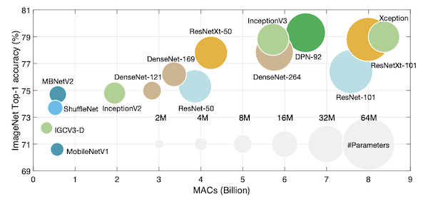

> NAS는 이러한 CNN 모델에 기반하여, 더 효율적인 모델을 찾는 경우가 많다. 따라서, 먼저 이러한 CNN 모델을 살펴보자.

---

### 7.2.1 AlexNet, VGGNet

> [ImageNet Classification with Deep Convolutional Neural Networks 논문(2012)](https://proceedings.neurips.cc/paper_files/paper/2012/file/c399862d3b9d6b76c8436e924a68c45b-Paper.pdf): AlexNet

> [Very Deep Convolutional Networks for Large-Scale Image Recognition 논문(2014)](https://arxiv.org/abs/1409.1556): VGGNet

다음은 CNN의 초기 모델인 AlexNet과 VGGNet의 구조를 비교한 도표다.

|| AlexNet | VGGNet |
| :---: | :---: | :---: |
| 구조 |  |  |
| 특징 | ealry stage에서 큰 kernel size를 사용 ( $11 \times 11$ ) | early stage에서 작은 kernel을 여러 개 사용 ( $3 \times 3$ ) |

VGGNet에서는 $3 \times 3$ 레이어를 두 개 쌓는 것이, AlexNet보다 computational cost가 적게 들면서도 더 나은 성능을 보임을 입증했다.

- (-) 하지만 \#layers, kernel call, memory access가 늘어나면서, 메모리 효율성 측면에서는 단점을 갖는다.
  
  

---

### 7.2.2 SqueezeNet: File Module

> [SqueezeNet: AlexNet-level accuracy with 50x fewer parameters and <0.5MB model size 논문(2016)](https://arxiv.org/pdf/1602.07360)

**SqueezeNet**은 $3 \times 3$ convolution을 **fire module**로 대체하여, 파라미터 수를 줄이면서 성능은 유지하여 효율적으로 연산을 수행한다.

| Architecture | Fire Module |
| :---: | :---: | 
|  |  |
| head에서 GAP(Global Average Pooling)을 사용한다. | $1 \times 1$ convolution(**squeeze**), $3 \times 3$ convolution(**expand**)을 사용한다. |

fire module은 다음과 같은 단계로 연산이 진행된다.

| Squeeze | $\rightarrow$ | Expand | $\rightarrow$ | Concatenate |
| :---: | :---: | :---: | :---: |:---: |
| 채널 수를 줄인다. ( $1 \times 1$ ) || 채널 수를 확장한다. ( $1 \times 1$ , $3 \times 3$ ) || 출력을 합친다. |

---

### 7.2.3 ResNet50: Bottleneck Block

> [Deep Residual Learning for Image Recognition 논문(2015)](https://arxiv.org/abs/1512.03385)

ResNet에서는 **bottleneck block**을 도입하여, 연산량은 줄이면서 residual connection을 통해 gradient vanishing 문제를 해결하며, 더 깊은 CNN 구조를 구현할 수 있게 되었다.

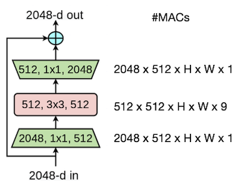

### &nbsp;&nbsp;&nbsp;📝 예제 1: bottleneck block MACs &nbsp;&nbsp;&nbsp;

위 bottleneck block 그림에서 \#MACs 연산이 얼마나 줄었는지 계산하라.

### &nbsp;&nbsp;&nbsp;🔍 풀이&nbsp;&nbsp;&nbsp;

- full convolution(\#channels 2048, \#kernels 9)

$$ 2048 \times 2048 \times H \times W \times 9 = 512 \times 512 \times H \times W \times 144 $$

- bottleneck block

$$ 2048 \times 512 \times H \times W \times 1 $$

$$ + 512 \times 512 \times H \times W \times 9 $$

$$ + 2048 \times 512 \times H \times W \times 1 $$

$$ = 512 \times 512 \times H \times W \times 17 $$

> 총 **8.5배** \#MACs 연산이 줄어들었다.

---

### 7.2.4 ResNeXt: Grouped Convolution

> [Aggregated Residual Transformations for Deep Neural Networks 논문(2017)](https://arxiv.org/abs/1611.05431)

**ResNeXt**(2017) 논문은, **grouped convolution**을 도입하여 파라미터 수는 줄이면서 정확도는 늘렸다.

| ResNet(2015) | ResNeXt(2017) |
| :---: | :---: |
| 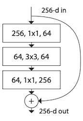 | 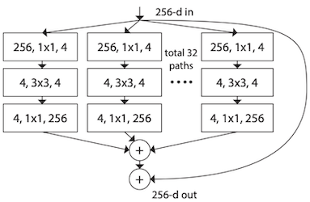 |

> 표기: \#입력 채널 수, 필터 크기, \# 출력 채널 수

> 논문에서는 group 수를 cardinality라는 용어로 정의한다.

---

### 7.2.5 ShuffleNet: 1x1 group convolution & channel shuffle

> [ShuffleNet: An Extremely Efficient Convolutional Neural Network for Mobile Devices 논문(2018)](https://arxiv.org/abs/1707.01083)
 
ShuffleNet에서는, group convolution에서 channel information이 손실되는 것을 보완하기 위한 방법으로 **channel shuffle**을 제안했다.

| ShuffleNet block | Channel Shuffle |
| :---: | :---: |
|  |  |

---

### 7.2.6 SENet: Squeeze-and-Excitation Block

> [Squeeze-and-Excitation Networks 논문(2017)](https://arxiv.org/pdf/1709.01507.pdf)

SENet은 **Squeeze-and-Excitation**(**SE**) block을 도입하여, feature map의 <U>각 channel의 정보가 얼마나 중요한지를 판단</U>한 뒤, 해당 채널을 강조하여 성능을 향상시킨다.

> Transformer의 attention과 비슷한 메커니즘으로 볼 수 있다. 

> SE block은 다른 CNN model(VGG, ResNet 등)의 어디든 부착할 수 있다.

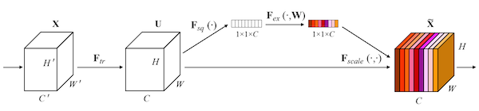

SE block은 Squeeze-Ecxcitation 두 단계로 이루어진다.

- **Squeeze**(압축)

  global average pooling 연산을 이용하여, spatial information을 $1 \times 1$ 로 압축한다.(\#channels $C$ 는 유지)

  - $u_{c}$ : feature map( $H \times W$ )

$$ z = F_{sq}(u_{c}) = {{1} \over {H \times W}} {\sum_{i=1}^{H}}{\sum_{j=1}^{W}}{u_{c}(i, j)} $$

- **Excitation**(재조정)

  squeeze된 벡터를 normalize한 뒤, 원래 feature map에 곱해준다. 이때 FC1 - ReLU - FC2 - Sigmoid 순서로 normalize된다.

  - $W_{1}, W_{2}$ : FC layer weight matrix

  - $\delta$ : ReLU 연산, $\sigma$ : Sigmoid 연산

  

$$ s = F_{ex}(z, W) = {\sigma}(W_{2} {\delta}(W_{1} z)) $$

이렇게 구한 가중치 벡터 $s$ 를 feature map $u$ 에 곱하는 것으로, 중요한 channel 값을 강조한다.

$$ F_{scale}(u_{c}, s_{c}) = s_{c} \cdot u_{c} $$

---

## 7.3 MobileNet Family

---

### 7.3.1 MobileNet: Depthwise-Separable Block

> [MobileNets: Efficient Convolutional Neural Networks for Mobile Vision Applications 논문(2017)](https://arxiv.org/abs/1704.04861)

**MobileNetV1**(2017)은 depthwise, pointwise convolution 두 레이어가 연결된, **depthwise-separable block**을 제안했다.

> input stem의 하나의 full conv을 제외하고, 나머지는 모두 depthwise-separable conv 연산으로 구성된다.

| depthwise conv | pointwise conv |
| :---: | :---: |
| 단일 채널마다 spatial information을 캡처 | spatial information을 mixing |

이때, conv 다음으로 이어지는 activation function(non-linearity)으로 ReLU6를 사용한다.

depthwise-separable block과 full conv block을 비교 시, 훨씬 적은 파라미터 수로 근소한 정확도를 확보한다.

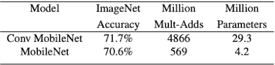

> depthwise-separable block: \#channels = \#groups인 극단적인 형태의 group convolution로도 볼 수 있다.

---

#### 7.3.1.1  Width Multiplier, Resolution Multiplier

> [Width Transfer: On the (In)variance of Width Optimization 논문(2021)](https://arxiv.org/abs/2104.13255)

MobileNet에서는 다양한 조건에 맞는 모델을 획득할 수 있도록, 두 가지 하이퍼파라미터를 추가로 사용한다. 

| Width Multiplier $\alpha$ | Resolution Multiplier $\rho$ |
| :---: | :---: |
| 출력 채널 수에 적용 ( $N \rightarrow {\alpha}N$ ) | 입력 데이터의 해상도에 적용 |

> $\alpha \in (0, 1]$ , $\rho \in (0, 1]$

---

### 7.3.2 MobileNetV2: inverted bottleneck block

> [MobileNetV2: Inverted Residuals and Linear Bottlenecks 논문(2018)](https://arxiv.org/pdf/1801.04381.pdf)

기존 bottleneck block의 문제점은, ReLU를 사용하면서 잃는 정보량이 많다는 점이다. **MobileNetV2**(2018)은 입력, 출력 채널 수를 늘리면, 정보 손실을 compensate할 수 있다는 아이디어로부터, **inverted bottleneck block**을 제안했다.

| inverted bottleneck block | stride=1 | stride=2 | 
| :---: | :---: | :---: |
|  | 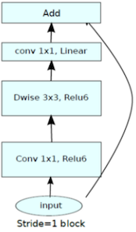 | 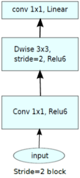 |
| | block + residual connection | block + downsampling |

MobileNetV1과 비교했을 때, 더 적은 파라미터로 보다 우수한 성능을 획득했다.

---

### 7.3.3 MobileNetV3

> [Searching for MobileNetV3 논문(2019)](https://arxiv.org/pdf/1905.02244.pdf)

**MobileNetV3**(2019)는 MobileNetV2의 후속 논문으로, NetAdapt algorithm + hardware-aware NAS를 이용해 찾은 개선된 architecture이다. 

| MobileNetV3-Large | MobileNetV3-Small |
| :---: | :---: |
| 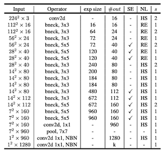 |  |

- SE: Squeeze-and-Excitation block

- NL: non-linearity

  > HS: h-swish, RE: ReLU

- NBN: no batch normalization

---

#### 7.3.3.1 MobileNetV2 vs MobileNetV3

MbV3은 MbV2에서 비용이 큰 레이어(last stage)를 구조적으로 개선하고, 개선된 non-linearity function을 사용한다.

- redesign expensive layers

  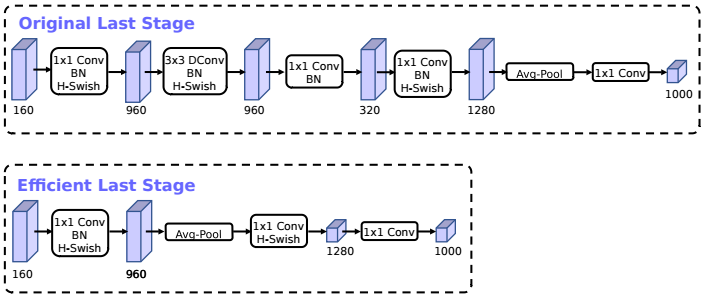

  | MobileNetV2 | MobileNetV3 |
  | :---: | :---: |
  | 1x1 conv + avgpool (expensive) | avgpool + 1x1 conv (effective) |

- nonlinearity(activation function)

  ReLU와 **h-swish**를 함께 사용한다. 미분해서 상수 값이 아니며, 일부 음수 값을 허용한다.

  > 단독으로 h-swish만을 사용하기보다, ReLU와 함께 사용하면 더 좋은 성능을 보였다.

---

#### 7.3.3.2 swish vs h-swish

**swish**는 sigmoid를 포함하기 때문에 복잡하고, 하드웨어 지원이 제한적이다. 이를 보완하기 위해 등장한 non-linearity가 바로 **h-swish**이다.

| ReLU vs swish | swish vs h-swish |
| :---: | :---: |
|  | 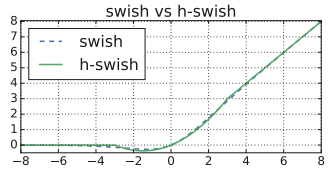 |

$$ \mathrm{swish} \ x = x \cdot {\sigma}(x) $$

$$ \mathrm{h} \ \mathrm{swish} \ = x{{\mathrm{ReLU}6(x+3)} \over {6}} $$

---