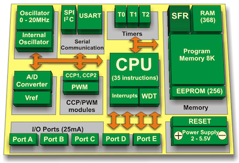
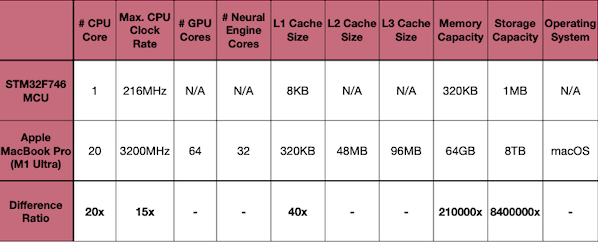

# Lecture 17 - TinyEngine - Efficient Training and Inference on Microcontrollers

> [Lecture 17 - TinyEngine - Efficient Training and Inference on Microcontrollers | MIT 6.S965](https://youtu.be/oCMnJXH0c50)

> [EfficientML.ai Lecture 11 - TinyEngine and Parallel Processing (MIT 6.5940, Fall 2023, Zoom)](https://youtu.be/gGcbn0ISOJM)

*TinyEngine*는 MCU의 추론 비용을 개선하기 위한 방법으로, 다음과 같은 커널 최적화 기법을 활용하였다.

- **Parallel Computing Techniques**

  - loop unrolling

  - loop reordering

  - loop tiling

  - SIMD(Single Instruction Multiple Data) programming

- **Inference Optimizations**

  - im2col(Image to Column) convolution

  - in-place depth-wise convolution

  - `NHWC` pointwise convolution, `NCHW` depthwise convolution

  - Winograd convolution

---

## 17.1 Introduction to Microcontroller(MCU)

> [ElectronicsHub: PIC Microcontroller and Its Architecture](https://www.electronicshub.org/pic-microcontroller-architecture/)

마이크로컨트롤러(MCU)는 보편적으로 다음 요소로 구성된다.

- **CPUs**(Central Processing Units)

- 휘발성 메모리(e.g., **SRAM**), 비휘발성 메모리(e.g., ROM, **Flash memory**)

- 직렬 입출력 인터페이스(e.g., **serial ports **(UARTs))

- **주변 장치**(e.g., timers, event counters, watchdog)

- Analog-to-Digital Converters(**ADCs**), Digital-to-Analog Converters(**DACs**)



MCU의 장단점은 다음과 같다.

| 특징 | 상세 |
| --- | --- |
| + | cost-effective, low power, small chip area |
| - | computational capability, small memory/storage, limited instruction set |

> **Notes**: MCU를 생산하는 대표적인 기업과 라인업.
>
> | 기업 | 제품 |
> | --- | --- |
> | *STMicroelectronics* | STM8(8-bit), ST10(16-bit), STM32(32-bit) |
> | *Texas Instruments* | TI MSP430(16-bit), MSP432(32-bit), C2000(32-bit) |
> | *Microchip Technology* | Atmel AVR(8-bit), AVR32(32-bit), AT91SAM(32-bit) |

---

### 17.1.1 Memory Hierarchy

> [Neural networks on microcontrollers: saving memory at inference via operator reordering 논문(2019)](https://arxiv.org/abs/1910.05110)

다음은 일반적인 랩탑과, 마이크로컨트롤러의 메모리 계층 구조를 비교한 그림이다.

- MCU cache: **L1 cache**(약 8KB 미만)만 가지며, 따라서 이를 최대한 효율적으로 활용해야 한다.


| Computer(e.g., laptop) | Microcontroller(MCU) |
| :---: | :---: |
|  |  |

다음은 STM32F746 MCU(Arm Cortex-M7)와 Apple MacBook Pro(M1 Ultra)의 하드웨어 성능을 비교한 도표이다.



---

## 17.2 Primary Data Layouts

> [Understanding Memory Formats, oneDNN](https://oneapi-src.github.io/oneDNN/dev_guide_understanding_memory_formats.html)

딥러닝에서 convolution 연산의 입출력은 주로 4차원 텐서이다. 다음의 텐서를 대상으로 메모리 레이아웃을 비교해 보자.(`H`: 3, `W`: 3, `C`: 10, `N`: 2)


(1) **NCHW** (*ONNX*, *Caffe*, *PyTorch*)

`|000|001|002|003|...|009|010|...|089|090|091|...|177|178|179|`

> *pointer[i+1]*: `W` 차원 이동

(2) **NHWC** (*TensorFlow*)

`|000|009|018|...|081|001|010|...|089|090|099|...|163|170|179|`

> *pointer[i+1]*: `C` 차원 이동

(3) **CHWN** (*rarely used*)

`|000|090|001|091|...|008|098|009|099|...|177|088|178|089|179|`

> *pointer[i+1]*: `N` 차원 이동

---

### 17.2.1 NCHW vs. NHWC vs. CHWN

최적의 메모리 레이아웃을 선택하는 것으로 추론 성능을 향상시킬 수 있다. 다음은 각 레이아웃의 장단점을 나타낸 도표다.

| Format | Pros and Cons | Operation |
| --- | --- | --- |
| **NCHW** | (+) spatial locality<br/>(-) channel-wise reduction 불리(e.g., 1x1 pointwise) | depthwise conv |
| **NHWC** | (+) channel-wise reduction<br/>(-) spatial locality 불리 | pointwise conv |
| **CHWN** | (+) 배치 단위 연산에서 유용<br/>(-) 실시간 추론에서 일반적으로 bs=1(활용 어려움) | |

---

## 17.3 Loop Optimization Techniques

> [MCUNet: Tiny Deep Learning on IoT Devices 논문(2020)](https://arxiv.org/abs/2007.10319)

다음은 TinyEngine에서 사용한 루프문 최적화 기법이다.

| 최적화 | 효과 |
| --- | --- |
| **Loop Reordering** | 중첩 loop의 순서를 재배열하여 locality 활용 |
| **Loop Tiling** | 타일 단위로 iteration space을 작성하여, 캐시 미스 최소화 |
| **Loop Unrolling** | 여러 iteration을 하나의 loop에서 수행하여, 분기 오버헤드 최소화 |

---

### 17.3.1 Loop Reordering: Improve Data Locality of Cache

> **cache miss** = **expensive**

캐시에서는 매번 메모리 chunk를 가져오고, 이를 cache line에 저장한다. 이때 data locality를 잘 활용하기 위해서는 데이터 접근 패턴을 고려해야 한다.

다음 행렬 곱셈 연산을 살펴보자. $A$ 행렬 데이터는 row-major order로 접근하게 된다.

$$ \mathrm{C[i][j]} \mathrel{+}= \mathrm{A[i][k] \ast B[k][j]} $$

행렬 $B$ 에서는, 중첩 반복문의 순서가 `i` $\rightarrow$ `j` $\rightarrow$ `k`라면 column-wise 접근을 하게 된다. 반면,  `i` $\rightarrow$ `k` $\rightarrow$ `j`라면 row-wise 접근을 한다.

<table>
<tr>
<td> Loop Order </td> <td> Code </td> <td> Locality </td>
</tr>
<tr>
<td>

`i` $\rightarrow$ `j` $\rightarrow$ `k`

</td>
<td> 

```c
for i in range(0, N):
  for j in range(0, N):
    for k in range(0, N):
      C[i][j] += A[i][k] * B[k][j]
```

</td>
<td> 


</td>
</tr>
<tr>
<td>

`i` $\rightarrow$ `k` $\rightarrow$ `j`

</td>
<td> 

```c
for i in range(0, N):
  for k in range(0, N):
    for j in range(0, N):
      C[i][j] += A[i][k] * B[k][j]
```

</td>
<td> 


</td>
</tr>
</table>

> Intel Xeon 4114 테스트: 24296 ms $\rightarrow$ 1979 ms (12x speed up)

---

### 17.3.2 Loop Tiling: Reduce Cache Misses

iteration에서 접근하는 데이터가 캐시 크기보다 크면, 캐시에 fetch한 데이터를 재사용(reuse)하기 전에 제거(**eviction**)되는 경우가 많이 발생한다.

iteration space를 캐시 크기에 기반하여 분할(tile 단위)하는 **loop tiling**으로, 캐시 미스를 줄일 수 있다.

<table>
<tr>
<td> Tiling </td> <td> Code </td> <td> Accessed data size </td> <td> Iteration space </td>
</tr>
<tr>
<td>

Original

</td>
<td> 

```c
for i in range(0, N):
  for k in range(0, N):
    for j in range(0, N):
      C[i][j] += A[i][k] * B[k][j]
```

</td>
<td>

$A = N^2$ 

$B = N^2$

</td>
<td>


</td>
</tr>
<tr>
<td>

(1) Tiled<br>(loop `j`)

</td>
<td> 

$T_j$ = `TILE_SIZE`

```c
for j_t in range(0, N, T_j):
  for i in range(0, N):
    for k in range(0, N):
      for j in range(j_t, j_t + T_j):
        C[i][j] += A[i][k] * B[k][j]
```

</td>
<td>

$A = N^2$

$B = N \times tile \ size$

</td>
<td>


</td>
</tr>
<tr>
<td>

(2) Tiled<br>(loop `k`)

</td>
<td> 

$T_j$ = $T_k$ = `TILE_SIZE`

```c
for k_t in range(0, N, T_k):
  for j_t in range(0, N, T_j):
    for i in range(0, N):
      for k in range(k_t, k_t + T_k):
        for j in range(j_t, j_t + T_j):
          C[i][j] += A[i][k] * B[k][j]
```

</td>
<td>

$A = N \times tile \ size$

$B = tile \ {size}^2$

</td>
<td>


</td>
</tr>
<tr>
<td>

(3) Tiled<br>(loop `i`)

</td>
<td>

$T_j$ = $T_k$ = $T_i$ = `TILE_SIZE`

```c
for i_t in range(0, N, T_i):
  for k_t in range(0, N, T_k):
    for j_t in range(0, N, T_j):
      for i in range(i_t, i_t + T_i):
        for k in range(k_t, k_t + T_k):
          for j in range(j_t, j_t + T_j):
            C[i][j] += A[i][k] * B[k][j]
```

</td>
<td>

$A = tile \ {size}^2$

$B = tile \ {size}^2$

$C = tile \ {size}^2$

</td>
<td>


</td>
</tr>
</table>

> Intel Xeon 4114 테스트: 24296 ms $\rightarrow$ 1269 ms (19x speed up)

---

#### 17.3.2.1 Multilevel Tiling

세 번째 코드에서 하드웨어가 L1, L2 캐시(multi-level)를 갖는다고 가정하고, 다음과 같이 적재되는 상황을 고려해 보자.

- **L2 cache**: $B = N \times tile \ size$ (`for j_t in range(0, N, T_j)`)

- **L1 cache**: $B = tile \ size^2$ (`for j in range(j_t, j_t + T_j)`)

만약 `N`의 크기가 크다면 여전히 캐시 미스가 발생할 수 있다. 이때는 `j` loop을 한 번 더 tiling하는 multilevel tiling을 적용할 수 있다.

<table>
<tr>
<td>  </td> <td> Tiling </td> <td> Multi-level Tiling </td> 
</tr>
<tr>
<td>

Tile size

</td>
<td>

$T_j$ = $T_k$ = $T_i$ = `TILE_SIZE` 
<br><br><br>

</td>
<td>

$T2_j$ = `TILE2_SIZE`

$T_j$ = $T_k$ = $T_i$ = `TILE_SIZE`

</td>
</tr>
<tr>
<td>

Code

</td>
<td>

```c
for i_t in range(0, N, T_i):
  for k_t in range(0, N, T_k):
    for j_t in range(0, N, T_j):
      for i in range(i_t, i_t + T_i):
        for k in range(k_t, k_t + T_k):
          for j in range(j_t, j_t + T_j):
            C[i][j] += A[i][k] * B[k][j]
            
```

</td>
<td>

```c
for j_t2 in range(0, N, T2_j):
  for i_t in range(0, N, T_i):
    for k_t in range(0, N, T_k):
      for j_t1 in range(j_t2, j_t2 + T2_j, T_j):
        for i in range(i_t, i_t + T_i):
          for k in range(k_t, k_t + T_k):
            for j in range(j_t, j_t + T_j):
              C[i][j] += A[i][k] * B[k][j]
```

</td>
</tr>
<tr>
<td>

Data size

</td>
<td>

**L2**: $B = N \times tile \ size$

**L1**: $B = tile \ {size}^2$

</td>
<td>

**L2**: $B = tile2 \ size \times tile \ size$

**L1**: $B = tile \ {size}^2$

</td>
</tr>
</table>

---

### 17.3.3 Loop Unrolling: Reducing Branch Overhead

> **Notes** loop control에서 발생하는 overhead 예시
>
> | Overhead | Example |
> | --- | --- |
> | Arithmetic operations for pointer | `i++`, `j++`, `k++` |
> | End of loop test | `k < N` |
> | Branch prediction | `if-else` |

**loop unrolling**이란 반복문의 조건 검사에서 발생하는 branch overhead를 줄이는 최적화 기법이다.

<table>
<tr>
<td> Unrolling </td> <td> Code </td> <td> Arithmetic for pointer </td> <td> \#loop test </td> <td> Code size </td>
</tr>
<tr>
<td>

Original

</td>
<td> 

```c
for i in range(0, N):
  for j in range(0, N):
    for k in range(0, N):
      C[i][j] += A[i][k] * B[k][j]
```

</td>
<td>

$N^3$

</td>
<td>

$N^3$

</td>
<td>

1

</td>
</tr>
<tr>
<td>

Unrolled<br>(by 4)

</td>
<td> 

```c
for i in range(0, N):
  for j in range(0, N):
    for k in range(0, N, 4):
      C[i][j] += A[i][k] * B[k][j]
      C[i][j] += A[i][k+1] * B[k+1][j]
      C[i][j] += A[i][k+2] * B[k+2][j]
      C[i][j] += A[i][k+3] * B[k+3][j]
```

</td>
<td>

${ {1} \over {4} }N^3$

</td>
<td>

${ {1} \over {4} }N^3$

</td>
<td>

4

</td>
</tr>
</table>

> Intel Xeon 4114 테스트: 24296 ms $\rightarrow$ 8512 ms (2.85x speed up)

---