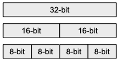
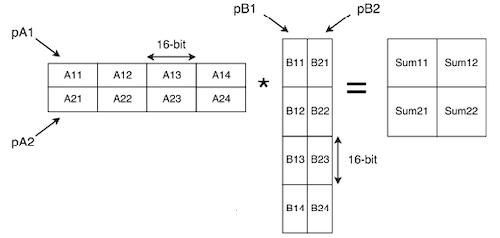
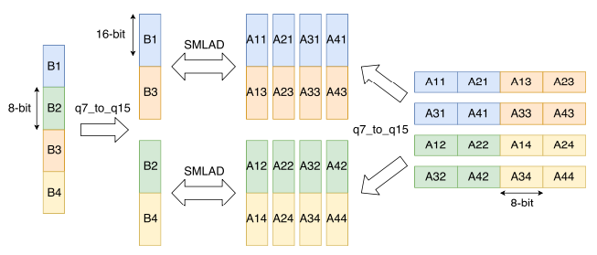
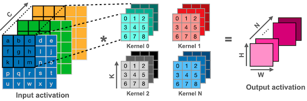
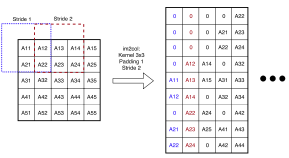
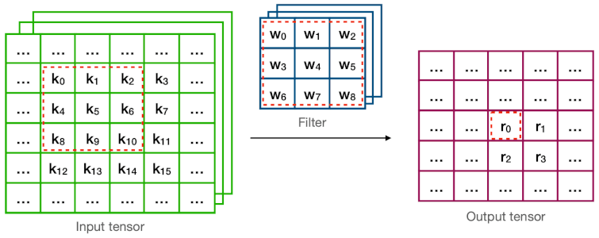
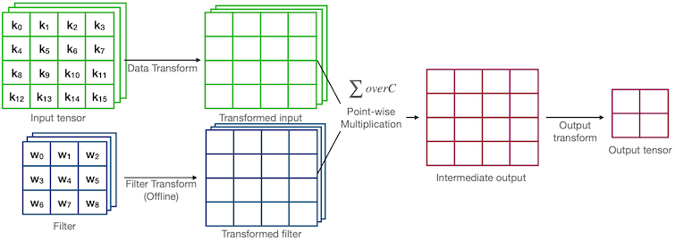

# Lecture 17 - TinyEngine - Efficient Training and Inference on Microcontrollers

> [Lecture 17 - TinyEngine - Efficient Training and Inference on Microcontrollers | MIT 6.S965](https://youtu.be/oCMnJXH0c50)

> [EfficientML.ai Lecture 11 - TinyEngine and Parallel Processing (MIT 6.5940, Fall 2023, Zoom)](https://youtu.be/gGcbn0ISOJM)

---

## 17.4 SIMD Programming

ARM Cortex-M4, M7를 포함한 다양한 프로세서에서는, 명령어를 병렬로 수행할 수 있는 **SIMD**(Single Instruction Multiple Data) 명령어를 지원한다.

<table>
<tr>
<td>  </td> <td> Single Instruction Single Data </td> <td> Single Instruction Multiple Data(SIMD) </td> 
</tr>
<tr>
<td>

Desc

</td>
<td>


</td>
<td>


</td>
</tr>
<tr>
<td>

Code

</td>
<td>

```c
for i in range(0, N):
  for k in range(0, N):  // 32-bit
    for j in range(0, N):
      C[i][j] += A[i][k] * B[k][j]
```

</td>
<td>

```c
for i in range(0, N):
  for k in range(0, N/4):    // 128-bit
    for j in range(0, N):
      C[i][j] += doc_vec4(A[i][k*4], B[k*4][j])
```

</td>
</tr>
<tr>
<td>

\#Ops

</td>
<td>

$N^3$

</td>
<td>

$N^3/4$

</td>
</tr>
</table>

---

### 17.4.1 ARM Cortex-M: CMSIS-NN Kernels

> [CMSIS-NN: Efficient Neural Network Kernels for Arm Cortex-M CPUs 논문(2018)](https://arxiv.org/abs/1801.06601)

Cortex-M 프로세서에서는, dual 16-bit Multiply-and-Accumulate 명령어(`SMLAD`)를 비롯한 다양한 SIMD 명령어를 지원한다. (모든 레지스터는 32-bit wide로 구성)



> `2 x INT16` 혹은 `4 x INT8` SIMD 연산 지원

---

#### 17.4.1.1 Example: 16-bit MAC Instruction

수많은 신경망 연산 함수에서 16-bit MAC 명령어를 활용한다. 다음은 INT8 양자화를 가정했을 때, 16-bit `SMLAD` 명령어가 수행되는 과정을 보여준다.

**(1)** **8-bit to 16-bit sign-extension**

- `ROR`: rotate right

- `SXTB16`: sign extend and pack to 16 bits

- `PKHTB`: pack high half to bottom, `PKHBT`: pack high to bottom

<table>
<tr>
<td>


</td>
<td>

```c
// Quantized data
inA = *__SIMD32(source)++
// sign extension
buf1 = __SXTB16(__ROR(inA, 8))  // A1, A3
buf2 = __SXTB16(inA)            // A2, A4

// (Optional)reordering
// [1,3,2,4] -> [1,2,3,4]
out1 = __PKHTB(buf1, buf2, 16)
out2 = __PKHBT(buf2, buf1, 16)
```

</td>
</tr>
</table>

> 입력과 가중치 모두 `q7_t` 타입일 경우, 별도의 재정렬이 필요하지 않다.

> offline에서 가중치를 미리 `SMLAD`에 최적화된 정렬로 재배치해둘 수 있다. (e.g., 입력이 `q15_t` 타입인 경우)

**(2)** **Matrix multiplication**

- `SMLAD`: signed multiply accumulate dual

<table>
<tr>
<td>



</td>
</tr>
<tr>
<td>

```c
// initialize accumulator
Sum11 = Bias1
Sum12 = Bias1
Sum21 = Bias2
Sum22 = Bias2

// inner loop of matrix multiplication
For i from 0 to column count/2
  A1 = *__SIMD32(pA1)++
  A2 = *__SIMD32(pA2)++
  B1 = *__SIMD32(pB1)++
  B2 = *__SIMD32(pB2)++
  Sum11 = __SMLAD(A1, B1, Sum11)
  Sum12 = __SMLAD(A1, B2, Sum12)
  Sum21 = __SMLAD(A2, B1, Sum21)
  Sum22 = __SMLAD(A2, B2, Sum22)
```

</td>
</tr>
</table>

---

#### 17.4.1.2 Example: Fully Connected Layer

fully-connected layer 연산의 배치 크기는 1이므로, 이때의 주된 연산은 **matrix-vector multiplication**에 해당된다.

- 1 loop iteration: 2개의 1x4 MAC 연산 수행



---

## 17.5 Im2col Convolution

> [Manas Sahni: Anatomy of a High-Speed Convolution](https://sahnimanas.github.io/post/anatomy-of-a-high-performance-convolution/)

**Im2col**이란, 입력 이미지 텐서를 columns 데이터로 변환하는 기법이다. (대표적으로 GEMM 행렬 곱셈을 위해 사용) 다음은 3차원 입력 이미지를 대상으로, direct convolution과 im2col convolution 과정을 비교한 예시다.

- **Direct**: 6개의 중첩 반복문

- **Im2col**: 3개의 중첩 반복문

| Conv | Description | 
| :---: | :---: | 
| Direct |  | 
| Im2Col |  | 

하지만 column마다 중복되는 데이터를 가지게 되면서, 이전보다 많은 메모리 공간을 차지하게 된다.

> 메모리 문제를 해결하기 위해 **implicit GEMM** 기법을 사용한다.

> **Notes**: 2D 입력 이미지 im2col 예시
> 
> 

---

## 17.6 In-place Depth-wise Convolution

**In-place** 연산은 입력 데이터의 메모리 공간에, 출력 데이터를 write back으로 덮어쓰는 메모리 최적화 기법이다.

다음은 Inverted bottleneck 구조의 peak memory 사용량을 줄이기 위한, **In-place depth-wise convolution**을 나타낸 그림이다. (임시 버퍼 활용)

| General depth-wise convolution | In-place depth-wise convolution |
| :---: | :---: |
|  |  |
| peak memory: $2 \times C \times H \times W$ | peak memory: $(1 + C) \times H \times W$ |

---

## 17.7 How to Choose the Appropriate Data Layouts

> [MCUNet: Tiny Deep Learning on IoT Devices 논문(2020)](https://arxiv.org/abs/2007.10319)

> [On-Device Training Under 256KB Memory 논문(2022)](https://arxiv.org/abs/2206.15472)

다음은 두 convolution 연산(pointwise, depthwise)에서, NHWC 및 NCHW 데이터 레이아웃 방식을 비교한 표다.

| Conv | Description | Layout |
| --- | --- | --- |
| pointwise |  | **NHWC** |
| depthwise |  | **NCHW** |

---

## 17.8 Winograd Convolution

> [Fast Algorithms for Convolutional Neural Networks 논문(2015)](https://arxiv.org/abs/1509.09308)

다음은 direct convolution과 Winograd convolution의 계산 과정을 비교한 그림이다.

| Conv | Description |
| --- | --- |
| Direct |  |
| Winograd |  |

> 예제에서 연산량(MACs for 4 outputs)은 다음과 같다.
>
> - **Direct** = $9 \times C \times 4$
>
> - **Winograd** = $16 \times C$ (**2.25x** 감소)

---

### 17.8.1 Example: Formula for 3x3 Convolution

Winograd convolution은 다음과 같은 변환 트릭을 포함하는 수식으로 표현된다.

$$ Y = \overset{Output \ Transform}{A^T}[\underset{Filter \ Transform}{[GgG^T]} \odot\underset{Data \ Transform}{[B^TdB]}] \ A $$

> $g$ : 3x3 filter, $d$ : input tile

이때 Transform 종류에 따라 offline 혹은 online 시점에 계산된다.

**(1) Online**

- **Output Transform**

  $A^T = \begin{bmatrix} 1 & 1 & 1 & 0 \\ 0 & 1 & -1 & -1 \end{bmatrix}$

- **Data Transform** $V$

  $B^T = \begin{bmatrix} 1 & 0 & -1 & 0 \\ 0 & 1 & 1 & 0 \\ 0 & -1 & 1 & 0 \\ 0 & 1 & 0 & -1 \end{bmatrix}$

  $B = \begin{bmatrix} 1 & 0 & 0 & 0 \\ 0 & 1 & -1 & 1 \\ -1 & 1 & 1 & 0 \\ 0 & 1 & 0 & -1 \end{bmatrix}$

**(2) Offline**

- **Filter Transform** $U$

  $G = \begin{bmatrix} 1 & 0 & 0 \\ 1/2 & 1/2 & 1/2 \\ 1/2 & -1/2 & 1/2  \\ 0 & 0 & 1  \end{bmatrix}$

  $G^T = \begin{bmatrix} 1 & 1/2 & 1/2 & 0 \\ 0 & 1/2 & -1/2 & 0 \\ 0 & 1/2 & 1/2 & 1 \end{bmatrix}$

---