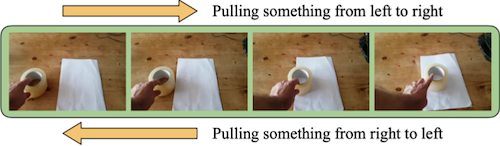
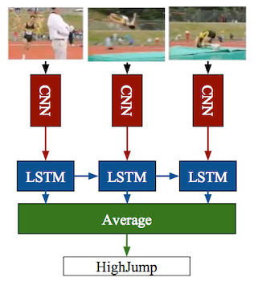
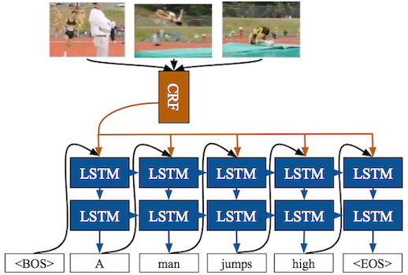
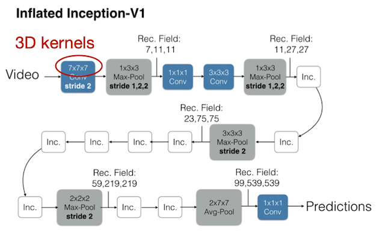
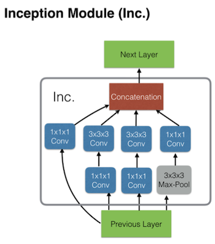
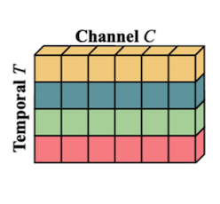
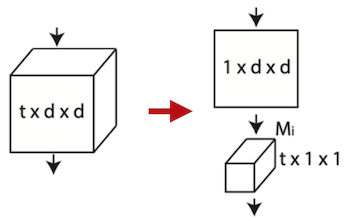
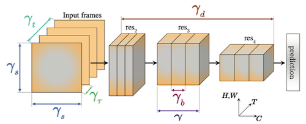
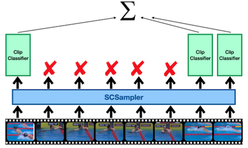

# 19 Efficient Video Understanding and Generative Models

> [Lecture 19 - Efficient Video Understanding and Generative Models | MIT 6.S965](https://youtu.be/0WZSzStMgLk?si=Kez32e0mNPgiZhjn)

> [EfficientML.ai Lecture 15 - GAN, Video, and Point Cloud (MIT 6.5940, Fall 2023, Zoom)](https://youtu.be/WU7tpyesm68?si=iRrWKkupS0KMkgUp)

Video Understanding은 다양한 응용이 가능한 도메인이다. 주의할 점으로, 동영상은 이미지와 달리 **temporal** dimension을 갖는다. (temporal modeling)

> action/gesture recognition, scene understanding, video search for ads, video prediction for autonomous driving

---

## 19.1 2D CNNs for Video Understanding

> [Temporal Segment Networks: Towards Good Practices for Deep Action Recognition 논문(2016)](https://arxiv.org/abs/1608.00859)

> [Two-Stream Convolutional Networks for Action Recognition in Videos 논문(2014)](https://arxiv.org/abs/1406.2199)

> [Long-term Recurrent Convolutional Networks for Visual Recognition and Description 논문(2014)](https://arxiv.org/abs/1411.4389)

2D CNN을 활용한 대표적인 video understanding 방법을 살펴보자. 2D CNN을 사용 시, 다른 방법에 비해 연산 효율적이며, image recognition에서 사용하는 2D CNN을 재활용할 수 있다는 장점을 갖는다. 

- 각 frame에 2D CNN 적용 후, class scores를 취합한다.

  - (-) (다른 방법에 비해) 정확도가 낮다.

  

- spatial stream, temporal stream를 결합한다.

  - spatial stream conv: 단일 프레임에서 물체를 인식한다.

  - temporal stream conv: **optical flow**를 인식한다.

  - (-) optical flow를 도출하기 위한 시간이 많이 소요된다.(모델 연산 시간보다도 더 큰 latency)

  

- CNN의 출력(feature)에 기반한 post-fusion 모델링 (LSTM 등 사용)

  - (-) low-level temporal relationship을 잘 모델링하지 못한다.

  | Action Recognition | Image Captioning | Video Description |
  | :---: | :---: | :---: |
  |  |  |  |

---

## 19.2 3D CNNs for Video Understanding

> [TSM: Temporal Shift Module for Efficient Video Understanding 논문(2018)](https://arxiv.org/abs/1811.08383)

> [Quo Vadis, Action Recognition? A New Model and the Kinetics Dataset 논문(2017)](https://arxiv.org/abs/1705.07750)

3D conv는 spatial dimentions만이 아니라, 추가로 temporal dimension까지 연산하는 방법이다. (spatiotemporal information) 

| 2D conv on multiple frames | 3D conv |
| :---: | :---: |
|  |  |

3D CNN을 활용한 대표적인 video understanding 방법으로 다음과 같은 예시가 있다.

- I3D: Initialize 3D CNNs with 2D CNN weights by inflation

  초기화 시 (ImageNet 등 데이터셋에서) pre-trained된 2D CNN 가중치를, temporal dimension으로 확장한다.

  - (-) 필요한 비용(모델 크기, 연산량 등)이 증가한다.

  | Inflated Inception-V1 | Inception Module |
  | :---: | :---: |
  |  |  |

---

## 19.3 Temporal Shift Module (TSM)

> [TSM: Temporal Shift Module for Efficient Video Understanding 논문(2018)](https://arxiv.org/abs/1811.08383): I3D family에 비해 6x 적은 연산량

Temporal Shift Module(TSM)은, 3D conv 기반의 장점은 유지하며 overhead는 줄이기 위해 고안된 모듈이다.

> 그림에서는 H, W 차원을 하나로 합쳐서, T / H,W / C 3차원 텐서로 표현한다.

| original tensor w/o shift | offline temporal shift (bi-direction) | online temporal shift (uni-direction) |
| :---: | :---: | :---: |
|  |  |  | 

- **Bi-directional**

  일부 채널을 temporal dimension $T$ 를 따라 shift하여, 근접한 시간을 갖는 frame끼리 정보가 교환될 수 있도록 만든다.

- **Uni-directional**

  일부 채널을 $T$ 차원을 따라 과거에서 미래 방향으로 shift하여, frame끼리 정보를 교환한다.

  > 실시간 스트리밍에서는 미래 시점의 frame을 미리 가져올 수 없기 때문에, 한 방향으로만 shitt한다.

이때 채널을 많이 이동시키지 않고 오직 1개만 shift하는 이유는, spatial information을 유지하기 위함이다.(spatial, temporal information 간의 trade-off) 

이를 통해 multiplication, addition 등의 추가적인 연산 없이, 단순히 shift만 추가하여 temporal modeling을 구현했다. (추가적인 FLOPs, parameter가 필요하지 않다.)

---

### 19.3.1 TSM Implementation

다음은 offline/online 방식에 따라 구현한 TSM 모델 구조 예시다. 

> 그림 속 여러 frame: $T$ 차원에 해당된다.

> $T$ dimension에서는 shift만 일어날 뿐, 2D conv가 적용되지 않는다.

- 공통적으로 각 frame마다 2D conv를 먼저 적용한다.

- **offline** TSM models

  - bypass를 추가하여 information loss를 보전한다.

  

- **online** TSM models

  > $F_t$ 입력일 때, 미래인 $F_{t+1}$ 에 접근할 수 없다. 오로지 메모리에 캐싱한 과거의 frame 정보를 사용한다.(shift)

  

---

## 19.4 Other Efficient Methods for Video Understanding

이외에도 video understanding을 위한 효율적인 방법이 다방면에서 연구되고 있다.

---

### 19.4.1 Kernel Decomposition

> [A Closer Look at Spatiotemporal Convolutions for Action Recognition 논문(2017)](https://arxiv.org/abs/1711.11248)

3D CNN kernel은, 2D spatial + 1D temporal kernel로 분해할 수 있다.

- (+)3D 접근법에 비해, 모델 크기가 가볍고 학습이 용이하다.

---

### 19.4.2 Multi-Scale Modeling

> [SlowFast Networks for Video Recognition 논문(2018)](https://arxiv.org/abs/1812.03982)

SlowFast Networks 논문에서는, large spatial resolution과 large temporal resolution 조건의 video recognition의 비용을 줄이기 위해, two-branch 디자인을 제안했다.

- **large** spatial resolution + **small** temporal resolution

  - low frame rate: $T$ 차원의 크기가 작다.

- **small** spatial resolution + **large** temporal resolution

  - high frame rate: $T$ 차원의 크기가 크다.

---

### 19.4.3 Neural Architecture Search for Video Understanding

> [X3D: Expanding Architectures for Efficient Video Recognition 논문(2020)](https://arxiv.org/abs/2004.04730)

X3D 논문에서는, NAS의 탐색 공간에 temporal duration, frame rate, spatial resoultion 차원을 추가하여 효율적인 모델을 획득한다.

- temporal duration ${\gamma}_{t}$

- frame rate ${\gamma}_{\tau}$

- spatial resoultion ${\gamma}_{s}$

- width ${\gamma}_w$ 

- bottleneck width ${\gamma}_b$ 

- depth ${\gamma}_{d}$

---

### 19.4.4 Skipping Redundant Frames/Clips

> [SCSampler: Sampling Salient Clips from Video for Efficient Action Recognition 논문(2019)](https://arxiv.org/abs/1904.04289)

긴 동영상은 보통 일부만이 중요한 정보만을 포함하게 된다. 따라서, non-salient 파트를 구분하여 제거한다면 연산량을 줄일 수 있다.

> 이때 작은 해상도 혹은 capacity가 작은 CNN을 사용하여, 효율적으로 non-salient frame을 구분할 수 있다.

---

### 19.4.5 Utilizing Spatial Redundancy

> [Recurrent Residual Module for Fast Inference in Videos 논문(2018)](https://arxiv.org/abs/1802.09723)

동영상에서는 대체로 근접한 frame( $x_t$ , $x_{t+1}$ )에서, 매우 유사한 spatial information을 갖는다.(불과 몇 픽셀의 차이 발생)

- conv가 갖는 linearity와 근접한 frame이 갖는 차이를 이용해, 보다 효율적인 연산이 가능하다.

  - $x_{t+1} - x_{t} = \Delta$

$$ y_{t+1} = F(x_{t+1}) = F(x_t + x_{t+1} - x_t) = F(x_t + \Delta) $$

$$ = F(x_t) + F(\Delta) = y_t + F(\Delta) $$

다음은 위 연산 방법을 적용했을 때, 추론 과정을 나타낸 예시다.

---