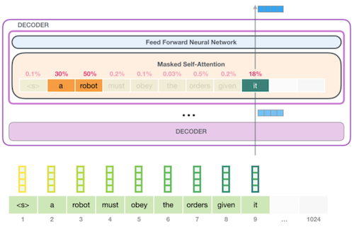
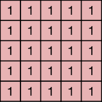
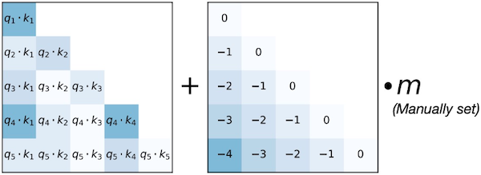
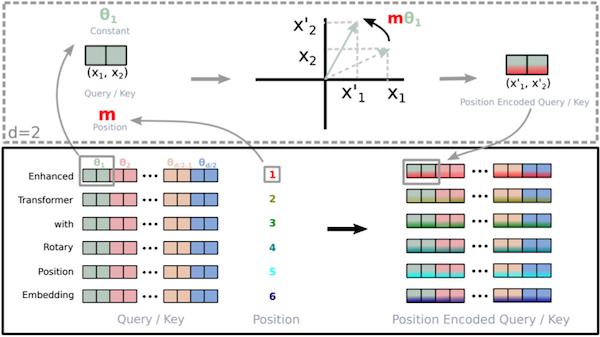
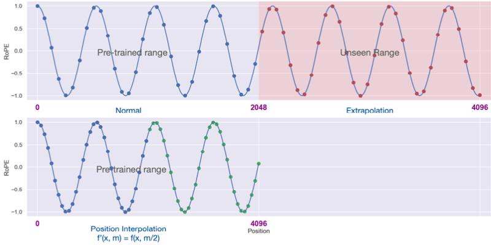
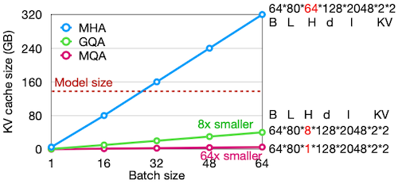

# 12 Transformer and LLM (Part I)

> [EfficientML.ai Lecture 12 - Transformer and LLM (Part I) (MIT 6.5940, Fall 2023, Zoom)](https://youtu.be/mR4u6ZaCYe4)

---

## 12.3 Transformer Design Variants

Transformer가 소개된 이래로, 다양한 변형이 제안되었다.

- Encoder-Decoder(T5), Encoder-only(BERT), Decoder-only(GPT)

- Absolute Positional Encoding $\rightarrow$ Relative Positional Encoding

- KV cache optimizations

  Multi-Head Attention(MHA) $\rightarrow$ Multi-Query Attention(MQA) $\rightarrow$ Grouped-Query Attention(GQA)

- FFN $\rightarrow$ GLU(Gated Linear Unit)

---

### 12.3.1 Encoder-Decoder

> [Exploring the Limits of Transfer Learning with a Unified Text-to-Text Transformer 논문(2019)](https://arxiv.org/abs/1910.10683)

> 처음 Transformer가 제안되어 machine translation에 사용되었을 때도, Encoder-Decoder 구조를 가졌다.

T5에서는 transfer learning을 통해, 다양한 NLP tasks에서 unified text-to-text model을 사용하는 방법을 제안했다.

- encoder에 **prompt**가 제공되면, decoder가 출력을 생성한다.

---

### 12.3.2 Encoder-only(BERT)

> [BERT: Pre-training of Deep Bidirectional Transformers for Language Understanding 논문(2018)](https://arxiv.org/abs/1810.04805)

가장 유명한 Encoder-only 모델로, **BERT**(Bidirectional Encoder Representations from Transformers)가 있다. 이때 BERT는 두 가지 pre-training objective를 사용하여 학습된다.

- Task 1: **Masked Language Model**(MLM)

  - 임의로 입력 토큰의 일정 비율(15%)를 masking한다.

  - 모델이 **masked token**을 예측하도록 학습된다.

- Task 2: **Next Sentence Prediction**(NSP)

  - sentence A의 **next sentence** B를 예측하도록 학습된다.

> 참고로 NSP는 잘 사용되지 않는다. (less used)

---

### 12.3.3 Decoder-only(GPT)

> [Improving language understanding with unsupervised learning 논문(2018)](https://openai.com/research/language-unsupervised)

가장 유명한 Decoder-only 모델로, **GPT**(Generative Pre-trained Transformer)가 있다. 다음은 "a robot must obey the orders given it" 문장을 주고, 다음 word를 예측하도록 학습된 GPT 모델이다.

- (next word prediction) Pre-Training Objective

  - pre-training은 unsupervised learning으로 진행된다.

  - $\mathcal{U} = \lbrace u_1, \cdots, u_n \rbrace$ : unsupervised corpus of tokens

$$ L_1(\mathcal{U}) = \sum_{i} \log P (u_i | u_{i-k}, \cdots , u_{i-1}; \Theta) $$

이후 downstream task에 적용하기 위해서, GPT-2와 같은 (비교적 LLM 중에서 작은) 모델은 fine-tuning이 필요하다.

> 반면 GPT-3처럼 보다 큰 모델은 fine-tuning 없이, zero-shot/few-shot만으로 downstream tasks에 적용할 수 있다.

- Fine-tuning Objective

  - fine-tuning은 supervised learning으로 진행된다.

  - $\mathcal{C}$ : labeled dataset

$$ L_2(\mathcal{C}) = \sum_{i} \log P (y | x^1 , \cdots , x^m) $$

참고로, Encoder-only인 BERT와, Decoder-only인 GPT의 attention mask는 다음과 같이 차이가 있다.

| BERT | GPT |
| :---: | :---: |
|  |  |

---

### 12.3.4 Absolute/Relative Positional Encoding

**Relative** Positional Encoding은 다음과 같은 구현을 통해, 학습에서 사용되지 않은 not seen sequence length에 대해 일반화가 가능하다.

> 즉, train short, test long이 가능하다. 단, 언제나 적용되지는 않는다.

> attention score에서 합산되므로, Value가 필요하지 않다.

| | APE | RPE |
| :---: | :---: | :---: |
| |  |  |
| Implementation | input embeddings(Q/K/V) + positional information | attention score + relative distance information |

---

#### 12.3.4.1 Relative Positional Encoding: ALiBi

> [Train Short, Test Long: Attention with Linear Biases Enables Input Length Extrapolation 논문(2021)](https://arxiv.org/abs/2108.12409)

ALiBi(Attention with Linear Biases) 논문에서는, attention matrix에 relative distance 기반의 offset을 더하는 방식을 제안한다.

---

#### 12.3.4.2 Relative Positional Encoding: RoPE

> [RoFormer: Enhanced Transformer with Rotary Position Embedding 논문(2021)](https://arxiv.org/abs/2104.09864)

> LLaMA에서 사용된다.

RoPE(Rotary Positional Encoding) 논문에서는, 2D space에서의 rotation을 기반으로 positional embedding을 구현했다.

> radial은 position invariant, angular는 query, key invariant와 연관된다.

- token embedding: complex number로 변환한다.

  - embedding dimension $d$ 를 $d/2$ pair로 분리한다.

  - 각 pair를 2D coordinate에서 한 쌍으로 표현한다.

- position $m$ : token embedding의 rotation으로 표현한다.

$$ f_{q,k}(x_m, m) = R_{\Theta, m}^d W_{q,k}x_m $$ 

---

#### 12.3.4.3 Relative Positional Encoding: RoPE + Context window

> [Extending Context Window of Large Language Models via Position Interpolation 논문(2023)](https://arxiv.org/abs/2306.15595)

대부분의 LLM은 context length 제한을 가지고 학습된다. 하지만 RoPE PE를 interpolating하여, context length 제한을 늘릴 수 있다.

- previous context length
  
  LLaMA: 2k, LlaMA-2: 4k, GPT-4: 8k

- extended

  LLaMA: 32k

---

### 12.3.5 KV Cache Optimizations

> [The KV Cache: Memory Usage in Transformers](https://youtu.be/80bIUggRJf4)

다음은 attention score를 계산하는 과정이다.

$$ \mathrm{Attention}(Q, K, V) = \mathrm{softmax} \left( {{QK^T} \over {\sqrt{d_k}}} \right) V $$

- Query: 새 token

- Key: attend해야 하는 previous context

- Value: previous context의 weighted sum

Transformer decoding 과정(GPT-style)에서는, attention 계산을 효율적으로 수행하기 위해, 모든 previous tokens의 keys, values 쌍을 저장하고 재사용한다.(**KV cache**)

| | before optimization | after optimization |
| :---: | :---: | :---: |
| |  |  |
| $q_{new}$ 와 연산 | $K, V$ | $K_{new}, V_{new}$ |

- (-) 하지만 long context 대상에서는, KV cache 사용량도 함께 커져야 한다.

  다음은 Llama-2-70B (MHA 사용 가정) 예시다.

  - $\mathrm{KV} \ \mathrm{cache} \ \mathrm{size} = BS \times 80 \times 64 \times 128 \times N \times 2 \times 2 \mathrm{bytes}$

    $= 2.5MB \times BS \times N$

  > minibatch \* layers \* heads \* n_emd(hidden dim) \* length(num tokens) \* K&V \* bytes(ex. FP16=2bytes) 

  > 만약 $BS = 16$ , $n_{seq} = 4096$ 이라면, 메모리 사용량만 160GB이다.(A100 GPU 메모리의 두 배)

---

#### 12.3.5.1 Multi-Query Attention

> [Fast Transformer Decoding: One Write-Head is All You Need 논문(2019)](https://arxiv.org/abs/1911.02150)

> [GQA: Training Generalized Multi-Query Transformer Models from Multi-Head Checkpoints 논문(2023)](https://arxiv.org/abs/2305.13245)

\#kv-heads 수를 줄이는 방식으로, KV cache size를 줄일 수 있다.

| | MHA | MQA | GQA |
| :---: | :---: | :---: | :---: |
| |  |  |  |
| heads for Query | $N$ | $N$ | $N$ |
| heads for KV | $N$ | 1 | $G$ |

> 대체로 $G = N/8$ 로 설정하면, 정확도를 잘 유지할 수 있다.

다음은 세 가지 방식에서의 KV cache size, accuracy 비교이다.

- KV cache size

  

- Accuracy

  다음은 Llama-2, 30B, 150B tokens 조건에서, 정확도를 비교한 도표다.

  

  - GQA를 사용하면, KV cache size를 절감하면서도, MHA와 유사한 정확도를 얻을 수 있다.

---

### 12.3.5 Gated Linear Units

> [GLU Variants Improve Transformer 논문(2020)](https://arxiv.org/abs/2002.05202)

inverted bottleneck 형태의 FFN 대신, GLU(Gate Linear Unit)를 사용하면 정확도를 향상시킬 수 있다.

- 3번의 matrix multiplication로 구성된다.

$$ \mathrm{FFN_{SwiGLU}}(x, W, V, W_2) = (\mathrm{Swish_1}(xW) \otimes xV)W_2 $$

| FFN | SwiGLU |
| :---: | :---: |
|  |  |

> total computing cost를 유지하기 위해, $8/3d$ 차원을 사용했다.

---