# 12 Transformer and LLM (Part I)

> [EfficientML.ai Lecture 12 - Transformer and LLM (Part I) (MIT 6.5940, Fall 2023, Zoom)](https://youtu.be/mR4u6ZaCYe4)

---

## 12.1 Pre-Transformer Era

NLP 도메인의 task는 크게 두 가지로 나눌 수 있다.

|| Discriminative | Generative |
| :---: | :---: | :---: |
||  | 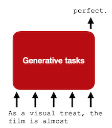 |
| 예시 | sentiment analysis text classification textual entailment | language modeling machine translation summarization |

---

### 12.1.1 Recurrent Neural Networks (RNNs)

Transformer가 등장하기 앞서, 사람들이 주로 사용한 모델은 RNN이었다.

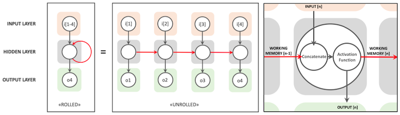

- (-) long-term dependancies를 유지하기 어렵다.

  > LSTM으로 해결

- (-) tokens 간의 dependency가 있기 때문에, scalability가 제한된다.

  > locality를 갖는 이미지와 다르게, 언어는 locality를 갖지 않는다.

참고로 RNN의 Bi-directional, Uni-directional 설계에 따라서, 수행하는 task를 다르게 할 수 있다.

| Bi-directional | Uni-directional |
| :---: | :---: |
| discriminative tasks (**encoding**) | generative tasks (**decoding**) |

---

### 12.1.2 Convolutional Neural Networks (CNNs)

CNN을 사용하면, token 사이에 dependency가 존재하지 않기 때문에, scalability 면에서 더 좋은 성능을 가질 수 있다.

|  |
| :---: |
|  |

- (-) context information을 캡처하기 어렵다.

  > 따라서, model capability 자체가 낮아진다.

---

## 12.2 Transformer

> [Attention Is All You Need 논문(2017)](https://arxiv.org/abs/1706.03762)

Transformer를 구성 요소별로 살펴보자.

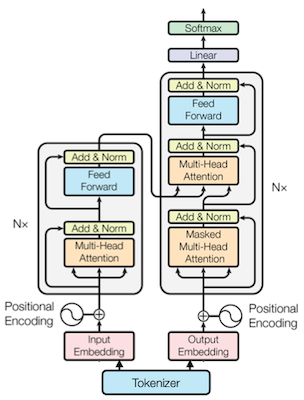

---

### 12.2.1 Tokenizer

**tokenizer**는 word를 하나 혹은 여러 tokens로 mapping한다.

> 따라서 word와 token 수는 동일하지 않고, 보통 token 수가 더 많다.

| Transformer | Tokenizer |
| :---: | :---: |
|  | 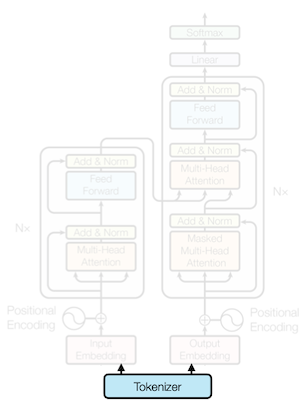 |

---

### 12.2.2 Word Representation

token을 embedding vector로 변환한다.

| Transformer | Embedding |
| :---: | :---: |
|  | 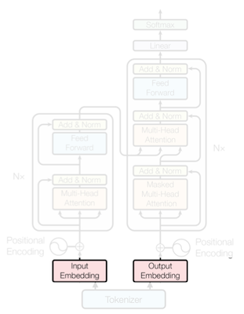 |

- One Hot Encoding

  각 word를 하나의 vector로 변환한다. 

  

  - (-) vocabularies가 크면, vector 크기 자체가 매우 커지기 때문에, 벡터 하나하나가 거대한 sparse representation이 된다.

- Word Embedding

  word index를 **continuous** word embedding으로 변환한다. (look-up table)

  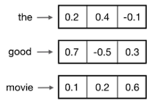

  - (+) word embedding은 학습을 통해 획득할 수 있다.

    > 대표적인 pre-trained word embedding으로, Word2Vec, GloVe가 있다.

---

### 12.2.3 Attention

embedding은 transformer blocks 내 MHA(**Multi-Head Attention**) 레이어를 거치게 된다.

| Transformer | Multi-Head Attention |
| :---: | :---: |
|  |  |

---

#### 12.2.3.1 Self-Attention

embedding $E$ 는 query, key, value $(Q, K, V)$ 로 project된다.

> Query-Key-Value: 전통적으로 retrieval system에서 사용되어 온 방식이다. 예를 들면 YouTube search engine이 있다.

> Query: search bar에 있는 text prompt // Key: 동영상의 titles/descriptions // Value: 대응되는 동영상

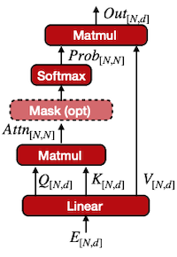

- $Q$ , $K$ : 내적한다.

  > 이때 $\sqrt{d}$ 로 normalized된다.

- attention weight를 구하기 위해, 위 결과에 softmax 함수를 적용한다. ( shape: $N \times N$ )

  > 이때 attention computation complexity는, $O(N^2)$ 이다.

- attention weight, $V$ : 곱해서 출력을 얻는다. 

---

#### 12.2.3.2 Multi-Head Attention

이름 그래도 multi-head를 가지며, 각 head가 서로 다른 semantics를 캡처한다. 다음은 8개 head의 attention map을 시각화한 것이다.

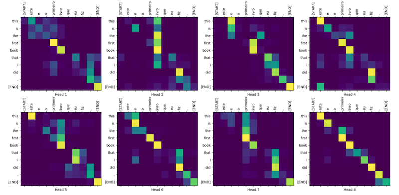

구현은 단순히 모든 head의 출력을 concat하고, projection matrix $W^O$ 를 곱해주면 된다. (linear projection)

$$ \mathrm{MultiHead}(Q,K,V) = \mathrm{Concat}(\mathrm{head_1}, \cdots \mathrm{head_h})W^O $$

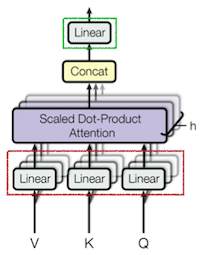

---

#### 12.2.3.3 Attention Masking

앞서 NLP의 두 가지 task를 다시 떠올려 보자.

- Discriminative: 전체 token을 볼 수 있다.

- Generative: 오직 previous token만 볼 수 있다.

따라서 causal/masked language modeling에서는, 이전 token만 볼 수 있도록 masking을 적용한다.

| Global | Causal |
| :---: | :---: |
| 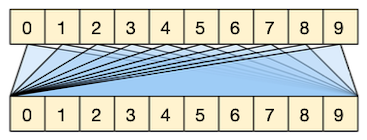 | 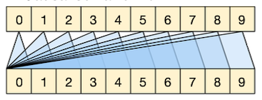 |

---

### 12.2.4 Feed-Forward Network

self-attention에서 tokens 사이의 relationships를 캡처했지만, 이때 element-wise non-linearity가 적용되지 않는다. 따라서 두 개의 fully-connected layer로 구성된 FFN(**Feed-Forward Network**)를 추가한다.

| Transformer | Feed-Forward |
| :---: | :---: |
|  |  |

vanilla implementation에서는, 두 레이어를 갖는 MLP와, 사이에 ReLU/GeLU activation으로 구성된다.

$$ FFN(x) = \max(0, xW_1 + b_1) W_2 + b_2 $$

- 이때, hidden state size가 매우 커지면서, **inverted bottleneck** 형태가 된다.

  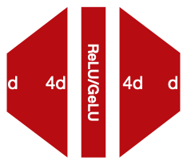

- 다음은 여러 모델 크기에서, hidden dimension 크기를 나타낸 도표이다.

  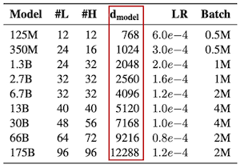

---

### 12.2.5 Layer Normalization (LN)

Layer Normalization으로, 각 token's embedding의 normalization을 수행한다.

| Transformer | Layer-Normalization |
| :---: | :---: |
|  |  |

---

#### 12.2.5.1 Pre-Norm vs. Post-Norm

Normalization의 위치에 따라서도, Transformer의 학습 성능이 달라질 수 있다.

- 대체로 training stability가 좋은, Pre-norm 디자인이 대중적으로 사용된다.

| Post-norm | Pre-norm |
| :---: | :---: |
|  |  |

---

### 12.2.6 Positional Encoding

> [AI Coffee Break youtube: Positional embeddings in transformers EXPLAINED](https://www.youtube.com/watch?v=1biZfFLPRSY)

하지만 attention과 FFN에서는, input tokens을 순차적으로 미분하지 않는다.(즉, 순서 정보가 망각된다.) 따라서, encoding 단계에서 position 정보를 추가하는 PE(**Positional Encoding**)을 거친다.

> 대조적으로 convolution 연산은 local order를 고려한다.

| Transformer | Positional Encoding |
| :---: | :---: |
|  | 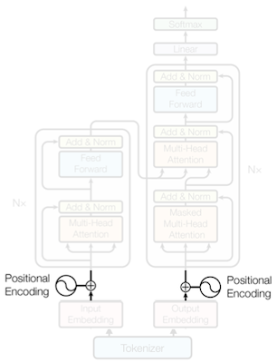 |

이때 PE는 sine, cosine 함수를 기반으로, 가변적인 길이의 입력에 있어서도, 하나의 **unique** encoding을 갖도록 한다.

- $t$ : token index

- $i$ : feature dimension

$$ {\vec{p_t}}^{(i)} = f(t)^{(i)} := \begin{cases} \sin(w_k. t), & if \ i = 2k \\ \cos(w_k.t), & if \ i = 2k + 1 \end{cases} $$

$$ w_k = {{1} \over {10000^{2k/d}}} $$

> 10000: 대부분의 tokens을 구분할 수 있는 큰 값을 갖는, 임의의 상수

다음은 실제 PE matrix가 어떻게 구성되는지를 보여주는 heat map이다.

> 색상이 light $\rightarrow$ dark $\rightarrow$ light...로 변화하는 것에 주목하자.

depth가 깊어질수록 다음과 같은 변화가 생긴다.

- 수직선의 변화가 감소한다.

  > 다시 말해, frequency가 감소한다.

- 각 token 사이의 positional encoding 영향이 감소한다.

이후 raw word embedding과 합산하여, positional information을 추가(fuse)한다.

---

#### 12.2.6.1 Derivation of Fixed Positional Encoding

> [Jonathan Kernes: Master Positional Encoding](https://towardsdatascience.com/master-positional-encoding-part-i-63c05d90a0c3)

몇 가지 Positional Encoding 방법을 살펴보며, fixed positional encoding이  등장한 배경을 파악해 보자.

|| Just Count | Discrete PE |
| :---: | :---: | :---: |
| | 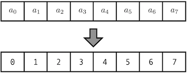 | 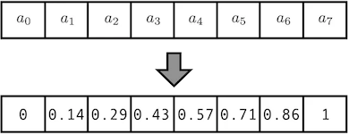 |
| 단점 | positional embedding 영향이 과도하게 커진다. | sequence 길이에 따라 encoding이 달라지므로, 가변 sequence에 적용할 수 없다. |

단순히 [0,1] 범위로 normalize하는 방법으로는, 효과적으로 PE가 불가능하다.

---

#### 12.2.6.2 Derivation of Fixed Positional Encoding: Using Binary

해결책으로 binary number의 사용을 고려할 수 있다.

> 아래 예시에서, embedding 차원은 이해를 위해 $d_{model}=2^3$ 로 가정한다.

- PE matrix: 각 위치를 binary number로 표현

  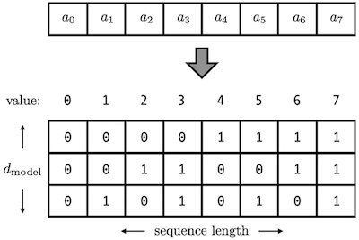

- positive, negative를 구분하기 위해, [0, 1]에서 [-1, 1]로 조정한다.

  다음 함수를 사용하여 조정할 수 있다.

$$ f(x) = 2x -1 $$

하지만 discrete한 특성은, distance 측정에서 문제를 일으킬 수 있다. 다음 예시를 보자.

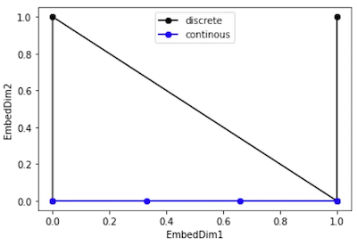

- (파란색: continuous)

  - encoding: [x, 0]

- (검은색: discrete)

  - encoding: [0, 0], [0, 1], [1, 0], [1, 1]

  - (-) 거리 측정에 문제가 생긴다.

    > 예를 들어, [0, 0]과 [0, 1]의 거리는 1이지만, [0, 1]과 [1, 0]의 거리는 $\sqrt{2}$ 이다.

---

#### 12.2.6.3 Derivation of Fixed Positional Encoding: Using Continuous Binary Vector

따라서 삼각함수 기반의 continuous binary vector를 사용한 interpolation을 추가한다.

> $d_{model}$ 만큼 다이얼을 두는 구현을 생각해 보자.

---