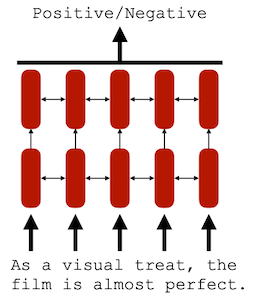
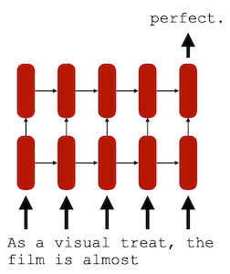
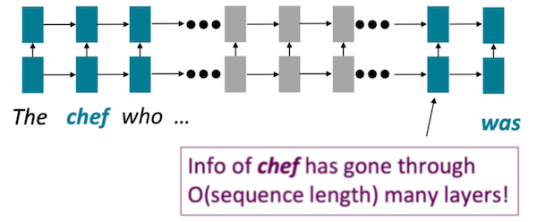
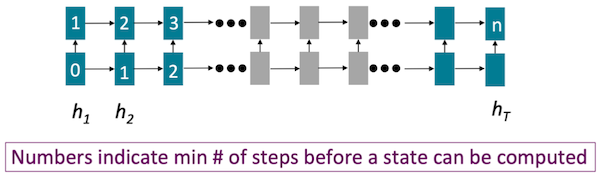
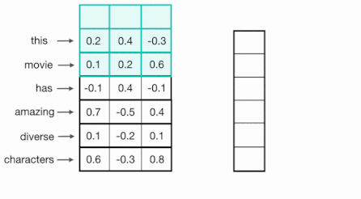
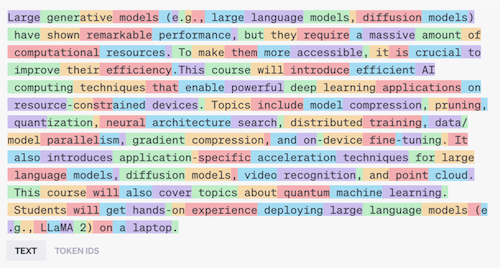
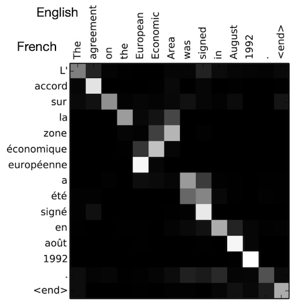
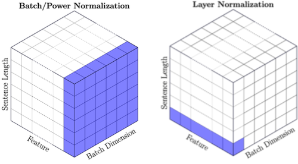

# 12 Transformer and LLM (Part I)

> [EfficientML.ai Lecture 12 - Transformer and LLM (Part I) (MIT 6.5940, Fall 2023, Zoom)](https://youtu.be/mR4u6ZaCYe4)

NLP 도메인의 task는 크게 두 가지로 나눌 수 있다.

- **Discriminative task**: sentiment analysis, text classification, textual entailment 등

- **Generative task**: language modeling, machine translation, summarization 등

| Discriminative | Generative |
| :---: | :---: |
|  |  |
| 입력 문장의 positive/negative 분석 (sentiment analysis) | 입력 문장에 이어질 단어를 예측 (language modeling) |

---

## 12.1 Pre-Transformer Era: Recurrent Neural Networks (RNNs)

Transformer가 등장하기 전, 자연어 처리를 위해 주로 활용된 모델은 RNN이었다.

이때 RNN은 단방향/양방향(Uni-directional/Bi-directional) 설계에 따라서 task를 다르게 수행하게 된다.

| Discriminative | Generative |
| :---: | :---: |
|  |  |
| **Bi-directional**(양방향)  | **Uni-directional**(단방향) |
| **Encoding** | **Decoding** |

---

### 12.1.1 Problem with RNNs/LSTMs: Hard to Model Long-Term Relationships

하지만 RNN은 **working memory**면에서, long-term dependancies를 유지하기 어렵다. (LSTM은 해결) 다음은 중간에 긴 문장(who ...)이 삽입된 입력에서 RNN을 묘사한 예시다.

- 두 토큰의 interaction: $O(seq\_len)$ steps 필요

- 이미지와 달리, 언어는 대체로 locality를 갖지 않는다.

---

### 12.1.2 Problem with RNNs/LSTMs: Limited Training Parallelism

또한 token 사이의 의존성에 의해 **scalability**가 제한된다.

- state는 이전 state에 의존적이다.

- state $n$ 을 얻기 위해 $n$ steps이 필요하다.

---

## 12.2 Pre-Transformer Era: Convolutional Neural Networks (CNNs)

> [Cezanne Camacho: CNNs for Text Classification](https://cezannec.github.io/CNN_Text_Classification/)

scalability를 고려한 대안으로, token 사이에 의존성이 존재하지 않는 CNN을 활용하는 시도가 있었다.

단어는 특정한 길이(일반적으로는 100)를 갖는 벡터로 임베딩되며, 1D convolution(kernel width=vector length)을 통해 처리된다.

| 1D Convolution | Sliding Window |
| :---: | :---: |
|  |  |

- (-) **limited context information**: receptive field가 제한적이다.

---

## 12.3 Transformer

> [Attention Is All You Need 논문(2017)](https://arxiv.org/abs/1706.03762)

2017년에 발표된 **Transformer**는 **attention** 메커니즘에 기반한 모델이다.

| Architecture | Sequence |
| --- | --- |
|  | (1) Tokenize words (word $\rightarrow$ tokens)  (2) Map tokens into embedding vectors  (3) Embeddings go through transformer blocks (`MHA`, `FFN`, `LN`, `Residual`)  (4) Positional encoding  (5) Final prediction with linear head |

---

### 12.3.1 Tokenize Words

**tokenizer**는 단일 word를 one/multiple token으로 매핑하는 작업을 수행한다. (따라서 일반적으로 단어의 수보다 token의 수가 더 많다.)

다음은 110 works로 구성된 문장을 162개 token으로 매핑한 예시다.

이후 절차에서 token은 embedding vector로 변환된다.

---

### 12.3.2 Mapping Tokens to Embedding Vectors

가장 간단한 embedding 방법이라면, 각 word를 고유한 one-hot vector로 변환하는 것이다.

하지만 **one-hot encoding**은 vocabularies가 커질수록, 벡터의 길이 및 차원이 매우 커지게 된다. 

대안인 **word embedding**에서 단어는 look-up table을 참조하여 임베딩되며, 이때의 LUT는 별도의 학습으로 획득한다.

> Pre-trained Word Embedding: Word2Vec, GloVe가 대표적이다.

---

### 12.3.3 Multi-Head Attention: Self-Attention

embedding은 transformer 블록 내부의 MHA(**Multi-Head Attention**)로 전달된다.

- embedding: 먼저 linear projection을 통해 $Q, K, V$ 벡터로 변환한다.

- **self-attention**: query, key, value 세 요소 사이의 문맥적 관계성을 캡처

> **Notes**: Query-Key-Value는 주로 retrieval system에서 활용된 설계이다.
>
> | Q-K-V | Example(YouTube search engine) |
> | --- | --- |
> | **Query** | 검색 바에 입력한 text prompt |
> | **Key** | 동영상의 titles/descriptions |
> | **Value** | 대응하는 동영상 |

이때 self-attention 연산은 다음 절차를 통해 수행된다.

(1) $Q$ 와 $K$ 를 내적하여 **similarity score**를 계산한다. (이때 Q,K 차원이 미치는 영향을 고려해 $\sqrt{d}$ 로 정규화한다.)

(2) softmax를 통해 **attention weight**를 구한다. (*softmax*: weight sum이 1이 되도록 정규화)

$$ \mathrm{Attention}(Q,K,V) = \mathrm{softmax}({QK^T \over {\sqrt{d_k} }})V $$

(3) attention weight와 $V$ 벡터를 곱하여 **output**을 얻는다.

> attention computation complexity: $O(N^2)$ 으로 expensive하다.

---

#### 12.3.3.1 Self-Attention Example: Machine Translation

다음은 영어 문장을 프랑스어로 번역했을 때 획득한 attention matrix를 시각화한 도식이다.

- 대체로 문장이 순차적으로 매칭되기 때문에, 대각선으로 attention이 집중된다.

- 그러나 영어와 프랑스어에서 문장 구조가 다른 세 단어에서, 역방향으로 attention이 집중된 것을 확인할 수 있다.

---

#### 12.3.3.2 Multi-Head Attention

Transformer는 서로 다른 문맥적 관계성을 캡처할 수 있도록 여러 개의 attention head를 가지며(MHA), 각 head에서 서로 다른 attention map을 획득하게 된다.

각 head $i$ 에서 $\mathrm{Attention}(QW_{i}^{Q}, KW_{i}^{K}, VW_{i}^{V})$ 를 수행하고, $h$ 개의 head의 결과를 concat하여 최종 출력을 획득한다.

$$ \mathrm{MultiHead}(Q,K,V) = \mathrm{Concat}(\mathrm{head_1}, \cdots \mathrm{head_h})W^O $$

> $W^O$ : linear projection matrix

---

#### 12.3.3.3 Attention Masking

앞서 NLP의 두 가지 task를 떠올려 보자. 

| Task | Visibility |
| --- | --- |
| **Discriminative**(Encoding) | future token까지 볼 수 있다. |
| **Generative**(Decoding) | 오직 previous token만 볼 수 있다. |

때문에 generative path에서는, 이전 token만 볼 수 있도록 attention에 마스킹을 적용한다. (casual/masked language modeling)

| Global | Causal |
| :---: | :---: |
|  |  |

---

### 12.3.4 Feed-Forward Network

이어서 element(token) 사이의 non-linearity를 더하기 위해 **Feed-Forward Network**를 거친다. 

| FFN | Variation |
| :---: | :---: |
|  |  |

vanilla 구현에서는 MLP는 두 개의 linear layer로 구성된다. (ReLU/GELU activation을 사용)

$$ FFN(x) = \max(0, xW_1 + b_1) W_2 + b_2 $$

이때, 두 레이어 사이에 매우 큰 hidden state를 갖는 설계가 보편적이다. (**inverted bottleneck** 형태)

---

### 12.3.5 Layer Normalization (LN)

Layer Normalization은 각 token의 embedding을 정규화하여, (residual connection과 함께) 학습을 안정화하는 역할을 수행한다. (CNN의 BN과 유사)

$$ y = \frac{x - E[x]}{\sqrt{Var[x] + \epsilon} } * \gamma + \beta $$

---

#### 12.3.5.1 Pre-Norm vs. Post-Norm

이때 Normalization의 배치에 따라서 Transformer 학습에 미치는 영향이 다르다.

| Post-norm | Pre-norm |
| :---: | :---: |
|  |  |

> 학습 안정성이 우수한 **Pre-norm** 디자인을 주로 사용한다.

---

### 12.3.6 Positional Encoding

> [Amirhossein Kazemnejad's Blog: The Positional Encoding](https://kazemnejad.com/blog/transformer_architecture_positional_encoding/)

하지만 Transformer는 RNN과 달리 **sequence**를 순차적으로 처리하지 않는다. (상기한 attention, FFN 연산은 sequence를 병렬로 한번에 처리한다.)

Transformer는 이러한 문제를 해결하기 위해, PE(**Positional Encoding**)을 통해 위치 정보를 추가한다. (raw word embedding에 합산한다.)

- 문장 내 각 단어는 unique encoding을 갖는다.

- token index $t$ 의 삼각 함수(sine, cosine)로 encoding된다.

- $i$ : feature dimension

- 10000: 모든 token이 구분될 만큼 충분히 큰 임의의 상수

$$ {\vec{p_t} }^{(i)} = f(t)^{(i)} := \begin{cases} \sin(w_k. t), & if \ i = 2k \\ \cos(w_k.t), & if \ i = 2k + 1 \end{cases} $$

$$ w_k = { {1} \over {10000^{2k/d} }} $$

다음은 PE matrix를 heatmap으로 시각화한 예시다. (하나의 문장은 최대 50개 token으로 구성, 128개 차원으로 Positional Embedding 수행)

- 색상의 light $\rightarrow$ dark $\rightarrow$ light 반복: sine 함수 설계가 이진 bit를 교대로 사용하는 것과 유사하기 때문.

- frequency: 벡터 차원을 따라 감소한다. 

---