# 14 Vision Transformer

> [EfficientML.ai Lecture 14 - Vision Transformer (MIT 6.5940, Fall 2023, Zoom)](https://youtu.be/fcmOYHd57Dk)

---

## 14.1 Vision Transformer

> [An Image is Worth 16x16 Words: Transformers for Image Recognition at Scale 논문(2020)](https://arxiv.org/abs/2010.11929)

**Vision Transformer**(ViT)는 2D image를 patch 단위로 나눈 token을 처리하는 transformer 모델이다. 다음은 2D image를 patch 단위로 나눈 예시를 나타낸 그림이다.

| 2D Image | | Tokenization |  
| --- | :---: | --- | 
|  | $\rightarrow$ |  |
| size: 96x96 patch size: 32x32 | | \#tokens: 3x3=9 dim of each token: 3x32x32=3,072 |

다음은 ViT에서 이미지 입력을 분류하기까지의 과정을 나타낸 그림이다.

이때 token의 Linear Projection은 대체로 convolution으로 처리한다. 여러 개의 서로 다른 패치에 대해, 하나의 동일한 convolution을 적용하는 방식이다.

> 현재 예시: "32x32 Filter, stride 32, padding 0, in_channel=3, output_channel = 768" convolution 레이어를 사용한다.

| | |
| --- | --- | 
| |  |
| input dim = 3,072 output dim(hidden size of ViT) = 768 | \#Parameters: 3,072x768 = 2.36M |

---

### 14.1.1 Model Variants

앞서 Vision Transformer 논문에서는 세 종류의 variants이 제안되었다.

- Patch size: 2, 4, 8, 16, 32

> ViT-L/16: ViT-Large 모델이며 16x16 패치를 사용한다.

다음은 여러 variants의 성능을 ResNet 모델과 비교한 도표이다. 많은 양의 데이터셋을 학습한 ViT 모델에서는, ResNet 모델보다 더 높은 정확도를 달성할 수 있었다.

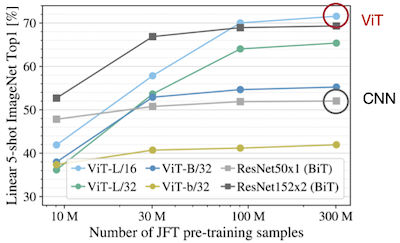

---

## 14.2 High-Resolution Dense Prediction

다음은 고해상도 dense prediction(픽셀 단위의 예측)에 포함되는 대표적인 task 예시다.

| Medical Image Segmentation | Super-Resolution |
| :---: | :---: |
| 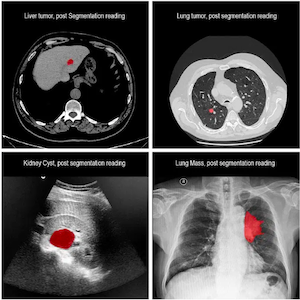 | 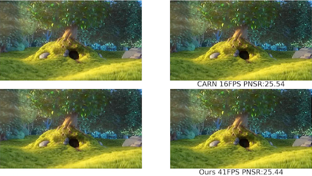 |

하지만, ViT는 고해상도 이미지에 대해 연산량이 폭발적으로 증가하기 때문에, 해당 문제를 대상으로 활용하기 어렵다.

> 입력 이미지의 크기가 증가하면, ViT의 연산량이 quadratic하게 증가하는 것을 확인할 수 있다.

---

### 14.2.1 Application: Segment Anything

> [Segment Anything 논문(2023)](https://arxiv.org/abs/2304.02643)

**Segment Anything**은 Meta에서 공개한 대규모 image segmentation 모델이다.

Segment Anything은 image encoder를 통해 embedding을 생성한다. 사용자가 segment 대상의 정보를 포함한 prompt를 주면, 모델은 prompt에 대응하는 segmentation mask를 반환하는 방식으로 동작한다.

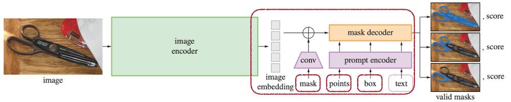

> 참고로 Segment Anything은 자동화된 data annotation을 통해, (11M 개의 이미지에서 추출한) 1B 개 이상의 mask 데이터셋으로 학습하였다.

---

## 14.3 Window Attention

---

### 14.3.1 Swin Transformer: Window Attention

> [Swin Transformer: Hierarchical Vision Transformer using Shifted Windows 논문(2021)](https://arxiv.org/abs/2103.14030)

Swin Transformer은 attention 연산을 **local window** 단위로 수행하는 것으로 연산량을 줄이는 방법을 제안했다. (**window attention**)

| Original Attention | Window Attention |
| :---: | :---: |
| 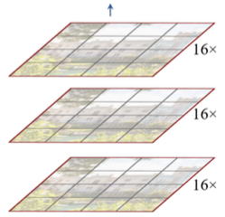 |  |
| 모든 token에서 attention을 계산한다. |  local window 내부에서만 attention을 계산한다. |

window attention을 사용하면 연산 복잡도는 linear하게 증가하며, feature map의 크기는 점차 감소하게 된다.

하지만, 해당 구현에서는 서로 다른 window 간의 정보 교환이 발생하지 않는다. 따라서 논문에서는 shift 연산을 추가하여 window 간의 정보를 교환할 수 있도록 보완한다. (예시에서는 2 pixel 만큼 shift)

| Shifted Window Partition | Two Successive Block |
| :---: | :---: |
|  | 

> SW: Shift Window

---

### 14.3.2 FlatFormer: Flattened Window Attention

> [FlatFormer: Flattened Window Attention for Efficient Point Cloud Transformer 논문(2023)](https://arxiv.org/abs/2301.08739)

3D Point Cloud 데이터는 일반적으로 99% 수준의 희소도를 가진다.

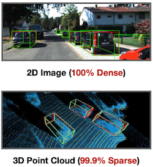

FlatFormer에서는 이러한 sparsity에 특화된 **Flattened Window Attention**(FWA)를 제안하였다. 해당 구현에서는 point의 불균형한 분포를 고려해, Equal-Window(동일한 window size로 그룹 분리) 대신 **Equal-Size**(동일한 크기의 그룹으로 분리) 방식으로 window를 나눈다.

|| Equal-Window | Equal-Size |
| :---: | :---: | :---: |
| |  |  |
| (+) | spatial proximity | balanced computation workload |
| (-) | computational regularity | geometric locality |

다음은 Jetson AGX Orin 보드에서 벤치마크한 결과로, 다른 모델에 비해 우수한 FPS(Frames Per Second)를 달성한 것을 확인할 수 있다.

---

## 14.4 EfficientViT: Linear Attention

> [EfficientViT: Multi-Scale Linear Attention for High-Resolution Dense Prediction 논문(2022)](https://arxiv.org/abs/2205.14756)

EfficientViT 논문은 attention의 softmax를, ReLU 기반의 **linear attention**으로 대체하여 연산량을 줄이는 방법을 제안하였다.

$$ \mathrm{Sim}(Q,K) = \exp\left({ {QK^T} \over {\sqrt{d} }}\right) \rightarrow \mathrm{Sim}(Q,K) =  \mathrm{ReLU}(Q)\mathrm{ReLU}(K)^T $$

따라서, 다음과 같이 연산 비용을 $O(n)$ 으로 줄일 수 있다.

<table>
<tr>
<td align="center">Softmax Attention</td>
<td align="center"> </td>
<td align="center" colspan="3">Linear Attention</td>
</tr>
<tr>
<td>

 

</td>
<td>

vs

</td>
<td>

</td>
<td align="center">

$\longrightarrow$ **(ab)c = a(bc)** (associative property of Matmul)

</td>
<td>

</td>
</tr>
<tr>
<td align="center">

Cost: $O(n^2)$

</td>
<td align="center"> </td>
<td align="center">

Cost: $O(n^2)$

</td>
<td align="center"> </td>
<td align="center">

Cost: $O(n)$

</td>
</tr>
</table>

그러나 softmax attention와 달리, linear attention에서 sharp distribution을 획득하는 것은 어렵다. (local information을 잘 캡처할 수 없으므로 성능 저하로 이어지게 된다.)

| Attention Feature Map | Accuracy Gap | 
| :---: | :---: |
|  |  |

---

### 14.4.1 EfficientViT Module: Multi-Scale Aggregation

논문에서는 depthwise convolution(DWConv) 기반의 branch를 추가하여 local information을 강화하였다. 다음은 해당 branch를 갖는 EfficientViT Module을 나타낸다.

| Aggregate multi-scale Q/K/V tokens | EfficientViT Module |
| :---: | :---: |
|  | 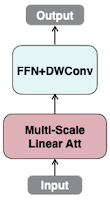 |

해당 모듈 설계로 정확도 손실을 충분히 회복할 뿐만 아니라, 오히려 softmax attention 대비 더 높은 성능을 달성할 수 있었다.

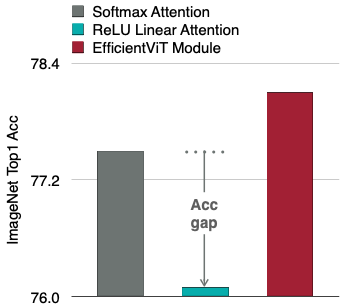

---

## 14.5 SparseViT: Sparse Attention

> [SparseViT: Revisiting Activation Sparsity for Efficient High-Resolution Vision Transformer 논문(2023)](https://arxiv.org/abs/2303.17605)

`sparse, high resolution` 입력 vs. `dense, low resolution` 입력 중 어느 쪽이 더 효율적일까?

| Uniform Resizing | Activation Pruning |
| :---: | :---: |
|  | 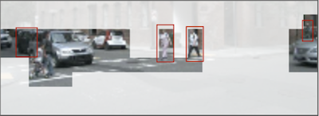 |
| **Low** Resolution (0.5x) **Dense** Pixels (100%) | **High** Resolution (1x) **Sparse** Pixels (25%) |

SparseViT는 `high resolution` sparse input을 활용한 효율적인 Vision Transformer 설계를 제안하였다.

- Step 1: **Window Attention Pruning** (with Non-Uniform Sparsity)

  input activation 대상으로 L2 magnitude 중요도에 기반하여 희소화한다.(top-k만 보존 후 sorting) 이어서 window attention을 적용한다.

  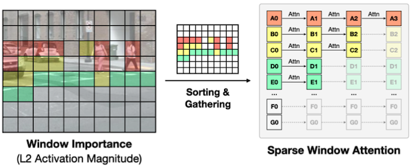

- Step 2: **Sparsity-Aware Adaptation**

  (dense activation으로 사전 학습된) 모델이 희소한 입력도 잘 처리할 수 있도록, 각 training iteration마다 레이어별로 임의의 희소도 비율을 설정하여 fine-tuning을 수행한다.

  

- Step 3: **Resource-Constrained Search**

  Evolutionary Algorithm을 통해, 지연시간 budget을 만족하는 최적의 레이어별 희소도 설정을 탐색한다.

  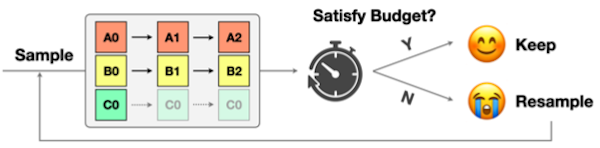

---
