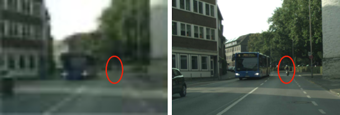
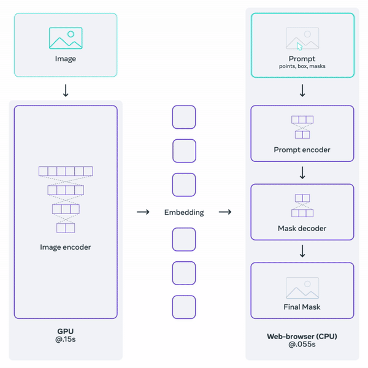
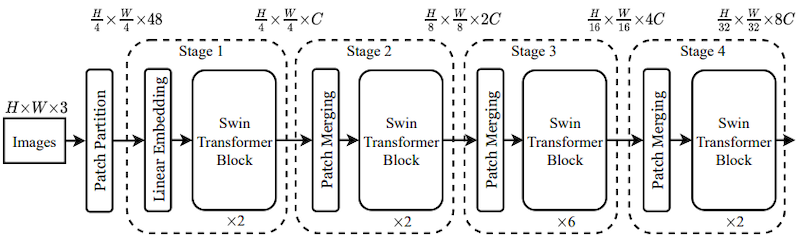
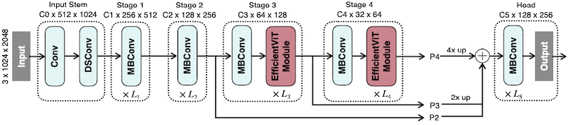
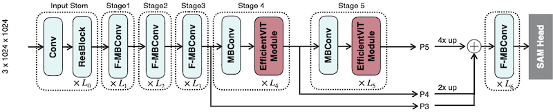
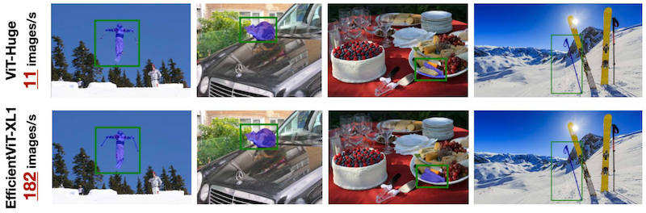
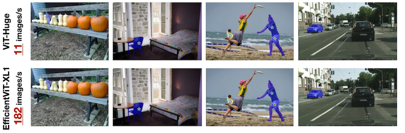
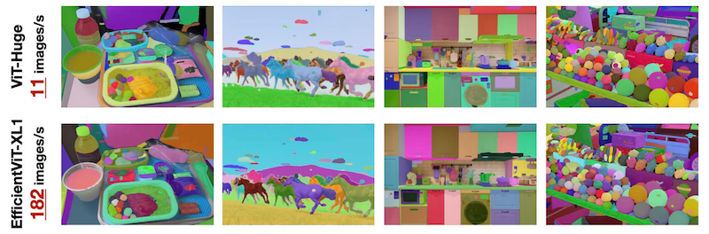

# 14 Vision Transformer

> [EfficientML.ai Lecture 14 - Vision Transformer (MIT 6.5940, Fall 2023, Zoom)](https://youtu.be/fcmOYHd57Dk)

---

## 14.1 Vision Transformer

> [An Image is Worth 16x16 Words: Transformers for Image Recognition at Scale 논문(2020)](https://arxiv.org/abs/2010.11929)

**Vision Transformer**(ViT)는 2D image를 patch 단위로 나눈 token을 처리하는 transformer 모델이다. 다음은 2D image를 patch 단위로 나눈 예시를 나타낸 그림이다.

| 2D Image | | Tokenization |  
| --- | :---: | --- | 
|  | $\rightarrow$ |  |
| size: 96x96 patch size: 32x32 | | \#tokens: 3x3=9 dim of each token: 3x32x32=3,072 |

다음은 ViT에서 이미지 입력을 분류하기까지의 과정을 나타낸 그림이다.

이때 token의 Linear Projection은 대체로 convolution으로 처리한다. 여러 개의 서로 다른 패치에 대해, 하나의 동일한 convolution을 적용하는 방식이다.

> 현재 예시: "32x32 Filter, stride 32, padding 0, in_channel=3, output_channel = 768" convolution 레이어를 사용한다.

| | |
| --- | --- | 
| |  |
| input dim = 3,072 output dim(hidden size of ViT) = 768 | \#Parameters: 3,072x768 = 2.36M |

---

### 14.1.1 Model Variants

앞서 Vision Transformer 논문에서는 세 종류의 variants이 제안되었다.

- Patch size: 2, 4, 8, 16, 32

> ViT-L/16: ViT-Large 모델이며 16x16 패치를 사용한다.

다음은 여러 ViT 모델의 ImageNet 정확도를 ResNet과 비교한 도표이다. 많은 양의 데이터셋을 사전학습한 ViT 모델일수록, ResNet 모델보다 더 우수한 정확도를 달성하였다.

> ViT-b: ViT-Base의 hidden dimension을 절반으로 줄인 모델

---

## 14.2 High-Resolution Dense Prediction

> **dense prediction**: 이미지 내 각 픽셀이 어느 클래스에 속하는지 예측

다음은 자율주행 task에서 저해상도(좌측), 고해상도(우측) 입력을 비교한 예시다.

저해상도 이미지에서는 고해상도 이미지에 비해, 디테일 및 작은 물체를 인식하기 어렵다.

---

### 14.2.1 Applications: Semantic Segmentation, Super-Resolution

다음은 high-resolution dense prediction의 다른 대표적인 응용 예시다. 

| Medical Image Segmentation | Super-Resolution (SR) |
| :---: | :---: |
|  |  |

하지만, ViT는 해상도에 따라 연산량이 폭발적으로 증가하기 때문에, 고해상도 입력을 대상으로 활용하기 어렵다.

> 입력 이미지의 해상도가 증가하면 연산량은 quadratic하게 증가한다.

---

### 14.2.2 Applications: Segment Anything

> [Segment Anything 논문(2023)](https://arxiv.org/abs/2304.02643)

**Segment Anything**은 Meta에서 공개한 image segmentation 프로젝트이다. (**task**, **model**, **dataset**)

- *SA-1B* dataset: 11M개 high-res image, 1B개 이상의 segmentation mask로 구성

> 참고로 mask 데이터를 구성하기 위해, data annotation을 자동으로 수행하는 *Segment Anything Data Engine*을 개발하였다.

---

#### 14.2.2.1 Segment Anything Model (SAM)

**Segment Anything Model**은 크게 세 가지 요소로 구성된다.

**(1) image encoder**: 고해상도 입력에 최적화된 *MAE*(Masked Autoencoder) pre-trained ViT로 임베딩 생성

**(2) prompt encoder**: 두 종류의 prompt를 임베딩으로 알맞게 변환

- sparse(points, boxes, text)

- dense(mask): convolution 활용

> text prompt: CLIP에서 얻은 text embedding을 사용한다.

**(3) mask decoder**: image embedding과 prompt embedding을 입력으로, segmentation mask를 예측

> (zero-shot) image in-painting, object tracking, 3D generation 등 다양한 downstream task에서 우수한 성능을 달성하였다.

---

## 14.3 Window Attention

---

### 14.3.1 Swin Transformer: Window Attention

> [Swin Transformer: Hierarchical Vision Transformer using Shifted Windows 논문(2021)](https://arxiv.org/abs/2103.14030)

Swin Transformer은 attention 연산을 **local window** 단위로 수행하는 것으로 연산량을 줄이는 방법을 제안했다. (**window attention**)

| Original Attention | Window Attention |
| :---: | :---: |
|  |  |
| 모든 token에서 attention을 계산한다. |  local window 내부에서만 attention을 계산한다. |

window attention을 사용하면 연산 복잡도는 linear하게 증가하며, feature map의 크기는 레이어를 거치며 점차 감소하게 된다.

하지만, 이러한 구현에서는 서로 다른 window 간의 정보 교환이 발생하지 않는다. 따라서  **shifted window** 기반 self-attention을 통해, window 간의 정보를 교환할 수 있도록 보완한다. (예시에서는 2 pixel 만큼 shift)

| Shifted Window Partition | Two Successive Block |
| :---: | :---: |
|  | 

> *SW*: Shift Window, *MSA*: Multi-head Self-Attention

---

### 14.3.2 FlatFormer: Flattened Window Attention

> [FlatFormer: Flattened Window Attention for Efficient Point Cloud Transformer 논문(2023)](https://arxiv.org/abs/2301.08739)

3D Point Cloud 데이터는 일반적으로 99% 수준의 희소도를 가진다.

FlatFormer에서는 이러한 sparsity에 특화된 **Flattened Window Attention**(FWA)를 제안하였다. 해당 구현에서는 point의 불균형한 분포를 고려해, Equal-Window(동일한 window size로 그룹 분리) 대신 **Equal-Size**(동일한 크기의 그룹으로 분리) 방식으로 window를 나눈다.

|| Equal-Window | Equal-Size |
| :---: | :---: | :---: |
| |  |  |
| (+) | spatial proximity | balanced computation workload |
| (-) | computational regularity | geometric locality |

다음은 Jetson AGX Orin 보드에서 벤치마크한 결과로, 다른 모델에 비해 우수한 FPS(Frames Per Second)를 달성한 것을 확인할 수 있다.

---

## 14.4 EfficientViT: Linear Attention

> [EfficientViT: Multi-Scale Linear Attention for High-Resolution Dense Prediction 논문(2022)](https://arxiv.org/abs/2205.14756)

high-resolution dense prediction에서 연산량을 줄이기 위해, EfficientViT은 attention의 softmax을 ReLU 기반의 **linear attention**으로 대체한다.

$$ \mathrm{Sim}(Q,K) = \exp\left({ {QK^T} \over {\sqrt{d} } }\right) \rightarrow \mathrm{Sim}(Q,K) =  \mathrm{ReLU}(Q)\mathrm{ReLU}(K)^T $$

따라서, 다음과 같이 연산 비용을 $O(n)$ 으로 줄일 수 있다.

<table>
<tr>
<td align="center">Softmax Attention</td>
<td align="center"> </td>
<td align="center" colspan="3">Linear Attention</td>
</tr>
<tr>
<td>

 

</td>
<td>

vs

</td>
<td>

</td>
<td align="center">

$\longrightarrow$ **(ab)c = a(bc)** (associative property of Matmul)

</td>
<td>

</td>
</tr>
<tr>
<td align="center">

Cost: $O(n^2)$

</td>
<td align="center"> </td>
<td align="center">

Cost: $O(n^2)$

</td>
<td align="center"> </td>
<td align="center">

Cost: $O(n)$

</td>
</tr>
</table>

그러나 softmax attention와 달리, linear attention에서 sharp distribution을 획득하는 것은 어렵다. (local information을 잘 캡처할 수 없으므로 성능 저하로 이어지게 된다.)

| Attention Feature Map | Accuracy Gap | 
| :---: | :---: |
|  |  |

---

### 14.4.1 EfficientViT Module: Multi-Scale Aggregation

논문에서는 depthwise convolution(DWConv) 기반의 branch를 추가하여 local information을 강화하였다. 다음은 해당 branch를 갖는 EfficientViT Module을 나타낸다.

| Aggregate multi-scale Q/K/V tokens | EfficientViT Module |
| :---: | :---: |
|  |  |

해당 모듈 설계로 정확도 손실을 충분히 회복할 뿐만 아니라, 기존 softmax attention보다 우수한 성능을 달성하였다.

---

### 14.4.2 EfficientViT-SAM

> [EfficientViT-SAM: Accelerated Segment Anything Model Without Accuracy Loss 논문(2024)](https://arxiv.org/abs/2402.05008)

논문에서는 Segment Anything Model(SAM)를 가속하기 위해, 기존의 image encoder를 대체하는 **EfficientViT-SAM** 설계를 제안하였다.

> prompt encoder, mask decoder: 그대로 유지

다음은 EfficientViT와 EfficientViT-SAM의 구조를 비교한 그림이다.

- 전반부 `Conv block` / 후반부 2 stage에서 `EfficientViT Module` 사용

- 후반부 3 stage에서 fused feature 획득 (`upsampling`, `addition`)

| EfficientViT |
| :---: |
|  |
| **EfficientViT-SAM-XL** |
|  |

이러한 EfficientViT-SAM의 학습은 총 2단계로 수행된다.

**(1)** EfficientViT-SAM의 **image encoder** 학습 (교사 모델: SAM의 image encoder)

**(2)** **end-to-end**로 EfficientViT-SAM 학습 (dataset: SA-1B, 2 epochs)

> end-to-end 학습 시, prompt(box, point) 중 하나를 무작위로 학습한다.

---

### 14.4.3 EfficientViT-SAM: Results

다음은 EfficientViT-SAM을 대상으로 세 가지 모드에서 획득한 결과를 보여주는 예시다. (ViT-Huge: SAM-ViT-H)

- 기존 SAM과 비교하여 17-69배 가속을 달성하였다. (단일 NVIDIA A100 기준)

| Mode | Segmentation Results |
| --- | :---: |
| Point |  |
| Box |  |
| Everything |  |

> YOLOv8, Grounding DINO를 활용한 Instance Segmentation 성능 비교에서도, SAM-ViT-H보다 우수한 성능을 달성하였다.

---

## 14.5 SparseViT: Sparse Attention

> [SparseViT: Revisiting Activation Sparsity for Efficient High-Resolution Vision Transformer 논문(2023)](https://arxiv.org/abs/2303.17605)

`sparse, high resolution` 입력 vs. `dense, low resolution` 입력 중 어느 쪽이 더 효율적일까?

| Uniform Resizing | Activation Pruning |
| :---: | :---: |
|  |  |
| **Low** Resolution (0.5x) **Dense** Pixels (100%) | **High** Resolution (1x) **Sparse** Pixels (25%) |

SparseViT는 `sparse, high resolution` input에 주목하며, 이를 위한 activation pruning 기법을 제안하였다.

> 자체적으로 수정한 Swin block(Swin Transformer)으로 search space를 구성하였다.

- Step 1: **Window Attention Pruning** (with Non-Uniform Sparsity)

  input activation 대상으로 L2 magnitude 중요도로 희소화한다. (top-k만 보존 후 정렬) 이어서 window attention이 수행된다.

  

- Step 2: **Sparsity-Aware Adaptation**

  (dense activation으로 사전 학습된) 모델이 희소한 입력을 잘 처리할 수 있도록, 학습 iteration마다 레이어별 임의의 희소도 비율로 미세조정한다.

  

- Step 3: **Resource-Constrained Search**

  진화 알고리즘(Evolutionary Algorithm) 기반으로, 지연시간 제약 조건을 만족하는 최적의 레이어별 희소도 설정을 획득한다.

  

---
