# 13 LLM Deployment Techniques

> [EfficientML.ai Lecture 13 - LLM Deployment Techniques (MIT 6.5940, Fall 2024)](https://youtu.be/sTz2tXG1T0c)

CNN과 다르게, LLM에서는 W8A8 양자화가 잘 동작하지 않는다.

- 작은 모델에서는 효과가 있지만, 모델 크기가 6.7B 이상이라면 양자화에 따른 정확도 하락이 크게 발생한다.

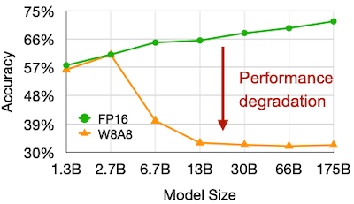

---

## 13.1 SmoothQuant: Weight-Activation Quantization

> [SmoothQuant: Accurate and Efficient Post-Training Quantization for Large Language Models 논문(2022)](https://arxiv.org/abs/2211.10438)

이처럼 양자화의 정확도 하락은, 주로 특정 채널의 activation 값이 다른 채널에 비해 상대적으로 큰 outlier에 의해 발생한다. 다음은 LLM의 양자화 이전 activation, weight 절댓값 분포를 채널별로 나타낸 그림이다.

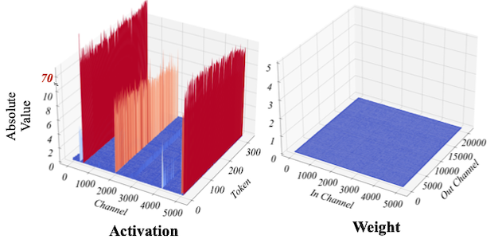

- activation: outlier channel로 인해 양자화가 어렵다.

- weight: 상대적으로 균일하여 양자화가 쉽다.

SmoothQuant에서는 activation과 weight의 행렬 곱셈(**linear**)에서 scaling 트릭을 적용하여 문제를 개선한다.

> 예를 들어 activation에 0.1을 곱한 뒤 weight에 10을 곱하면, 수학적으로 이전과 동일한 결과를 획득할 수 있다.

| Difficulty | Scaling | Smoothed |
| --- | :---: | :---: |
| | 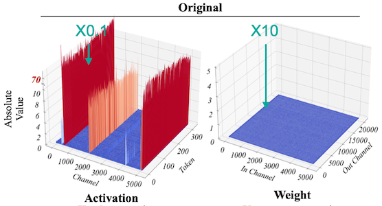 | 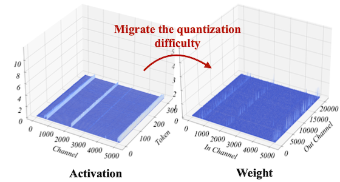 |
| **Activation** | **Hard** | **Easy** |
| **Weight** | **Easy** | Harder but **still Easy** |

---

### 13.1.1 Activation Smoothing

다음은 SmoothQuant에서 scaling 트릭을 적용하는 과정을 나타낸 그림이다. (왼쪽 행렬은 activation $\mathbf{X}$ , 오른쪽 행렬은 weight $\mathbf{W}$ , $\alpha$ 는 Migration Strength(논문: 0.5))

> 예제 activation: 2개의 sequence, 각 sequence는 4 hidden dimension(input channel $j = 1, 2, 3, 4$ )을 갖는다. 

> 색상 하이라이트는 outlier value를 나타낸다.

(1) **Calibration Stage** (Offline)

per-channel smoothing factor $s$ 를 획득한다.

| Per-channel Abs Max | $\max \|\mathbf{X}\|$ ÷ $\max \|\mathbf{W}\|$ |
| :---: | :---: |
| 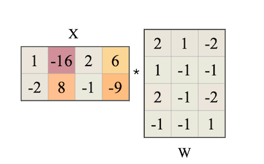 | 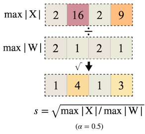 | 

$$ s_j = \max (|\mathbf{X_j}|)^{\alpha} / \max (|\mathbf{W_j}|)^{1- \alpha} $$

(2) **Smoothing Stage** (Offline)

activation의 smoothing은, LayerNorm에서 $s$ 를 나누는 방식으로 통합하여 구현된다. (fuzed $\rightarrow$ zero overhead)

| Activation | Weight |
| :---: | :---: |
| 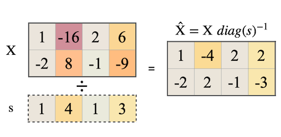 | 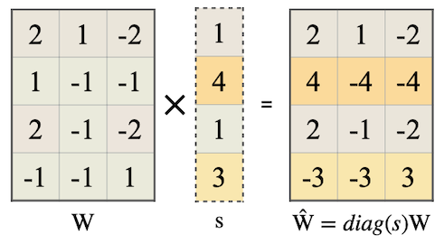 | 

(3) **Inference** (Runtime)

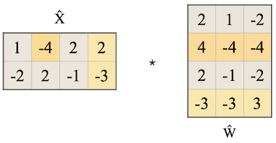

$$ \mathbf{Y} = (\mathbf{X} diag (s)^{-1}) \cdot (diag (s)\mathbf{W}) = \hat{\mathbf{X} }\hat{\mathbf{W} } $$

---

### 13.1.2 Ablation Study on the Migration Strength

OPT-175B 모델을 대상으로 migration strength를 다양하게 조정한 실험에서는, $\alpha$ 를 0.5에 근접하게 설정했을 때 가장 높은 정확도를 획득했다.

- $\alpha < 0.4$ : activation 난이도 상승

- $\alpha > 0.6$ : weight 난이도 상승

---

### 13.1.3 System Implementation

SmoothQuant는 (NVIDIA에서 Transformer 추론 가속을 위해 설계한) **FasterTransformer** 라이브러리에 기반한 시스템을 설계하였다.

- compute-intensive operations (`Linear`, `BMM`): INT8로 양자화하여 연산한다.

- `LayerNorm`, `Softmax`, `Element-wise Add`: 정확도를 위해 FP16으로 연산한다.

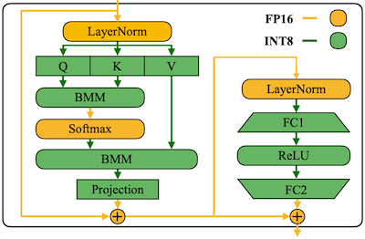

> `BMM`: Batch Matrix Multiplication

---

### 13.1.4 SmoothQuant Benchmark

다음은 세 가지 LLM 모델을 대상으로 한 SmoothQuant 적용 전, 후 LAMBADA 벤치마크 정확도를 비교한 결과이다. (참고로 SmoothQuant는 별도의 미세조정을 필요로 하지 않는다.)

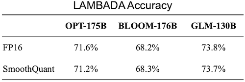

다음은 OPT-175B 모델을 대상으로 한 실험에서 SmoothQuant의 지연시간, 메모리 사용량을 비교한 도표이다.

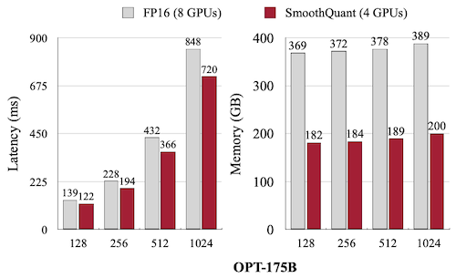

> SmoothQuant를 사용하면, MT-NLG 530B 모델을 8 GPU(NVIDIA A6000)를 장착한 1개 노드만으로 서빙할 수 있다. (통신 오버헤드 제거)

---

## 13.2 Single-batch LLM Serving

앞서 SmoothQuant의 W8A8 양자화는 batch serving (e.g., bs=128)에서 효율적일 수 있으나, On-device처럼 single-query LLM inference를 가정한 시나리오에서는 대안으로 적합하지 않다.

---

### 13.2.1 Highly Memory-bounded Decoding

다음은 LLaMA-65B decoding을 수행했을 때, batch size 설정별 compute intensity를 나타낸 그림이다. (NVIDIA A100 GPU 기준)

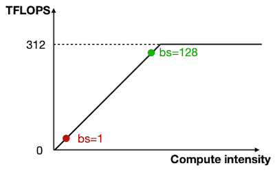

- bs=1: **memory bound** 병목으로, 충분한 성능을 이끌어내지 않는다.

> Compute Intensity = FLOPs / Memory Bandwidth

---

### 13.2.2 Bottleneck of Single-batch LLM Inference

다음은 LLaMA-7B의 RTX 4090 GPU 추론(bs=1, FP16 with FasterTransformer)을 가정했을 때, context stage와 generation stage의 latency 및 computation intensity를 비교한 실험이다.

> Context(summarizing a prompt with 200 tokens) vs. Generation(generating 20 tokens)

| Latency | Computation Intensity(Generation Stage) |
| :---: | :---: |
| 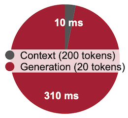 | 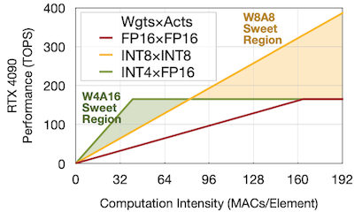 |

이처럼 배치 사이즈가 작은 경우, 추론 지연시간의 대부분을 generation stage이 차지하는 것을 확인할 수 있다. 또한, 작은 배치 사이즈 설정에서는, W8A8보다 W4A16 양자화가 우수한 computation intensity를 가졌다.

다음은 Attention, FFN 연산에서 weight, activation의 memory footprint를 비교한 그림이다.

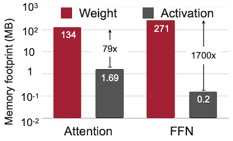

이처럼 single-batch 설정에서는 weight loading이 메모리 병목의 큰 지분을 차지한다. 하지만 달리 말하면, 가중치를 low-bit로 양자화하는 것으로 token generation을 가속할 수 있다.

---

## 13.3 AWQ: Activation-aware Weight Quantization

> [AWQ: Activation-aware Weight Quantization for LLM Compression and Acceleration 논문(2023)](https://arxiv.org/abs/2306.00978)

그러나, 단순한 low-bit weight quantization만으로는 LLM의 급격한 정확도 하락을 방지하기 어렵다. 다음은 OPT-6.7B 모델을 INT3 양자화했을 때 발생하는 정확도 하락을 보여준다.

> Group-wise(or block-wise) quantization을 적용하였다. (group size=128)

| Conventional int3-g128 | Acc. Degrade |
| :---: | :---: |
|  | 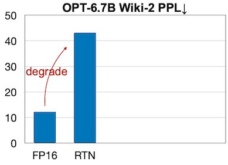 |

하지만 AWQ는 양자화에서 가장 중요한(salient) 1%의 가중치 채널만 예외로 두는 것으로, 발생하는 정확도 하락을 대부분 방지할 수 있다는 사실을 발견하였다.

| AWQ(Mixed Precision) | Acc. Degrade |
| :---: | :---: |
| 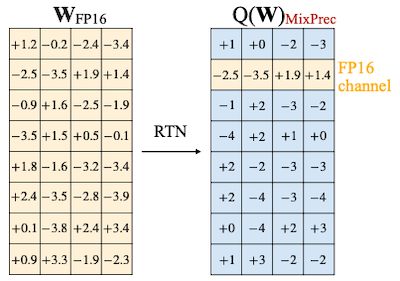 | 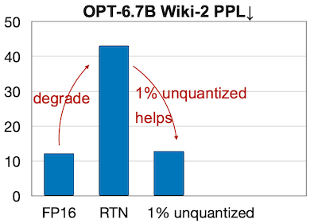 |

---

### 13.3.1 Selecting Salient Weight Channels

이때 1%의 중요한 가중치 채널은, activation outlier를 기준으로 선택한다.

| Selected by Activation | Acc. Degrade |
| :---: | :---: | 
| 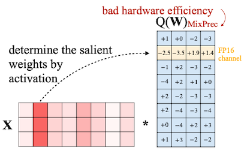 | 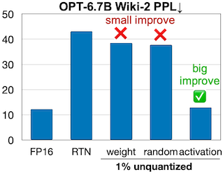 |

---

### 13.3.2 Protect Salient Weight by Scaling

하지만, FP16 mixed precision을 유지하는 것은 구현이 어렵고 비효율적이다.

> **Notes**: 양자화는 일반적으로 다음과 같은 수식으로 정의된다. ( $y = Q(\mathbf{w})\mathbf{x}$ )
> 
> $$ Q(\mathbf{w}) = \triangle \cdot \mathrm{round} \frac{\mathbf{w} }{\triangle} $$
>
> $$ \triangle = \frac{\max (|\mathbf{w}|)}{2^{N-1} } $$
>
> $N$ : number of bits, $\mathbf{w}$ : group/block of weight (그룹마다 Absmax를 적용한다.)

따라서 AWQ는 mixed precision을 유지하는 대신, 양자화에 scaling을 추가하여 salient weight를 보호하는 방법을 제안하였다. 

$$ \mathbf{WX} \overset{Quant}{\longrightarrow} Q(\mathbf{W} \cdot \mathbf{s}) (\mathbf{s^{-1} } \cdot \mathbf{X}) $$

> $\mathbf{s^{-1} }$ : 이전 연산에 결합(fused)하여 수행된다.

그러나 해당 scaling으로 발생하는 양자화 오차를 고려해야 하므로, 이를 위한 적절한 기준도 필요하게 되었다.

| Scaling | Acc. Degrade |
| :---: | :---: |
|  |  |

---

### 13.3.3 Activation-aware Optimal Scaling

> **Notes**: $\mathbf{s}$ 가 너무 크지 않다는 가정( $\triangle \approx \triangle '$ ) 하에, 양자화 오차는 $\mathbf{s^{-1} }$ 에 비례한다.
> 
> - 99% weight channel
>
> $$ Q(w) \cdot x = \triangle \cdot \mathrm{round} \frac{w}{\triangle} \cdot x $$
>
> - 1% salient weight channel
>
> $$ Q(w \cdot s) \cdot \frac{x}{s} = \triangle ' \cdot \mathrm{round} \frac{w \cdot s}{\triangle '} \cdot x \cdot \frac{1}{s} $$

AWQ는 양자화 전,후 activation의 차이를 최소화하는 방식으로 최적 scaling 설정을 탐색한다.

$$ \mathscr{L}(\mathbf{s}) = || Q(\mathbf{W} \cdot \mathbf{s}) (\mathbf{s^{-1} } \cdot \mathbf{X}) - \mathbf{WX} || $$

이때 $\mathbf{s}$ 의 search space는, salient channel과 non-salient channel의 균형을 맞추기 위한 하이퍼파라미터인 $\alpha \in [0, 1]$ 를 포함한다. (`0: scaling 미적용`) $\alpha$ 의 탐색은 grid search를 통해 진행된다.

$$ \mathbf{s} = \mathbf{s^{\alpha}_{X} } $$

$$ {\alpha}^{*} = \arg\min_{\alpha} \mathscr{L}( \mathbf{s^{\alpha}_{X} } ) $$

> $\mathbf{s_{X} }$ : average magnitude of activation (per-channel)

---

### 13.3.4 Data-efficiency for Calibration Set

AWQ는 설계상 regression이나 backpropagation이 필요하지 않으며, 적은 양의 calibration set만으로도 양자화를 수행할 수 있다.

다음 도표는 AWQ와 GPTQ를 비교한 실험으로, 실제로 AWQ가 GPTQ 대비 10배 작은 calibration set에서 보다 우수한 perplexity를 갖는 것을 관찰할 수 있다.

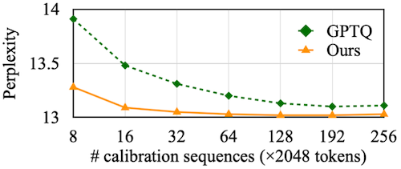

> 참고로 AWQ는 GPTQ와 orthogonal하기 때문에, 둘을 함께 사용하는 선택도 가능하다.

---

### 13.3.5 AWQ Results

> [VILA: On Pre-training for Visual Language Models 논문(2023)](https://arxiv.org/abs/2312.07533)

다음은 Llama-2, LLaMA 모델을 대상으로 AWQ의 perplexity를 비교한 실험 결과이다. (`INT3-g128`, `INT4-g128`)

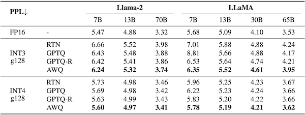

> RTN: Round-to-nearest quantization

또한, **VLM**(Vision Language Model)인 VILA 모델을 대상으로 한 실험에서도 우수한 성능을 달성하였다.

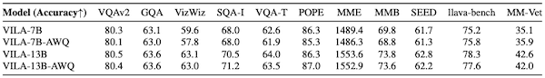

---