# 13 LLM Deployment Techniques

> [EfficientML.ai Lecture 13 - LLM Deployment Techniques (MIT 6.5940, Fall 2024)](https://youtu.be/sTz2tXG1T0c)

---

## 13.7 Wanda: Weight Sparsity

> [A Simple and Effective Pruning Approach for Large Language Models 논문(2023)](https://arxiv.org/abs/2306.11695)

Wanda 논문에서는 weight 및 activation distribution에 기반한 pruning 기법을 제안하였다.

- criteria = $|weight| * ||activation||$

| Magnitude-based | Wanda |
| :---: | :---: |
| 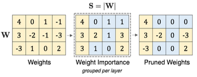 | 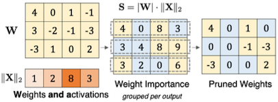 |

---

### 13.7.1 Wanda: Results

Wanda는 LLaMA, LLaMA-2를 대상으로 한 여러 실험에서, magnitude-based pruning보다 우수한 성능(mean zero-shot accuracy)을 달성하였다.

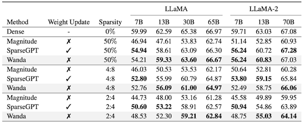

---

## 13.8 Deja Vu: Contextual Sparsity

> [Deja Vu: Contextual Sparsity for Efficient LLMs at Inference Time 논문(2023)](https://arxiv.org/abs/2310.17157)

LLM에서 각 입력 토큰을 추론할 때마다, 모델의 전체 파라미터가 필요한 것은 아니다. **Deja Vu**는 입력 토큰마다 필요로 하는 head & MLP subset만을 남기는 방식의 dynamic pruning 기법이다. (**input-dependent**)

논문에서는 이러한 방식으로 획득하는 희소도를 *contextual* (*dynamic*) *sparsity*라고 지칭한다.

- medium-high 수준 희소도: static sparsity 대비 정확도 우수

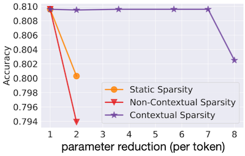

> **in-context learning** 성능을 보존하는 면에서도 static sparsity보다 유리하다.

---

### 13.8.1 Hypothesis 1: Contextual Sparsity

다음은 OPT 모델에 입력 토큰을 전달했을 때, 모델의 attention head, MLP block에서 활성화되지 않은 파라미터 비율을 보여주는 그림이다.

- OPT-175B 기준

  - Attention Head: 평균 **80%**

  - MLP Block: 평균 **95%**

| Attention Head | MLP Block |
| :---: | :---: |
| 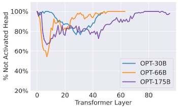 | 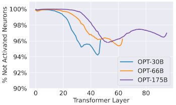 |

> `x`: layer index

---

### 13.8.2 Hypothesis 2: Self-attentions are Mean-shift Clustering

> **Notes**: *Mean shift Clustering* = 주변에서 가장 데이터가 밀집된 지점으로 데이터를 모으는 클러스터링 (centroid-based, iterative)
>
> - $n_k$ : 반지름 $h$ 의 구(Sphere)에 포함된 데이터 수
>
> $$ y_{k+1} \leftarrow \frac{1}{n_k} \sum_{x_i \in S_h (y_k)} x_i $$

다음은 사전학습된 LLM에 입력을 주었을 때, 서로 다른 3개의 attention heads에서 계산된 score를 나타낸다. (예측해야 하는 토큰은 `Truck`)

| Head | Features |
| --- | --- |
| **heavy hitter** | $H_{42}$ : `like`에서 high attention  $H_{44}$ : `shipping`에서 high attention  |
| **uniform mixing** | $H_{43}$ : 모든 token에서 균일한 attention (제거해도 예측에 영향을 미치지 않음) |

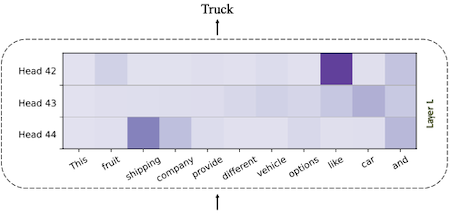

> contextual sparsity의 발생은 이러한 attention layer의 특성에서 기인한다.

또한 논문에서는 self-attention head 연산을 mean-shift step으로 간주할 수 있음을 증명하였다. (uniform head를 동적으로 예측할 수 있는 근거)

---

### 13.8.3 Similarity in Consecutive Layers

LLM의 residual connection은, token embedding이 레이어 전반에 걸쳐 유사성을 갖게 만든다.

$$ X' = X+F(X) $$

| Residual around Attention | Residual around MLP |
| :---: | :---: |
| 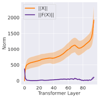 | 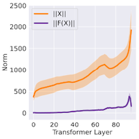 |

> $||X||$ 가 $F(X)$ 보다 훨씬 큰 값이므로 임베딩은 느리게 변화하게 된다.

---

### 13.8.4 Asynchronous Lookahead Predictor

Deja Vu는 유사도를 바탕으로, 추론 중 asynchronous하게 가지치기할 파라미터를 선택하는 예측기를 제안하였다.

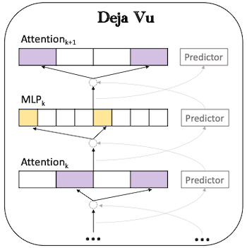

> 이전 레이어 출력 $y$ 와 파라미터 사이의 유사도를 기반으로 예측

---

### 13.8.5 Deja Vu: Results

이러한 설계로 Deja Vu에서는 배치 사이즈 1, A100 8개(NVLINK) 설정에서 가장 우수한 per-token latency를 달성하였다.

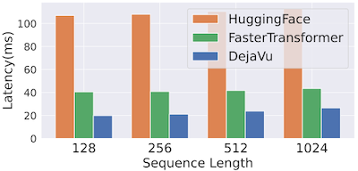

---

## 13.9 Mixture-of-Experts (MoE)

> [Outrageously Large Neural Networks: The Sparsely-Gated Mixture-of-Experts Layer 논문(2017)](https://arxiv.org/abs/1701.06538)

> [Switch Transformers: Scaling to Trillion Parameter Models with Simple and Efficient Sparsity 논문(2021)](https://arxiv.org/abs/2101.03961)

**MoE**(Mixture-of-Experts)는 token $x$ 마다 상위 $k$ 개의 expert( $\lbrace E_i(x) \rbrace {}_{i=1}^{N}$ )만을 추론하는 방식으로 비용을 절감한다.

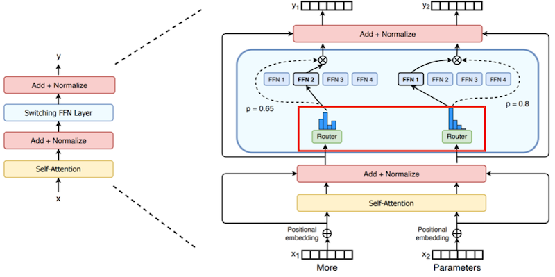

특히 MoE를 활용하면, 추론 비용(per token)의 증가 없이 모델의 파라미터 수만을 늘릴 수 있다. (loss 감소, perplexity 향상)

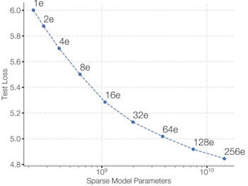

> more experts $\rightarrow$ larger model size $\rightarrow$ lower loss, better perplexity

---

### 13.9.1 Mixture of Experts Layer

> [Maarten Grootendorst: A Visual Guide to Mixture of Experts (MoE)](https://newsletter.maartengrootendorst.com/p/a-visual-guide-to-mixture-of-experts)

> [Mixtral of Experts 논문(2024)](https://arxiv.org/abs/2401.04088)

MoE 레이어 내부의 router는 Top-k의 expert를 활성화하는 기능을 담당한다. 다음은 기본적인 형태의 routing을 보여주는 그림이다.

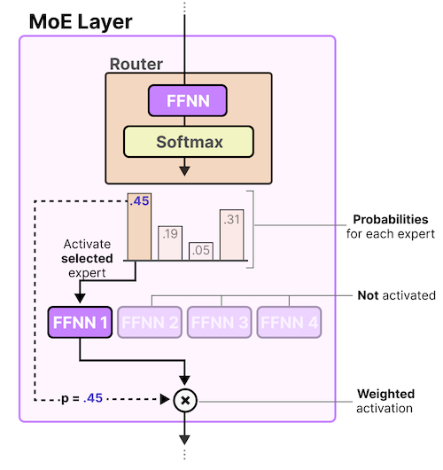

$$ G(x) := \mathrm{Softmax}(\mathrm {TopK (x \cdot W_g)}) $$

> $x$ : 입력, $W$ : router weight matrix

이후 선택된 expert 출력과 router 출력을 곱한 뒤, 합산한 결과를 반환한다.

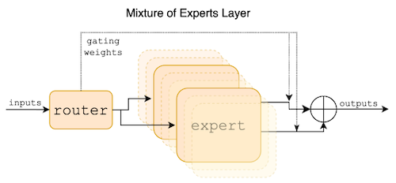

$$ \sum_{i=0}^{n-1} G(x){}_i \cdot E_i (x) $$

> 값으로 0을 갖는 gate에서 연산 생략

---

### 13.9.2 Distributed Switch Implementation

> **Notes**: 기본적으로 token은 가장 큰 router probability에 대응되는 expert로 전달되지만, 이때의 배치 크기가 expert의 용량보다 크면 overflow가 발생하게 된다.

추론 성능을 최대화하기 위해서는, expert 수는 load balancing을 고려한 최적의 값으로 활성화되어야 한다. Switch Transformers 논문에서는 이를 조절하기 위한 설계로 **expert capacity**를 사용하였다.

- *capacity factor*: slot 수 조절 (`> 1.0` = 버퍼를 추가로 생성)

$$ \mathrm{expert} \ \mathrm{capacity} = \frac{ \mathrm{tokens} \ \mathrm{per} \ \mathrm{batch} }{ \mathrm{number} \ \mathrm{of} \ \mathrm{experts} } \times \mathrm{capacity} \ \mathrm{factor} $$

다음은 capacity factor 설정별로 expert 3개에 token이 할당된 예시다. (빨간 점선=overflow)

- `C=1`: $6/3 \times 1 = 2$  (**1 token skipped**)

- `C=1.5`: $6/3 \times 1.5 = 3$ 

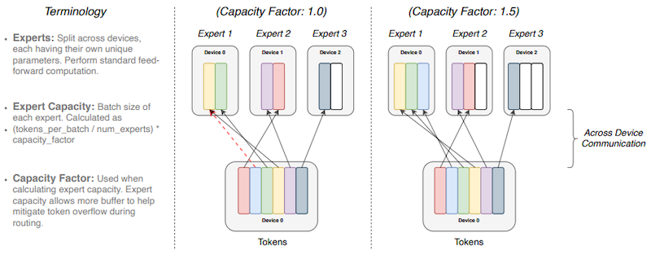

capacity factor를 크게 설정하여 overflow를 방지할 수 있으나, 계산 및 통신 비용이 증가하는 trade-off가 발생한다.

---

### 13.9.2 Different Routing Mechanism

> [A Review of Sparse Expert Models in Deep Learning 논문(2022)](https://arxiv.org/abs/2209.01667)

다음은 여러 논문에서 제안된 세 가지 routing 방법을 비교한 그림이다.

| Tokens choose Top-k Experts | Experts choose Top-k Tokens | Globally Decide Expert Assignment |
| :---: | :---: | :---: |
| 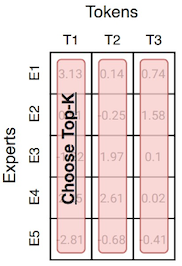 | 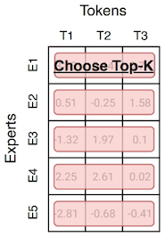 | 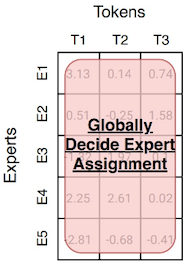 |

---

## 13.10 SpAtten: Attention Sparsity

> [SpAtten: Efficient Sparse Attention Architecture with Cascade Token and Head Pruning 논문(2020)](https://arxiv.org/abs/2012.09852)

SpAtten은 중요하지 않은 token, head를 판별하여 cascade pruning을 수행한다.

- token: attention에서 계산한 cumulative score 중 작은 값은 pruning

- $V$ : $QK$ 가 작으면 pruning

| Cascade Pruning | Cumulative Score |
| :---: | :---: |
| 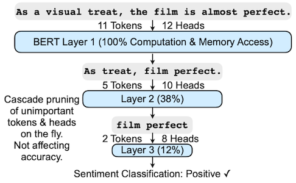 | 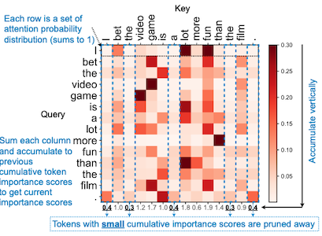 |

---

## 13.11 H2O: Attention Sparsity

> [H2O: Heavy-Hitter Oracle for Efficient Generative Inference of Large Language Models 논문(2023)](https://arxiv.org/abs/2306.14048)

KV cache 사이즈를 줄이기 위한 다양한 선행 연구(e.g., low-rank based transformer, MQA)가 등장하였지만, 사전 학습된 LLM에 적용하였을 때 높은 캐시 미스율과 정확도 하락 문제가 발생하였다.

| Symbolic Plots of Attention Map | Trade-off |
| :---: | :---: |
| 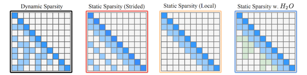 | 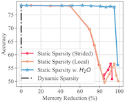 |

이를 해결하기 위해, H2O는 KV cache 내부에서 local token과 Heavy Hitters( $H_2$ )를 보존하는 방식의 pruning을 수행한다.

---

### 13.11.1 Heavy-Hitter Oracle

다음은 논문에서 제안한 Heavy-Hitter Oracle ($H_2O$ cache eviction policy) 방식으로 Heavy Hitter를 판별하는 예시다. (greedy algorithm 기반)

> KV cache size: 3으로 가정

**(1) step 1-3**: 3개의 토큰을 캐시에 저장

**(2) step 4**: accumulated attention score에 따라 세 번째 token 제거

**(3) step 5**: step 4와 동일한 방식으로 pruning 수행

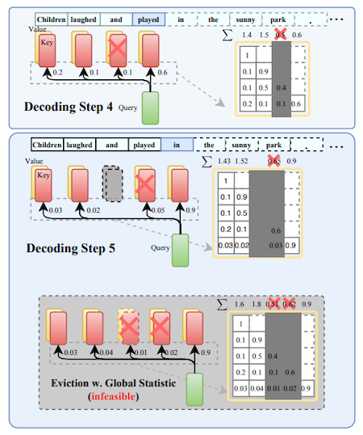

---