# 13 LLM Deployment Techniques

> [EfficientML.ai Lecture 13 - LLM Deployment Techniques (MIT 6.5940, Fall 2024)](https://youtu.be/sTz2tXG1T0c)

---

## 13.12 Metrics for LLM Serving

> [databricks: LLM Inference Performance Engineering: Best Practices](https://www.databricks.com/blog/llm-inference-performance-engineering-best-practices)

다음은 LLM serving에서 주요하게 다루는 네 가지 성능 지표이다.

- **Goal**: *TTFT*, *TPOT* 최소화, *throughput* 최대화

- **Trade-off**: *throughput* vs. *TPOT*

| Metric | Description |
| --- | --- |
| **Time to First Token** (**TTFT**) | 사용자가 쿼리를 입력한 이후, 모델 출력을 보기까지 걸리는 시간 |
| **Time Per Output Token** (**TPOT**) | 각 사용자의 출력 토큰을 생성하는 데 걸리는 시간 |
| **Latency** | (*TTFT*) + (*TPOT* \* 생성할 토큰 수) |
| **Throughput** | 모든 사용자 요청에 대해, 초당 생성할 수 있는 출력 토큰의 수 |

> e.g., 100ms/1 token: *TPOT* = 10 tokens/second(\~ 450words/minute)

---

### 13.12.1 Key Heuristics for Model Evaluation

다음은 모델 성능과 관련된 대표적인 세 가지 휴리스틱 요소이다.

| Heuristic | Description |
| --- | --- | 
| **Output Length** | *latency* 좌우 |
| **Input Length** | *TTFT*에 영향을 미치나, *latency* 영향은 비교적 적음 (e.g., MPT 모델 *latency*: 512개 입력 토큰 추가 < 8개 출력 토큰 추가) |
| **Model Size** | 대형 모델일수록 긴 *latency* (단, 비례하지는 않음) (e.g., Llama-70B: **2x** Llama-13B 수준) |

이때, input length는 하드웨어 제약 조건을 반드시 고려해야 한다.

> e.g., context length=2048 tokens의 MPT-7B 서빙: A100-80GB 이상의 GPU 권장

---

## 13.13 vLLM and Paged Attention

> [Efficient Memory Management for Large Language Model Serving with PagedAttention 논문(2023)](https://arxiv.org/abs/2309.06180)

다음은 sequence length가 다른 두 Request를 처리하는 예시로, 대표적인 KV cache의 메모리 낭비 요인을 보여준다.

- *Internal fragmentation*: unknown output length에 따른 over-allocation

- *Reservation*: 현재 사용하지 않으나, 이후 사용할 메모리를 미리 할당

- *External fragmentation*: 서로 다른 sequence length에 의해 발생

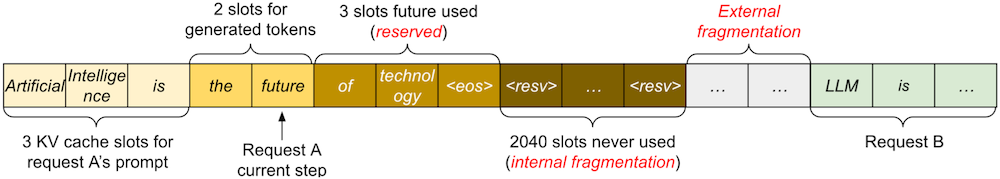

> (sequence length) `Request A`: 최대 2048, `Request B`: 최대 512

입력 시퀀스 길이는 매우 가변적이고 예측하기 어렵기 때문에, 단편화(fragmentation) 및 예약(reservation)으로 인해 KV cache를 60\~80% 만큼 낭비하게 된다.

> **Notes**: 13B 파라미터 LLM 모델을 NVIDIA A100(40GB)에서 서빙할 때의 메모리 할당 예시
>
> 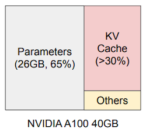

---

### 13.13.1 PagedAttention

> [vLLM Blog: Easy, Fast, and Cheap LLM Serving with PagedAttention](https://blog.vllm.ai/2023/06/20/vllm.html)

논문에서는 OS(Operating System)에서 영감을 받은, *virtual memory* 및 *paging* 기반의 attention 연산 알고리즘인 **PagedAttention**을 제안하였다.

이때 KV cache는 block 단위로 분할되며, 블록은 정해진 개수의 K, V 값을 갖는다.

| Memory Management in OS | Memory Management in vLLM |
| :---: | :---: |
| 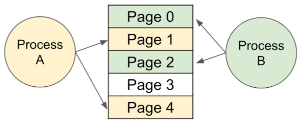 | 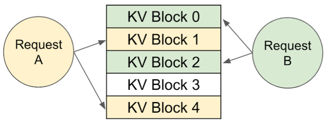 |
| **pages** | **blocks** |
| **bytes** | **tokens** |
| **processes** | **sequences** |

다음은 PagedAttention 구현에서의 attention 연산 과정을 보여주는 예시다.

> Prompt: "Alan Tuning is a computer scientist", Completion: "and mathematician renowned for"

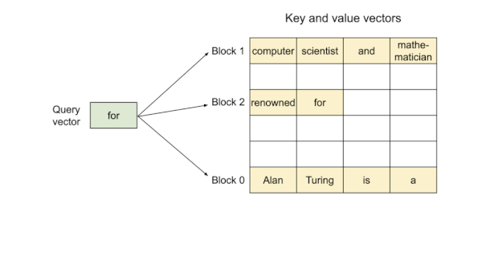

KV block은 virtual memory를 기반으로 하므로, physical memory에서 불연속적으로 저장될 수 있다.

---

### 13.13.2 Block Table Translation in vLLM

> vLLM: 논문에서 제시한 serving engine

다음은 PagedAttention에서 출력을 생성하는 과정을 보여준다. 블록의 매핑은 block table을 통해 관리되며, 정해진 토큰 수를 초과하면 새로운 블록을 할당한다.

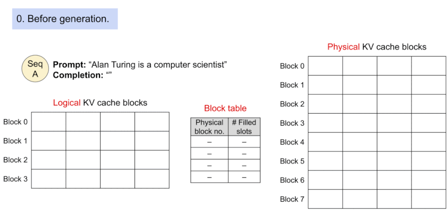

---

### 13.13.3 Prompt Sharing in Parallel Sampling

parallel sampling이란 동일한 프롬프트에서 여러 개의 출력 시퀀스를 생성하는 것을 의미한다.

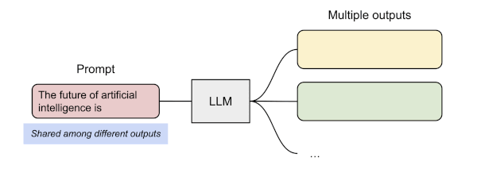

다음은 PagedAttention에서 parallel sampling을 수행하는 과정을 보여준다. (동일한 물리적 KV cache 블록를 공유)

---

## 13.14 FlashAttention

> [FlashAttention: Fast and Memory-Efficient Exact Attention with IO-Awareness 논문(2022)](https://arxiv.org/abs/2205.14135)

**FlashAttention**은 거대한 $N$ x $N$ attention 행렬을 모두 메모리에 저장하는 대신, SRAM 크기에 최적화된 타일 단위로 attention 연산을 수행하는 기법이다. (**tiling**)

이를 통해, HBM(High Bandwidth Memory)과 GPU on-chip SRAM 사이의 메모리 읽기/쓰기를 줄일 수 있다.

- Outer Loop(빨간색): on-chip SRAM에 $K$ , $V$ block 적재

- Inner Loop(파란색): iterative하게 $Q$ block을 on-chip SRAM에 적재하고 attention 연산 (출력은 HBM에 기록)

| FlashAttention | Speedup(GPT-2) |
| :---: | :---: |
| 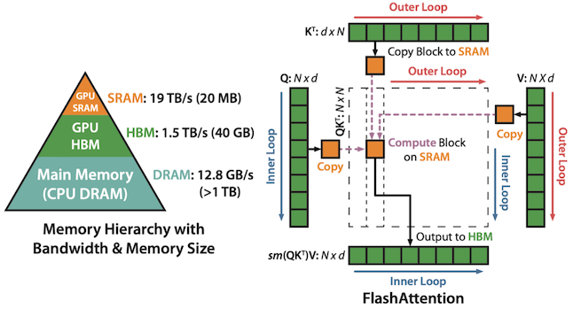 | 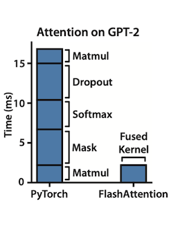 |

> 읽기/쓰기 오버헤드를 더욱 줄이기 위해, 두 커널을 하나로 합쳐서 구현하였다. (**kernel fusion**)

---

### 13.14.1 FlashAttention: Results

> [FlashAttention-2: Faster Attention with Better Parallelism and Work Partitioning 논문(2023)](https://arxiv.org/abs/2307.08691)

다음은 NVIDIA H100 GPU에서, PyTorch와 FlashAttention의 attention 연산 속도를 비교한 결과이다.

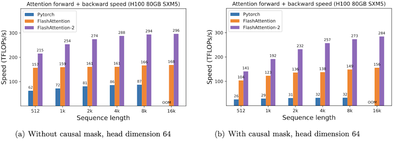

---

## 13.15 Speculative Decoding

> [Fast Inference from Transformers via Speculative Decoding 논문(2022)](https://arxiv.org/abs/2211.17192)

> [Google Research: Looking back at speculative decoding](https://research.google/blog/looking-back-at-speculative-decoding/)

기존의 decoding 과정은 token by token, 즉 한 번에 하나의 토큰을 생성하는 방식으로 동작한다. (**autoregressive decoding**)

예를 들어, 12개의 토큰으로 구성된 문장을 만드는 데만, 12번의 forward pass가 필요하다. 모델 가중치 전체를 읽어야 하므로 **memory-bounded**하며, 대체로 연산 리소스를 충분히 활용하지 못한다.

> **Notes**: GPU는 1초에 수백 조 연산이 가능하지만, 메모리 대역폭은 초당 수 조 바이트에 불과하다.

따라서 논문에서는 이러한 연산 리소스를 활용하여, 여러 토큰을 병렬로 계산하는 **Speculative Decoding** 기법을 제안하였다. 해당 기법에서는 두 종류의 모델을 활용한다.

- *Draft Model*: 소형 LLM (e.g., 7B), autoregressive

- *Target Model*: 대형 LLM (e.g., 175B), non-autoregressive

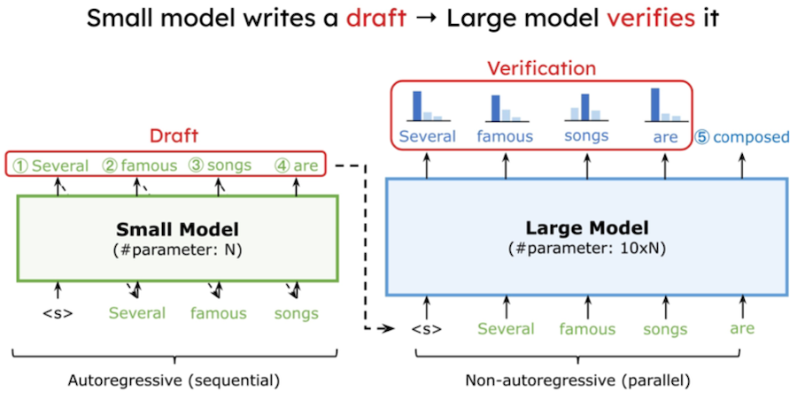

---

### 13.15.1 Speculative Decoding: Procedure

> [TitanML: In the Fast Lane! Speculative Decoding — 10x Larger Model, No Extra Cost](https://medium.com/@TitanML/in-the-fast-lane-speculative-decoding-10x-larger-model-no-extra-cost-f33ea39d065a)

speculative decoding은 다음 절차로 수행된다. (초록색: accepted, 빨간색: rejected, 파란색: correction)

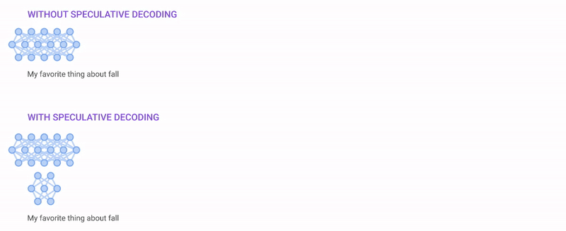

**(1)** **draft model** $p(.|.)$ : **autoregressive**하게 $K$ 개 토큰(**draft**)을 생성한다.

- $x_0, \cdots, x_t$ : 초기 프롬프트 시퀀스, $T$ : 타겟 시퀀스 길이

$$ \tilde{x}_{n+1}, \cdots, \tilde{x}_{n+K} $$

**(2)** **target model** $q(.|.)$ : 병렬로 draft token과 새 토큰 1개를 전달 받아, 위치별 확률을 계산한다. (logit)

- e.g., $\tilde{x}_{n+1}$ 위치의 확률

  draft model: $p(\tilde{x}_{n+1}|x_0, \cdots, x_n)$ , target model: $q(\tilde{x}_{n+1}|x_0, \cdots, x_n)$

> **Notes**: $\tilde{x}_{n+1}$ 토큰의 decoding에서는, 부수적으로 $x_0, \cdots, x_n$ 위치의 확률도 계산된다.

**(3)** **sampling**: $K$ 개 토큰의 accept/reject(및 correction) 여부를 결정한다.

- e.g., greedy sampling

  - 첫 번째 불일치 직전까지의 토큰: accept하여 입력 시퀀스에 추가. ("ate")

  - 불일치 발생 위치: target model의 토큰을("my") 입력 시퀀스에 추가하고, 과정을 다시 반복 

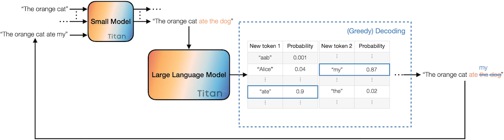

> *Token Acceptance Rate* (TAR): draft model이 생성한 토큰 중 accept되는 비율

---

## 13.16 Batching

Batching은 동시에 여러 입력(request)을 묶어서 처리하여, GPU throughput을 최대화하고 idle time은 최소화하는 기법이다.

Batching은 크게 네 가지 방법으로 분류할 수 있다.

- **No Batching**: 모든 request를 개별적으로 처리

- **Static Batching**: 처리 전, full batch가 형성될 때까지 대기

- **Dynamic Batching**: full batch 혹은 설정한 delay가 지나면 처리 (throughput, latency trade-off 고려)

- **Continuous Batching** (a.k.a., **In-Flight Batching**)

---

### 13.16.1 Dynamic Batching

> [Matt Howard, Philip Kiely: Continuous vs dynamic batching for AI inference](https://www.baseten.co/blog/continuous-vs-dynamic-batching-for-ai-inference/)

latency가 중요한 모델 서빙(e.g., Stable Diffusion)에서는, batch가 가득 차거나 설정한 지연 시간이 지나면 처리하는 **dynamic batching**이 유용한 수단일 수 있다.

- **static batching**: full batch(4 requests) 대기

- **dynamic batching**: 설정한 지연 시간이 지나면, full batch 여부와 관계 없이 처리

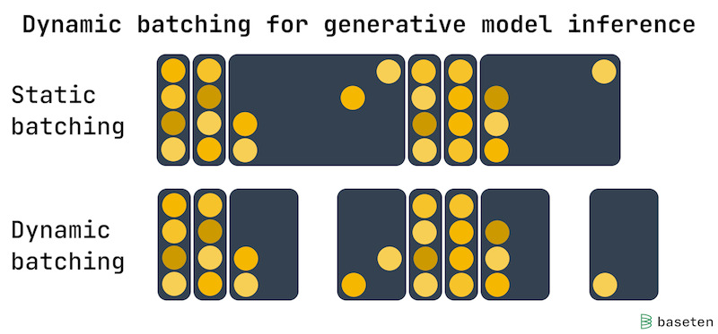

> 특히 균일한 추론 시간을 갖는 생성형 모델에서, throughput-latency trade-off 균형을 잘 맞출 수 있다.

---

### 13.16.2 Continuous Batching (In-Flight Batching)

**continuous batching**은 token-by-token 방식으로, 기존의 request가 끝나면 바로 새로운 request를 처리하는 기법이다.

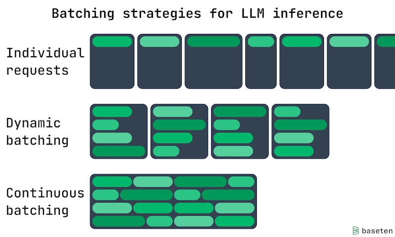

---

## 13.17 TensorRT-LLM Public Release

> [NVIDIA github: TensorRT-LLM](https://github.com/NVIDIA/TensorRT-LLM)

다음은 NVIDIA의 TensorRT-LLM 라이브러리에서 지원하는 주요 기능이다.

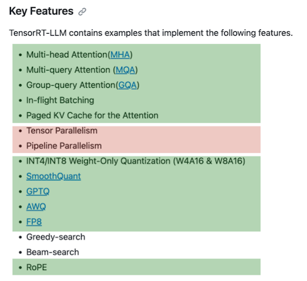

> 초록색: covered in the lecture

---