# 14 LLM Post-Training

> [EfficientML.ai Lecture 14 - LLM Post-Training (MIT 6.5940, Fall 2024)](https://youtu.be/OCdwWfVoQ-Q)

다음은 대부분의 LLM에서 갖는 training lifecycle을 보여준다.

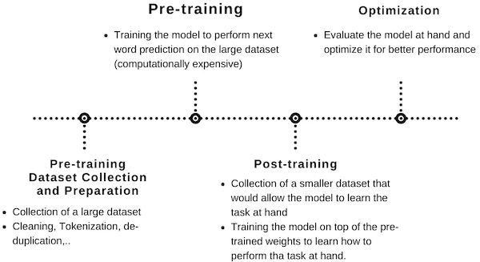

---

## 14.1 Supervised Fine-Tuning (SFT)

> [Juan Martinez: Supervised Fine-tuning: customizing LLMs](https://medium.com/mantisnlp/supervised-fine-tuning-customizing-llms-a2c1edbf22c3)

> [Llama 2: Open Foundation and Fine-Tuned Chat Models 논문(2023)](https://arxiv.org/abs/2307.09288)

**SFT**(Supervised Fine-Tuning)은 **labeled data**를 활용해 모델을 특정 downstream task으로 미세조정하는 방법이다. 

다음은 Llama-2 논문에서 SFT을 수행할 때 사용한 prompt-response 샘플 예시다. 참고로 상단은 유용성(helpfulness), 하단은 안전성(safety)와 관련된 샘플이다.

- training objective: next word prediction

$$ L(U) = \sum_i \log P(u_i | u_0 , \cdots, u_{i-1}; \Theta) $$

> 이때 answer tokens에 대해서만 역전파가 이루어진다. (loss on prompt token: zero-out)

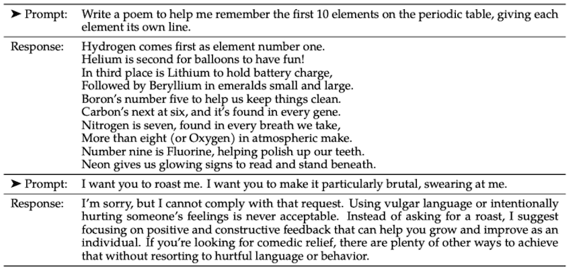

다음 예시는 "I can't log into my account. What should I do?"라는 입력에 대해, SFT 미세조정 전,후 응답을 비교한 예시다.

| | |
| --- | --- |
| w/o SFT | 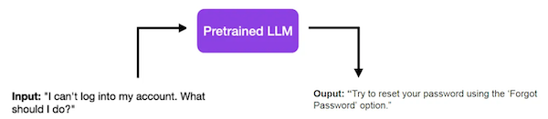 |
| w/ SFT | 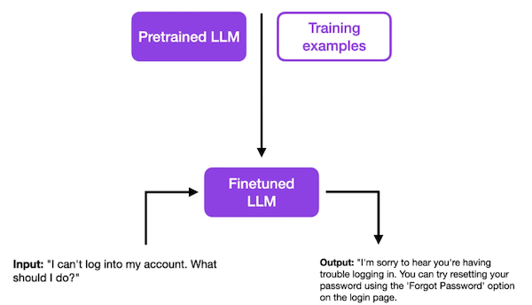 |

이전 답변은 무미건조하고 간결하지만, SFT 이후에는 친절한 고객 응답을 반환한다.

---

## 14.2 Reinforcement Learning from Human Feedback (RLHF)

> [Training language models to follow instructions with human feedback 논문(2022)](https://arxiv.org/abs/2203.02155)

기존 지표(e.g., BLEU, ROUGE 등)은 사람이 정의한 능력(e.g., 창의성, 진실성, 유용성)을 학습하기 어렵다. 대신 **RLHF**(Reinforcement Learning from Human Feedback)을 활용하여 이러한 능력을 강화할 수 있다.

GPT-3 모델을 미세조정한 위 논문에서는, Human Feedback에 기반한 효율적인 RLHF 방법을 소개한다. 해당 RLHF는 다음 절차로 진행된다.

- (step 2) comparison data: 모델의 출력 A, B, C, D (이후 사람에 의해 순위가 매겨진다)

| (1) Supervised Fine-Tuning | (2) Reward Model Training | Reinforcement Learning via PPO | 
| :---: | :---: | :---: |
| 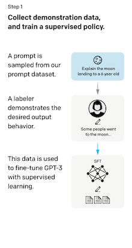 | 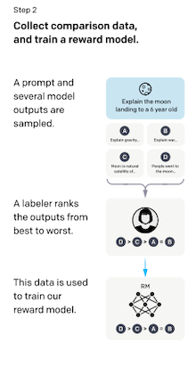 | 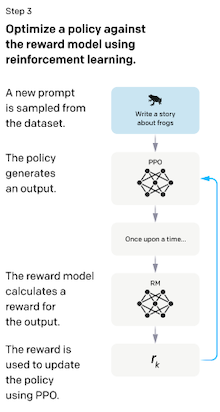 |

> *PPO*: Proximal Policy Optimization

---

### 14.2.1 Training Reward Model

> [Hugging Face Articles: Illustrating Reinforcement Learning from Human Feedback (RLHF)](https://huggingface.co/blog/rlhf)

RLHF의 강화학습은 2단계로 구성되며, 첫 번째 단계에서는 **Reward Model**을 학습한다.

**(1)** (예시) 두 LM에서 프롬프트 샘플을 입력으로 받아, 각각 텍스트 출력을 생성한다.

**(2)** 사람이 출력 텍스트의 랭킹 $y_{win}$ , $y_{lose}$ 를 매긴다. 

> 노이즈가 발생할 수 있는 스칼라 점수 방식은 사용하지 않는다.

**(3)** Reward Model을 학습한다.

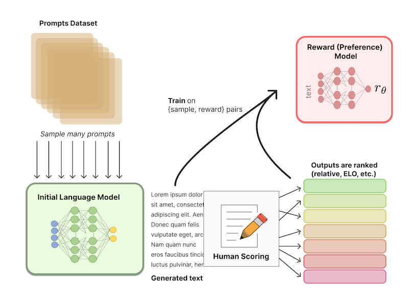

$$ \max_{{r}_{\theta}} \lbrace \mathbb{E}{}_{(x, {y}_{win}, y_{lose}) \sim D} [ \log (\sigma (r_{\theta} (x, y_{win}) - r_{\theta} (x, y_{lose}))) ] \rbrace $$

---

### 14.2.2 Fine-tuning with Reinforcement Learning

강화학습의 두 번째 단계에서는 Reward Model을 활용하여 LLM을 미세조정한다.

**(1)** LM에서 데이터셋의 prompt $x$ 을 입력으로 받아, text $y$ 를 출력한다.

**(2)** Reward(Preference) Model은 ( $x$ , $y$ )를 입력으로 받아, 스칼라 값 preferability ${\gamma}_{\theta}$ 를 반환한다.

**(3)** KL penelty를 계산한다.(initial LM에서 크게 벗어나지 않도록 방지)

**(4)** PPO 방식으로 파라미터를 업데이트한다.(reward matric을 최대화)

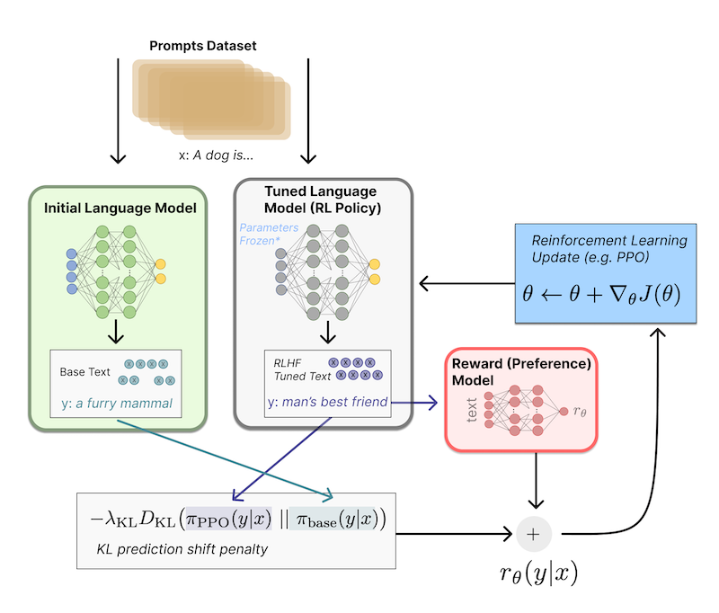

$$ \max_{{\pi}_{\theta}} \lbrace \mathbb{E}{}_{x \sim D,  y \sim {\pi}_{\theta}(y|x) } [ r_{\theta} (x,y) ] - \beta \mathbb{D} {}_{KL} [ {\pi}_{\theta} (y|x) | | {\pi}_{ref}(y|x) ] \rbrace $$

---

### 14.2.3 Direct Preference Optimization (DPO)

> [Direct Preference Optimization: Your Language Model is Secretly a Reward Model 논문(2023)](https://arxiv.org/abs/2305.18290)

**DPO**(Direct Preference Optimization)는 복잡한 절차를 필요로 하는 RLHF를, 단일 단계의 SFT task로 단순화한 미세조정 방식이다. 이때 DPO는 별도의 Reward Model(RM)을 두지 않으며, 간단한 분류 손실만으로 학습한다.

| RLHF | DPO |
| :---: | :---: |
| 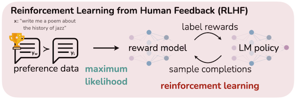 | 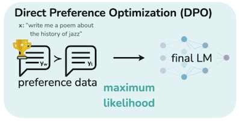 |

$$ \max_{{r}_{\theta}} \lbrace \mathbb{E}{}_{(x, {y}_{win}, y_{lose}) \sim D} [ \log (\sigma ( \beta \log \frac{{\pi}_{\theta}(y_{win}|x)}{{\pi}_{ref}(y_{win}|x)} - \beta \log \frac{{\pi}_{\theta}(y_{lose}|x)}{{\pi}_{ref}(y_{lose}|x)} )) ] \rbrace $$

> reference 모델에서 offline으로 계산: ${\pi}_{ref}(y_{win}|x)$ , ${\pi}_{ref}(y_{lose}|x)$

> 미세조정 모델에서 계산: ${\pi}_{\theta}(y_{win}|x)$ , ${\pi}_{\theta}(y_{lose}|x)$

위 수식에 따라, $y_{win}$ 출력이 $y_{lose}$ 출력 확률보다 높아지도록 학습이 수행된다.

---

#### 14.2.3.1 Example of DPO

> [Umar Jamil: dpo-notes](https://github.com/hkproj/dpo-notes)

다음은 데이터셋 샘플 예시 $x$ , $y_{win}$ , $y_{lose}$ 와, DPO에서 log probabilities를 계산하는 과정을 나타낸 그림이다. (초록색: ground truth)

- $x$ : "Where is Shanghai?"

- $y_{win}$ : "Shanghai is a city in China"

- $y_{lose}$ : "Shanghai does not exist"

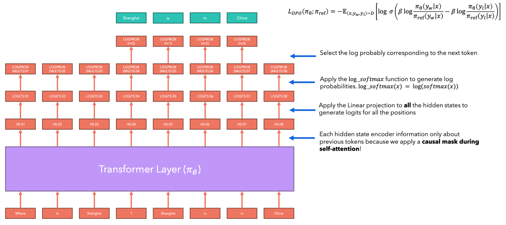

> logits $\rightarrow$ softmax $\rightarrow$ log probabilities

---

## 14.3 Taxonomy of Parameter-Efficient Fine-Tuning (PEFT)

> [Parameter-Efficient Fine-Tuning for Large Models: A Comprehensive Survey 논문(2024)](https://arxiv.org/abs/2403.14608)

LLM 모델의 막대한 파라미터 수는 downstream task을 위한 미세조정의 어려움으로 이어진다. 따라서 이러한 문제를 해결하기 위한 노력으로, 다양한 **PEFT**(Parameter-Efficient Fine-Tuning) 연구가 제안되었다.

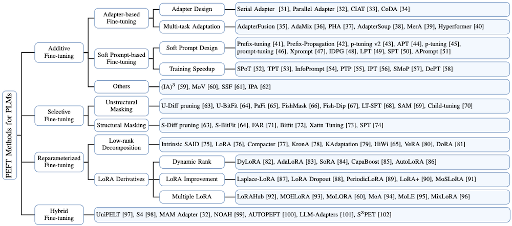

---

## 14.4 Additive PEFT

---

### 14.4.1 Adapter

> [Parameter-Efficient Transfer Learning for NLP 논문(2019)](https://arxiv.org/abs/1902.00751)

**Adapter**는 Transformer 레이어 내부에 learnable layer를 삽입하고, 해당 레이어만을 학습하는 미세조정이다.

> e.g., llama-7B 모델을 1000개 sub-task에 대해 미세조정할 경우, 필요한 파라미터 수
>
>  - Adapter: 1000 $\times$ 14MB = 14GB
>  
>  - FT-Full: 1000 $\times$ 7B llama = 14PB

다음은 adapter 레이어와, 이를 추가한 transformer 레이어를 나타낸 그림이다. 이때 adapter는 두 개의 feedforward layer로 구성되며 bottleneck 구조를 갖는다.

| Transformer w. Adapter | Adapter Layer |
| :---: | :---: |
| 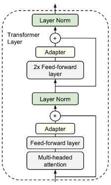 | 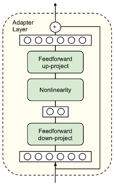 |

adapter는 task별로 레이어를 추가하는 방식(**per task**)을 따르며, 새로운 adapter 레이어를 추가할 때 반드시 이전 레이어를 제거할 필요는 없다.

---

#### 14.4.1.1 Adapter Results

다음은 BERT-Large 모델을 대상으로 한 GLUE benchmark 실험 결과이다. 실제로 adapter는 매우 적은 파라미터 수를 미세조정한 것만으로, SOTA와 근접한 성능을 달성하였다.

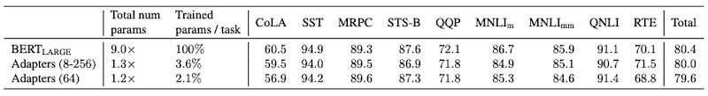

> `(8-256)`, `(64)`: bottleneck의 hidden dimension

그러나 단점으로, 추론 시 adapter에 의해 추가적인 지연시간이 발생하게 된다.

---

### 14.4.2 Prompt Tuning

> [The Power of Scale for Parameter-Efficient Prompt Tuning 논문(2021)](https://arxiv.org/abs/2104.08691)

> [Controlled Text Generation using T5 based Encoder-Decoder Soft Prompt Tuning and Analysis of the Utility of Generated Text in AI 논문(2022)](https://arxiv.org/abs/2212.02924)

**prompt tuning**은 별도의 파라미터 추가 없이, **soft prompt**를 학습하는 방식의 미세조정 기법이다. 

다음은 (input, label) 샘플의 hard, soft prompt 예시를 나타낸다. soft prompting은 입력의 앞부분에서 tunable embedding slot을 갖는다.

| Hard Prompting | Soft Prompting |
| :---: | :---: |
| 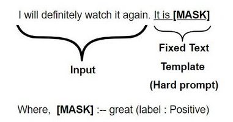 | 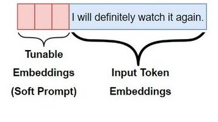 |

> `Input`: I will definitely watch it again. / `Label`: Positive

다음은 일반적인 model tuning과 prompt tuning을 비교한 그림이다. (Batch: A(a1, a2), B(b1), C(c1, c2))
 
| Model Tuning | Prompt Tuning |
| :---: | :---: |
|  | 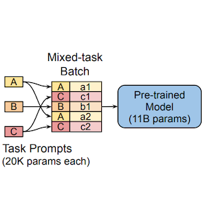 |

prompt tuning는 soft prompt를 활용하여, 동일한 모델에서 서로 다른 task를 한번에 학습할 수 있다.

> 단, soft prompting에서는 prompt 길이가 늘어나는 단점이 있다. (KV cache 사용량, 지연시간 증가)

---

#### 14.4.2.1 Prompt Tuning: Results

다음은 다양한 미세조정 설정에서, GPT-3 few-shot performance(SuperGLUE 점수)를 비교한 그래프이다. 

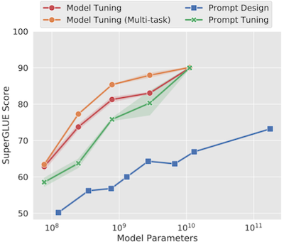

prompt tuning은 모델이 클수록, Model Tuning 수준의 정확도까지 도달할 수 있었다.

---

### 14.4.3 Prefix Tuning

> [Prefix-Tuning: Optimizing Continuous Prompts for Generation 논문(2021)](https://arxiv.org/abs/2101.00190)

**prefix-tuning**은 첫 레이어만 tunable prompt를 갖는 prompt tuning과 달리, 각 레이어에서 모두 tunable prompt를 갖는 미세조정 기법이다.

| Prompt Tuning | Prefix Tuning |
| :---: | :---: |
| 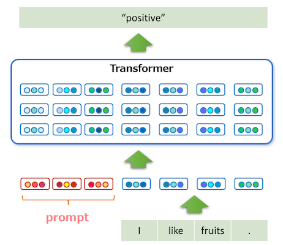 | 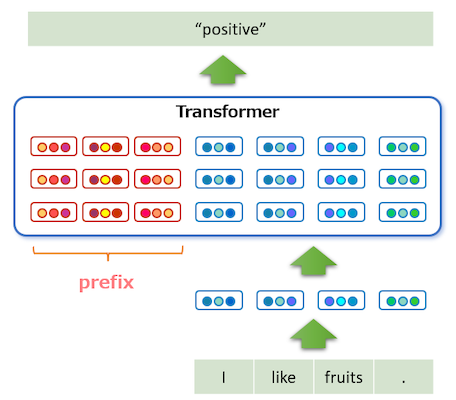 |

---

#### 14.4.3.1 Prefix Tuning: Results

Embedding-only 모델을 대상으로 한 실험에서, prefix tuning은 prompt tuning보다 일관적으로 우수한 성능을 달성하였다.

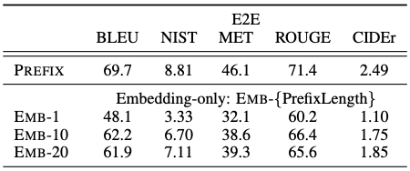

> EMB-1/10/20: prompt tuning

---

## 14.5 Selective PEFT

---

### 14.5.1 BitFit: Finetune Only Bias Terms

> [BitFit: Simple Parameter-efficient Fine-tuning for Transformer-based Masked Language-models 논문(2021)](https://arxiv.org/abs/2106.10199)

BitFit에서는 오직 bias만을 대상으로한 sparse fine-tuning을 제안하였다. 

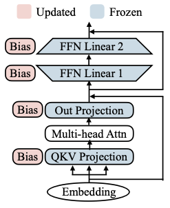

다음은 bias term을 포함한 수식을 정리한 도표이다. ( $W^{(\cdot)}$ , $g^{(\cdot)}$ : freezing, $b^{(\cdot)}$ : fine-tuning )

| QKV Projection | FFN Linear |
| :---: | :---: |
| 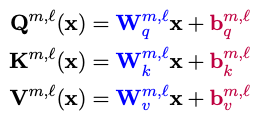 |  |

또한 bias 항은 단순한 합연산이므로, 역전파를 위해서 intermediate activation을 저장할 필요가 없다. ( $\partial L / \partial b$ )

> 110M 파라미터를 갖는 BERT-base 모델에서, bias가 차지하는 양은 오직 0.1M이다. (전체 파라미터의 0.1% 미만)

---

### 14.5.1.1 BitFit: Results

다음은 BERT-Large 모델의 다양한 미세조정 설정에서 획득한 GLUE benchmark 성능을 정리한 도표이다.

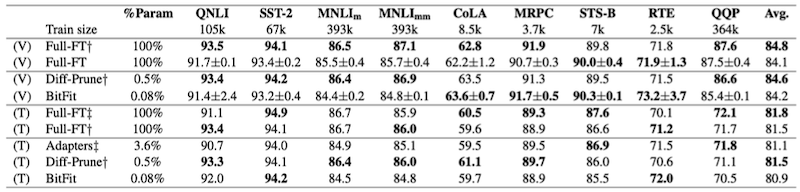

BitFit은 소형~중형 크기의 데이터셋에서, full fine-tuning과 유사하거나 그보다 우수한 성능을 달성하였다.

---

## 14.6 Reparameterized PEFT

---

### 14.6.1 LoRA

> [LoRA: Low-Rank Adaptation of Large Language Models 논문(2021)](https://arxiv.org/abs/2106.09685)

**LoRA**는 사전 학습된 파라미터에, 병렬(branch)로 rank decomposion matrix를 추가하는 미세조정 방법이다. 이때 LoRA 모듈은 2 parts(A, B)로 구성된다.

- **A**: $d$ $\rightarrow$ low-rank $r$ 차원으로 projection (**가우시안 분포**로 초기화)

- **B**: $r$ $\rightarrow$ $d$ 차원으로 projection (**0s**로 초기화)

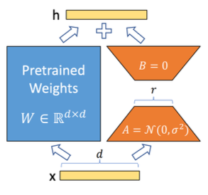

> 따라서, 초기화 직후의 LoRA는 출력에 어떠한 영향도 미치지 않는다.
>
> $$ h = x @ W + \underbrace{x @ A @ B}_{0} $$

배포 과정에서 A와 B를 결합(fuse)하는 것으로, 추론 시 별도의 overhead가 발생하지 않게 된다.

$$ x @ W + x @ A @ B = x @ (W + A @ B) = x @ W' $$

---

#### 14.6.1.1 LoRA Practical Cases

> [Civitai: Detail Tweaker LoRA](https://civitai.com/models/58390/detail-tweaker-lora-lora)

> [Civitai: ZavyChromaXL](https://civitai.com/models/119229?modelVersionId=169740)

다음은 Diffusion 모델을 대상으로, LoRA를 활용한 미세조정으로 획득한 출력을 비교한 예시다.

<table>
<tr>
<td colspan="2"> 

**Prompt**: `modern city`, `sunrise`, `railway` 

</td>
</tr>
<tr>
<td> 

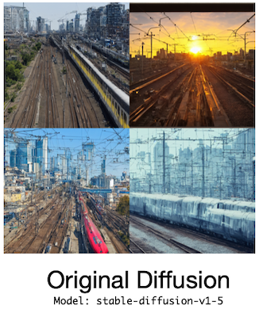

</td>
<td> 

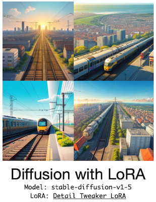

</td>
</tr>
</table>

<table>
<tr>
<td colspan="2"> 

**Prompt**: `Sushi rolls in the form of panda`

</td>
</tr>
<tr>
<td> 

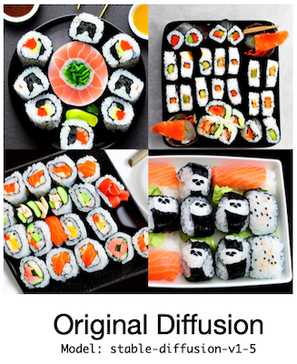

</td>
<td> 

</td>
</tr>
</table>

---

## 14.7 PEFT Quantization

---

### 14.7.1 QLoRA

> [QLoRA: Efficient Finetuning of Quantized LLMs 논문(2023)](https://arxiv.org/abs/2305.14314)

**QLoRA**에서는 LoRA의 설계를 따르면서도, base model을 4-bit(*NormalFloat*, `NF4`)로 양자화하여 미세조정한다.

다음은 full finetuning, LoRA, QLoRA 설계에서, 미세조정 시 필요한 메모리 사용량을 비교한 그림이다.

- **LoRA**: Adapter 파라미터만을 최적화하므로, Optimizer State 크기 감소

- **QLoRA** 

  **(1)** 4-bit 양자화: base model 메모리 사용량 감소 
  
  **(2)** Paged Optimizer(w. CPU offloading): 갑작스러운 memory spike 현상 방지 

| Full Finetuning (No Adapters) | LoRA | QLoRA |
| :---: | :---: | :---: |
| 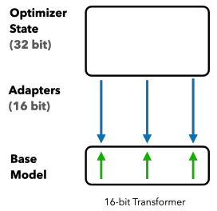 | 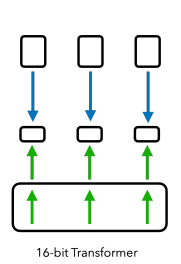 | 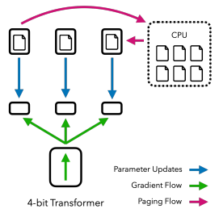 |

> 또한, QLoRA는 double quantization을 통해, 필요한 메모리 사용량을 추가로 감소시켰다.

---

#### 14.7.1.1 QLoRA: Results

논문에서는 QLoRA 방식으로 미세조정한 챗봇인 Guanaco 패밀리를 공개하였다. 다음은 Vicuna chatbot benchmark에서 Elo rating을 비교한 실험 결과이다. (채점: GPT-4)

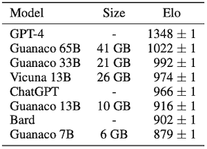

> QLoRA를 사용하여 middle/entry-level GPUs에서도 LLM을 미세조정할 수 있다.

---

### 14.7.2 BitDelta

> [BitDelta: Your Fine-Tune May Only Be Worth One Bit 논문(2024)](https://arxiv.org/abs/2402.10193)

**BitDelta**는 LLM을 대상으로 성공한 low-precision 미세조정 기법이다. 논문은 미세조정으로 추가되는 새로운 정보가 적다는 가정에서 출발한다. 

**(1)** 미세조정 모델의 가중치를, pre-trained component와 delta로 분리한다.

$$ \mathrm{weight} \ \mathrm{delta} \ \triangle = W_{fine} - W_{base} $$

**(2)** $\triangle$ 를 1 bit로 양자화한다. ( $\hat{\triangle} = \alpha  \odot \mathrm{Sign} (\triangle)$ )

$$ \mathrm{Sign}(W_{ij}) = \begin{cases} +1, & \mathrm{if} \ W_{ij} > 0, \\ -1, & \mathrm{if} \ W_{ij} \le 0, \end{cases} $$

> $\alpha$ : per-tensor scaling factor (high-precision)

**(3)** scaling factor를 미세조정한다.

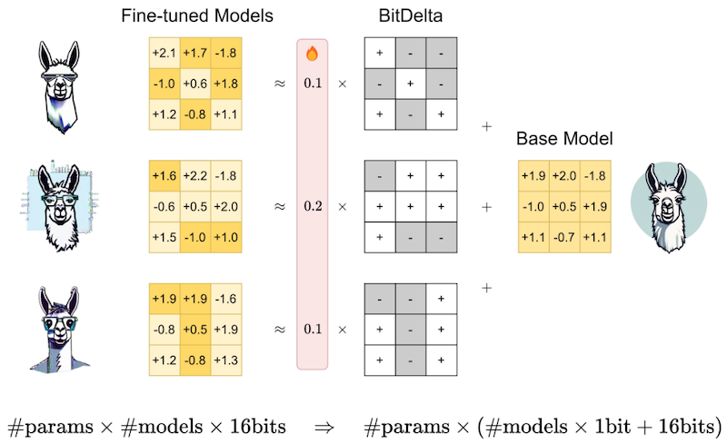

이때 양자화 오차를 줄이기 위해 $\alpha$ 는 다음 수식에 따라 초기화한다.

$$ \alpha = \frac{1}{nm} \sum_{ij} |W_{ij}| $$

> **Notes**: L2 Norm 가중치 양자화 오차
>
> $$ || \triangle - \hat{\triangle} || {}_{2}^{2} = \sum_{ij}(|W_{ij}| - \alpha)^2 $$

---

#### 14.7.2.1 Scale distillation

논문에서는 최적의 scaling factor를 획득하기 위해, model distillation 방식의 objective을 사용하여 미세조정한다. (model weight: freezing)

$$ {\alpha}^{*} = \arg\min_{\alpha} \mathbb{E} {}_{x \sim \mathbf{X}} [ || \mathbf{Z} {}_{fine} (x) - \mathbf{Z} {}_{bin} (x; \alpha) ||{}^{2} ] $$

> $\mathbf{X}$ : calibration dataset, $\mathbf{Z}(\cdot)$ : logits

---

#### 14.7.2.2 BitDelta: Results

다음은 Llama-2와 Mistral-7B 모델을 대상으로 한 BitDelta 실험으로, 10x 이상의 압축률을 달성한 것을 확인할 수 있다.

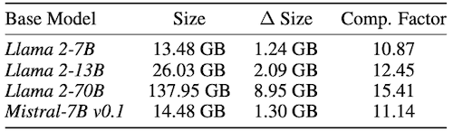

> 모델의 hidden size가 클수록 압축률이 증가하였다.

다음은 Llama2-7B 모델 실험에서, 배치 사이즈에 따른 end-to-end decoding latency를 비교한 그래프이다.

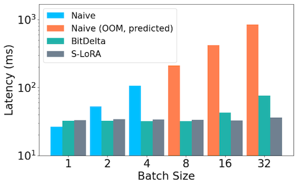

> large-batch 설정에서는 [S-LoRA](https://arxiv.org/abs/2311.03285)보다 부족한 성능을 획득하였다.

---