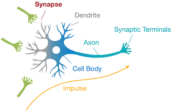
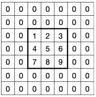
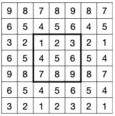
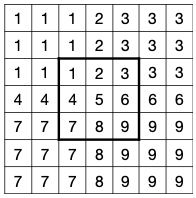
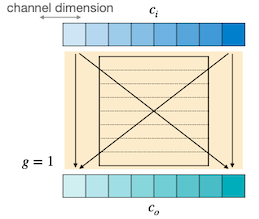
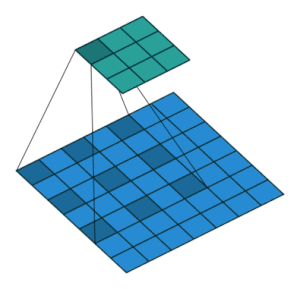
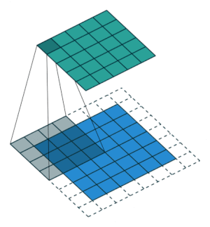
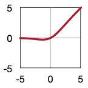
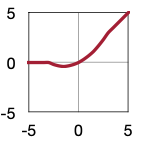

# Lecture 02 - Basics of Neural Networks 

> [Lecture 02 - Basics of Neural Networks | MIT 6.S965](https://youtu.be/5HpLyZd1h0Q)

> [Lecture 5 slide: Image Classification with CNNs | Stanford CS231n](https://cs231n.stanford.edu/slides/2022/lecture_5_ruohan.pdf)

> [vdumoulin github: conv_arithmetic](https://github.com/vdumoulin/conv_arithmetic)

| 실제 뉴런과 시냅스 | 신경망(Neural Network) |
| :---: | :---: |
|  |  |

- synapse: axon(축삭)과 dendrite(수상돌기)를 연결하여, 두 신경세포 사이의 연결을 담당한다.

- 신경망 synapse

  - 입력: 여러 input axon.
  
  - 출력: 가중치를 곱하여 결합한 뒤 activation function(활성 함수)를 적용한 값을 반환한다.

---

## 2.1 Terminology of Fully-Connected Layer

다음은 3개 레이어(2개의 hidden layer)로 구성된 **Fully-Connected Layer** 예시이다.

 

| 용어 | 신경망에서의 대응(동의어) |
| --- | --- | 
| Synapse | **parameter**, **weight** |
| Cell body | sum of weighted inputs + bias |
| Neuron | **feature**, **activation** |

---

## 2.2 Shape of Tensors

> $n$ : batch size, $c$ : channels, $w$ : width, $k$ : kernel size

---

### 2.2.1 Fully-Connected Layer

$$ y_i = \sum_{j}w_{ij}x_{j} + b_{i} $$

fully-connected layer의 tensor shape은 다음과 같다.

| | Tensors |
| --- | --- |
| Input Features $X$ | $(n, c_i)$ |
| Output Features $Y$ | $(n, c_o)$ |
| Weights $W$ | $(c_o, c_i)$ |
| Bias $b$ | $(c_o, )$ |

---

### 2.2.2 Convolution Layer

> [A guide to convolution arithmetic for deep learning 논문](https://arxiv.org/pdf/1603.07285.pdf)

> 그림의 텐서는 순서대로 입력, 필터, 출력 텐서에 대응된다.

다음은 1차원 및 2차원 Convolution Layer(합성곱 레이어)의 예시이다.

| Tensors | 1D Convolution | 2D Convolution |
| --- | --- | --- |
| |  |  |
| Input Features $X$ | $(n, c_i, w_i)$ | $(n, c_i, h_i, w_i)$ |
| Output Features $Y$ | $(n, c_o, w_o)$ | $(n, c_o, h_o, w_o)$ |
| Weights $W$ | $(c_o, c_i, k_w)$ | $(c_o, c_i, k_h, k_w)$ |
| Bias $b$ | $(c_o, )$ | $(c_o, )$ |

이때 합성곱 레이어는 하나의 필터(=kernel)가 하나의 출력 채널을 만들며, 필터를 shift하면서 여러 번 연산하는 방식으로 출력을 산출한다. (**weight sharing**)

> 출력 채널의 수 = 필터의 수

> 출력 텐서의 height $h_o$ 는 다음과 같이 계산할 수 있다.
>
> $$ h_o = h_i - k_h + 1 $$

---

### 2.2.3 Convolution Layer: Padding

> PyTorch의 default padding은 **zero padding**.

서로 다른 레이어에서 출력 텐서의 크기를 조절하기 위해 **padding**을 사용할 수 있다. (예를 들어, 입력 텐서와 동일한 resolution을 출력 텐서에서 유지) 다음은 세 가지 대표적인 padding 방법이다.

| Zero Padding | Reflection Padding | Replication Padding | 
| :---: | :---: | :---: |
|  |  |  |

> 출력 텐서의 height $h_o$ 는 다음과 같이 계산할 수 있다. ( $p$ : padding size )
>
> $$ h_o = h_i + 2p - k_h + 1 $$

---

### 2.2.4 Convolution Layer: Receptive Field

> [Receptive Fields: Why 3x3 conv layer is the best?](https://youtu.be/lxpQZRvfnCc): 수식 증명

합성곱 연산에서는 출력의 픽셀은 입력의 넓은 픽셀(higher level features)에 대응된다. 이를 수치화한 개념을 **receptive field**라고 한다.

- 각 output element: input에서 $k_{h} \times k_{w}$ receptive field를 가진다.

3개의 레이어를 거칠 때 receptive field가 어떻게 변화하는지 살펴보자.

- 레이어를 거칠수록 $k-1$ 만큼 receptive field size가 커진다. ( $k=3$ 일 경우 1, 3, 5, 7, ...)

- 따라서, receptive field size는 다음과 같이 계산할 수 있다.

$$ L \cdot (k-1) + 1 $$

> 예시 그림에서 $L=3, k=3$ 이므로, receptive field size는 $3 \cdot (3-1) + 1 = 7$ 이다.

이러한 특성 때문에, CNN은 downsampling을 통해 해상도가 점차 줄어드는 것이 일반적이다. (downsampling이 없을 경우, 매우 많은 수의 레이어가 필요하므로)

> $L=2, k=3$ 일 경우, receptive field size는 $2 \cdot (3-1) + 1 = 5$ 이다.

---

### 2.2.5 Strided Convolution Layer

receptive field가 더 넓어지기 위한 방법으로, 합성곱 연산에서 큰 stride 크기를 사용할 수 있다. 이를 **strided convolution**이라고 한다. 예를 들어 stride가 2일 경우, 필터는 한 번에 2칸씩 shift한다.

stride를 고려할 경우, receptive field size는 다음 수식으로 계산할 수 있다.

$$ \sum_{i=1}^{L}((k_i-1) \cdot \prod_{j=1}^{l-1} s_j) + 1 $$

> $L=2, k=3$ 이며, 첫 번째 연산에서 stride $s=2$ 일 때, receptive field size는 다음과 같다.
> 
> $$ (3-1) \cdot 2 + (3-1) \cdot 1 + 1 = 7 $$

> 출력 텐서의 height $h_o$ 는 다음과 같이 계산할 수 있다. ( $p$ : padding size, $s$ : stride )
>
> $$ h_o = \frac{h_i + 2p - k_h}{s} + 1 $$

---

### 2.2.6 Grouped Convolution Layer

CNN에서 가중치의 수를 줄이기 위한 방법(=narrow하게 만들기 위한) 중 하나인 **grouped convolution**에서는, <U>입력 채널을 여러 그룹으로 나누고</U> 각 그룹에서 별도의 필터로 연산한다. (따라서 그룹별로 병렬 연산도 가능하다.)

| convolution ( $g=1$ ) | grouped convolution ( $g=2$ ) |
| :---: | :---: |
|  |  |

grouped convolution의 tensor shape은 다음과 같다.

| Tensors | Grouped Convolution |
| --- | --- |
| Input Features $X$ | $(n, c_i, h_i, w_i)$ |
| Output Features $Y$ | $(n, c_o, h_o, w_o)$ |
| **Weights** $W$ | $(g \cdot c_o / g, c_i / g, k_h, k_w)$ |
| Bias $b$ | $(c_o, )$ |

> 출력 텐서의 height $h_o$ 는 다음과 같이 계산할 수 있다. ( $p$ : padding size, $s$ : stride )
>
> $$ h_o = \frac{h_i + 2p - k_h}{s} + 1 $$

---

### 2.2.7 Depthwise Convolution Layer

> [Xception: Deep Learning with Depthwise Separable Convolutions 논문(2016)](https://arxiv.org/abs/1610.02357)

MobileNet과 같이 주로 mobile device를 위해 설계된 CNN에서 사용되는 **depthwise convolution**은, 하나의 입력 채널마다 별도의 필터를 적용하는 방법이다.

- $g=c_i=c_o$ 인, grouped convolution의 특수한 경우로 볼 수 있다.

| | |
| :---: | :---: |
|  |  |

tensor shape은 다음과 같다.

| Tensors | Depthwise Convolution |
| --- | --- |
| Input Features $X$ | $(n, c_i, h_i, w_i)$ |
| Output Features $Y$ | $(n, c_i, h_o, w_o)$ |
| **Weights** $W$ | $(c, k_h, k_w)$ |
| Bias $b$ | $(c_o, )$ |

> 출력 텐서의 height $h_o$ 는 다음과 같이 계산할 수 있다. ( $p$ : padding size, $s$ : stride )
>
> $$ h_o = \frac{h_i + 2p - k_h}{s} + 1 $$

---

### 2.2.8 Dilated Convolution Layer

(생략)

---

### 2.2.9 Transposed Convolution Layer

| no stride | stride = 2 |
| :---: | :---: |
|  |  |

(생략)

---

## 2.3 Pooling Layer

**downsampling**의 다른 대표적인 방법으로 **pooling**로, 별도의 파라미터(가중치)를 사용하지 않는다.

> 채널마다 적용되는 **channel independent**한 연산으로, 대체로 stride를 kernel size와 동일하게 설정한다.

다음은 대표적인 두 가지 pooling 방법을 비교한 그림이다.

---

## 2.4 Normalization Layer

$$ \hat{x_{i}} = \frac{1}{\sigma} (x_i - {\mu}_{i}) $$

> $\mu$ : mean, $\sigma$ : standard deviation

(생략)

---

## 2.5 Activation Function

| Sigmoid | ReLU | ReLU6 | Leaky ReLU | Swish | Hard Swish |
| :---: | :---: | :---: | :---: | :---: | :---: |
|  |  |  |  |  |  |
| $y = 1/(1+e^{-x})$ | $y = \max(0, x)$ | $y = \min(\max(0, x), 6)$ | $y = \max(\alpha x, x)$ | $y = x \cdot \sigma(x)$ | $y = \begin{cases} 0, & \text{if } x \leq -3 \\ x, & \text{if } \geq 3 \\ x \cdot (x+3)/6, & \text{otherwise} \end{cases}$ |

(생략)

---

## 2.6 Transformer

> [Attention is All You Need 논문(2017)](https://arxiv.org/abs/1706.03762)

(생략)

---
