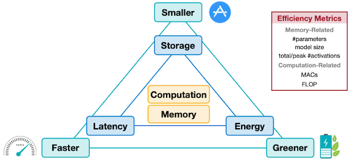
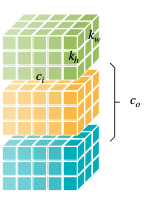
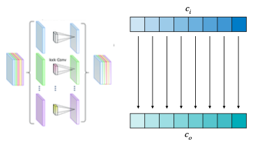
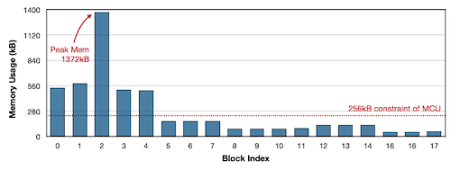
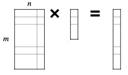
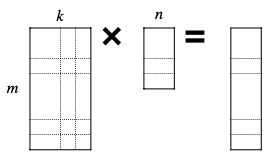
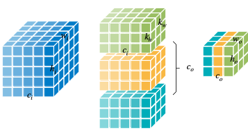

# Lecture 02 - Basics of Neural Networks

> [Lecture 02 - Basics of Neural Networks | MIT 6.S965](https://youtu.be/5HpLyZd1h0Q)

---

## 2.5 Efficiency Metrics

보통 network를 설계할 때, 크게 세 가지 요소를 고려한다.

- latency

- storage

- energy

그렇다면 다른 network 사이에서 **efficiency**(효율성)을 비교할 때 어떤 지표를 사용하여 비교해야 할까?

> **storage**가 weight만 의미한다면, **memory**는 추가로 activation까지 고려한다.

- **Memory-Related**

  - \#parameters

  - model size

  - total/peak \#activations

- **computation**

  - MACs

  - FLOP

---

### 2.5.1 Latency

Neural Network 추론에 있어서, **latency**(지연시간)는 NN 자체의 특성과 hardware 특성에 모두 영향을 받는다. 예를 들어 pipelining을 이용하면 computation과 data movement는 동시에 이루어질 수 있다.

병렬화가 가능한 자원만 충분하다면 latency는 다음 수식으로 계산할 수 있다.

$$ Latency \approx \max(T_{computation}, T_{memory}) $$

- $T_{computation}$

  분모는 hardware 특성, 분자는 NN 특성이다.

$$ \approx {{Number \ of \ Operations \ of \ NN} \over {Number \ of \ Opeartions \ that \ Processor \ can \ Process \ Per \ Second}} $$

- $T_{memory}$

$$ \approx T_{data \ movement \ of \ activations} + T_{data \ movement \ of \ weights} $$

- $T_{data \ movement \ of \ weights}$ 

  분모는 hardware 특성, 분자는 NN 특성이다.

  > weight를 SRAM에 모두 저장하면, main memory에 접근하지 않을 수 있다.

$$ \approx {{Model \ size} \over {Memory \ Bandwidth \ of \ Processor}} $$

- $T_{data \ movement \ of \ activations}$ 

$$ \approx {{Input \ activation \ size + Output \ activation \ size} \over {Memory \ Bandwidth \ of \ Processor}} $$

---

### 2.5.2 Energy Consumption

(생략)

---

### 2.5.3 Number of Parameters (\#Parameters)

\#Parameters는 기본적으로 총 weight 개수를 의미한다. 여러 레이어 종류에 따른 \#Parameters를 구해보자.(bias는 무시)

- Linear Layer

  $W^{T}$ : 입력 채널 수( $c_i$ )와 출력 채널 수( $c_o$ )를 곱하면 된다.

  

$$ c_o \cdot c_i $$

- Convolution

  

$$ c_o \cdot c_i \cdot k_h \cdot k_w $$

- Grouped Convolution

  

$$ c_o/g \cdot c_i/g \cdot k_h \cdot k_w \cdot g  $$

$$ = c_o \cdot c_i \cdot k_h \cdot k_w / g $$

- Depthwise Convolution

  

$$ = c_o \cdot k_h \cdot k_w $$

### &nbsp;&nbsp;&nbsp;📝 예제 1: AlexNet \#Parameters &nbsp;&nbsp;&nbsp;

AlexNet의 \#Parameters를 구하라. 단, bias는 무시한다.

### &nbsp;&nbsp;&nbsp;🔍 풀이&nbsp;&nbsp;&nbsp;

레이어별 \#parameters를 구해보자.

- Conv Layer 1

$$ 96 \times 3 \times 11 \times 11 = 24,848 $$

- Conv Layer 2(grouped convolution 1)

$$ {{256 \times 96 \times 5 \times 5} \over {2}} = 307,200 $$

- Conv Layer 3

$$ 384 \times 256 \times 3 \times 3 = 884,736 $$

- Conv Layer 4(grouped convolution 2)

$$ 384 \times 384 \times 3 \times 3 / 2 = 663,552 $$

- Conv Layer 5(grouped convolution 3)

$$ 256 \times 384 \times 3 \times 3 / 2 = 442,368 $$

- Linear Layer 1

$$ 4096 \times (256 \times 6 \times 6) = 37,738,736 $$

- Linear Layer 2

$$ 4096 \times 4096 = 16,777,216 $$

- Linear Layer 3

$$ 1000 \times 4096 = 4,096,000 $$

모든 레이어의 \#parameters를 합치면 총 61M이다.

---

### 2.5.4 Model Size

model size는 weight가 동일한 bit width를 가진다면 간단히 구할 수 있다.

> bit width가 다른 mixed precision model은 계산이 달라진다.

- Model Size = \#Parameters $\cdot$ Bit Width

### &nbsp;&nbsp;&nbsp;📝 예제 2: AlexNet model size &nbsp;&nbsp;&nbsp;

AlexNet이 \#Parameters를 61M만큼 갖는다고 할 때, 각 조건에서의 model size를 구하라.

- weight: fp32 type

- weight: int8 type

### &nbsp;&nbsp;&nbsp;🔍 풀이&nbsp;&nbsp;&nbsp;

- fp32 type(=4 bytes)

$$ 61M \times 4Byte = 224MB $$

- int8 type(=1 byte)

$$ 61M \times 1Byte = 61MB $$

> $1MB = 1 \times 10^6 Bytes$

---

### 2.5.5 Number of Activations (\#Activations)

ResNet과 MobileNetV2를 비교해 보자.

- MobileNetV2: ResNet보다 \#Parameter는 적지만, 반대로 Peak Activation은 늘었다.

이는 MobileNetV2의 특정 레이어에서 \#activations이 memory bottleneck을 일으키는 구조이기 때문이다.

> [MCUNetV2: Memory-Efficient Patch-based Inference for Tiny Deep Learning 논문](https://arxiv.org/abs/2110.15352)

- 입력부와 가까운 레이어의 activation memory가 굉장히 크다.

- 반대로 resolution가 줄어들며 channel 수가 많아지는 후반부는 activation memory가 줄어들지만, 그만큼 많은 filter를 사용하므로 weight memory가 굉장히 커진다. 

또한 훈련 중에도 memory bottleneck의 주된 원인은 \#Parameter가 아닌 \#activations이다.

- \#Parameter, \#activations: FP32

- MobileNetV2이 ResNet보다 \#Parameter가 4배 더 적지만, \#activations은 1.1배 적다.

### &nbsp;&nbsp;&nbsp;📝 예제 3: AlexNet \#Activations &nbsp;&nbsp;&nbsp;

AlexNet의 (1) Total \#Activations, (2) Peak \#Activations를 구하라.

### &nbsp;&nbsp;&nbsp;🔍 풀이&nbsp;&nbsp;&nbsp;

$$ 3 \times 224 \times 224 = 150,528 $$

$$ 96 \times 55 \times 55 = 290,400 $$

$$ 96 \times 27 \times 27 = 69,984 $$

...

$$ 256 \times 6 \times 6 = 9,216 $$

$$ 4096 = 4096 $$

$$ 4096 = 4096 $$

$$ 1000 = 1000 $$

따라서 Total \#Activations, Peak \#Activations은 다음과 같다.

- Total \#Activations

$$ = 932,264 $$

- Peak \#Activations 

$$\approx input \ activations + output \ activations $$

$$= 150,528 + 290,400 = 440,928$$

---

### 2.5.6 MACs

computation efficiency를 표현하는 대표적인 지표인 **MAC**(Multiply-Accumulate) operations를 살펴보자.(MAC 연산은 CNN 연산의 대부분을 차지한다.)

우선 Multiply-Accumulate operation(MAC)은 다음과 같이 곱셈과 덧셈으로 이루어진 연산을 의미한다.

$$ a \leftarrow a + b \cdot c $$

두 가지 대표적인 연산에서 MACs를 구해보자.

- Matrix-Vector Multiplication(MV)

  Matrix-Vector Multiplication 연산에서 MACs는 다음과 같이 계산할 수 있다.

    

$$ MACs = m \cdot n $$

- General Matrix-Matrix Multiplication(GEMM)

  Matrix-Matrix 연산에서 MACs는 다음과 같이 계산할 수 있다.

    

이번에는 여러 레이어 종류별로 계산해 보자.(batch size n=1로 가정)

- Linear Layer

  

$$ c_o \cdot c_i $$

- Convolution

  

$$ c_i \cdot k_h \cdot k_w \cdot c_o \cdot w_o \cdot c_o $$

> $w_o, c_o$ 계산에 주의. 

> 다시 말해 output activation 각 픽셀마다 $c_i \cdot k_h \cdot k_w \cdot c_o$ 만큼의 MACs를 갖는다는 뜻이기도 하다.

- Grouped Convolution

  

$$ c_i/g \cdot k_h \cdot k_w \cdot c_o \cdot w_o \cdot c_o $$

- Depthwise Convolution

  

$$ k_h \cdot k_w \cdot c_o \cdot w_o \cdot c_o $$

### &nbsp;&nbsp;&nbsp;📝 예제 4: AlexNet \#MACs &nbsp;&nbsp;&nbsp;

AlexNet의 \#MACs를 구하라.

### &nbsp;&nbsp;&nbsp;🔍 풀이&nbsp;&nbsp;&nbsp;

- Conv Layer 1

$$ 96 \times 3 \times 11 \times 11 \times 55 \times 55 = 105,415,200 $$

- Conv Layer 2

$$ 256 \times 96 \times 5 \times 5 \times 27 \times 27 / 2 = 223,948,800 $$

...

- Linear Layer 1

$$ 4096 \times (256 \times 6 \times 6) = 37,748,736 $$

- Linear Layer 2

$$ 4096 \times 4096 = 16,777,216 $$

- Linear Layer 3

$$ 1000 \times 4096 = 4,096,000 $$

따라서 총 MACs는 724M이다.

---

### 2.5.7 FLOP

MAC과 마찬가지로 computation과 관련된 대표적인 지표로 **FLOP**(Floating Point Operations)이 있다.

> processor의 성능 지표인 FLOPS(Floating Point Operation Per Second)와 구분할 것

만약 operations이 다음과 같은 data type이라면, 1 MAC = 2 FLOP이다.

- multiply: FP32

- add: FP32

### &nbsp;&nbsp;&nbsp;📝 예제 5: AlexNet \#FLOP &nbsp;&nbsp;&nbsp;

AlexNet의 FLOPs를 구하라. AlexNet은 총 MACs를 724M개를 갖는다고 한다.

- multiply: FP32

- add: FP32

### &nbsp;&nbsp;&nbsp;🔍 풀이&nbsp;&nbsp;&nbsp;

$$ 724M \times 2 = 1.4G $$

---