# Lecture 03 - Pruning and Sparsity (Part 1)

> [Lecture 03 - Pruning and Sparsity (Part I) | MIT 6.S965](https://youtu.be/sZzc6tAtTrM)

> [EfficientML.ai Lecture 3 - Pruning and Sparsity (Part I) (MIT 6.5940, Fall 2023, Zoom recording)](https://youtu.be/95JFZPoHbgQ?si=rHYkeGoQoZZTnyVa)

> [A Survey on Deep Neural Network Pruning: Taxonomy, Comparison, Analysis, and Recommendations 논문(2023)](https://arxiv.org/abs/2308.06767)

지금의 AI model size는 너무나 크다.

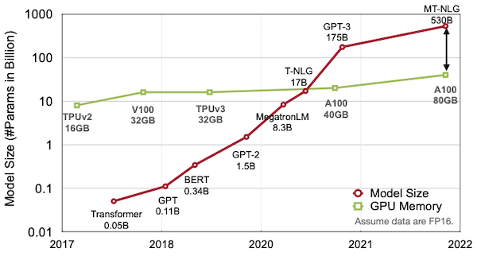

메모리 비용은 (연산 비용과 비교해서, 보다) **expensive**하다.

- register file access cost를 1로 뒀을 때, SRAM cache가 5배 cost, DRAM access가 약 640배 cost를 소비한다.

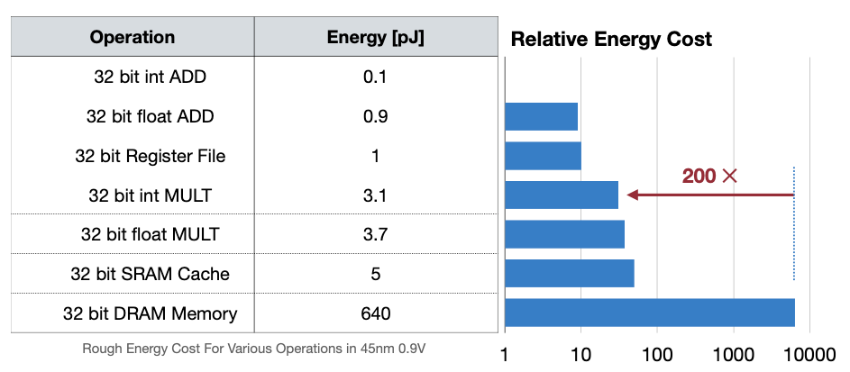

데이터 이동이 많을수록 memory reference가 필요하고, 이는 더 많은 power를 필요로 하게 된다. 그렇다면 이러한 비용을 어떻게 줄일 수 있을까? 대표적으로는 다음과 같은 방법들을 고려할 수 있다.

- model/activation size 줄이기

- workload 줄이기(data를 빠르게 compute resources에 공급)

- compiler/scheduler 개선하기

- locality를 활용하기

- cache에 더 많은 data를 보관하기

이중에서도 모델의 over-parameterization에 의한 비용을 해결하기 위한 효과적인 방법인 **pruning**(가지치기)을 살펴볼 것이다.

> pruning은 1990년부터 제시된 역사가 깊은 기법이다. 1993년에는 pruning 이후 weight를 fine-tuning하는 방법을 제시했다.

---

## 3.1 Pruning

prining은 크게 세 가지 단계로 구성된다. 

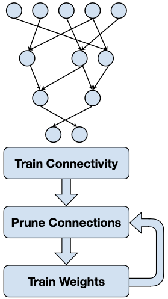

- Train Connectivity

  over-parameterized target network를 학습한다.

- Prune Connections

  weight(unit) **importance**를 파악 후, 중요하지 않은 weight를 pruning한다.

- Train Weights

  pruning 이후의 정확도 손실을 **fine-tuning**으로 보완한다.

---

### 3.1.1 Pruning and Fine-tuning

> [Learning both Weights and Connections for Efficient Neural Networks 논문(2015)](https://arxiv.org/abs/1506.02626)

다음은 AlexNet에 세 가지 다른 방법으로 pruning했을 때, 정확도 손실을 나타낸 그래프이다.

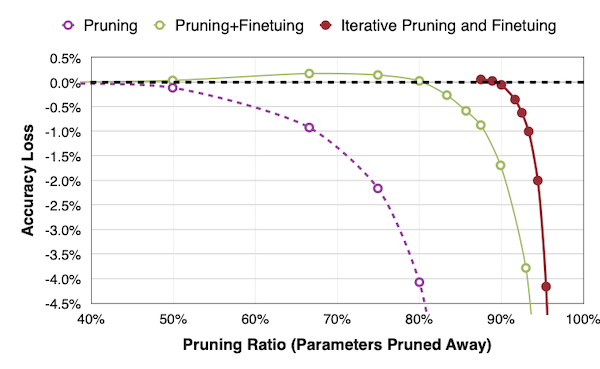

1. Pruning

    - 50%: 비교적 정확도 손실이 적다.

    - 80%: 4%가 넘는 정확도 손실이 발생한다.
    
    정규 분포를 이루던 weight 분포는, pruning을 거치면 다음과 같이 변화한다.

    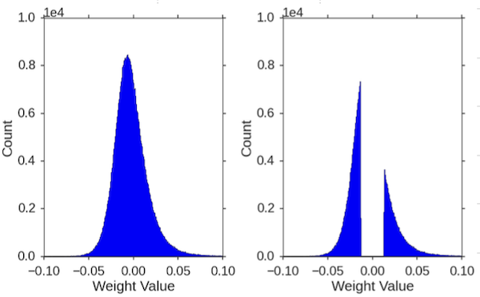

2. Pruning + Fine-tuning

    80%를 pruning 후, 남은 20%의 weights를 fine-tuning한다. fine-tuning 후 weight 분포는 다음과 같이 smooth하게 변화한다.

    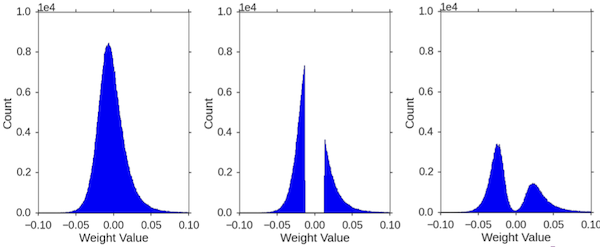

3. **Iterative Pruning + Fine-tuning**

    2번 과정를 반복하면, 매우 적은 정확도 손실로도, 약 90% 수준으로 weight pruning이 가능하다.

---

### 3.1.2 CNN + Pruning Results

다음은 여러 network에 pruning을 적용하고 난 뒤 결과를 정리한 표다.


- AlexNet, VGG-16는 pruning을 통해 9배, 12배가 넘게 크기를 줄였다.

- 반면, GoogleNet, ResNet, SqueezeNet과 같은 compressed model에서는 큰 효과를 보지 못했다. 

  > 이런 경우 **quantization**(양자화) 같은 수단이 더 효과적이다.

---

### 3.1.3 MLPerf Inference

> [Leading MLPerf Inference v3.1 Results with NVIDIA GH200 Grace Hopper Superchip Debut](https://developer.nvidia.com/blog/leading-mlperf-inference-v3-1-results-gh200-grace-hopper-superchip-debut/)

**MLPerf**는 다양한 기업이 참가하는 Al computing 대회다. **closed division**과 **open division** 두 트랙에서 경쟁한다.

- closed division

  model을 변경할 수 없다.(precision, weight 등) 따라서 오로지 hardware innovation으로 경쟁해야 한다.

- open division

  신경망을 변경할 수 있다. 모델을 개조하거나 압축하는 등 다양한 기법을 사용하여 경쟁한다.

핵심은 두 트랙 모두 정확도를 잃지 않으면서, 빠르게 추론해야 한다. 아래는 BERT를 대상으로 한 NVIDIA의 closed, open division 결과물이다.

- 모델을 변경할 수 있는 open division에서, 4.5x 더 빠르게 sample을 처리할 수 있었다.

| | closed division | open division | speedup |
| :---: | :---: | :---: | :---: |
| offline samples/sec | 1029 | 4609 | 4.5x |

이때 다음과 같은 기법으로 4.5x의 speedup을 얻었다.

- **Pruning**

- Quantization-Aware Training(QAT)

- Knowledge Distillation


---

### 3.1.4 Pruning in the Industry

대표적으로 NVIDIA는 hardware 수준의 sparsity matrix을 이용한 가속을 지원하고 있다. 특정 조건을 만족하면 dense matrix를 sparse matrix로 바꿔서 연산을 가속할 수 있다.

- **2:4 sparsity**: 4개의 parameter로 이루어진 그룹에서 paramter 2개가 0이면 가능하다.

    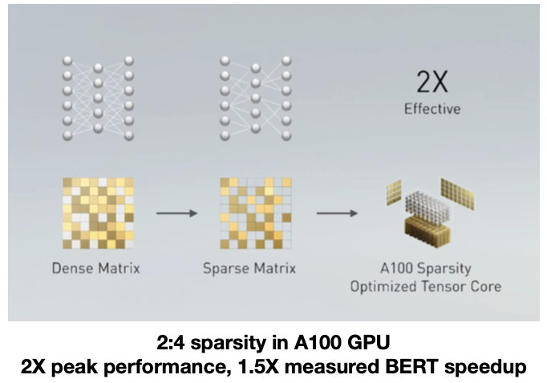

---

## 3.2 Formulate Pruning

일반적으로 Pruning은 loss function에서, \#non-zero 수의 threshold $N$ 을 두어 제한하는 것으로 구현할 수 있다.

$$ \underset{W_p}{\mathrm{argmin}}{L(\mathbf{x}; W_p)} $$

$$ s.t. {||W_{p}||}_{0} \le N $$


- $W_{p}$ : pruned weights

- $N$ : threshold

> s.t.: subject to

> L0-norm: = \#nonzeros

---

## 3.3 What, How, When, How often to prune

> [The Lottery Tickey Hypothesis: A survey](https://roberttlange.com/posts/2020/06/lottery-ticket-hypothesis/)

pruning은 어떤 단위로, 어떤 기준으로, 언제, 얼마나 자주 적용해야 하는가에 따라 세부적으로 나눌 수 있다.


---

## 3.4 Pruning Granularity

pruning을 적용하는 granularity는, 크게 unstructured, structured pruning으로 나눌 수 있다.

|| Unstructured<br/>(weight-wise) | Structured<br/>(Channel, Kernel, Layer, ...) |
| :---: | :---: | :---: |
| | 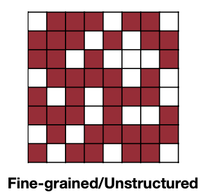 | 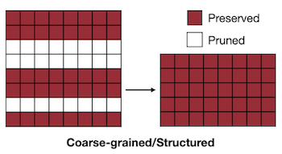 |
| compression ratio | 크다 | 작다 | 
| acceleration | 어렵다 | 비교적 쉽다 |

---

### 3.4.1 Pruning at Different Granularities

보다 세부적으로 pruning granularity를 살펴보자. 

| Fine-grained | Pattern-based | Vector-level | Kernel-level | Channel-level |
| :---: | :---: | :---: | :---: | :---: |
|  | 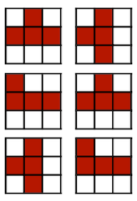 | 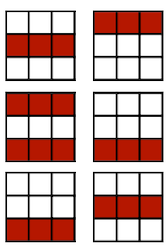 |  |  |

> 좌측에 위치할수록 fine-grained, 우측에 위치할수록 coarse-grained


---

### 3.4.2 Pattern-based Pruning: N:M sparsity

(생략)

---

### 3.4.3 Channel Pruning

이때 채널별로 최적의 pruning ratio를 탐색하면, 더 좋은 성능을 얻을 수 있다.

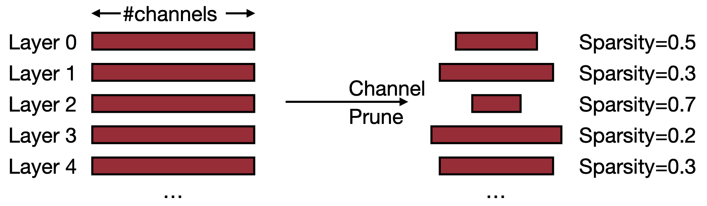

- (+) direct하게 speedup을 구현할 수 있다.
  
- (-) compression ratio이 낮다.

- (-) 출력에 영향을 미치는 것을 주의해야 한다.(특히 residual connection 사용 시)

---

## 3.5 Pruning Criterion

pruning은 기본적으로 **less important**한 패러미터를 제거하는 과정이다.

---

### 3.5.1 Magnitude-based Pruning: L1-norm

> [Learning both Weights and Connections for Efficient Neural Networks 논문(2015)](https://arxiv.org/abs/1506.02626)

heuristic에 기반하여, 패러미터의 절댓값 크기를 importance로 사용할 수 있다.(**L1-norm**)

$$ Importance = \sum_{i \in S}|w_i| $$

다음은 예시 행렬을 대상으로, importance를 기준으로 50%만을 남기고 pruning한 결과다.

| Example | Element-wise | Row-wise | |
| :---: | :---: | :---: | :---: |
| $\begin{bmatrix} 3 & -2 \\ 1 & -5 \end{bmatrix}$ | $\begin{bmatrix} \|3\| & \|-2\| \\ \|1\| & \|-5\| \end{bmatrix} \rightarrow \begin{bmatrix} 3 & 0 \\ 0 & -5 \end{bmatrix}$ | $\begin{bmatrix} \|3\| + \|-2\| \\ \|1\| + \|-5\| \end{bmatrix} \rightarrow \begin{bmatrix} 0 & 0 \\ 1 & -5 \end{bmatrix}$ | |

---

### 3.5.2 Magnitude-based Pruning: L2-norm

혹은 L2-norm이나, $L_p$ norm을 사용할 수도 있다.

$$ Importance = \sqrt{\sum_{i \in S}{{|w_{i}|}^{2}}} $$

| Example | Element-wise | Row-wise | |
| :---: | :---: | :---: | :---: |
| $\begin{bmatrix} 3 & -2 \\ 1 & -5 \end{bmatrix}$ | $\begin{bmatrix} \sqrt{\|3\|^2} & \sqrt{\|-2\|^2} \\ \sqrt{\|1\|^2} & \sqrt{\|-5\|^2} \end{bmatrix} \rightarrow \begin{bmatrix} 3 & 0 \\ 0 & -5 \end{bmatrix}$ | $\begin{bmatrix} \sqrt{\|3\|^2 + \|-2\|^2} \\ \sqrt{\|1\|^2 + \|-5\|^2} \end{bmatrix} \rightarrow \begin{bmatrix} 0 & 0 \\ 1 & -5 \end{bmatrix}$ | |

---

### 3.5.3 Sensitivity and Saliency

> [SNIP: Single-shot Network Pruning based on Connection Sensitivity 논문(2018)](https://arxiv.org/abs/1810.02340)

SNIP 논문에서는 **connection sensitivity**라는 salience 기반의 pruning criterion을 제시했다. 가중치의 sensitivity가 높을수록 importance가 높다고 가정한다.

$$ s_j(w; \mathcal{D}) = {{|g_{j}(w;\mathcal{D})|} \over {{\sum_{k=1}^m} |g_k(w;\mathcal{D})|}} $$

- $s_j$ : weight $w_j$ 의 sensitivity

- $m$ : \#weights

- $c_j$ : connection(active = 1, pruned = 0)

- $g_j$ : $c_j$ 에 대한 loss $L(c \odot w)$ 의 미분 

---

### 3.5.4 Loss Change: First-Order Taylor Expansion

> [Gate Decorator: Global filter pruning method for accelerating deep convolutional neural networks 논문(2019)](https://arxiv.org/abs/1909.08174)

weight saliency를 weight pruning 이후의 loss change로 정의할 수 있다. 대표적으로 1차 테일러 근사를 활용하면, weight의 작은 변화(**perturbation**)를 쉽게 측정할 수 있다.

$$ \triangle \mathcal{L} = \mathcal{L} (w + \triangle w) - \mathcal{L}(w) = {\nabla}_w \mathcal{L} \triangle w $$

- $\triangle w$ : weight perturbation

예를 들어 Gate Decorator 논문에서는, BN에 scaling factor $\lambda$ 를 추가하는 GBN(Gate Batch Normalization) 방법을 제시한다. 일부 $\lambda$ 를 0으로 만들 때 발생하는 loss change $\mathcal{L}$ 을 기준으로 필터의 importance를 측정한다.

---

### 3.5.5 Loss Change: Second-Order Taylor Expansion

> [Optimal Brain Damage 논문(1989)](https://proceedings.neurips.cc/paper/1989/hash/6c9882bbac1c7093bd25041881277658-Abstract.html)

> [Group fisher pruning for practical network compression 논문(2021)](https://arxiv.org/abs/2108.00708)

굉장히 오래 전부터 사용된 방법으로, loss function의 2차 테일러 근사를 이용하여 importance를 측정할 수도 있다.

$$ \mathcal{L} (w + \triangle w) - \mathcal{L}(w) = {\nabla}_w \mathcal{L} \triangle w + {{1} \over {2}} {\triangle}w^{T}H \triangle w $$

- $H  = {\triangle}_w^2 \mathcal{L}(w)$

- 이때 neural network가 수렴한다고 가정하면, first-order term을 0에 가까운 값으로 취급하여 무시할 수 있다.

- (-) 단, **Hessian matrix** 계산이 복잡하기 때문에, computation, memory overhead가 발생하게 된다.

---

## 3.6 Data-Aware Pruning Criterion

가중치만으로는 최적의 검증 성능을 찾는 것이 어렵기 때문에, 훈련 데이터를 활용하여 pruning importance를 정하는 **data-aware pruning** 방법이 등장했다.

---

### 3.6.1 Average-Percentage-Of-Zero-based Pruning(APoZ)

> [Network Trimming: A Data-Driven Neuron Pruning Approach towards Efficient Deep Architectures 논문(2016)](https://arxiv.org/abs/1607.03250)

최적의 threshold를 정할 필요 없이, 보다 간단하게 0의 값을 갖는 percentage를 기반으로 하는 pruning 방법이 제시되었다. 예를 들어 다음과 같은 output activations이 있다고 하자.

| Batch 1 | Batch 2 |
| :---: | :---: |
| 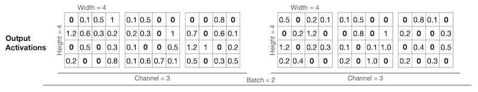 | 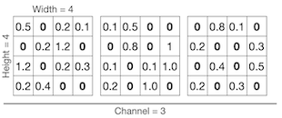  |

Network Trimming 논문은 **Average Percentage of Zeros**(APoZ) 기반의 activation pruning을 적용한다. 각 배치에서 같은 위치에 있는 채널들을 하나의 pruning 단위로 보고, 0의 비율을 기반으로 한 importance를 이용하여 pruning한다.

- channel 0

  - batch 1 \#zeros: 5

  - batch 2 channel 0 \#zeros: 6

$$ {{5+6} \over {2 \cdot 4 \cdot 4}} = {11 \over 32} $$

- channel 1

  - batch 1 \#zeros: 5

  - batch 2 \#zeros: 7

$$ {{5+7} \over {2 \cdot 4 \cdot 4}} = {12 \over 32} $$

- channel 2

  - batch 1 \#zeros: 6

  - batch 2 \#zeros: 8

$$ {{6+8} \over {2 \cdot 4 \cdot 4}} = {14 \over 32} $$

> 제일 0의 비율이 많은 channel 2를 pruning한다.

---

### 3.6.2 Regression-based Pruning: Reconstruction Error

> [Channel Pruning for Accelerating Very Deep Neural Networks 논문(2017)](https://arxiv.org/abs/1707.06168)

pruning 전/후 출력을 비교하여, 제일 오차가 적은 channel을 pruning할 수 있다.

| Before Pruning | After Pruning |
| :---: | :---: |
| 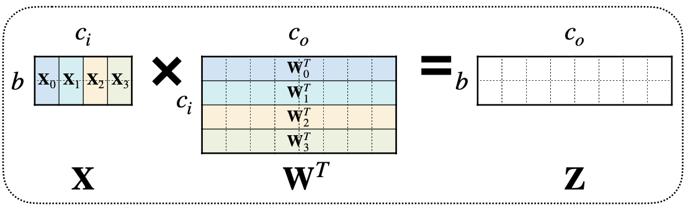 | 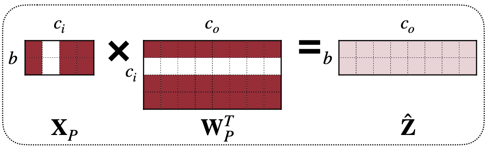 |

pruning 전/후 output activation $\hat{Z}$ 와 $Z$ 의 차이를 최소화하는 loss function은, 다음과 같이 나타낼 수 있다.

```math
{\mathrm{arg}}\underset{W, {\beta}}{\mathrm{min}}{||Z-\hat{Z}||}^{2}_{F} = || Z - \sum_{c=0}^{c_{i}-1}{||{{\beta}_{c}X_{c}{W_{c}}^{T}}||}^{2}_{F}
```

```math
s.t. \quad {||\beta||}_{0} \le N_{c}
```

- $\beta$ : coefficient vector ( length = $c_i$ )

  > 0이면 pruning된다.

- $N_{c}$ : \#nonzero channels

---

### 3.6.3 Entropy-based Pruning

> [An entropy-based pruning method for cnn compression 논문(2017)](https://arxiv.org/abs/1706.05791)

(생략)

---
