# Lecture 03 - Pruning and Sparsity (Part 1)

> [Lecture 03 - Pruning and Sparsity (Part I) | MIT 6.S965](https://youtu.be/sZzc6tAtTrM)

> [Network Pruning의 개념](https://do-my-best.tistory.com/entry/Network-pruning#----%--pruning%--%EB%B-%A-%EC%-B%-D%---%--Structured%--Pruning)

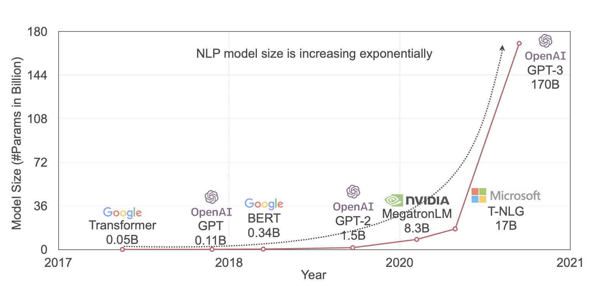

지금의 AI model size는 너무나 크다. 무엇보다도 메모리 비용은 연산 비용과 비교했을 때 더 expensive하다.


또한 data movement가 많으면 많을수록 memory reference도 필요하고, 결국 더 많은 energy를 필요로 한다. 그렇다면 이런 cost를 어떻게 줄일 수 있을까?

- model/activation size 줄이기

- workload 줄이기(data를 빠르게 compute resources에 공급)

- compiler/scheduler 개선하기

- locality를 활용하기

- cache에 더 많은 data를 보관하기

그중에서도 DNN이 갖는 over-parameterization으로 인한, 추론 시의 high cost와 memory footprint를 해결하기 위한 방법으로 **pruning**(가지치기)을 살펴볼 것이다.

> pruning 자체는 1990년 제시된 기법이다. 1993년에는 pruning 이후 weight를 fine-tuning하는 방법을 제시했다.

---

## 3.1 Pruning

> 인간의 두뇌에서 성장기를 거치면서 synapses per neuron 숫자가 감소하는 것과 비슷하게, model에서도 synapses와 neurons을 줄여주는 방법이다.

그런데 pruning을 이용해 neuron을 줄이기 위해서는 어떤 neuron이 중요한지 그렇지 않은지를 인식할 필요가 있다. 반대로 말하면 pretrained model에서 weight의 중요도만 알고 있다면 얼마든지 pruning을 적용할 수 있다.(+fine-tuning)


- Train Connectivity

    over-parameterized target network를 학습한다.

- Prune Connections

    특정 기준에 따라 weight(unit)의 중요도를 산정한 다음, 중요하지 않은 weight를 **pruning**한다.

- Train Weights

    pruning 이후 accuracy lost는 **fine-tuning**으로 보완한다.

하지만 일부 논문에서는 pruning 후 fine-tuning보다, 남겨진 <U>구조</U>을 바탕으로 random initialization을 진행하는 것이 더 바람직하다고 주장한다. pruning 후 남은 weight들이 optimal하지 않을 수 있다고 지적한다.

> 이 관점에서는 pruning을 네트워크 구조를 효과적으로 탐색하는 도구로 바라본다.

---

### 3.1.1 Pruning and Fine-tuning

다음은 AlexNet에 pruning을 적용했을 때의 accuracy loss를 나타낸 표다.


- Pruning(보라색 선)

    - 50%까지는 accuracy loss가 적다.

    - 80%부터 4% 이상의 accuracy loss가 발생한다.
    
    본래 정규 분포를 이루던 weight 분포는 pruning 후 다음과 같이 변한다.

    

- Pruning+Fine-tuning(초록색 선)

    - 남은 20% weights를 가지고 fine-tuning한다.
    
    fine-tuning 후 남은 weight 분포는 다음과 같이 smooth하게 바뀐다.

    

- Iterative Pruning and Fine-tuning(빨간색 선): 

    위 과정를 반복하여 적용 시, 매우 적은 accuracy lost를 유지하며 weight를 약 90%까지 pruning할 수 있다.

---

### 3.1.2 Neural Network Pruning

다음은 여러 network에 pruning을 적용하고 난 뒤의 결과를 나타낸 표다.

| Neural Network | pruning 전<br/>\#Parameters | pruning 후<br/>\#Parameters | Reduction | MACs<br/>Reduction |
| :---: | :---: | :---: | :---: | :---: |
| AlexNet | 61M | 6.7M | 9배 | 3배 |
| VGG-16 | 138M | 10.3M | 12배 | 5배 |
| GoogleNet | 7M | 2.0M | 3.5배 | 5배 |
| ResNet50 | 26M | 7.47M | 3.4배 | 6.3배 |
| SqueezeNet | 1M | 0.38M | 3.2배 | 3.5배 |

AlexNet, VGG-16과 다르게, compressed model에서는 큰 효과를 보지 못했다. 이런 경우 **quantization**(양자화)와 같은 수단이 더 효과적일 수 있다.

> MACs와 \#Parameters 감소 비율이 비례하지 않는 이유: lec02 정리 참조

특이하게도 NeuralTalk LSTM 같은 모델에서는, pruning이 image caption quality를 감소시키지 않고 오히려 더 간결한 표현으로 특징을 더 잘 설명하기도 한다.

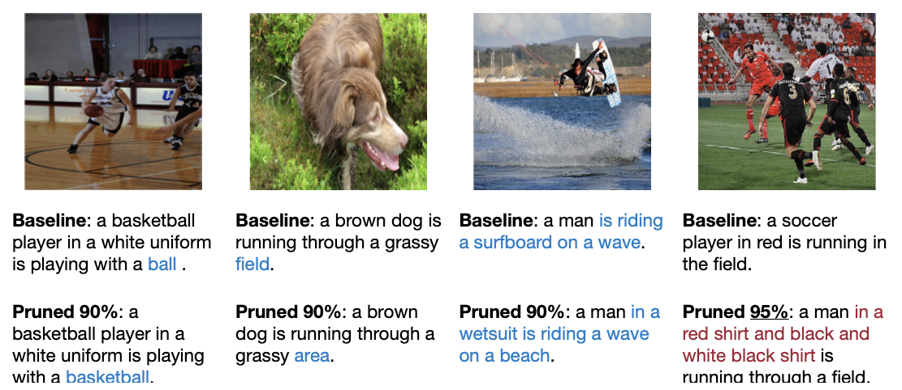

> 물론 너무 적극적으로 pruning을 하여 accuracy를 손상시켜서는 안 된다. 얼마나 pruning을 적용할 것인지를 잘 분석하여 결정해야 한다.

---

### 3.1.3 Pruning in the Industry

- NVIDIA: hardware 수준에서 sparsity matrix을 이용한 가속을 지원하고 있다.

  특정 조건을 만족하면 dense matrix를 sparse matrix로 바꿔서 연산을 가속할 수 있다.(speedup)

    - **2:4 sparsity**: 4개의 parameter로 이루어진 그룹에서 paramter 2개가 0이면 가능하다.

        

- Xilinx: pruning을 통해 정확도 감소를 최소화하면서 model complexity를 5배\~50배까지 줄이는 AI Optimizer를 지원한다.

    

---

### 3.1.4 Training Budget

> [Rethinking the Value of Network Pruning 논문](https://arxiv.org/abs/1810.05270)

위 논문에서는 기존의 pruning 방식에서 크게 두 가지 문제점을 지적한다.

- over-parameterized target network를 학습시키는 과정 자체가 꼭 필요하지 않다.

- 큰 모델을 pruning 후 남은 weight는 작은 모델에서도 optimal하다는 보장은 없다.

따라서 pruning 후 얻은 weight보다도 모델의 구조 자체가 더 유의미하다고 주장한다. 따라서 논문에서는 pruning을 통해 모델을 구한 뒤 from scratch로 학습시킨다.

> 단, **ImageNet**과 같은 <U>큰 데이터셋</U>에서는 모델을 from scratch로 학습시키면 오래 걸릴 뿐더러, <U>fine-tuning보다 저조한 성능을 보이므로</U>에 주의해야 한다.

그런데 이때 scratch로 학습한 이후 기존의 큰 모델과 비교하기 위해서는 **training budget**을 고려해야 한다. 크게 두 가지 방식을 고려할 수 있다. 

- **Scratch-E**

    큰 모델을 학습했을 때와 같은 epoch을 학습시킨다.

- **Scratch-B**

    Scratch-E 방식으로 학습할 경우, 작은 모델에서 한 epoch에 더 적은 연산이 수행된다.(FLOPs) 따라서 연산량을 맞춘 뒤 학습을 진행한다. 

---

## 3.2 formulate pruning

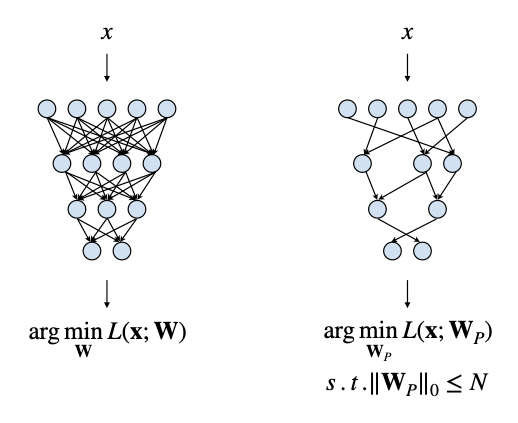

loss function을 **SGD**(Stochastic Gradient Descent)을 이용해 최소화하는 일반적인 학습 과정은 다음과 같은 수식으로 나타낼 수 있다.

$$ \underset{W}{\mathrm{argmin}}{L(\mathbf{x}; W)} $$

- $\mathbf{x}$ : input

- $L$ : objective function

- $W$ : original weights

그런데 여기서 pruning은 \#parameters를 threshold를 두어 제한한다. 정확히는 0이 아닌 \#parameters가 threshold보다 적어야 한다.

$$ \underset{W_p}{\mathrm{argmin}}{L(\mathbf{x}; W_p)} $$

$$ s.t. {||W_{p}||}_{0} \le N $$

> s.t.: subject to

> L0-norm은 엄밀히는 norm이 아니며, 벡터에서 0이 아닌 원소의 개수를 의미한다.(\#nonzeros)

- $W_{p}$ : pruned weights

- $N$ : threshold


---

## 3.3 pruning granularity

그렇다면 pruning은 어떤 단위로 적용하는 것이 좋을까? 예를 들어 $8 \times 8$ 크기를 갖는 2D weights matrix가 있다고 하자.

먼저 unstructured/structured 두 가지 방식 중 하나를 적용할 수 있다.

1. **Unstructured**(Fine-grained pruning)

    weight element 단위를 pattern 없이 pruning한다.

   

    - weight마다 prune 여부를 결정할 수 있기 때문에 flexible하고 compression ratio가 높다.

        > 그러나 큰 model에서는 structured보다 accuracy가 떨어지는 경향이 있다.

    - 하지만 너무 불규칙하기 때문에 GPU 가속을 적용하기 어렵다.

        > 해당 sparse matrix에 특화된 hardware(FPGA 등)를 설계한 뒤 acceleration을 수행하면 좋은 결과를 얻을 수 있다.

    - weight position을 저장해야 하는 overhead가 발생한다.

2. **Structured**(Coarse-grained pruning)

    

    - row와 같은 pattern 단위로 pruning하는 방법이다.

    - 쉽게 GPU를 이용한 가속이 가능하다.

---

## 3.4 pruning at different granularities

2D convolutional layer 예시를 보자. filter는 4차원 weight로 구성된다.

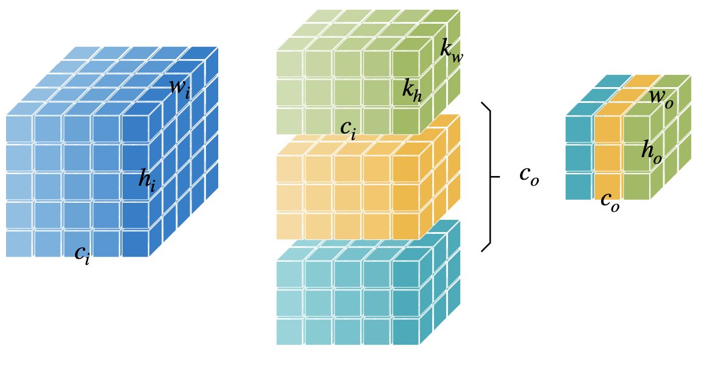

- $c_{i}$ : input channels (or channels)

- $c_{o}$ : output channels (or filters)

- $k_{h}$ : kernel size height

- $k_{w}$ : kernel size width

dimension이 4개나 있는 만큼 다양한 pruning granularity가 존재한다. 

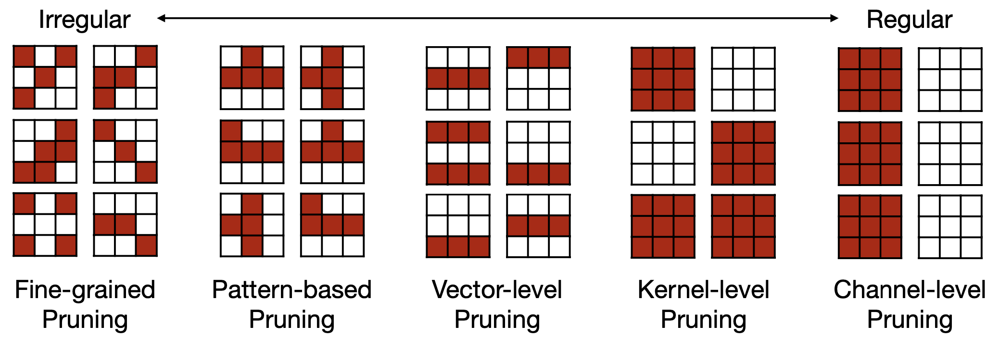

- **Fine-grained**

    - 극단적인 압축률을 얻을 수 있다. 
    
    - specialized hardware를 사용하여 최적의 결과를 얻을 수 있다.

- **Pattern-based**

    Ampere GPU 이상이면 지원하는 **pattern-based pruning**: N:M sparsity가 대표적이다. (N:M sparsity: M개의 element당 element N개가 pruned)

    - 2:4 sparsity case(50% sparsity)

        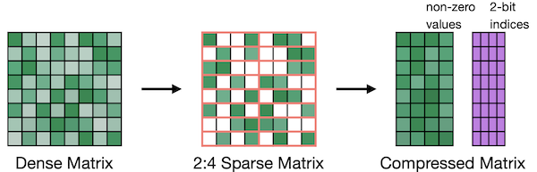

    > accuracy는 거의 유지하면서 거의 ~2x speedup 성능을 지닌다.

- **Channel-level**

    - CPU 관점에서 제일 작업 부하가 적어서 유리한 방식이다. 
    
    - channel 수를 줄이는 것으로 direct하게 speedup을 구현할 수 있다.
    
    - 대신 compression ratio는 낮은 편이다.

    - channel을 모두 uniform하게 pruning하기보다는, channel마다 특정한 pruning ratio를 적용하는 편이 좋다.

        

---

## 3.5 pruning criterion

그렇다면 어떤 weight가 중요한지를 어떻게 알 수 있을까?

---

### 3.5.1 magnitude-based pruning

단순히 weight의 절댓값을 바탕으로 중요도를 정할 수 있다.(**L1-norm**)

$$ Importance = |W| $$

다음 예시를 보자.

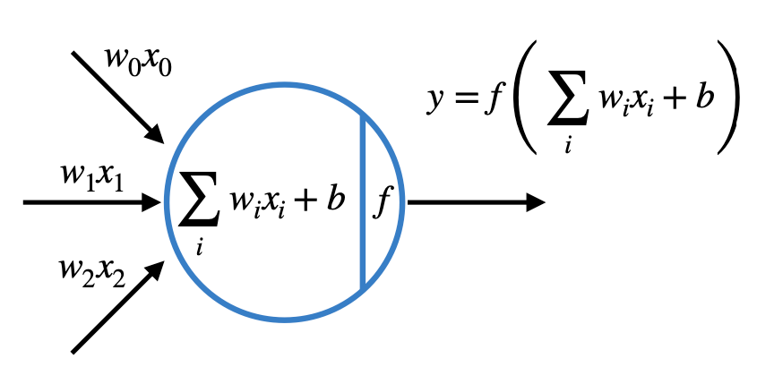

$$ f(\cdot) = ReLU(\cdot), W = [10, -8, 0.1] $$

$$ \rightarrow y = ReLU(10 x_{0} - 8 x_{1} + 0.1 x_{2}) $$

위 예시에서는 weight가 제일 작은 $x_{2}$ 가 prune할 대상이 된다.

---

#### 3.5.1.1 magnitude-based pruning examples

- Element-wise

    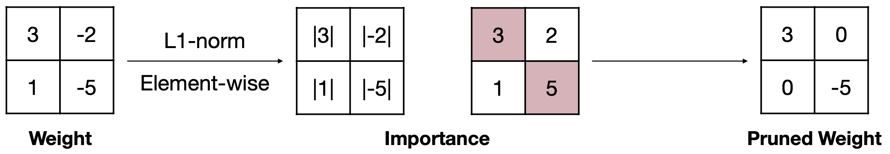

- Row-wise(L1-norm)

    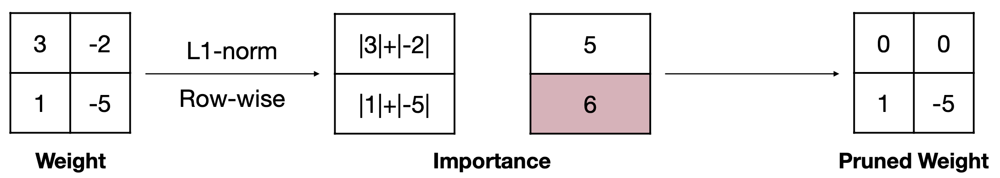


$$ Importance = \sum_{i \in S}{|w_{i}|} $$

- Row-wise(L2-norm)

    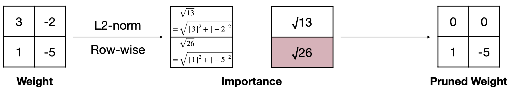

$$ Importance = \sqrt{\sum_{i \in S}{{|w_{i}|}^{2}}} $$

---

### 3.5.2 Scaling-based Pruning

channel output에 곱해지는 scaling factor을 기준으로 삼아서, 각 filter마다 pruning을 적용할 수도 있다.

> scaling factor는 trainable parameter로 batch normalization과 연관이 깊다.

1. 각 filter마다 weight의 L1-norm을 구한다

    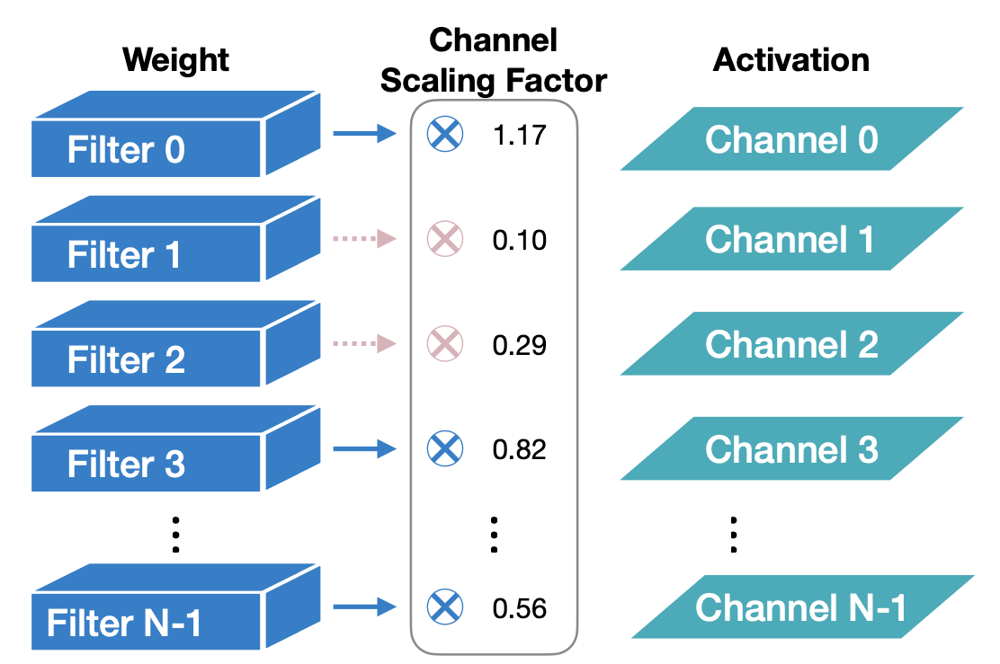

2. 작은 scaling factor를 갖는 channel을 pruning한다.

    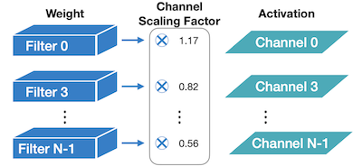

---

### 3.5.3 second-order-based pruning

loss function을 기준으로 pruning을 적용할 수도 있다. loss function에 Taylor series 근사를 적용한 수식은 다음과 같다,

$$ \delta L = L(x; W) - L(x; W_{p} = W - \delta W) $$

$$ = \sum_{i}{g_{i}{\delta}w_{i}} + {1 \over 2}\sum_{i}{h_{ii}{\delta}{w_{i}^{2}}}+ {1 \over 2}{\sum_{i \neq j}{h_{ij}{\delta}w_{i}{\delta}w_{j}}}+O({||{\delta}W||}^{3}) $$

- first order derivative $g_{i} = {{\partial}L \over {{\partial}w_{i}}}$

- second order derivative $h_{i,j} = {{\partial}^{2}L \over {{\partial}w_{i}{\partial}w_{j}}}$

위 수식을 수정해 보자.

- third order derivative항( $O({||{\delta}W||}^{3})$ )은 매우 작다고 가정하고 제거할 수 있다.

    (objective function $L$ 은 거의 **quadratic**(2차 방정식)에 가깝다.)

- neural network traning은 기본적으로 수렴한다. 

    따라서 first-order term $g_{i}$ 이 0에 가깝게 수렴하므로 무시할 수 있다.

- cross terms( $h_{ij}{\delta}w_{i}{\delta}w_{j}$ )에서는 parameter들이 서로 independent하다.

    따라서 무시할 수 있다.

따라서 이들을 제거하면 남는 항은 다음과 같다.

$$ {\delta}{L_{i}} = L(x;W) - L(x; W_{p}|w_{i}=0) \approx {1 \over 2}{h_{ii}{\delta}{w_{i}}^{2}} $$

이를 importance score로 사용하여, 어떤 weight를 pruning해야 할지 결정할 수 있다.

```math
{importance}_{w_{i}} = |{\delta}L_{i}| = {1 \over 2}{h_{ii}{w_{i}}^{2}}
```

- 이때 $h_{ii}$ 는 non-negative하다.

> 하지만 **Hessian matrix**(헤세 행렬. 이계도함수를 행렬로 표현한 것)의 계산이 복잡하기 때문에 computation overhead가 발생하게 된다.

---

### 3.5.4 percentage-of-zero-based pruning

다음은 ReLU activation을 거친 output activations 예시다.(ReLU activation을 거치기 때문에 0을 갖는 값들이 생긴다.)


- 2개의 batch(2개의 서로 다른 image)

    즉, batch dimension을 갖는다.

- 각 image는 4x4 resolution, 3 channel을 갖는다.

이런 경우 prune pattern을 정할 때, batch 양쪽을 다 고려해서 선택해야 한다. 보통은 **Average Percentage of Zeros**(APoZ), 즉 channel이 갖는 0의 비율을 기준으로 판단한다.

- 두 batch의 channel 0: 4x4 resolution 2개, 0이 총 5+6개 존재한다.

$$ {{5+6} \over {2 \cdot 4 \cdot 4}} = {11 \over 32} $$

- 두 batch의 channel 1: 4x4 resolution 2개, 0이 총 5+7개 존재한다.

$$ {{5+7} \over {2 \cdot 4 \cdot 4}} = {12 \over 32} $$

- 두 batch의 channel 2: 4x4 resolution 2개, 0이 총 6+8개 존재한다.

$$ {{6+8} \over {2 \cdot 4 \cdot 4}} = {14 \over 32} $$

channel 2가 제일 0의 비율이 많으므로, channel 2를 pruning한다.

---

### 3.5.5 regression-based pruning

regression을 기반으로 한 heuristic한 방법으로, 'original output'과 'pruning 후 output' 오차가 제일 적은 channel을 pruning할 수 있다.

다음과 같이 original output $Z$ 와 pruning을 거친 $\hat{Z}$ 가 있다고 하자.


$$ Z = XW^{T} = \sum_{c=0}^{c_{i}-1}{X_{c}{W_{c}}^{T}} $$


regression-based pruning의 목표는 다음과 같은 수식으로 나타낼 수 있다.

```math
{\mathrm{arg}}\underset{W, {\beta}}{\mathrm{min}}{||Z-\hat{Z}||}^{2}_{F} = || Z - \sum_{c=0}^{c_{i}-1}{||{{\beta}_{c}X_{c}{W_{c}}^{T}}||}^{2}_{F}
```

```math
s.t. \quad {||\beta||}_{0} \le N_{c}
```

- $\beta$ 

    length가 $c_i$ 인 coefficient vector. $\beta = 0$ 일 때 channel이 prune된다.

- $N_{c}$ : nonzero channel 수

---