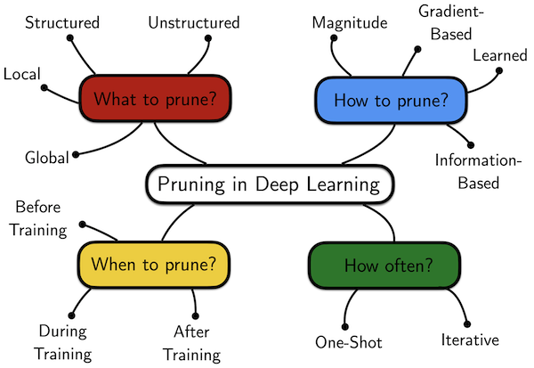
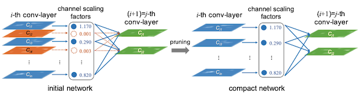

# Lecture 03 - Pruning and Sparsity (Part 1)

> [Lecture 03 - Pruning and Sparsity (Part I) | MIT 6.S965](https://youtu.be/sZzc6tAtTrM)

> [EfficientML.ai Lecture 3 - Pruning and Sparsity (Part I) (MIT 6.5940, Fall 2023, Zoom recording)](https://youtu.be/95JFZPoHbgQ?si=rHYkeGoQoZZTnyVa)

> [Network Pruning의 개념](https://do-my-best.tistory.com/entry/Network-pruning#----%--pruning%--%EB%B-%A-%EC%-B%-D%---%--Structured%--Pruning)

지금의 AI model size는 너무나 크다.


메모리 비용은 (연산 비용과 비교해서, 보다) **expensive**하다.

- register file access cost를 1로 뒀을 때, SRAM cache가 5배 cost, DRAM access가 약 640배 cost를 소비한다.


데이터 이동이 많을수록 memory reference가 필요하고, 이는 더 많은 power를 필요로 하게 된다. 그렇다면 이러한 비용을 어떻게 줄일 수 있을까? 대표적으로는 다음과 같은 방법들을 고려할 수 있다.

- model/activation size 줄이기

- workload 줄이기(data를 빠르게 compute resources에 공급)

- compiler/scheduler 개선하기

- locality를 활용하기

- cache에 더 많은 data를 보관하기

이중에서도 모델의 over-parameterization에 의한 비용을 해결하기 위한 효과적인 방법인 **pruning**(가지치기)을 살펴볼 것이다.

> pruning은 1990년부터 제시된 역사가 깊은 기법이다. 1993년에는 pruning 이후 weight를 fine-tuning하는 방법을 제시했다.

---

## 3.1 Pruning

prining은 크게 세 가지 단계로 구성된다. 


- Train Connectivity

  over-parameterized target network를 학습한다.

- Prune Connections

  weight(unit) **importance**를 파악 후, 중요하지 않은 weight를 pruning한다.

- Train Weights

  pruning 이후의 정확도 손실을 **fine-tuning**으로 보완한다.

---

### 3.1.1 Pruning and Fine-tuning

> [Learning both Weights and Connections for Efficient Neural Networks 논문(2015)](https://arxiv.org/abs/1506.02626)

다음은 AlexNet에 세 가지 다른 방법으로 pruning했을 때, 정확도 손실을 나타낸 그래프이다.


1. Pruning

    - 50%: 비교적 정확도 손실이 적다.

    - 80%: 4%가 넘는 정확도 손실이 발생한다.
    
    정규 분포를 이루던 weight 분포는, pruning을 거치면 다음과 같이 변화한다.

    

2. Pruning + Fine-tuning

    80%를 pruning 후, 남은 20%의 weights를 fine-tuning한다. fine-tuning 후 weight 분포는 다음과 같이 smooth하게 변화한다.

    

3. **Iterative Pruning + Fine-tuning**

    2번 과정를 반복하면, 매우 적은 정확도 손실로도, 약 90% 수준으로 weight pruning이 가능하다.

---

### 3.1.2 CNN + Pruning Results

다음은 여러 network에 pruning을 적용하고 난 뒤 결과를 정리한 표다.


- AlexNet, VGG-16는 pruning을 통해 9배, 12배가 넘게 크기를 줄였다.

- 반면, GoogleNet, ResNet, SqueezeNet과 같은 compressed model에서는 큰 효과를 보지 못했다. 

  > 이런 경우 **quantization**(양자화) 같은 수단이 더 효과적이다.

---

### 3.1.3 MLPerf Inference

> [Leading MLPerf Inference v3.1 Results with NVIDIA GH200 Grace Hopper Superchip Debut](https://developer.nvidia.com/blog/leading-mlperf-inference-v3-1-results-gh200-grace-hopper-superchip-debut/)

**MLPerf**는 다양한 기업이 참가하는 Al computing 대회다. **closed division**과 **open division** 두 트랙에서 경쟁한다.

- closed division

  model을 변경할 수 없다.(precision, weight 등) 따라서 오로지 hardware innovation으로 경쟁해야 한다.

- open division

  신경망을 변경할 수 있다. 모델을 개조하거나 압축하는 등 다양한 기법을 사용하여 경쟁한다.

핵심은 두 트랙 모두 정확도를 잃지 않으면서, 빠르게 추론해야 한다. 아래는 BERT를 대상으로 한 NVIDIA의 closed, open division 결과물이다.

- 모델을 변경할 수 있는 open division에서, 4.5x 더 빠르게 sample을 처리할 수 있었다.

| | closed division | open division | speedup |
| :---: | :---: | :---: | :---: |
| offline samples/sec | 1029 | 4609 | 4.5x |

이때 다음과 같은 기법으로 4.5x의 speedup을 얻었다.

- Pruning

- Quantization-Aware Training(QAT)

- Knowledge Distillation


---

### 3.1.4 Pruning in the Industry

대표적으로 NVIDIA는 hardware 수준의 sparsity matrix을 이용한 가속을 지원하고 있다. 특정 조건을 만족하면 dense matrix를 sparse matrix로 바꿔서 연산을 가속할 수 있다.

- **2:4 sparsity**: 4개의 parameter로 이루어진 그룹에서 paramter 2개가 0이면 가능하다.

    

---

## 3.2 formulate pruning

다음과 같은 일반적인 loss function을 가정하자.

$$ \underset{W}{\mathrm{argmin}}{L(\mathbf{x}; W)} $$

- $\mathbf{x}$ : input

- $L$ : objective function

- $W$ : original weights

이때 pruning은 non-zero 패러미터 수에 threshold $N$ 을 두어 제한한다.

$$ \underset{W_p}{\mathrm{argmin}}{L(\mathbf{x}; W_p)} $$

$$ s.t. {||W_{p}||}_{0} \le N $$


- $W_{p}$ : pruned weights

- $N$ : threshold

> s.t.: subject to

> L0-norm: 엄밀히는 norm이 아니며, 벡터에서 0이 아닌 원소의 개수를 의미한다.(\#nonzeros)

---

## 3.3 What, How, When, How often to prune

> [The Lottery Tickey Hypothesis: A survey](https://roberttlange.com/posts/2020/06/lottery-ticket-hypothesis/)

pruning은 어떤 단위로, 어떤 기준으로, 언제, 얼마나 자주 적용해야 하는가에 따라 세부적으로 나눌 수 있다.



---

## 3.4 What to prune: pruning granularity

pruning을 어떤 단위로 적용하는 것이 좋을까? 대표적으로 unstructured/structured 두 가지 분류 중 하나를 고려할 수 있다.

1. **Unstructured**(Fine-grained pruning)

    

    - element 단위로, 특정한 pattern 없이 pruning한다.

      따라서 flexible하고 compression ratio가 높다.

    - (-) 모델 크기를 줄이기 위해서는 weight position을 mapping해야 하며, 이에 따라 overhead가 발생한다.

    - (-) large model에서는 structured와 비교해 정확도가 떨어지는 경향이 있다.

    - (-) 불규칙하기 때문에 GPU acceleration이 어렵다.

      > 대부분의 하드웨어가 sparse matrix를 다루는 데 특화되어 있지 않다.

      > 따라서 특수한 software 혹은 sparse matrix에 특화된 hardware(FPGA 등)를 함께 사용(혹은 설계)해야 효과적이다.

2. **Structured**(Coarse-grained pruning)

    

    - pattern 단위로 pruning한다.

    - GPU acceleration이 쉽다.

---

### 3.4.1 pruning at different granularities

좀 더 세부적으로 pruning granularity를 살펴보자. 


- **Fine-grained**

  극단적인 압축률을 얻을 수 있다. 

- **Pattern-based**

  Ampere GPU 이상이면 지원하는 N:M sparsity가 대표적이다.(N:M sparsity: M개의 element당 element N개가 pruned)

- **Channel-level**

  > 가장 기본적인 structured pruning 기법에 해당된다.
  
  주의할 점으로, uniform pruning보다도, channel별로 적절한 pruning ratio를 적용해야 성능면에서 유리하다.

  

  - (+) direct하게 speedup을 구현할 수 있다.

  - (+) 특히 CPU에서 제일 부하가 적어서 유리한 방식이다.
    
  - (-) compression ratio는 낮은 편이다.

  - (-) 출력 채널 수가 바뀌는 영향을 고려해야 한다.(예를 들면 residual connection의 적용이 불가능해질 수 있음)


---

## 3.5 pruning criterion

그렇다면 importance는 어떻게 판단할 수 있을까?

---

### 3.5.1 magnitude-based pruning

> [Learning both Weights and Connections for Efficient Neural Networks 논문(2015)](https://arxiv.org/abs/1506.02626)

대표적으로 heuristic에 기반해서, 절댓값 크기를 바탕으로 중요도를 정할 수 있다.(**L1-norm**)

$$ Importance = |W| $$

다음과 같은 예시가 있다고 하자.


$$ f(\cdot) = ReLU(\cdot), W = [10, -8, 0.1] $$

$$ \rightarrow y = ReLU(10 x_{0} - 8 x_{1} + 0.1 x_{2}) $$

이때 L1 norm 기준에서는, weight가 제일 작은 $x_{2}$ 가 pruning 대상이 된다.

---

#### 3.5.1.1 magnitude-based pruning examples

- Element-wise

    

- Row-wise(L1-norm)

    


$$ Importance = \sum_{i \in S}{|w_{i}|} $$

- Row-wise(L2-norm)

    

$$ Importance = \sqrt{\sum_{i \in S}{{|w_{i}|}^{2}}} $$

---

### 3.5.2 Scaling-based Pruning

> [Learning Efficient Convolutional Networks through Network Slimming 논문(2017)](https://arxiv.org/abs/1708.06519)

Network Slimming 논문에서는 출력 채널마다 scaling factor $\gamma$ 를 두고 학습한 뒤, scaling factor가 threshold를 넘지 못하는 채널을 pruning한다.(다음으로 fine-tuning 후 iterative하게 진행된다.)



이러한 scaling factor는 다음과 같이 loss function의 regularization term으로 사용된다.

$$ L = \sum_{x,y}l(f(x,W, y)) + \lambda \sum_{\gamma in \Gamma} g(\gamma) $$

- sparsity regularization: scaling factor $\gamma$ 의 sum이 클수록 패널티가 부여된다.

참고로 scaling factor는 Batch Normalization 패러미터로 사용(reuse)할 수 있다.

$$ z_o = \gamma {{z_i - {\mu}_{\Beta}} \over {\sqrt{{\sigma}^2_{\Beta}+ \epsilon}}} $$

---

### 3.5.3 second-order-based pruning

> [Optimal Brain Damage 논문(1989)](https://proceedings.neurips.cc/paper/1989/hash/6c9882bbac1c7093bd25041881277658-Abstract.html)

loss function을 Taylor series로 근사한 뒤, second-order 기반의 pruning criterion을 사용하는 방법도 있다.

$$ \delta L = L(x; W) - L(x; W_{p} = W - \delta W) $$

$$ = \sum_{i}{g_{i}{\delta}w_{i}} + {1 \over 2}\sum_{i}{h_{ii}{\delta}{w_{i}^{2}}}+ {1 \over 2}{\sum_{i \neq j}{h_{ij}{\delta}w_{i}{\delta}w_{j}}}+O({||{\delta}W||}^{3}) $$

- first order derivative $g_{i} = {{\partial}L \over {{\partial}w_{i}}}$

- second order derivative $h_{i,j} = {{\partial}^{2}L \over {{\partial}w_{i}{\partial}w_{j}}}$

이때 다음과 같은 가정을 사용한다.

- third order derivative항( $O({||{\delta}W||}^{3})$ )은 매우 작다고 가정하고 제거한다.

    따라서 objective function $L$ 은 거의 **quadratic**(2차 방정식)에 가깝다.

- neural network가 수렴한다고 가정한다. 

    따라서 first-order term $g_{i}$ 이 0에 가깝게 수렴하므로 무시할 수 있다.

- cross terms( $h_{ij}{\delta}w_{i}{\delta}w_{j}$ )에서는 parameter들이 서로 independent하다.

    따라서 무시할 수 있다.

위 가정에 따라 제거 후, 남는 항은 다음과 같다.

$$ {\delta}{L_{i}} = L(x;W) - L(x; W_{p}|w_{i}=0) \approx {1 \over 2}{h_{ii}{\delta}{w_{i}}^{2}} $$

위 수식을 기반으로 importance score를 정의할 수 있다.

```math
{importance}_{w_{i}} = |{\delta}L_{i}| = {1 \over 2}{h_{ii}{w_{i}}^{2}}
```

- 이때 $h_{ii}$ 는 non-negative하다.

- (-) **Hessian matrix**(헤세 행렬) 계산이 복잡하기 때문에, computation, memory overhead가 발생하게 된다.

---

### 3.5.4 percentage-of-zero-based pruning

> [Network Trimming: A Data-Driven Neuron Pruning Approach towards Efficient Deep Architectures 논문(2016)](https://arxiv.org/abs/1607.03250)

다음은 (ReLU activation 이후의) output activations 예시다.


- 2개 batch

- 하나의 batch image는 4x4 resolution, 3 channel을 갖는다.

- 두 batch를 함께 고려해서 pruning해야 한다. 

activation pruning에서는, 보편적으로 **Average Percentage of Zeros**(APoZ), channel 내 0의 비율을 기준으로 판단한다.

- channel 0

$$ {{5+6} \over {2 \cdot 4 \cdot 4}} = {11 \over 32} $$

- channel 1

$$ {{5+7} \over {2 \cdot 4 \cdot 4}} = {12 \over 32} $$

- channel 2

$$ {{6+8} \over {2 \cdot 4 \cdot 4}} = {14 \over 32} $$

제일 0의 비율이 많은(제일 sparsity가 높은) channel 2를 pruning한다.

---

### 3.5.5 regression-based pruning

heristic에 기반해 원래 출력과 pruning 이후 출력을 비교하여, 오차가 제일 적은 경우의 channel을 pruning할 수 있다.

- 원래 출력

  

$$ Z = XW^{T} = \sum_{c=0}^{c_{i}-1}{X_{c}{W_{c}}^{T}} $$

- pruning 이후 출력

  

따라서 $\hat{Z}$ 와 $Z$ 의 차이를 최소화하는 방향으로 pruning을 진행하면 된다. regression을 사용하여, loss function을 다음과 같이 나타낼 수 있다.

```math
{\mathrm{arg}}\underset{W, {\beta}}{\mathrm{min}}{||Z-\hat{Z}||}^{2}_{F} = || Z - \sum_{c=0}^{c_{i}-1}{||{{\beta}_{c}X_{c}{W_{c}}^{T}}||}^{2}_{F}
```

```math
s.t. \quad {||\beta||}_{0} \le N_{c}
```

- $\beta$ : (length가 $c_i$ 인) coefficient vector

  $\beta = 0$ 일 때 pruning을 적용한다.

- $N_{c}$ : nonzero channel 수

---