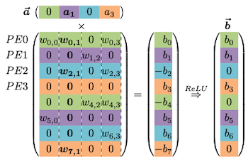
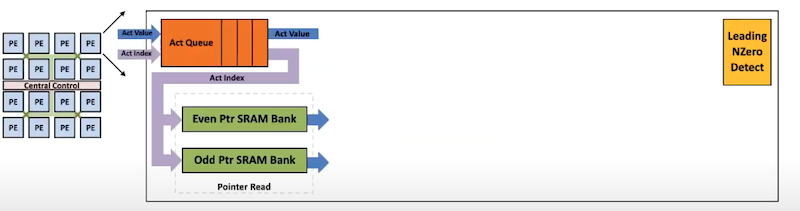
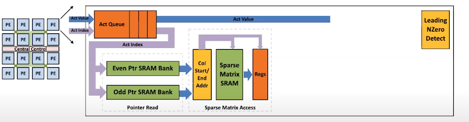
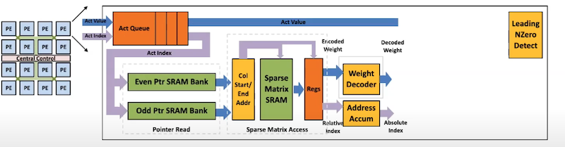
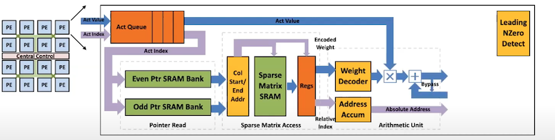
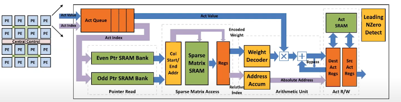
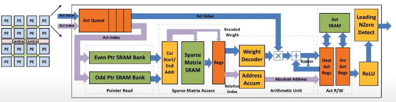

# Lecture 04 - Pruning and Sparsity (Part II)

> [Lecture 04 - Pruning and Sparsity (Part II) | MIT 6.S965](https://youtu.be/1njtOcYNAmg)

---

## 4.1 Pruning Ratio

per-layer **pruning ratio**는 어떻게 설정해야 할까? 이는 레이어의 특성에 따라 고려해야 한다.

- FC layer: pruning이 쉽다.

- 얕은 레이어: pruning이 어렵다.


이때 각 채널마다 적절한 pruning ratio를 찾아서 pruning 시, latency와 accuracy를 모두 향상시킬 수 있다. uniform shrink와 not uniform shrink(AMC 논문)의 성능을 보면 이러한 경향을 더 잘 알 수 있다.


---

### 4.1.1 Finding Pruning Ratios

pruning ratio를 정하기 위해서, 해당 레이어가 pruning에 얼마나 **sensitive**한지 파악해 보자.(**sensitivity analysis**)

> sensitive: pruning을 하면 할수록 정확도가 크게 감소한다.

다음은 CIFAR-10 데이터셋을 쓰는 VGG-11 model에서, 레이어별 pruning sensitivity를 분석한 그래프이다.


- $L_i$ : $i$ 번째 레이어

   pruning ratio $r \in \lbrace 0, 0.1, 0.2, ..., 0.9  \rbrace$ 를 골라서 pruning을 적용한다.

- 정확도 감소 ${\triangle} {Acc}_{r}^{i}$ 가 제일 큰 레이어: L0 

   = L0 레이어가 pruning에 제일 민감하다.

위 그래프에 degradation threshold $T$ 를 추가하면, 각 레이어마다 어느 정도의 pruning ratio를 적용할지 intuition을 얻을 수 있다.


하지만 이렇게 얻은 pruning ratio가 optimal하지는 않다. 각 레이어 특징과 레이어  간의 interection을 고려하지 않았기 때문이다.(어디까지나 sub-optimal한 방식)

> 예를 들어 레이어 크기가 작다면, pruning ratio를 크게 설정해도 정확도 감소가 작을 수밖에 없다.

---

### 4.1.2 Automatic Pruning: AMC

> [AMC: AutoML for Model Compression and Acceleration on Mobile Devices 논문(2018)](https://arxiv.org/abs/1802.03494)

**AMC**(AutoML for Model Compression) 논문에서는 pruning ratio를, **reinforcement learning problem**(강화 학습 문제)으로 정의하여 해결한다.


- **Critic**

    좋은 정책인지 나쁜 정책인지를 평가하기 위한 reward function
    
    - Reward = -Error(error rate)

      제약조건을 만족하지 않는 경우, $-\infty$ 를 사용한다.

    - 이때 latency나 FLOPs, model size가 크면, 패널티를 부여할 수 있다.

      > Reward = -Error \* log(FLOP)

      > latency: latency lookup table(LUT)을 바탕으로 예측한다.

```math
R = \begin{cases} -Error, & if \, satisfies \, constrains \\ -\infty , & if \, not \end{cases}
```

- **Action**

    각 레이어가 갖는 **pruning ratio**

```math
a \in [0,1)
```

- **Embedding**

    강화 학습을 위해서 network architecture를 embedding한다.

    - $s$ : **state**. 11개 feature로 구성된다.

      > layer index $i$ , channel number, kernel sizes, FLOPs, ...


```math
s_t = [N, C, H, W, i]
```

- **Agent**

    DDPG agent를 기반으로 한다.(continuous action output 지원)

다음 그림은 논문에서 얻은 레이어별 sparsity ratio 분포(pruning policy)다. ImageNet 데이터셋으로 학습한 ResNet-50으로, peak와 crest가 경향성을 갖는 것을 알 수 있다.


> y축: density(\#non-zero weights/ \#total weights)

> y 값이 작다 =  \#non-zero weight가 적다 = sparsity가 크다. 

- **peaks**

  1x1 convolution은 redundancy가 적고 pruning에 민감하다.

- **crests**
  
  3x3 convolution은 redundancy가 많고, 더 aggressive하게 pruning할 수 있다.

논문의 MobileNet 결과를 보면, (Galaxy S7 Edge에서 추론했을 때) 25%의 pruning으로 1.7x speedup을 얻은 것을 확인할 수 있다.

> convolution 연산에서 쓰이는 6개 항에, 입력 채널과 출력 채널이 포함되어 있다. 두 개 항이 모두 3/4로 줄어드는 효과이므로, quadratic speedup을 얻을 수 있는 것이다.


---

### 4.1.3 NetAdapt

> [NetAdapt: Platform-Aware Neural Network Adaptation for Mobile Applications 논문(2018)](https://arxiv.org/abs/1804.03230)

**NetAdapt**는 **rule-based** iterative/progressive한 방법으로, 레이어별 최적의 pruning ratio를 찾는 논문이다.


- 매 iteration마다, (수동으로 정의한) $\triangle R$ 만큼 latency가 줄어드는 것을 목표로 pruning한다.

    > \#models = \#iterations

1. 각 레이어 $L_k$ (A~Z)

   - latency가 $\triangle R$ 만큼 줄어들 때까지 pruning한다.(LUT 기반 예측)

   - short-term fine-tune (10k iterations): fine-tuning 후 정확도를 측정한다.

2. 가장 큰 정확도를 갖는 pruned layer를 선택한다.

   - 이후 accuracy를 회복하기 위해, long-term fine-tune을 진행한다.

---

## 4.2 Finetuning Pruned Neural Network

pruning 후 fine-tuning 과정에서는, 해당 모델이 이미 수렴에 근접하므로 learning rate를 더 작게 설정해야 한다.

> 보통 original learning rate의 1/100, 1/10으로 설정한다.

이때 pruning+fine-tuning 방법보다도, 이를 여러 차례 반복하는 **Iterative Pruning**이 효과적이다.


---

### 4.2.1 Regularization

> [Learning Efficient Convolutional Networks through Network Slimming 논문(2017)](https://arxiv.org/abs/1708.06519): channel scaling factors에 smooth-L1 regularization 적용

> [Learning both Weights and Connections for Efficient Neural Networks 논문(2015)](https://arxiv.org/abs/1506.02626): weights에 L2 regularization 적용 후 magnitude-based fine-grained pruning

fine-tuning 중 **regularization**을 추가로 적용하면, weight sparsity를 늘릴 수 있다.

- non-zero parameters: 패널티를 부여한다.

- small parameters: 최대한 0이 될 수 있도록 한다.

가장 대표적인 regularization 방법인 **L1 Regularization**와 **L2 Regularization**을 살펴보자.

- L1 Regularization

    - $L$: data loss

    - $\lambda$: regularization strength

```math
L' = L(x; W) + \lambda |W|
```

- L2 Regularization

```math
L' = L(x; W) + \lambda ||W||^2
```

---

## 4.3 Lottery Ticket Hypothesis

> [The Lottery Ticket Hypothesis: Finding Sparse, Trainable Neural Networks 논문(2019)](https://arxiv.org/abs/1803.03635)

> 학습 전에 쓸 모델을, 학습 후에 찾는다는 아이러니함이 있지만, pruning에서 굉장히 중요한 논문에 해당된다.

**Lottery Ticket Hypothesis**는, sparse neural network를 from scratch( $W_{t=0}$ )부터 다시 학습하면 정확도가 어떻게 될까라는 의문에 답하는 논문이다.

- pruned architecture + from scratch training (random initialized)

  다시 학습하면, 전보다 더 낮은 정확도를 얻을 가능성이 크다.

- **winning ticket**

  하지만 (찾기는 어려워도) 기존 dense model보다 적은 패러미터를 가지면서, 더 적은 학습만으로도, 동일한 성능 혹은 이를 능가하는 갖는 sub-network가 존재할 수 있다.

다음은 pretrained model의 weight를 특정 비율에 따라 pruning한 뒤, 다시 학습한 정확도를 나타내는 그림이다.


> 왼쪽: MNIST, 오른쪽: CIFAR-10 데이터셋

- aggressive한 pruning ratio로도(오직 weight를 1%만 남겨도) 정확도 회복이 가능하다.

---

### 4.3.1 Iterative Magnitude Pruning

winning ticket은 **Iterative Magnitude Pruning** 방법으로 찾아낼 수 있다.

1. dense model training $\rightarrow$ pruning $\rightarrow$ random initialization

    동일한 sparsity pattern(**sparsity mask**)을 갖지만, 다른 weight를 갖는 모델이 되도록 무작위로 초기화한다.

    

2. training $\rightarrow$ pruning

    

3. random initialization

    2번을 통해 얻은 모델을, spasity mask를 바탕으로 무작위 가중치 모델로 초기화

    

4. 2번과 3번 과정을 반복하며 winning ticket를 탐색한다.

단, 이러한 Iterative Magnitude Pruning 방법은, 수렴할 때까지 계속 학습해야 하므로 굉장히 비효율적이다.

---

### 4.3.2 Scaling Limitation

> [Stabilizing the Lottery Ticket Hypothesis 논문](https://arxiv.org/abs/1903.01611)

또한, MNIST, CIFAR-10과 같이 작은 데이터셋과 달리, ImageNet과 같이 거대한 데이터셋에서는 from scratch부터 학습해서는 정확도가 복구되지 않는다. 

대신 $k$ iteration만큼 이미 훈련한 뒤의 가중치( $W_{t=k}$ )를 사용하면, fine-tuning을 통해 sub-networks 정확도를 회복할 수 있다.


---


## 4.4 System Support for Sparsity

추론 시 input activation과 weight 사이의 연산을 수행하게 된다. 다음 세 가지 경우를 살펴보자.

- 0 \* A = 0

  weight가 0이므로 계산할 필요가 없다.(**weight sparsity**)

  - computation 10배 감소, memory footprint 5배 감소

- W \* 0 = 0

  activation이 0이므로 계산할 필요가 없다.(**activation sparsity**)

  > ReLU activation function으로, activation sparsity가 쉽게 얻어지게 된다.(activation sparsity를 조절하기 위해 ReLU를 개조하기도 한다.)

  - computation 3배 감소

- 2.09, 1.92 $\rightarrow$ 2
  
  2.09와 1.92가 모두 2라는 동일한 값을 가리키도록 하면, weight를 훨씬 줄일 수 있다. (**weight sharing**)

  > 높은 정밀도가 필요하지 않으므로 2로 근사할 수 있다.(quantization) 

  - memory footprint 8배 감소

---

### 4.4.1 EIE: Efficient Inference Engine

> [EIE: Efficient Inference Engine on Compressed Deep Neural Network 논문(2016)](https://arxiv.org/abs/1602.01528)

추론 중 다음과 같은 연산을 수행한다고 하자.

$$ \bar{a} = [0 \quad a_1 \quad 0 \quad a_3] $$

```math
\begin{bmatrix} w_{0,0} && w_{0,1} && 0 && w_{0,3} \\ 0 && 0 && w_{1,2} && 0 \\ 0 && w_{2,1} && 0 && w_{2,3} \\ 0 && 0 && 0 && 0 \\ 0 && 0 && w_{4,2} && w_{4,3} \\ w_{5,0} && 0 && 0 && 0 \\ 0 && 0 && 0 && w_{6,3} \\ 0 && w_{7,1} && 0 && 0 \end{bmatrix} \begin{bmatrix} b_0 \\ b_1 \\ -b_2 \\ b_3 \\ -b_4 \\ b_5 \\ b_6 \\ -b_7 \end{bmatrix} \underset{ReLU}{\Rightarrow} \begin{bmatrix} b_0 \\ b_1 \\ 0 \\ b_3 \\ 0 \\ b_5 \\ b_6 \\ 0 \end{bmatrix}
```

먼저 위 예제를 4개의 processing element로 나눠보자.



EIE 논문에서는 초록색 processing element를 메모리에 저장할 때, sparsity를 활용하여 물리적으로 다음과 같이 mapping한다.(오직 non-zero만 저장)

- **Relative Index**

  Absolute Index 대신 Relative Index를 사용하며 메모리 사용량을 줄인다.(bits 수도 감소)

  - $w_{0,0}$ : index 0

  - $w_{0,1}$ : $w_{0,0}$ 아래 0, $w_{0,0}$ 의 바로 옆에 위치하므로, index 1

  - $w_{4,2}$ : $w_{0,1}$ 아래 0, 오른쪽 0 다음에 위치하므로, index 2

  - $w_{0,3}$ , $w_{4,3}$ : 중간에 0 없이 바로 위치하므로 index 0 

- Column Pointer

  - starting point $w_{0,0}$ 를 기준으로 몇 번째 column에 위치하는지 정보를 나타낸다. 

| virtual weight | $w_{0,0}$ | $w_{0,1}$ | $w_{4,2}$ | $w_{0,3}$ | $w_{4,3}$ |
| :---: | :---: | :---: | :---: | :---: | :---: |
| Relative Index | 0 | 1 | 2 | 0 | 0 |
| Column Pointer | 0 | 1 | 2 | 3 | 5 |

> 이러한 format을 **CSC format**(Compressed Sparse Column)으로 지칭한다.

---

#### 4.4.1.1 Dataflow

- activation 0

  skip

  

- activation $a_1$

  broadcast 후 parallel하게 연산한다.

  

  

- activation 0

  

- activation $a_3$

  broadcast 후 parallel하게 연산한다.

  

  

끝나면 다음 cycle로 가중치 행렬의 아래 부분 연산도 수행한다. 결과를 모두 얻은 뒤 update를 수행한다.

---

#### 4.4.1.2 Micro Architecture for each PE

각 PE는 다음과 같은 과정을 거쳐서 연산을 가속하여 수행하게 된다.


흐름도를 단계별로 파악해 보자.

- **Activation Sparsity**: zero/non-zero인지 검사한다.

  non-zero일 경우, weight와 연산하게 된다.

  

- **Weight Sparsity**: non-zero weight 위치 정보를 register에 전달한다.

  

- **ALU**: weight decoding 수행 및 address를 계산한다.

  > quantization과 관련된 자세한 내용은 lec05 참조

  - quantized weight를 decoding한다.

  - relative index 정보를 바탕으로 absolute address를 계산한다.(address accumulate)

  

- **ALU**: 연산을 수행한다.

  activation과 decoded weight의 연산을 수행한다.

  

- **Write Back**: SRAM에 output을 저장한다.

  ALU로 계산한 absolute address에 연산 결과를 저장한다.

  

- **ReLU**, **Non-zero Detection**

  ReLU 연산을 수행하고, Non-zero 값을 찾아낸다.(next stage에서 활용)

  

---
