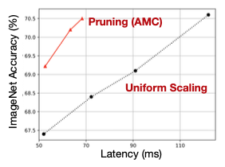
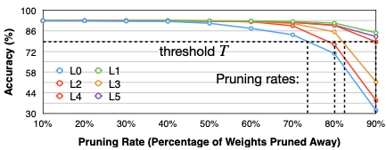
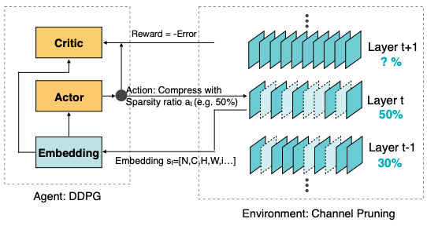
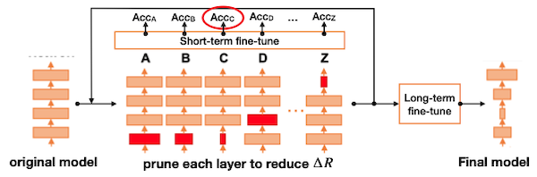
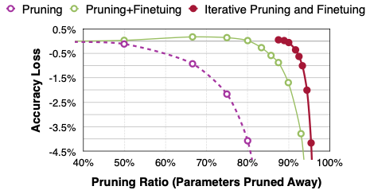

# Lecture 04 - Pruning and Sparsity (Part II)

> [Lecture 04 - Pruning and Sparsity (Part II) | MIT 6.S965](https://youtu.be/1njtOcYNAmg)

---

## 4.1 Pruning Ratio

> [AMC: AutoML for Model Compression and Acceleration on Mobile Devices 논문(2018)](https://arxiv.org/abs/1802.03494)

per-layer **pruning ratio**는 어떻게 설정해야 할까? 우선 uniform shrink와 not uniform shrink를 복습하며 비교해 보자.

- FC layer일수록 pruning하기 쉬웠다.

- 얕은 레이어일수록 pruning하기 어려웠다.


위 두 방식의 latency, accuracy를 비교한 그래프를 보자. 각 채널마다 적절한 pruning ratio를 찾아내면, latency와 accuracy를 모두 향상시킬 수 있다.



- not uniform pruning이 uniform scaling과 비교했을 때 **Pareto Dominant**하다.

---

### 4.1.1 Finding Pruning Ratios

pruning ratio를 정하기 위해서는, 우선 해당 레이어가 pruning에 얼마나 **sensitive**한지 알아야 한다.

- sensitive한 레이어라면 pruning을 하면 할수록 정확도가 크게 감소한다.

- 따라서 레이어의 sensitivity를 알기 위한 **sensitivity analysis**가 필요하다.

다음은 CIFAR-10 데이터셋을 쓰는 VGG-11 model에서, heuristic한 방법으로 pruning ratio를 찾는 과정이다.


- $L_i$ : $i$ 번째 레이어

   pruning ratio $r \in \lbrace 0, 0.1, 0.2, ..., 0.9  \rbrace$ 를 골라서 pruning을 적용한다.

결과를 보면 degrade ${\triangle} {Acc}_{r}^{i}$ 가 제일 큰 레이어는 $L0$ 이다. 즉 $L0$ 레이어가 제일 pruning에 민감하다.

위 그래프에 degradation threshold $T$ 를 추가하면, 각 레이어마다 어느 정도의 pruning ratio를 적용할지 알 수 있다.



하지만 이렇게 얻은 pruning ratio가 optimal하지는 않다. 각 레이어 성격과 레이어 사이의 interection을 고려하지 않았기 때문이다.(sub-optimal, 차선의 방식)

> 예를 들어 레이어가 pruning에 민감하지는 않지만, 해당 레이어 크기가 작다면 아무리 pruning ratio를 크게 설정해도 효과가 적을 것이다.

---

### 4.1.2 Automatic Pruning: AMC

그렇다면 레이어 사이의 interection을 고려하면서 pruning ratio를 찾을 수는 없을까? **AMC**(AutoML for Model Compression) 논문에서는 pruning ratio를 찾는 문제를 **reinforcement learning problem**(강화 학습 문제)으로 정의하여 해결한다.



- critic

    좋은 정책인지 나쁜 정책인지를 평가하기 위한 reward function이 필요하다. 
    
    - 가장 단순한 reward function로 -Error(error rate)를 사용할 수 있다.

    - 추가로 긴 latency나 큰 model size(FLOPs)를 고려해서 패널티로 부여할 수 있다.

      > latency constraints는 latency lookup table(LUT)을 미리 만들어서 구현한다.

```math
R = \begin{cases} -Error, & if \, satisfies \, constrains \\ -\infin , & if \, not \end{cases}
```

- actor

    - **Action**: 각 레이어가 갖는 **sparsity ratio**.(pruning ratio)

    $$ a \in [0,1) $$

- Embedding

    강화 학습을 위해서는 network architecture를 embedding해야 한다.

    $$ s_t = [N, C, H, W, i] $$

    - s : **state**. 11개 feature를 갖는다.

        layer index $i$ , channel number, kernel sizes, FLOPs, ...

- Agent

    DDPG agent를 사용한다.(continuous action output을 지원한다.)

다음은 강화 학습 문제를 해결함으로써 얻어낸 pruning policy(레이어별 sparsity ratio 분포)이다.(ImageNet 데이터셋으로 학습한 ResNet-50. 이름처럼 50개 레이어를 갖는다.) 그림을 보면 peak와 crest가 경향성을 갖는다.


- y축: density(\#non-zero weight/ \#total weight)

    따라서 y축의 값이 작을수록 \#non-zero weight가 적으므로 sparsity가 크다. 

- **peaks**: 1x1 convolution은 pruning을 잘 적용하지 않았다.

- **crests**: 반면 3x3 convolution에서 더 aggressive하게 pruning된 것을 알 수 있다.

---

### 4.1.3 NetAdapt

> [NetAdapt: Platform-Aware Neural Network Adaptation for Mobile Applications 논문(2018)](https://arxiv.org/abs/1804.03230)

**NetAdapt**도 마찬가지로 레이어별 최적의 pruning ratio를 찾는 논문이다.



1. 각 iteration마다 수동으로 정의한 $\triangle R$ 만큼 latency가 줄어드는 것을 목표로 pruning을 지속한다.(latency LUT 기반)

    > \#models = \#iterations

2. pruning을 진행한 뒤, 각 레이어 $L_k$ (A~Z)마다 fine-tuning 후 정확도를 측정한다.(short-term fine-tune)

3. 가장 큰 정확도를 갖는 pruned layer를 선택한다.

    이후 accuracy를 회복하기 위한 long-term fine-tune을 진행한다.

---

## 4.2 Finetuning Pruned Neural Network

pruning 후 정확도를 회복하는 fine-tuning 과정에서는, 이미 해당 모델이 수렴에 가깝기 때문에 learning rate를 더 작게 설정해야 한다.

> 보통 original learning rate의 1/100이나 1/10으로 설정한다.

또한 pruning과 fine-tuning을 단계적으로 반복하며 수행하는 **iterative pruning**이 일반적인 pruning+fine-tuning 방법보다 효과적이다.

> 30% pruning + fine-tuning이 끝난 뒤, 40% pruning + fine-tuning, ...



---

## 4.3 Regularization

fine-tuning 중 loss term에 **regularization** 항을 추가하는 것으로, weight를 더 sparse하게 만들 수 있다.

- penalize non-zero parameters

- encourage small parameters

가장 대표적인 regularization 방법은 **L1 Regularization**와 **L2 Regularization**이다.(양쪽 다 비슷한 비율로 자주 사용된다.)

- L1 Regularization

    $$ L' = L(x; W) + \lambda |W| $$

    - $L$: data loss

    - $\lambda$: regularization strength

- L2 Regularization

    $$ L' = L(x; W) + \lambda ||W||^2 $$ 

---