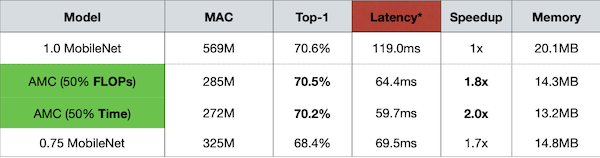
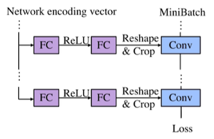
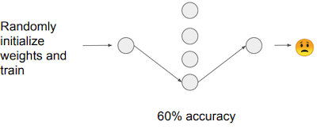
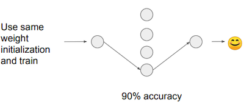

# Lecture 04 - Pruning and Sparsity (Part II)

> [Lecture 04 - Pruning and Sparsity (Part II) | MIT 6.S965](https://youtu.be/1njtOcYNAmg)

> [EfficientML.ai Lecture 4 - Pruning and Sparsity (Part II) (MIT 6.5940, Fall 2023, Zoom recording)](https://youtu.be/sDJymyfAOKY?si=uXQDRHl50SIk-37Y)

---

## 4.1 Pruning Ratio

> [AMC: AutoML for Model Compression and Acceleration on Mobile Devices 논문(2018)](https://arxiv.org/abs/1802.03494)

다음은 CIFAR-10으로 학습한 VGG-11 모델의 6개 레이어(L0\~L5)를 대상으로, pruning 시 정확도 변화(민감도)를 조사한 실험이다.(sensitivity analysis)


- pruning ratio $r \in \lbrace 0, 0.1, 0.2, ..., 0.9  \rbrace$ 

- 정확도 감소( ${\triangle} {Acc}_{r}^{i}$ )가 제일 큰 레이어는 L0이다. 즉, L0 레이어가 제일 pruning에 민감하다.

단, 이러한 분석으로 얻은 pruning ratio는 최적이 아닌 한계를 갖는데, 이유는 레이어의 특징과 레이어 사이의 interaction이 고려되지 않기 때문이다.

> 예를 들어 레이어 크기가 작을 경우, pruning ratio가 커도 정확도 감소가 비교적 작다.

---

## 4.2 Finding Pruning Ratio: Learn to Prune

이후, 최적의 pruning ratio를 찾고자 하는 다양한 연구가 시도되었다.

---

### 4.2.1 Reinforcement Learning based Pruning: AMC

> [AMC: AutoML for Model Compression and Acceleration on Mobile Devices 논문(2018)](https://arxiv.org/abs/1802.03494)

> **Agent**(에이전트): **Environment**(환경)을 관찰하여 얻은 **state**(상태) 값 및 **policy**(정책)를 토대로 **action**(행동)을 결정한다. 
>
> - 때때로 행동에 대한 **reward**(보상)을 받는다.
>
> - policy: state를 입력으로 받아서, 출력으로 agent가 수행해야 하는 행동을 반환하는 함수

**AMC**(AutoML for Model Compression) 논문에서는, 최적의 pruning ratio를 **Reinforcement Learning**(강화 학습) 기반으로 탐색한다.


- Agent: 레이어 $t$ 의 embedding state $s_t$ 를 입력으로, action인 sparsity ratio $a_t$ 를 출력한다.

  - embedding state $s_t = [N, C, H, W, i, ...]$

  > DDPG = Deep Deterministic Policy Gradient

- Reward: $-Error$ (error rate)로 정의된다.

  이때, 제약조건(latency, FLOPs, model size 등)을 고려하는 패널티를 부여할 수 있다.

  > e.g., $R_{FLOPs} = -Error \cdot log(FLOPs)$

  > 제약조건을 만족하지 않는 경우, Reward 값으로 $-\infty$ 를 준다.

```math
R = \begin{cases} -Error, & if \ \mathrm{satisfies} \ \mathrm{constraints} \\ -\infty , & if \ \mathrm{not} \end{cases}
```

---

#### 4.2.1.1 Sparsity Pattern Across Layers

다음은 ImageNet-1으로 학습한 ResNet-50에서 레이어별 획득한 density이다. 

> density = \#non-zero_weights / \#weights

이때, iterative pruning을 4 stage 동안 수행했다. (stage마다 전체 density를 각각 $[50\%,35\%,25\%,20\%]$ 으로 설정)


> x축: layer index, y축: density. **density 값이 클수록 sparsity ratio가 작다 = 더 민감하다.**

| | | |
| :---: | --- | --- |
| **Peaks** | 대부분 1x1 convolution(**pointwise**) | **pruning에 민감**하다. |
| **Crests** | 대부분 3x3 convolution(**depthwise**) | **pruning에 덜 민감**하며, 공격적인 가지치기가 가능하다. |

즉, 강화학습의 결과를 통해, $3 \times 3$ convolution을 더 가지치기하는 것이 효율적임을 알 수 있다.
 
---

#### 4.2.1.2 Speedup Mobile Inference

ImageNet으로 학습한 MobileNet 대상으로 획득한 모델을 실제 추론하여 얻는 speedup 성능이다.

- Galaxy S7 Edge 추론에서, 25%의 pruning ratio로 1.7x speedup 획득



> 입력과 출력 모두 3/4씩 줄어드는 효과이므로, quadratic한 speedup을 획득하게 된다.

---

### 4.2.2 Rule based Pruning: NetAdapt

> [NetAdapt: Platform-Aware Neural Network Adaptation for Mobile Applications 논문(2018)](https://arxiv.org/abs/1804.03230)

**NetAdapt**에서는 feedback loop 기반으로 최적의 pruning ratio를 탐색한다.

- 목표: 제약 조건(e.g., latency, energy, ...)을 만족하며 최고 정확도를 갖는 레이어별 pruning ratio

먼저 1 iteration마다 단일 레이어를 대상으로 pruning하며, 모델의 latency(제약조건)가 $\triangle R$ 만큼 줄어들 때까지 수행한다. (latency는 LUT를 통해 측정)

> \#pruned_models = \#iterations

| original model | NetAdapt Iterative Pruning |
| :---: | :---: |
|  |  |

- pruning 후, 짧게 10k iteration 동안만 fine-tuning하여 성능을 측정한다.

- 가장 높은 정확도를 갖는 모델은 다음 iteration의 초기 모델이 된다.

모든 iteration이 끝나면, 가장 높은 성능의 모델을 대상으로 lont-term fine-tuning 후 성능을 측정한다.

---

### 4.2.3 Regularization based Pruning

> [Learning both Weights and Connections for Efficient Neural Networks 논문(2015)](https://arxiv.org/abs/1506.02626)

> [Learning Efficient Convolutional Networks through Network Slimming 논문(2017)](https://arxiv.org/abs/1708.06519)

> [A Systematic DNN Weight Pruning Framework using Alternating Direction Method of Multipliers(2018)](https://arxiv.org/abs/1804.03294)

fine-tuning 및 training 과정에서, loss function에 **regularization** 항을 추가하여 sparsity를 향상시킬 수 있다.

- 가장 대표적으로 **L1**, **L2 Regularization**를 사용하는 weight pruning은, 다음과 같이 정의할 수 있다.

  | Regularization | Loss Function |
  | :---: | --- |
  | L1-Regularization | $L' = L(x; W) + \lambda \|W\|$ |
  | L2-Regularization | $L' = L(x; W) + \lambda \|\|W\|\|{}^2$ |

---

### 4.2.4 Meta-Learning based Pruning: MetaPruning

> [MetaPruning: Meta Learning for Automatic Neural Network Channel Pruning 논문(2019)](https://arxiv.org/abs/1903.10258)

MetaPruning 논문에서는 최고 성능의 모델을 획득하기 위해, 가지치기된 구조를 입력으로 대응되는 가중치를 생성하는 **meta network**를 학습한다. 

> 논문에서는 channel pruning 문제를, 제약조건을 만족하면서 loss가 최소화되는 channel width의 집합으로 정의한다.
>
>  $$ (c_1, c_2, \cdots, c_l)^{*} = \underset{c_1, c_2, \cdots, c_l}{\arg\min} \mathcal{L}(\mathcal{A}(c_1, c_2, \cdots, c_l ; w)) $$
>
>  $$ s.t. \quad C < \mathrm{constraint} $$
>
>  > $c_l$ : $l$ 번째 레이어의 channel width, $C$ : cost(FLOPs, latency 등)

MetaPruning은 meta network인 **PruningNet**을 학습하는 단계와, PruningNet을 사용해 제약조건을 만족하며 최고 정확도를 갖는 모델의 탐색 단계로 구성된다.

| (Step 1) Training | (Step 2) Searching |
| :---: | :---: |
|  | 

> 최적 모델의 탐색 알고리즘으로는 evolutionary search를 사용한다. 

---

#### 4.2.4.1 Meta Network: PruningNet

두 개의 fully-connected layer를 갖는 모델로 구성된 **PruningNet**은, 입력으로 encoding vector $(c_1, c_2, \cdots, c_l)$ 를 받아서, 출력으로는 생성한 pruned network의 가중치 $W$ 를 반환한다.

> training iteration마다 무작위로 channel width 조합을 생성한다.

$$ W = \mathrm{PruningNet}(c_1, c_2, \cdots, c_l) $$



이후 pruned model은 Reshape 연산을 통해, PruningNet에서 입력으로 받은 $(c_1, c_2, \cdots, c_l)$ 와 동일한 출력 채널 수를 갖도록 구성된다. 

- 해당 모델에 입력 이미지 배치를 통과시켜 loss를 계산하고, 연결된 PruningNet의 가중치를 업데이트한다.

---

## 4.3 Lottery Ticket Hypothesis

> [The Lottery Ticket Hypothesis: Finding Sparse, Trainable Neural Networks 논문(2019)](https://arxiv.org/abs/1803.03635)

> [THE LOTTERY TICKET HYPOTHESIS: FINDING SPARSE, TRAINABLE NEURAL NETWORKS](https://ndey96.github.io/deep-learning-paper-club/slides/Lottery%20Ticket%20Hypothesis%20slides.pdf)

**Lottery Ticket Hypothesis**(LTH)는, 희소화된 네트워크를 from scratch( $W_{t=0}$ )부터 다시 학습했을 경우 갖는 성능에 의문을 제기한다.

- original pruned model: 90% accuracy 가정

| Pruned Model+From Scratch | Winning Ticket |
| :---: | :---: |
|  |  |
| 60% 정확도로, 전보다 낮은 성능 획득 | 90% 정확도로, 전보다 적은 학습만으로도 기존 이상의 성능 획득 |

즉, 기존 dense model보다 희소하면서, 적은 학습만으로도 기존 이상의 성능을 갖는 sub-network가 존재할 수 있다는 것이 LTH의 주장이다.

---

### 4.3.1 Iterative Magnitude Pruning

winning ticket을 찾는 가장 대표적인 방법으로, **Iterative Magnitude Pruning**이 존재한다.

> 성능 면에서 one-shot pruning 방법보다는, 여러 차례 과정을 반복하는 **Iterative Pruning**이 효과적이다.
>
> 

다음은 iterative magnitude pruning 방법을 통해 winning ticket을 찾는 과정이다.

| | | |
| --- | --- | --- |
| Step 1 | dense model training<br/> $\rightarrow$ pruning<br/> $\rightarrow$ random initialization<br/>(**same sparsity mask**) |  |
| Step 2 | training $\rightarrow$ pruning |  |
| Step 3 | random initialization<br/>(**same sparsity mask**) |  |
| Step 4 | Repeat Step 2-3 | |

> 이러한 Iterative Magnitude Pruning 방법에서는, 수렴까지 학습을 위한 비용이 소모된다는 단점에 주의해야 한다.

---

### 4.3.4 Limitation

> [Stabilizing the Lottery Ticket Hypothesis 논문(2019)](https://arxiv.org/abs/1903.01611)

> [One ticket to win them all: generalizing lottery ticket initializations across datasets and optimizers 논문(2019)](https://arxiv.org/abs/1906.02773)

하지만 한계점으로, (MNIST, CIFAR-10과 같은) 작은 데이터셋이 아니라 ImageNet과 같이 거대한 데이터셋에서는 정확도를 복구하지 못했다. 


대안으로 특정 iteration까지 학습한 가중치( $W_{t=k}$ )를 활용하여, fine-tuning으로 정확도를 회복할 수 있다.

---

## 4.4 Pruning at Initialization(PaI)

보다 훈련 비용을 낮추기 위해, 훈련 전에 먼저 winning ticket을 찾는 **Pruning at Initialization**(PaI, a.k.a. Foresight Pruning) 방법이 제안되었다.

| | |
| --- | --- |
| Pruning after Training(PaT) |  |
| Pruning at Initialization(PaI) |  |

> 대체로 PaI는 PaT에 비해 성능이 떨어지기 때문에, 주로 효율적인 훈련(예: 훈련 속도)이 필요한 상황에서 활용된다.

---

### 4.4.1 SNIP: Connection Sensitivity

> [SNIP: Single-shot Network Pruning based on Connection Sensitivity 논문(2018)](https://arxiv.org/abs/1810.02340)

최초로 PaI를 구현한 SNIP 논문은 가중치 연결을 on/off하며, loss에 얼마나 변화를 미치는지 관찰하고, 이를 기반으로 **connection sensitivity**를 계산한다.

- connection mask ( $c_j \in \lbrace 0, 1 \rbrace$ )를 도입하여 연결을 제어한다. 

  > $c_j = 1$ (active), $c_j = 0$ (pruned)
  
- 예를 들어, connection $j \in \lbrace 1 \cdots m \rbrace$ 의 loss 변화는, 다음과 같이 계산할 수 있다.

  >  $e_j$ : $j$ 번째 연결을 제외하고 모두 $0$ 값을 갖는 벡터

$$ \triangle L_j (w; \mathcal{D}) = L(1 \odot w; \mathcal{D}) - L((1 - e_j) \odot w; \mathcal{D}) $$

> 이때, Variance Scaling을 통해 가중치를 초기화하며, 입력으로는 훈련 데이터셋에서 샘플링한 하나의 minibatch를 활용한다.

다음은 SNIP에서 정의한 수식이다.

<table>
<tr>
<td> Loss Function </td> <td> Connection Sensitivity </td>
</tr>
<tr>
<td> 

$\min_{c,w} L(c \odot w; \mathcal{D}) = \min_{c,w} {{1} \over {n}} \sum\limits_{i=1}^n l(c \odot w ; (x_i, y_i))$

</td>
<td> 

$s_j = {{|g_{j}(w;\mathcal{D})|} \over { {\sum}^m_{k=1} |g_k(w;\mathcal{D})|}}$

</td>
</tr>
<tr>
<td> 

- $\mathcal{D}$ : training dataset

- $\odot$ : Hadamard product


</td>
<td> 

- $j \in \lbrace 1 \cdots m \rbrace$

- $e_j$ : $j$ 번째를 제외하고, 모두 0의 값을 갖는 vector

</td>
</tr>
</table>

이후 모든 connection sensitivity 계산이 끝나면, top- $\kappa$ 개 연결만을 남기고 일반적인 모델 학습 과정을 진행한다.

---

### 4.4.2 GraSP: Gradient Signal Preservation

> [PICKING WINNING TICKETS BEFORE TRAINING BY PRESERVING GRADIENT FLOW 논문(2020)](https://arxiv.org/abs/2002.07376)

하지만 SNIP은 하나의 가중치 연결만 주목하면서, 가중치 사이의 복잡한 interaction은 포착하지 못한다. 또한, 중요한 연결을 제거하면서 모델에서 정보의 흐름이 차단될 수 있다.

> SNIP에서는 높은 pruning ratio으로 설정 시, 특정한 레이어의 가중치를 모두 제거하는 문제가 발생한다.

이러한 SNIP의 단점을 해결하는 방안으로, GraSP 논문은 **gradient flow**의 관찰을 제안한다.

- (전제) 모델의 최종 성능은 **trainability**와 큰 연관이 있다.

  $\rightarrow$  pruning 이후의 gradient flow를 관찰하여, 모델의 trainability를 파악할 수 있다.

다시 말해 pruning 이후의 기울기를 관찰하고, 이때 기울기의 크기(norm)이 크게 감소하면, 해당 연결이 중요한 연결이라고 판단할 수 있다.

> 실제로 Tiny-ImageNet 대상으로 학습한 VGG19, ResNet32 실험에서, SNIP에 비해 높은 pruning ratio 설정에서 더 높은 정확도를 획득했다.
> 
> 

---
