# Lecture 04 - Pruning and Sparsity (Part II)

> [Lecture 04 - Pruning and Sparsity (Part II) | MIT 6.S965](https://youtu.be/1njtOcYNAmg)

> [EfficientML.ai Lecture 4 - Pruning and Sparsity (Part II) (MIT 6.5940, Fall 2023, Zoom recording)](https://youtu.be/sDJymyfAOKY)

가중치 혹은 활성화 값 중 하나의 값이 0이면, 다음과 같이 연산을 생략할 수 있다.

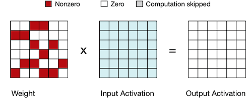

다음은 후술할 EIE 논문에서, 두 종류의 sparsity를 활용했을 때 얻은 이점이다.

| | 0 $\times$ A = 0 | W $\times$ 0 = 0 |
| :---:| --- | --- |
| 종류 | **weight sparsity** | **activation sparsity** |
| (+) | (90% sparsity 기준)<br/>computation 10배 감소<br/>memory footprint 5배 감소 | (70% sparsity 기준)<br/>computation 3배 감소 | 

구체적으로는 memory access(특히 DRAM)에 드는 비용을, sparsity를 활용하는 압축 알고리즘, 하드웨어를 통해 줄일 수 있다.

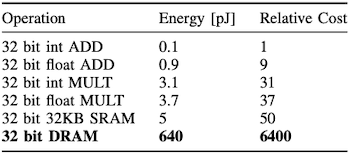

> 45NM CMOS process 기준. DRAM access는 SRAM에 비해 128배 에너지를 소모한다.

---

## 4.6 EIE: Parallelization on Sparsity

> [EIE: Efficient Inference Engine on Compressed Deep Neural Network 논문(2016)](https://arxiv.org/abs/1602.01528)

EIE 논문에서는 변형된 CSC(Compressed Sparse Column) format을 사용하여, 희소 가중치 행렬을 encoding한다. 행렬-벡터 연산 예시를 통해 EIE의 동작 방식을 살펴보자.

$$ \vec{a} = [0 \quad a_1 \quad 0 \quad a_3] \quad \quad $$

$$ \times $$

```math
\begin{bmatrix} w_{0,0} && w_{0,1} && 0 && w_{0,3} \\ 0 && 0 && w_{1,2} && 0 \\ 0 && w_{2,1} && 0 && w_{2,3} \\ 0 && 0 && 0 && 0 \\ 0 && 0 && w_{4,2} && w_{4,3} \\ w_{5,0} && 0 && 0 && 0 \\ 0 && 0 && 0 && w_{6,3} \\ 0 && w_{7,1} && 0 && 0 \end{bmatrix} \begin{bmatrix} b_0 \\ b_1 \\ -b_2 \\ b_3 \\ -b_4 \\ b_5 \\ b_6 \\ -b_7 \end{bmatrix} \underset{ReLU}{\Rightarrow} \begin{bmatrix} b_0 \\ b_1 \\ 0 \\ b_3 \\ 0 \\ b_5 \\ b_6 \\ 0 \end{bmatrix}
```

실제 연산에서, 0인 활성화나 가중치 값은 연산을 생략한다.

| | |
| :---: | :---: |
| 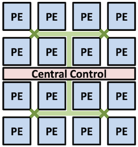 | 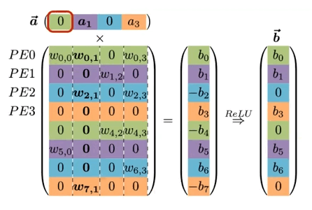 |

> 색상은 동일한 PE에 store되는 element. 이때, 색상마다 가중치는 하나의 큰 배열에 저장된다.

이때, $PE0$ 의 피연산자 가중치(non-zero weights)는 벡터 형태로 메모리에 저장된다. 

<style>
    .heatMap {
        width: 70%;
        text-align: center;
    }
    .heatMap th {
        background: #AEC67D;
        word-wrap: break-word;
        text-align: center;
    }
</style>

<div class="heatMap">

| virtual weight | $w_{0,0}$ | $w_{0,1}$ | $w_{4,2}$ | $w_{0,3}$ | $w_{4,3}$ |
| :---: | :---: | :---: | :---: | :---: | :---: |
| **Relative Index** | 0 | 1 | 2 | 0 | 0 |
| **Column Pointer** | 0 | 1 | 2 | 3 | 5 |

</div>

- **Relative Index**

  skip하는 zero element 수. (distance)

  > 변환 시, 열을 모두 scan하고 다음 열로 넘어가는 방식으로 진행된다.

  > (+) absolute index에 비해 작은 bit width를 사용할 수 있다.

- **Column Pointer**

  각 column의 시작 지점에 대응되는 relative index를 가리킨다.

  > column $j$ 가 갖는 \#nonzeros: $p_{j+1} - p_{j}$

---

### 4.6.1 Micro Architecture for each PE

다음은 PE의 micro architecture를 나타낸 도식이다.

| Layout of PE | PE architecture |
| :---: | :---: |
| 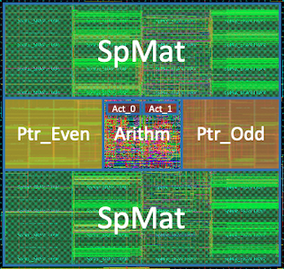 | 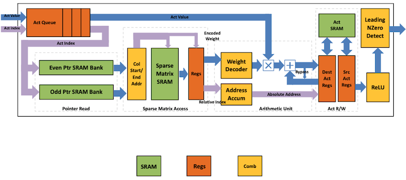 |

- 활성화 벡터 $a$ 를 스캔한 뒤, non-zero activation $a_j$ 만을 인덱스 $j$ 와 함께 broadcast한다.

  > 0에 해당될 경우, 대응되는 가중치 행렬의 column을 skip한다.

  > (PE array를 제어하는) Central Control Unit(CCU)에서, PE 내부 Act Queue에 non-zero activation을 전달한다.

- 한 사이클에 두 pointer를 읽도록, 두 SRAM Bank가 각각 $p_j$ , $p_{j+1}$ 를 처리한다.

  > pointer 길이: 16 bits

- 열마다 \#nonzeros가 다르기 때문에, **load imbalance** 문제가 발생할 수 있고, **FIFO**를 통해 해결한다.

흐름을 단계별로 파악해 보자.

1. **Sparse Matrix Read Unit**

    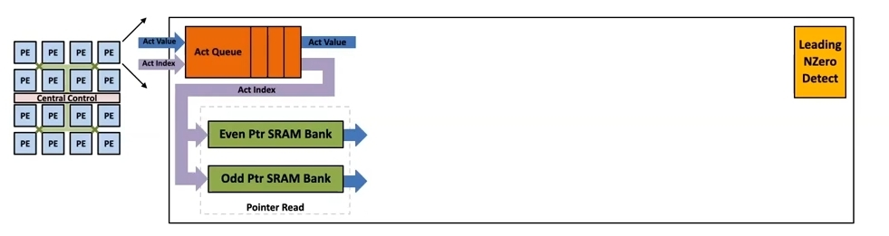 

    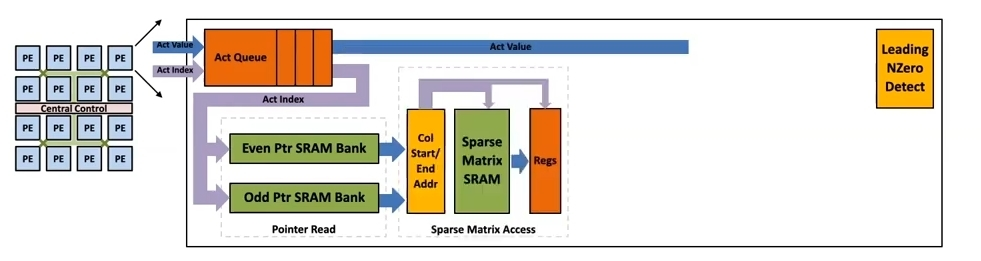
  
    - 포인터 $p$ 를 활용해, SRAM의 column $I_j$ 에서 nonzero 활성화 값을 read한다. 

    - $(v, x)$ 를 전달한다. 

      - $x$ : accumulator array index

      - $v$ : weight value

    > pointer $p$ (16 bits): 상위 13 bit는 SRAM row를 가리키고, 하위 3 bit는 entry(8개 원소) 중 하나를 가리킨다.

2. **Arithmetic Unit**

    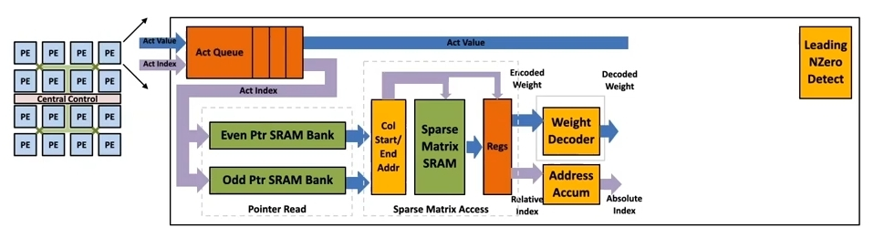

    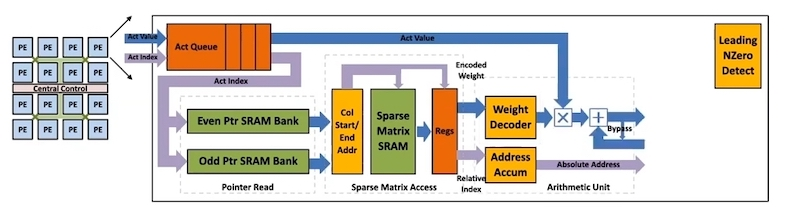

    - MAC 연산( $b_{x} = b_{x} + v \times a_{j}$ )을 수행한다.

    - relative index 정보를 바탕으로, 결과를 저장할 absolute address를 계산한다.(address accumulate)

    > 4 bits 로 사전에 양자화된 $v$ 는, LUT를 조회하여 16 bits로 decoding된다.

3. **Write Back**

    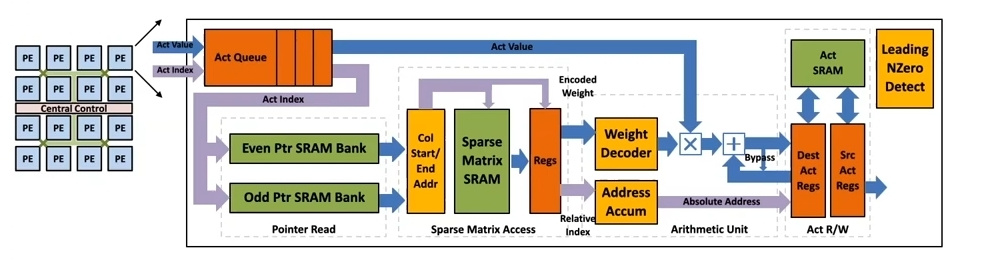

    - SRAM에 결과를 write한다.

4. **ReLU**, **Non-zero Detection**

    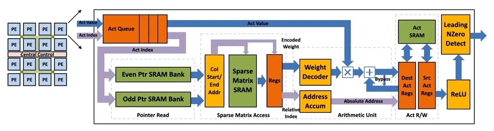

    - ReLU 연산을 수행한다.
    
    - LNZD(Leading Non-zero Detection Node) 노드에서 nonzero 활성화를 찾아낸다.(next stage에서 활용)

---

### 4.6.2 Benchmark of EIE

다음은 EIE를 활용한 다양한 모델 추론 결과이다. 특히, 가중치나 활성화가 0을 가질 경우 연산을 생략하기 때문에, 극적인 연산량(FLOPs) 감소를 달성했다.

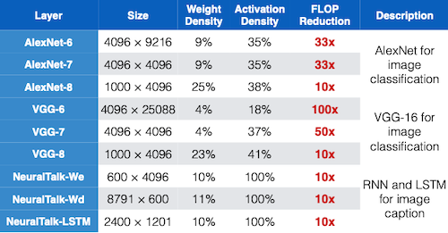

다음은 지연시간 및 에너지 관점에서, EIE와 다양한 하드웨어 추론 결과를 비교한 도표이다.

> Intel Core i7-5930k CPU, NVIDIA TitanX GPU, NVIDIA Jetson TK1 Mobile GPU

| | |
| :---: | :---: |
| speedup | 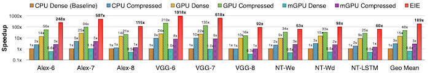 |
| energy | 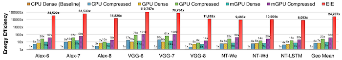 |

---

### 4.6.3 EIE: Pros and Cons

> [Retrospective: EIE: Efficient Inference Engine on Sparse and Compressed Neural Network 논문(2023)](https://arxiv.org/abs/2306.09552)

위 논문에서는, EIE 접근법의 장단점을 다음과 같이 요약하고 있다. 

| 장점 | 단점 |
| --- | --- |
| 연산량, 에너지 효율<br/>fine-grained sparsity 지원<br/>INT4까지 aggressive한 양자화 지원 | control flow 관점에서 overhead, storage overhead<br/>structured sparsity 활용 불가<br/>FC layers만 지원<br/>SRAM 대상 효율화이므로, LLM 등 큰 모델에 비적합

---

## 4.7 ESE: Load Balance Aware Pruning

> [ESE: Efficient Speech Recognition Engine with Sparse LSTM on FPGA 논문(2016)](https://arxiv.org/abs/1612.00694)

| Unbalanced | Balanced |
| :---: | :---: |
|  | 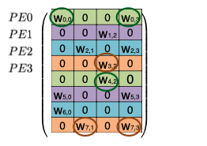 |
| 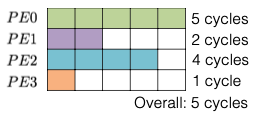 |  |

(생략)

---

## 4.8 Sparse Matrix-Matrix Multiplication (SpMM)

다음은 표준 Dense matrix multiplication과 Sparse matrix multiplication(**SpMM**)의 코드를 비교한 도표다.


| Dense Matrix Multiplication | Sparse Matrix Multiplication |
| --- | --- |
| for m in range(m):<br/> $\quad$ for n in range(N):<br/> $\quad \quad$ for k in range(A[m].`size`):<br/> $\quad \quad \quad$ C[m][n] = A[m][k] \* B[k][n] | for m in range(m):<br/> $\quad$ for n in range(N):<br/> $\quad \quad$ for k in range(A[m].`nonzero`):<br/> $\quad \quad \quad$ C[m][n] = A[m][k] \* B[k][n] |

> A[0].`nonzeros` = [2, 3], A[1].`nonzeros` = [0, 1], ...

- nonzero가 많을수록 연산량이 줄어든다.

---

### 4.8.1 CSR Format for Sparse matrices

다음은 대표적인 sparse matrix format에 해당되는 **CSR**(Compressed Sparse Row) format 예시다.


Row pointer는 이전 row까지의 누적 \#nonzero 값을 갖는다. 이를 통해, 해당 row의 nonzero element 수를 알 수 있다.

```c
int m_off = a.row_offsets[m_idx];
int nnz = a.row_offsets[m_idx+1] - m_off;    // numbers of nonzeros in row m_idx
```

---
