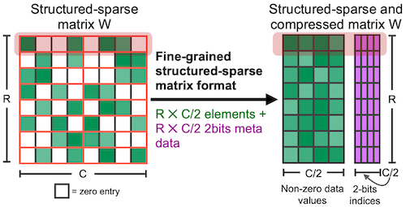
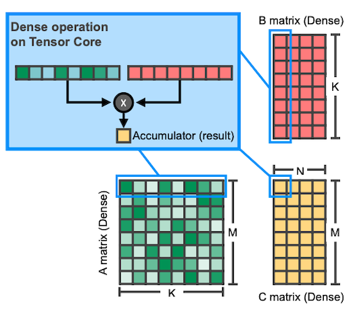
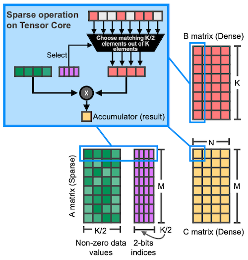
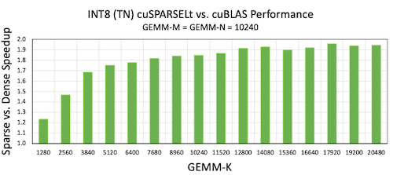

# Lecture 04 - Pruning and Sparsity (Part II)

> [Lecture 04 - Pruning and Sparsity (Part II) | MIT 6.S965](https://youtu.be/1njtOcYNAmg)

---

## 4.4 System & Hardware Support for Sparsity

추론 시 input activation과 weight 사이의 연산을 수행하게 된다. 다음 세 가지 경우를 살펴보자.

- 0 \* A = 0

  weight가 0이므로 계산할 필요가 없다.(**weight sparsity**)

  - computation 10배 감소, memory footprint 5배 감소

- W \* 0 = 0

  activation이 0이므로 계산할 필요가 없다.(**activation sparsity**)

  > ReLU activation function으로, activation sparsity가 쉽게 얻어지게 된다.(activation sparsity를 조절하기 위해 ReLU를 개조하기도 한다.)

  - computation 3배 감소

- 2.09, 1.92 $\rightarrow$ 2
  
  2.09와 1.92가 모두 2라는 동일한 값을 가리키도록 하면, weight를 훨씬 줄일 수 있다. (**weight sharing**)

  > 높은 정밀도가 필요하지 않으므로 2로 근사할 수 있다.(quantization) 

  - memory footprint 8배 감소

---

## 4.5 EIE: Efficient Inference Engine

> [EIE: Efficient Inference Engine on Compressed Deep Neural Network 논문(2016)](https://arxiv.org/abs/1602.01528)

추론 중 다음과 같은 연산을 수행한다고 하자.

$$ \bar{a} = [0 \quad a_1 \quad 0 \quad a_3] $$

```math
\begin{bmatrix} w_{0,0} && w_{0,1} && 0 && w_{0,3} \\ 0 && 0 && w_{1,2} && 0 \\ 0 && w_{2,1} && 0 && w_{2,3} \\ 0 && 0 && 0 && 0 \\ 0 && 0 && w_{4,2} && w_{4,3} \\ w_{5,0} && 0 && 0 && 0 \\ 0 && 0 && 0 && w_{6,3} \\ 0 && w_{7,1} && 0 && 0 \end{bmatrix} \begin{bmatrix} b_0 \\ b_1 \\ -b_2 \\ b_3 \\ -b_4 \\ b_5 \\ b_6 \\ -b_7 \end{bmatrix} \underset{ReLU}{\Rightarrow} \begin{bmatrix} b_0 \\ b_1 \\ 0 \\ b_3 \\ 0 \\ b_5 \\ b_6 \\ 0 \end{bmatrix}
```

먼저 위 예제를 4개의 processing element로 나눠보자.


EIE 논문에서는 초록색 processing element를 메모리에 저장할 때, sparsity를 활용하여 물리적으로 다음과 같이 mapping한다.(오직 non-zero만 저장)

- **Relative Index**

  Absolute Index 대신 Relative Index를 사용하며 메모리 사용량을 줄인다.(bits 수도 감소)

  - $w_{0,0}$ : index 0

  - $w_{0,1}$ : $w_{0,0}$ 아래 0, $w_{0,0}$ 의 바로 옆에 위치하므로, index 1

  - $w_{4,2}$ : $w_{0,1}$ 아래 0, 오른쪽 0 다음에 위치하므로, index 2

  - $w_{0,3}$ , $w_{4,3}$ : 중간에 0 없이 바로 위치하므로 index 0 

- Column Pointer

  - starting point $w_{0,0}$ 를 기준으로 몇 번째 column에 위치하는지 정보를 나타낸다. 

| virtual weight | $w_{0,0}$ | $w_{0,1}$ | $w_{4,2}$ | $w_{0,3}$ | $w_{4,3}$ |
| :---: | :---: | :---: | :---: | :---: | :---: |
| Relative Index | 0 | 1 | 2 | 0 | 0 |
| Column Pointer | 0 | 1 | 2 | 3 | 5 |

> 이러한 format을 **CSC format**(Compressed Sparse Column)으로 지칭한다.

---

### 4.5.1 Dataflow

- activation 0

  skip

  

- activation $a_1$

  broadcast 후 parallel하게 연산한다.

  

  

- activation 0

  

- activation $a_3$

  broadcast 후 parallel하게 연산한다.

  

  

끝나면 다음 cycle로 가중치 행렬의 아래 부분 연산도 수행한다. 결과를 모두 얻은 뒤 update를 수행한다.

---

### 4.5.2 Micro Architecture for each PE

각 PE는 다음과 같은 과정을 거쳐서 연산을 가속하여 수행하게 된다.


흐름도를 단계별로 파악해 보자.

- **Activation Sparsity**: zero/non-zero인지 검사한다.

  non-zero일 경우, weight와 연산하게 된다.

  

- **Weight Sparsity**: non-zero weight 위치 정보를 register에 전달한다.

  

- **ALU**: weight decoding 수행 및 address를 계산한다.

  > quantization과 관련된 자세한 내용은 lec05 참조

  - quantized weight를 decoding한다.

  - relative index 정보를 바탕으로 absolute address를 계산한다.(address accumulate)

  

- **ALU**: 연산을 수행한다.

  activation과 decoded weight의 연산을 수행한다.

  

- **Write Back**: SRAM에 output을 저장한다.

  ALU로 계산한 absolute address에 연산 결과를 저장한다.

  

- **ReLU**, **Non-zero Detection**

  ReLU 연산을 수행하고, Non-zero 값을 찾아낸다.(next stage에서 활용)

  

---

### 4.5.3 Benchmark, Pros and Cons of EIE

> [Retrospective: EIE: Efficient Inference Engine on Sparse and Compressed Neural Network 논문(2023)](https://arxiv.org/abs/2306.09552)

weight 혹은 activation 중 하나만 0이어도 연산을 수행하지 않기 때문에, FLOP Reduction이 굉장히 크다.


2023년 Retrospective: EIE 논문에서는, EIE의 장단점을 다음과 같이 요약하고 있다. 먼저 장점은 다음과 같다.

- (+) sparse operations에 특화된 hardware 사용 시, (dense와 비교하여) 최대 50% 수준의 효율을 얻을 수 있다.

- (+) weight, activation sparsity를 동시에 고려하여 연산과 에너지 효율을 극대화한다.

- (+) fine-grained sparsity를 지원한다.

- (+) EIE는 weights를 16bit로 decode 후 16bit 연산을 하는데, 이는 INT4까지 aggressive하게 양자화한 모델과 궁합이 좋다.(W4A16)

하지만 EIE는 대표적으로 **load imbalance** 문제와, 다음과 같은 단점을 가지고 있다.

- (-) structured sparsity를 효율적으로 활용하지 못한다.

  따라서 vector processor와 궁합이 좋지 않다.

- (-) control flow 면에서 다른 기법과 비교 시, overhead, storage overhead가 크다.

- (-) FC layers에서만 지원하므로, LLM을 지원하는 EIE가 필요하다.

- (-) SRAM에 초점을 두고 있어서, TinyML에는 유리하나 LLM에는 적합하지 않다.

---

## 4.6 NVIDIA Tensor core: M:N Weight Sparsity

> [Accelerating Sparse Deep Neural Networks 논문(2021)](https://arxiv.org/abs/2104.08378)

NVIDIA (A100 이상) GPU의 tensor core에서 지원하는 M:N sparsity를 알아보자. 다음은 4개 elements마다 최대 2개의 non-zero를 지원하는 2:4 sparsity의 예시다.



1. 행렬을 1x4의 벡터로 나눈다.

2. 4개 원소 중 2개의 원소를 0으로 pruning한다.

    threshold를 기준으로 판단하는데, 기준에 맞는 원소가 부족해도, 혹은 더 많아도 두 개 원소를 0으로 만든다.

3. 나머지 2개 non-zero element 위치를 2bit index로 나타낸다.

이러한 sparse matrix의 GEMM 연산을, 일반 dense matrix 연산과 비교해 보자.

- dense matrix GEMM

  

- sparse matrix GEMM

  

---

### 4.6.1 Benchmark of M:N Sparsity

M:N Sparsity를 살펴보자.

- speedup

  matrix size가 클수록 speedup도 커진다.

  

- accuracy(FP16, INT8 quantization)

  

---
