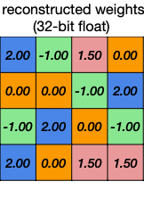
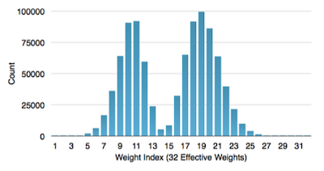
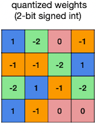
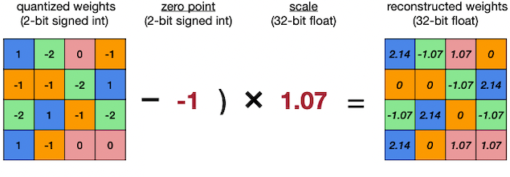

# Lecture 05 - Quantization (Part I)

> [Lecture 05 - Quantization (Part I) | MIT 6.S965](https://youtu.be/91stHPsxwig)

> [EfficientML.ai Lecture 5 - Quantization (Part I) (MIT 6.5940, Fall 2023, Zoom recording)](https://youtu.be/MK4k64vY3xo?si=ouUP5R86zYN7XPsS)

> [A White Paper on Neural Network Quantization](https://arxiv.org/abs/2106.08295)

> [tinyML Talks: A Practical Guide to Neural Network Quantization](https://youtu.be/KASuxB3XoYQ)

---

## 5.1 Numeric Data Types

---

### 5.1.1 Integer

우선 **integer**(정수)를 8bit로 표현한 세 가지 예시를 살펴보자. 


- 첫 번째: unsigned integer

  range: $[0, 2^{n} - 1]$

- 두 번째: (signed integer) Sign-Magnitude

  range: $[-2^{n-1} - 1, 2^{n-1} - 1]$

   > 00000000과 10000000은 모두 0을 표현한다.

- 세 번째: (signed integer) 2-bit complement Representation

  range: $[-2^{n-1}, 2^{n-1} - 1]$

   > 00000000은 0, 10000000은 $-2^{n-1}$ 을 표현한다.

---

### 5.1.2 fixed-point number

소수(**decimal**)를 표현하는 방식은 두 가지가 있다.

- **fixed-point number**(고정 소수점 연산)

- **floating-point number**(부동 소수점 연산)

아래는 8bit fixed-point number를 나타낸 그림이다.


- 맨 앞 1bit는 sign bit로 사용한다.

- 3bits로 integer(정수)를 표현한다.

- 4bits로 fraction(소수)을 표현한다.

> 두 번째와 세 번째 연산의 차이: 소수점( $2^{-4}$ ) 의 위치를 나중에 곱하였다.

위와 같은 예시를 `fixed<w,b>`로 표현할 수 있다. `w`가 총 bit width, `b`가 fraction bit width이다.

> 32bit 예시: 1bit sign bit, 15bit integer, 16bit fraction

---

### 5.1.3 floating-point number

다음은 32bit **floating-point** number의 예시다.(가장 보편적인 **IEEE 754** 방법)


$$ (-1)^{sign} \times (1 + \mathrm{Fraction}) \times 2^{\mathrm{Exponent} - 1} $$

- sign: 부호를 나타내는 1bit

- **exponent**: 지수를 나타내는 8bit

- fraction(mantissa): 가수를 나타내는 23bit

> 32bit(4byte)는 single precision(단정도), 64bit(8byte)는 double precision(배정도)이다.

### <span style='background-color: #393E46; color: #F7F7F7'>&nbsp;&nbsp;&nbsp;📝 예제 1: IEEE 754 표준에 따라 숫자 표현하기 &nbsp;&nbsp;&nbsp;</span>

숫자 -314.625를 IEEE 754 표준에 따라 표현하라.

### <span style='background-color: #C2B2B2; color: #F7F7F7'>&nbsp;&nbsp;&nbsp;🔍 풀이&nbsp;&nbsp;&nbsp;</span>

1. 음수이므로 **sign bit**는 1이다.

2. **fraction**

    -314.625의 절댓값 $314.625$ 를 2진수로 변환하면 ${100111010.101}_{(2)}$ 가 된다.

    - 소수점을 옮겨서 일의 자리 수, 소수점 형태로 만든다. 
    
    - 소수점 부분만을 fraction 23bit 부분에 맨 앞부터 채운다.

      > 남는 자리는  0으로 채운다.

$$ 1.00111010101 \times 2^{8} $$

3. **exponent**

    bias를 계산해야 한다. (bias = $2^{k-1}$ )
    
    - $k$ : exponent 부분의 bit 수를 나타낸다. 
    
    $$2^{8-1} = 127$$

    8 + 127 = 135를 2진수로 변환하면 ${10000111}_{(2)}$ 이 된다.

    - 변환한 2진수를 8bit exponent 부분에 채워준다.

결과는 다음과 같다.

| sign bit | exponent | fraction |
| :---: | :---: | :---: | 
| 1 | 10000111 | 00111010101000000000000 | 

---

### 5.1.4 floating-point number comparison

다양한 floating-point number 표현법을 비교해보자. 특히 neural network에서는 <U>fraction보다도 exponent에 더 민감</U>하기 떄문에, exponent 정보를 최대한 보존하는 표현법이 등장했다.

- underflow, overflow, NaN을 더 잘 처리하기 위해서는, exponent을 최대한 보존하여 정확도를 유지해야 한다.

- 더 작은 bit를 사용하면서 memory, latency는 줄이고, accuracy는 최대한 보존하는 것이 목표.


- **Half Precision**(FP16)

    exponent 5 bit, fraction은 10 bit

- Brain Float(BF16)

    IEEE FP32와 비교했을 때, exponent 7bit로 줄였지만 fraction은 8bit로 유지했다. 

- TensorFloat(TF32)
    
    exponent 10bit, fraction 8bit이다. 
    
    > FP16과 동일한 exponent(10bit), FP32와 동일한 fraction(8bit)를 지원한다.

    > BERT 모델에서 TF32 V100을 이용한 학습이, FP32 A100을 이용한 학습에 비해 6배 speedup을 달성했다.

---

## 5.2 Quantization


continuous 혹은 large set of values 특성을 가진 연속적인 입력을 discrete set으로 변환하는 것을 **quantization**(양자화)라고 지칭한다.


다음은 quantization을 통해 얻을 수 있는 몇 가지 이점이다.

- memory usage

- power consumption

- latency

- silicon area

---

### 5.2.1 Quantization in Neural Networks

신경망은 다음과 같은 특징을 갖기 때문에, quantization을 적용하기 적합하다.

- training, inference: computationally intensive하다. 

- modern neural networks: over-parameterized하다.

  따라서 정확도 손실 없이도 bit precision을 줄일 여지가 있다.

네트워크에 quantization을 적용하기 전/후의 weight 분포 차이를 살펴보자. continuous space가 discrete space로 매핑된다.


> 이후 fine-tuning 시 분포가 변하게 된다.

---

### 5.2.2 Matrix operations with quantized weights

우선 $WX + b$ 꼴의 행렬 연산이 하드웨어에서 어떻게 진행되는지 살펴보자.

```math
W = \begin{bmatrix} 0.97 & 0.64 & 0.74 & 1.00 \\ 0.58 & 0.84 & 0.84 & 0.81 \\ 0.00 & 0.18 & 0.90 & 0.28 \\ 0.57 & 0.96 & 0.80 & 0.81 \end{bmatrix} \quad X = \begin{bmatrix} 0.41 & 0.25 & 0.73 & 0.66 \\ 0.00 & 0.41 & 0.41 & 0.57 \\ 0.42 & 0.24 & 0.71 & 1.00 \\ 0.39 & 0.82 & 0.17 & 0.35 \end{bmatrix} \quad b = \begin{bmatrix} 0.1 \\ 0.2 \\ 0.3 \\ 0.4 \end{bmatrix}
```

아래 그림은 MAC 연산을 수행하는 array를 표현한 예시다.


$$ A_{i} = \sum_{j}{C_{i,j}} + b_i $$

$$ A_{i} = W_i \cdot \mathrm{x_1} + W_i \cdot \mathrm{x_2} + W_i \cdot \mathrm{x_3} + W_i \cdot \mathrm{x_4} $$

1. $C_{i,j}$ 자리에 먼저 행렬 $W$ 값을 load한다.

2. 한 사이클마다 행렬 $X$ 에서 다음 input value를 가져온다.

```math
\begin{bmatrix} 0.41 \\ 0.00 \\ 0.42 \\ 0.39 \end{bmatrix}
```

3. 연산 후 행렬 $X$ 의 다음 열을 가져와서 순차적으로 계산한다.

그런데 이 과정에 **weight, bias quantization**을 추가하면 어떻게 될까?

1. floating-point tensor 대신 **scaling factor** $s_{X}$ 가 곱해진 형태의 integer tensor 를 사용한다.

```math
X_{fp32} \approx s_{X}X_{int} = \hat{X}
```

```math
\hat{X} = {{1} \over {255}} \begin{bmatrix} 105 & 64 & 186 & 168 \\ 0 & 105 & 105 & 145 \\ 107 & 61 & 181 & 255 \\ 99 & 209 & 43 & 89 \end{bmatrix}
```

- $\hat{X}$ : scaled quantized tensor

- **최소값 0→0**, **최대값 1.00→255**, `uint8` 타입으로 매핑되었다.

2. weight tensor도 scaling factor $s_{W}$ 를 곱한 integer tensor를 사용한다.

```math
W = \begin{bmatrix} 0.97 & 0.64 & 0.74 & 1.00 \\ 0.58 & 0.84 & 0.84 & 0.81 \\ 0.00 & 0.18 & 0.90 & 0.28 \\ 0.57 & 0.96 & 0.80 & 0.81 \end{bmatrix} \approx {{1} \over {255}}\begin{bmatrix} 247 & 163 & 189 & 255 \\ 148 & 214 & 214 & 207 \\ 0 & 46 & 229 & 71 \\ 145 & 245 & 204 & 207 \end{bmatrix} = s_{W}W_{uint8}
```

3. bias tensor는 `int32` 타입으로 매핑된다.

```math
\hat{b} = {{1} \over {255^2}}\begin{bmatrix} 650 \\ 1300 \\ 1951 \\ 650 \end{bmatrix} 
```

-  **overflow**를 피하기 위해서는 이처럼 <U>더 큰 bit width를 사용</U>해야 한다.

- $\hat{W}, \hat{X}$ 가 가지고 있는 ${{1} \over {255}}$ 가 서로 곱해지면 ${{1} \over {255^2}}$ 가 되므로, quantized bias $\hat{b}$ 는 scaling factor로 ${{1} \over {255^2}}$ 를 사용한다.

이제 실제 연산 과정을 보자. 우선 $\hat{W}, \hat{X}$ 에서 scaling factor를 제외한 값을 행렬 연산 한 뒤에, 결과값에 ${{1} \over {255^2}}$ 를 곱해서 scale을 다시 맞춰준다.


하지만 이렇게 얻은 `int32` activation 값을 이보다 더 낮은 정밀도인 `int8`로 바꾸고 싶다. 이것이 **activation quantization**이며, 다음과 같이 결과값 $\hat{Out}$ 을 `uint8`로 양자화할 수 있다.

```math
\hat{Out} = {{1} \over {136671 \cdot 255}} \begin{bmatrix} 134 & 185 & 206 & 255 \\ 111 & 167 & 186 & 242 \\ 60 & 65 & 96 & 134 \\ 109 & 172 & 187 & 244 \end{bmatrix}
```

- 최대값 136671이 scaling factor에 쓰인 점에 주목하자.

---

### 5.2.3 Symmetric vs Asymmetric Quantization


> 위 예시의 데이터 분포에서는 symmetric signed quantization이 더 정밀하게 데이터를 표현할 수 있다.

- **symmetric quantization** (scale transform)

  - `signed int`: zero point가 0에 정확히 매핑된다.

  - `unsigned int`: zero point가 0이 아닌 위치에 매핑된다.
  
    > (+) 대표적으로 ReLU를 사용하여 output activation이 unsigned인 경우 유리하다.

- **asymmetric quantization** (affine transform)

  clipping range를 정하는 $\alpha, \beta$ 의 절댓값이 다른 양자화 방식이다.

  - (+) 데이터 분포가 대칭적이지 않을 때, 정밀하게 표현할 수 있다.

  - (-) computation overhead가 발생한다.

    > 계산속도가 더 빠른 `unsigned int`를 사용하는 편이 유리하다.

---

### 5.2.4 Uniform vs Non-uniform Quantization

quantization의 step size를 uniform(균일)하게 정하거나, non-uniform하게 정하는가에 따라서도 표현력이 달라진다.


- (a): **uniform quantization**

  - (+) 구현이 쉽다.
    
  - (-) 표현력은 non-uniform보다 떨어진다.

- (b): **non-uniform quantization**

  분포에 따라 step size가 결정된다. 
    
  - (c): **logarithmic quantization** 
    
    same storage에서 더 넓은 범위의 값의 표현이 가능하다.

$$ Q(x) = Sign(x)2^{round(\log_{2}|x|)} $$

---

## 5.3 How Many Bits to Quantize Weights?

그렇다면 양자화 시 bit width는 어느 정도가 적당할까? 다음은 CNN의 convolution, Fully-Connected layer를 여러 bit width로 양자화했을 때, 정확도 변화를 나타낸 도표를 살펴보자.


- Conv layer: 4bits까지 정확도 유지

- FC layer: 2bits까지 정확도 유지

대표적인 CNN 모델에서 Conv, FC layer이 갖는 비중은 다음과 같다.


---

## 5.4 Deep Compression

> [Deep Compression: Compressing Deep Neural Networks with Pruning, Trained Quantization and Huffman Coding 논문(2015)](https://arxiv.org/abs/1510.00149)

> [Deep Compression 논문 리뷰](https://velog.io/@woojinn8/LightWeight-Deep-Learning-3.-Deep-Compression-%EB%A6%AC%EB%B7%B0)

Deep Compression 논문에서는, pruning과 weight quantization(+ Huffman coding)을 통해 모델의 크기를 획기적으로 줄이는 방법을 제안했다. 


- Pruning

- Quantization(K-Means-based Quantization)

- Huffman Encoding

아래는 해당 논문에서, 방법별 AlexNet model size의 변화를 비교한 도표이다.


- 가로: Compression Ratio, 세로: Accuracy loss

- Pruning + Quantization을 함께 적용하는 방법이 더 우수하다.

---

### 5.4.1 K-Means-based Weight Quantization

Deep Compression 논문은 **K-Means-based weight quantization** 방식으로 weight quantization을 수행한다. 

> non-uniform quantization의 일종으로 볼 수 있다.(quantization level 수 = cluster 수)

> 비슷하게 Computer Graphics에서는 65536개의 스펙트럼으로 이루어진 원래 색상을, 256개 bucket을 갖는 codebook을 만들어서 양자화한다.

- storage: **Integer** Weights, Floating-Point Codebook

  - codebook(centroids): 아래 예시에서는 FP32 bucket 4개로 구성된다. 
  
  - cluster index: bucket이 4개 있으므로 2bit만 사용하면 충분하다.

- computation: Floating-Point Arithmetic

| Weights<br/>(FP32 x 16) | 압축 | cluster index(INT2 x 16)<br/>centroids (FP32 x 4)| 추론 | Reconstructed<br/>(FP32 x 16) |
| :---: | :---: | :---: | :---: | :---: |
|  | → |  | → |   |

### <span style='background-color: #393E46; color: #F7F7F7'>&nbsp;&nbsp;&nbsp;📝 예제 2: K-Means-based Quantization의 메모리 사용량 &nbsp;&nbsp;&nbsp;</span>

위 예시 그림에서 K-Means-based Quantization 이전/이후 사용하는 메모리 사용량을 계산하라.

### <span style='background-color: #C2B2B2; color: #F7F7F7'>&nbsp;&nbsp;&nbsp;🔍 풀이&nbsp;&nbsp;&nbsp;</span>

- 양자화 전 

  weight matrix: FP32 x 16

  $$32 \times (4 \times 4) = 512 \, \mathrm{bits} = 64 \, \mathrm{bytes} $$

- 양자화 후

  - weight matrix: INT2 x 16

  $$2 \times (4 \times 4) = 32 \, \mathrm{bits} = 4 \, \mathrm{bytes} $$
    
  - codebook: FP32 x 4

  $$32 \times (1 \times 4) = 128 \, \mathrm{bits} = 16 \, \mathrm{bytes} $$

따라서 양자화 전 필요한 메모리 사용량은 64 bytes, 양자화 후 필요한 메모리 사용량은 20 bytes이다.(3.2배 사용량 감소) 

> weight tensor가 크면 클수록, 가중치의 메모리 사용량 감소 효과가 더 커진다.

---

### 5.4.2 K-Means-based Quantization Error

위 예시에서 weight를 다시 reconstruct(decode)한 뒤, error를 계산해 보자.

| 양자화 전 | Decompressed | Error |
| :---: | :---: | :---: |
|  |  | <br> |

이처럼 quantization 시 발생하는 error는, centroids(codebook)을 fine-tuning하며 줄일 수 있다.


1. cluster index에 따라 quantization error를 분류한다.

2. 평균 error를 구한다.

3. centroids를 업데이트한다.

---

### 5.4.3 K-Means-based Quantization Limitations

그러나 K-Means-based weight quantization은 다음과 같은 한계를 갖는다.

- (-) 연산에서 다시 floating point로 reconstruct된다.

- (-) reconstruction 과정에서 time complexity, computation overhead가 크다.

- (-) weight가 메모리에서 연속적이지 않기 떄문에, memory access에서 긴 지연이 발생하게 된다.

- (-) activation은 입력에 따라 다양하게 변하기 때문에, actiavation quantization으로 clustering-based approach는 적합하지 않다.

---

### 5.4.4 Huffman Coding

추가로 **Huffman Coding** 알고리즘을 적용하여 memory usage를 더 줄일 수 있다.

> Unix의 파일 압축, JPEG, MP3 압축에서 주로 사용된다.

> Encoding의 분류는 크게 두 가지로 나뉜다. 고정된 길이로 encode하는 RLC(Run Length Coding), 가변 길이로 encode하는 VLC(Variable Length Coding). Huffman Coding은 대표적인 VLC에 해당된다.



- frequent weights: bit 수를 적게 사용해서 표현한다.

- In-frequent weights: bit 수를 많이 사용해서 표현한다.

### <span style='background-color: #393E46; color: #F7F7F7'>&nbsp;&nbsp;&nbsp;📝 예제 2: Huffman Coding &nbsp;&nbsp;&nbsp;</span>

a, b, c 알파벳을 Huffman Coding을 이용해 압축하라.

> ASCII code로 표현하려고 한다면 INT8 x 3으로 24bits를 사용해야 한다. 하지만 Huffman coding을 적용하여 메모리 사용량을 줄일 수 있다. 

### <span style='background-color: #C2B2B2; color: #F7F7F7'>&nbsp;&nbsp;&nbsp;🔍 풀이&nbsp;&nbsp;&nbsp;</span>

a, b, c를 다음과 같이 압축하여 정의했다고 하자.

- Try 1
  
    | a | b | c |
    | :---: | :---: | :---: |
    | 01 | 101 | 010 |

   $\rightarrow$ a와 c의 접두어 부분(`01`)이 겹치기 때문에 VLC로 압축할 수 없다.

- Try 2

    | a | b | c |
    | :---: | :---: | :---: |
    | 01 | 10 | 111 |

   $\rightarrow$ 겹치는 접두어가 없기 때문에, `01 10 111` = 총 7bits로 압축할 수 있다.

---

## 5.5 Linear Quantization

K-means-based quantization과 다르게, 일정한 step size를 갖는 **Linear Quantization** 방법을 살펴보자. 앞서 K-means-based quantization 예제에 linear quantization을 적용 시 다음과 같다.

- integer $q \rightarrow$ real $r$ 의 affine mapping으로 볼 수 있다.

  - $Z$ : Zero points

  - $S$ : Scaling factor

$$ r = S(q-Z) $$

| Weights<br/>(FP32 x 16) |  | Quantized Weights<br/>(INT2) |  | Reconstruction<br/>(FP32 x 16) |
| :---: | :---: | :---: | :---: | :---: |
|  | → |  | → |   |

---

### 5.5.1 Zero Point, Scaling Factor

zero point $Z$ , scaling factor $S$ 를 계산해 보자.


1. 먼저 양자화를 적용할 floating-point range를 정한다.

    - $r_{min}$ : real number $r$ 최소값

    - $r_{max}$ : real number $q$ 최대값

2. integer clipping range를 정한다.

    - $q_{min}$ : integer $q$ 최소값

    - $q_{max}$ : integer $q$ 최대값

3. 다음 식을 계산하여 zero point, scaling factor를 구한다.

    - $r_{max} = S(q_{max} - Z)$

    - $r_{min} = S(q_{min} - Z)$

이떄 두 식을 조합하여 scaling factor에 대한 식으로 변환할 수 있다.

$$ S = {{r_{max} - r_{min}} \over {q_{max} - q_{min}}} $$

### <span style='background-color: #393E46; color: #F7F7F7'>&nbsp;&nbsp;&nbsp;📝 예제 3: linear quantization &nbsp;&nbsp;&nbsp;</span>

다음 weight matrix에서 zero point, scaling factor 값을 구하라.


### <span style='background-color: #C2B2B2; color: #F7F7F7'>&nbsp;&nbsp;&nbsp;🔍 풀이&nbsp;&nbsp;&nbsp;</span>

예시 행렬에서 다음과 같은 값들을 구할 수 있다.

- $r_{min}, r_{max} = [-1.08, 2.12]$

- $q_{min}, q_{max} = [-2, 1]$

위 값을 가지고 scaling factor $S$ 를 계산할 수 있다.

$$ S = {{2.12 - (-1.08)} \over {1 - (-2)}} = 1.07 $$

$r_{min}$ 혹은 $r_{max}$ 방정식에 $S$ 를 대입하면, zero point $Z$ 를 구할 수 있다. 이때 $Z$ 가 정수가 되도록 round(반올림) 연산을 적용해야 한다.

$$ Z = \mathrm{round}{\left( q_{min} - {{r_{min}} \over S} \right)} = \mathrm{round}{\left( -2 - {{-1.08} \over {1.07}} \right)} = 1 $$

---

### 5.5.2 Sources of quantization error

linear quantization error와, 이를 발생시키는 원인을 알아보자. 다음은 linear quantization을 나타내는 그림이다.


- 다음과 같은 서로 다른 값이 동일한 integer domain grid에 mapping된다.

  - 근접한 두 FP32 값

  - $q_{max}$ 보다 큰 FP32 outlier: $2^{b} - 1$ 로 매핑

다음은 양자화된 값을 다시 복원한 뒤 error 값을 나타낸 그림이다. 

> quantization error는 round error, clip error를 합한 값이다.


- outlier에 따른 clip error가 크다.

하지만 다음과 같이 $q_{max}$ 값이 큰 예시에서는, clip error보다 round error가 더 커지게 된다. 


- rounding에 따른 round error가 크다.

따라서 이러한 **trade-off** 관계를 고려하여 quantization range를 정할 필요가 있다.

---

## 5.6 Linear Quantized Matrix Multiplication

linear quantization 연산은 **affine mapping**(아핀변환)으로 볼 수 있다.

$$ r = S(q - Z) $$

> affine mapping: linear transform 후 translation하는 변환. non-linear transform에 해당된다.

---

### 5.6.1 Linear Quantized Fully-Connected Layer

먼저 Fully-Connected layer + linear quantization 수식을 살펴보자.

$$ Y = WX + b $$

$$ \downarrow $$

$$ S_{Y}(q_{Y} - Z_{Y}) =  S_{W}(q_{W} - Z_{W}) \cdot S_{X}(q_{X} - Z_{X}) + S_b(q_b - Z_b) $$

1. weight zero point $Z_{W} = 0$ 로 가정하면, 다음과 같이 수식이 바뀐다.

$$ S_{Y}(q_{Y} - Z_{Y}) =  S_{W}S_{X}(q_{W}q_{X} - Z_{X}q_{W})  + S_b(q_b - Z_b) $$

2. bias zero point $Z_b = 0$ , scaling factor $S_b = S_W S_X$ 로 가정하면, 다음과 같이 수식이 바뀐다.

   > 이처럼 bias, weight의 zero point가 모두 0인 경우는, symmetric quantization에 해당된다.

$$ S_{Y}(q_{Y} - Z_{Y}) =  S_{W}S_{X}(q_{W}q_{X} - Z_{X}q_{W}+ q_b) $$

3. 위 수식을 integer 출력 $q_{Y}$ 에 관한 식으로 정리하면 다음과 같다.

$$ q_{Y} = {{S_{W}S_{X}} \over {S_{Y}}}(q_{W}q_{X} + q_b - Z_{W}q_{X}) + Z_{Y} $$

4. 연산 전에 알 수 있는 항을 bias로 합쳐준다.

    > $q_b - Z_X q_W = q_{bias}$

    > Note: $q_b$ , $q_{bias}$ 모두 32 bits integer이다.

$$ q_{Y} = {{S_{W}S_{X}} \over {S_{Y}}}(q_{W}q_{X} + q_{bias}) + Z_{Y} $$

이제 나머지 항이 어떤 연산인지 살펴보자.

$(1) \quad {{S_{W}S_{X}} \over {S_{Y}}} = 2^{-n}M_{0}$

- bit shift( $2^{-n}$ )와 fixed point 곱셈 ( $M_0$ )으로 볼 수 있다. ( $M_0 \in [0.5, 1)$ )

  - INT32를 N-bit integer로, 다시 rescale하는 역할을 한다.

  - 언제나 $(0, 1)$ 사이의 값을 갖는다.

$(2) \quad q_{W}q_{X} + q_{bias}$

- N-bit integer 곱셈 후, 32-bit integer 덧셈을 수행한다.

$(3) \quad Z_{Y}$

- N-bit integer 덧셈을 수행한다.

---

### 5.6.2 Linear Quantized Convolution Layer

$$ Y = \mathrm{Conv} (W, X) + b $$

$$ \downarrow $$

$$ q_{Y} = {{S_{W}S_{X}} \over {S_{Y}}}(\mathrm{Conv}(q_{W}, q_{X}) + q_{bias}) + Z_{Y} $$

각 항이 어떤 연산인지 살펴보자.

$(1) \quad {{S_{W}S_{X}} \over {S_{Y}}}$

- bit shift( $2^{-n}$ )와 fixed point 곱셈 ( $M_0$ )으로 볼 수 있다. ( $M_0 \in [0.5, 1)$ )

  - INT32를 N-bit integer로, 다시 rescale하는 역할을 한다.

$(2) \quad \mathrm{Conv}(q_{W}q_{X}) + q_{bias}$

-  N-bit integer 곱셈. 32-bit integer 덧셈을 수행한다.

$(3) \quad Z_{Y}$

- N-bit integer 덧셈을 수행한다.

위 연산을 그래프로 그리면 다음과 같이 나타낼 수 있다.


---

## 5.7 Simulated Quantization

하지만 fixed-point operation을 미리 general purpose hardware(예: CPU, GPU)로 시뮬레이션할 수 있다면 다양한 quantization scheme을 실험해 볼 수 있다.

> GPU 가속을 이용해 다양한 조건의 양자화를 검증할 수 있다.

이러한 시뮬레이션이 가능하게끔 딥러닝 프레임워크에서 quantization operations(**quantizer**)를 제공하고 있다.


- 좌측: fixed-point operations을 이용한 quantized on-device inference

- 우측: floating-point operations을 이용한 **simulated quantization**

---