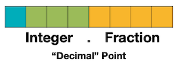
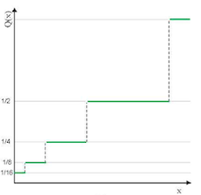
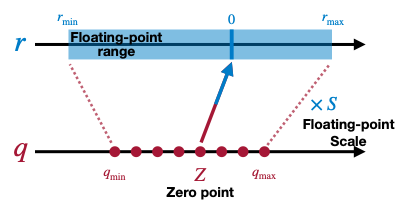
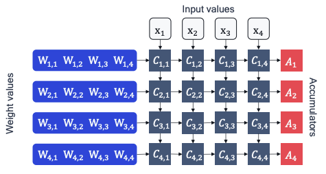

# Lecture 05 - Quantization (Part I)

> [Lecture 05 - Quantization (Part I) | MIT 6.S965](https://youtu.be/91stHPsxwig)

> [EfficientML.ai Lecture 5 - Quantization (Part I) (MIT 6.5940, Fall 2023, Zoom recording)](https://youtu.be/MK4k64vY3xo?si=ouUP5R86zYN7XPsS)

> [A White Paper on Neural Network Quantization](https://arxiv.org/abs/2106.08295)

continuous signal(input)을 discrete set으로 변환하는 테크닉을 **quantization**(양자화)라고 지칭한다.

| Before Quantization | After Quantization |
| :---: | :---: |
|  |  |

다음은 양자화를 통해 이득을 얻을 수 있는 대표적인 예시다.

- memory usage

- power consumption

- latency

- silicon area

> 특히 modern neural networks은 (1) over-parameterized되어 있고, (2) computationally intensive하기 때문에 양자화를 통해 얻을 수 있는 이득이 크다.

---

## 5.1 Numeric Data Types

---

### 5.1.1 Integer

다음은 여러 정수 데이터 타입을 이용하여, 10진수 49(혹은 -49)를 8-bit Integer(**INT8**)로 표현한 예시다.

- **Unsigned Integer**

  n-bit range: $[0, 2^{n} - 1]$

  

- **Signed Integer** (**Sign-Magnitude**)

  n-bit range: $[-2^{n-1} - 1, 2^{n-1} - 1]$

  > $00000000_{(2)} = 10000000_{(2)} = 0$

  

- **Signed Integer** (**Two's Complement Representation**)

  range: $[-2^{n-1}, 2^{n-1} - 1]$

  > $00000000_{(2)} = 0$ , $10000000_{(2)} = -2^{n-1}$ 

  

---

### 5.1.2 Fixed-Point Number

> 구현의 핵심은 **shift 연산**으로, 1bit 우측 이동은 정수에 2를 나눈 것과 유사하고, 1bit 좌측 이동은 정수에 2를 곱한 것과 유사하다.

소수의 표현은, 크게 **fixed-point number**(고정 소수점 연산)과 **floating-point number**(부동 소수점 연산) 두 가지 방식으로 나뉜다. 다음은 fixed-point number 타입을 이용해, 8bit로 소수를 나타내는 방식을 설명한 그림이다.

- `fixed<8,4>`(Width 8bit, Fraction 4bit)

  

  - Sign(1bit)

  - Integer(3bit)

  - Fraction(4bit)

- e.g., `unsigned fixed<8,3>`

$$ {00010.110}_{(2)} = 2 + 1 \times 2^{-1} + 1 \times 2^{-2} = 2 + 0.5 + 0.25 = 2.75_{(10)} $$

fixed-point number는 정수 표현과 매우 유사하기 때문에, **실수 연산에서 정수 연산용으로 최적화된 하드웨어를 사용**할 수 있어서, 지연시간이나 연산 비용 면에서 효율적이다.

---

### 5.1.3 Floating-Point Number (IEEE FP32)

다음은 가장 보편적인 **IEEE 754** 방식의, 32bit floating-point number를 표현한 그림이다.

- IEEE FP32

  

  - Sign(1bit)

  - Exponent(지수, 8bit)

  - Fraction(mantissa): (가수, 23bit)

  - $(-1)^{\mathsf{sign}} \times (1 + \mathsf{Fraction}) \times 2^{\mathsf{Exponent} - 127}$

    > Exponent Bias $= 127 = 2^{8-1}-1$

- e.g., IEEE FP32 0.265625 표현

  $0.265625 = (1 + 0.0625) \times 2^{125-127} = 1.0625 \times 2^{-2}$

  

---

#### 5.1.3.1 Floating-Point Number: Subnormal Numbers

만약 exponent 값이 0인 경우, **subnormal number**라고 부른다. 이를 특수한 경우로 분류하여, normal number와 다르게 계산한다.

- IEEE FP32 Subnormal Numbers

  

  - $(-1)^{\mathsf{sign}} \times \mathsf{Fraction} \times 2^{1 - 127}$

  - normal number과 다르게, **linear한 표현력**을 갖는다.

- Smallest Subnormal Numbers

  

  - $2^{-149} = 2^{-23} \times 2^{1 - 127}$

  - 이보다 더 작은 숫자를 표현할 수 없으므로 주의해야 한다.

- Largest Subnormal Numbers

  

  - $2^{-126} - 2^{-149} = (1 - 2^{-23}) \times 2^{1 - 127}$

---

#### 5.1.3.2 Floating-Point Number: Special Values

다음과 같은 두 가지 경우를 특수한 값으로 분류한다.

- Infinity 

  > Normal Numbers, Exponent $\neq$ 0

  

- NaN (Not a Number)

  > Subnormal Numbers, Fraction $=$ 0

  

---

#### 5.1.3.3 Wastes of IEEE FP32 Conventions

하지만 이러한 IEEE FP32 방식을, 딥러닝에 적용할 때 주의해야 할 사항이 있다.


- normal values 범위는 exponential한 반면, subnormal values 범위는 linear하다.

- (-) 범위 표현에서 낭비가 발생한다.(special values)

---

### 5.1.4 Floating-Point Number Formats for Deep Learning

> [FP8 Formats for Deep Learning 논문(2022)](https://arxiv.org/abs/2209.05433)

> [Qualcomm Blog: The future of model efficiency for edge AI](https://www.qualcomm.com/news/onq/2022/09/the-future-of-model-efficiency-for-edge-ai)

다음은 딥러닝 학습을 위해 등장한 format이 공통적으로 고려한 특징이다.

- Fraction Width vs Exponent Width

  딥러닝은 exponent width에 더 민감하다.

  - Exponent Width $\rightarrow$ Dynamic Range

  - Fraction Width $\rightarrow$ Precision

- 근래 거대 모델의 학습 비용은 너무 크다.

  작은 bit width를 사용하여 학습 효율은 높이면서, 정확도는 보존할 필요가 있다.

초기에는 **half presicion**(16bit)를 이용하며, exponent bit width를 보다 크게 가지는 format이 등장하기 시작했다.

| | Exponent<br/>(bits) | Fraction<br/>(bits) | Total<br/>(bits) |
| --- | :---: | :---: | :---: |
|  | 8 | 23 | 32 |
|  | 5 | 10 | 16 |
|  | **8** | 7 | 16 |

이후 연구가 진행되면서 NVIDIA에서는 이보다 작은 FP8 format을 제안하게 된다.

| | Exponent<br/>(bits) | Fraction<br/>(bits) | Total<br/>(bits) |
| --- | :---: | :---: | :---: |
|  | 4 | 3 | 8 |
|  | 5 | 2 | 8 |

> 하지만 2022년 Qualcomm 연구에 따르면, edge AI 도메인의 추론에서는 FP8 포맷이 하드웨어 효율성에서 단점을 가질 뿐만 아니라, 정확도 면에서도 INT8 포맷보다 나쁜 성능을 보였다.

---

### 5.1.5 INT4 and FP4

근래 더 나아가 거대한 모델의 크기를 더 압축하기 위한 INT4, FP4 포맷이 등장했다.

| | Range<br/>(Positive Numbers) | 
| --- | :---: | 
|  |  | 
|  |  | 
|  |  | 
|  |  | 

- INT4: centroid 사이 distance가 모두 동일하다.

---

## 5.2 Uniform vs Non-uniform Quantization

step size를 어떻게 정하는가에 따라 양자화를 분류할 수 있다.

|| Uniform | Non-Uniform | Non-Uniform<br/>(Logarithmic) |
| :---: | :---: | :---: | :---: |
||  |  |  | 
| 장점 | 동일한 step size로 구현이 쉽다 | 표현력이 우수하다. | 효율적으로 넓은 범위를 표현한다. |

- **Uniform Quantization**

$$ Q(r) = \mathrm{Int}(r/S) - Z $$

- **Non-Uniform Quantization**

```math
Q(r) = X_i, \quad r \in [{\triangle}_i , {\triangle}_{i+1})
```

- Non-Uniform Quantization: **Logarithmic Quantization** 
    
$$Q(r) = Sign(r)2^{round(\log_{2}|r|)}$$

---

## 5.3 Linear Quantization

대표적인 uniform quantization에 해당되는 **Linear Quantization**을 살펴보자. 다음 양자화는 정수 $q$ 를 실수 $r$ 로 affine mapping하는 과정에 해당된다.



$$ r = S(q-Z) $$

- $Z$ : Zero points

- $S$ : Scaling factor

linear quantization은 다음과 같은 순서로 진행된다.

1. <span style="background-color:#3DB7CC">floating-point range</span>  $r_{min}$ , $r_{max}$ 를 정한다.

2. <span style="background-color:#980000">integer range</span>  $q_{min}$ , $q_{max}$ 를 정한다.

3. zero point $Z$ , scaling factor $S$ 를 정한다.

이때 scaling factor $S$ 는 1과 2에서 정의한 범위의 비율로 정의된다.

$$r_{max} = S(q_{max} - Z), \ r_{min} = S(q_{min} - Z)$$

$$ \downarrow $$

$$ S = {{r_{max} - r_{min}} \over {q_{max} - q_{min}}} $$

---

## 5.4 Matrix Operations with Quantized Weights

> [Quantization and Training of Neural Networks for Efficient Integer-Arithmetic-Only Inference 논문(2017)](https://arxiv.org/abs/1712.05877)

> [tinyML Talks: A Practical Guide to Neural Network Quantization](https://youtu.be/KASuxB3XoYQ)

$WX + b$ 형태의 양자화된 행렬 연산이, 하드웨어에서 어떻게 수행되는지 살펴볼 것이다. 우선 양자화 이전의 MAC array에서 어떻게 연산이 수행되는지 살펴보자.

```math
W = \begin{bmatrix} 0.97 & 0.64 & 0.74 & 1.00 \\ 0.58 & 0.84 & 0.84 & 0.81 \\ 0.00 & 0.18 & 0.90 & 0.28 \\ 0.57 & 0.96 & 0.80 & 0.81 \end{bmatrix} \quad X = \begin{bmatrix} 0.41 & 0.25 & 0.73 & 0.66 \\ 0.00 & 0.41 & 0.41 & 0.57 \\ 0.42 & 0.24 & 0.71 & 1.00 \\ 0.39 & 0.82 & 0.17 & 0.35 \end{bmatrix} \quad b = \begin{bmatrix} 0.1 \\ 0.2 \\ 0.3 \\ 0.4 \end{bmatrix}
```



$$ A_{i} = \sum_{j}{C_{i,j}} + b_i $$

$$ A_{i} = W_{i,1} \cdot \mathrm{x_1} + W_{i,2} \cdot \mathrm{x_2} + W_{i,3} \cdot \mathrm{x_3} + W_{i,4} \cdot \mathrm{x_4} $$

연산은 다음과 같은 과정으로 진행된다.

1. $C_{i,j}$ : 가중치 $W_{i,j}$ 값을 load한다.

2. 1 cycle마다 입력 텐서 $X$ 에서, input value를 가져온다.

  예시 행렬이면, 첫 cycle은 다음과 같은 input value를 가져오게 된다.

```math
\begin{bmatrix} 0.41 \\ 0.00 \\ 0.42 \\ 0.39 \end{bmatrix}
```

하지만, 양자화 과정을 고려했을 때 연산 과정은 달라지게 된다.

---

### 5.4.1 Integer-Arithmetic-Only Inference

다음은 unsigned INT8로 양자화된 입력 텐서 $\hat{X}$ 와, 마찬가지로 unsigned INT8로 양자화된 가중치 $\hat{W}$ 의 연산 과정을 나타낸 그림이다.

> 정확도 유지를 위해, 일부는 32bit 정수로 양자화된다.(e.g., bias vector)


- Input Tensor 

  - $\hat{X}$ : scaled quantized tensor

  - 아래는 **min 0→int 0**, **max 1.00→int 255**로 매핑한 예시다.(`uint8`)

```math
X_{fp32} \approx s_{X}X_{int} = \hat{X}
```

```math
\hat{X} = {{1} \over {255}} \begin{bmatrix} 105 & 64 & 186 & 168 \\ 0 & 105 & 105 & 145 \\ 107 & 61 & 181 & 255 \\ 99 & 209 & 43 & 89 \end{bmatrix}
```

- Weight Matrix

```math
W_{fp32} \approx s_{W}W_{int} = \hat{W}
```

```math
\hat{W} = {{1} \over {255}}\begin{bmatrix} 247 & 163 & 189 & 255 \\ 148 & 214 & 214 & 207 \\ 0 & 46 & 229 & 71 \\ 145 & 245 & 204 & 207 \end{bmatrix}
```

- bias tensor

  - `int32` 타입으로 양자화한다.

    **overflow**를 피하기 위해, activation은 더 큰 bit width에 해당되는 32 bit를 사용해야 한다.

  - bias scaling factor: $\hat{W}, \hat{X}$ 의 scaling factor 값을 서로 곱하면 ${{1} \over {255^2}}$ 가 된다.

```math
\hat{b} = {{1} \over {255^2}}\begin{bmatrix} 650 \\ 1300 \\ 1951 \\ 650 \end{bmatrix} 
```

이후, bias까지 합산을 마치면, 다시 INT8로 양자화된 activation tensor $\hat{Out}$ 을 획득한다.

```math
\hat{Out} = {{1} \over {136671 \cdot 255}} \begin{bmatrix} 134 & 185 & 206 & 255 \\ 111 & 167 & 186 & 242 \\ 60 & 65 & 96 & 134 \\ 109 & 172 & 187 & 244 \end{bmatrix}
```

---

## 5.5 Tricks on Integer-Arithmetic-Only Inference

앞서 살펴본 양자화 추론에 숨은 트릭을 살펴보자. 먼저 간단한 예시로, 두 실수의 곱 연산 $r_3 = r_1 r_2$ 을 양자화된 버전으로 바꿀 것이다. 표기는 아래 방식을 따를 것이다.

$$ r = S(q-z) $$

- $r$ : real value

- $q$ : quantized value

먼저 $r_3 = r_1 r_2$ 을 양자화된 버전으로 바꾸면 다음과 같다.

$$ S_{Y}(q_{Y} - Z_{Y}) =  S_{W}(q_{W} - Z_{W}) \cdot S_{X}(q_{X} - Z_{X}) $$

$$ \downarrow $$ 

$$ q_{Y} = \underset{precompute}{{{S_{W}S_{X}} \over {S_{Y}}}} \left( q_{W}q_{X} - Z_{W}q_{X} \underset{Precompute}{- Z_{X}q_{W} - Z_{W}Z_{X}} \right) + Z_{Y} $$

여기서 얻을 수 있는 통찰은, 일부 항을 **offline에서 미리 계산**하여 추론 시 연산을 최적화할 수 있다는 것이다.

---

### 5.5.1 Linear Quantized Operations

앞서 살펴본 트릭을 적용하면, linear quantization operation을 추론 과정에서 다음과 같이 대체할 수 있다.

- Fully-Connected Layer

$$ Y = WX + b $$

$$ \downarrow $$

$$ q_{Y} = {{S_{W}S_{X}} \over {S_{Y}}}(q_{W}q_{X} + q_{bias}) + Z_{Y} $$

- Convolutional Layer

$$ Y = \mathrm{Conv} (W, X) + b $$

$$ \downarrow $$

$$ q_{Y} = {{S_{W}S_{X}} \over {S_{Y}}}(\mathrm{Conv}(q_{W}, q_{X}) + q_{bias}) + Z_{Y} $$

---

### 5.5.2 Normalization of Multiplier

앞서 multiplier $M$ 은 $S_1, S_2, S_3$ 으로 이루어진다. 

$$ M := {{S_1 S_2} \over {S_3}} $$

- 경험적으로 **언제나 (0,1) 사이의 값**을 갖는다.

따라서 다음과 같은 형태로 $M$ 을 $M_0$ 로 normalize하면, 실수 곱셈을 fixed-point multiplication 연산(bit shift 활용)으로 구현할 수 있다.

$$M = 2^{-n}M_0$$

- $M_0$ : $[0.5, 1)$ , $n$ : 음수가 아닌 정수

> $M_0$ 는 하드웨어에 따라서 int16이나 int32를 사용한다.

> 주의할 점으로 비트 시프트를 통한 곱셈은 대체로 효율적이나, 파이프라인화하여 최적화된 곱셈과 비교할 경우, 비용 면에서 이점은 거의 없다. (특히, bit width가 작을수록 곱셈의 비용은 그다지 크지 않다.)

---

## 5.6 Symmetric vs Asymmetric Quantization

양자화의 low precision range와 zero point에 따라서도 표현력이 달라진다.

> 아래 예시의 데이터 분포에서는, symmetric(signed) quantization가 제일 효율적이다.

> unsigned int: ReLU를 사용하는 네트워크의 activation quantization에서 특히 유용하다. 하드웨어 관점에서는 대체로 symmetric weights, asymmetric activations가 가장 효율적이다.

| | Symmetric<br/>(signed) | Symmetric<br/>(unsigned) | Asymmetric<br/>(unsigned) |
| :---: | :---: | :---: | :---: |
| |  |  |  |
| Zero Point | $Z = 0$ | $Z = 0$ | $Z \neq 0$ |
| INT8 Range | \[-128, 127\] (restricted) <br/> \[-127,127\] (full) | [0, 255] | [0, 255] |
| Matrix Transform | Scale | Scale | Affine |

> restricted range: full range보다 정확도가 떨어지지만, 연산 비용이 더 저렴하고 구현이 간단하다.(주로 특정 hardware에서 사용)

symmetric quantization과 asymmetric quantization의 대표적인 특징은 다음과 같다.

- **symmetric quantization** 

  - (+) 구현이 간단하다.

  - (+) zero point 항이 0이므로 연산이 효율적이다.

$$ WX \approx s_W s_X(W_{int}X_{int}) $$

- **asymmetric quantization**

  - (+) 데이터 분포가 대칭적이지 않을 때, 정밀하게 표현할 수 있다.

  - (-) computation overhead가 크다.

    > 따라서 계산 속도가 빠른 `unsigned int`를 주로 함께 사용한다.

$$ WX \approx \underset{same \ calculation}{s_W s_X(W_{int}X_{int})} + \underset{precompute, \ layer \ bias}{s_W s_X z_X W_{int} + s_W z_W s_X z_X} + \underset{data-dependent \ overhead}{s_W s_X z_W X_{int}} $$

---

## 5.7 Sources of Quantization Error

linear quantization에서 양자화 오차를 발생시키는 원인을 알아보자.

| $x \rightarrow x_{int}$ |
| :---: |
|  |

1. **round error**: $x$ 에서 근접한 값 $\rightarrow$ 동일한 $x_{int}$ grid

2. **clip error**: 범위( e.g., $q_{max}$ )를 벗어난 outlier  $\rightarrow 2^{b} - 1$ 

> quantization error = round error + clip error

다음은 양자화된 값 $x_{int}$ 을 $\hat{x}$ 로 복원한 뒤 발생한 오차를 나타낸 그림이다. scaling factor를 어떻게 정하는가에 따라, 양측 오차에서 **trade-off**가 발생한다.

| $x_{int} \rightarrow \hat{x}$ <br/>(case 1: round error가 큰 경우) |
| :---: |
|  |
| $x_{int} \rightarrow \hat{x}$ <br/>**(case 2: clip error가 큰 경우)** |
|  |

따라서, 양자화 시 최적의 절충점을 고려하여 scaling factor를 정해야 한다.

---
