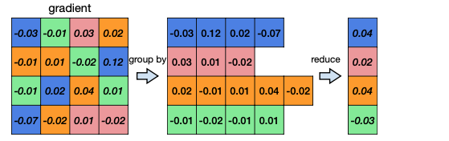
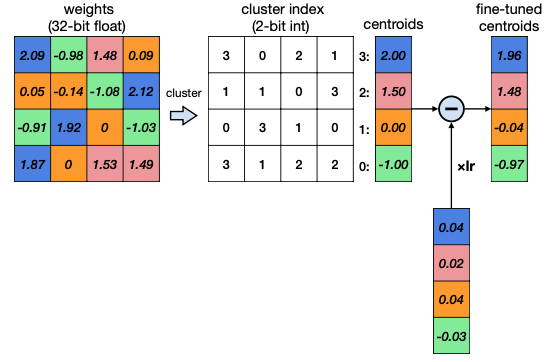
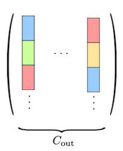
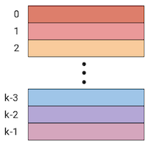
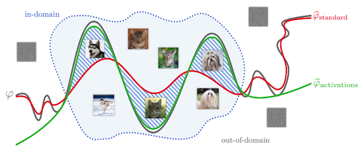
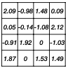
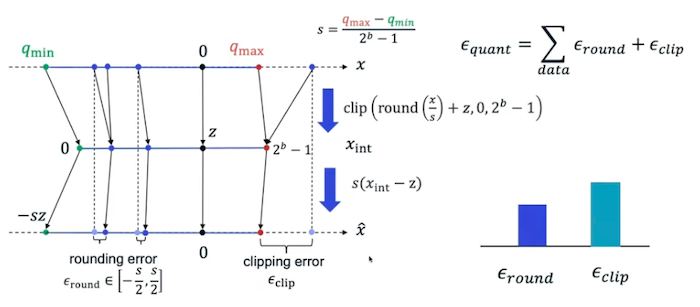
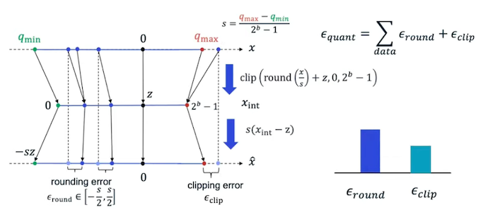

# Lecture 05 - Quantization (Part I)

> [Lecture 05 - Quantization (Part I) | MIT 6.S965](https://youtu.be/91stHPsxwig)

> [EfficientML.ai Lecture 5 - Quantization (Part I) (MIT 6.5940, Fall 2023, Zoom recording)](https://youtu.be/MK4k64vY3xo?si=ouUP5R86zYN7XPsS)

---

## 5.5 How Many Bits to Quantize Weights?

> [Deep Compression: Compressing Deep Neural Networks with Pruning, Trained Quantization and Huffman Coding 논문(2015)](https://arxiv.org/abs/1510.00149)

양자화를 위한 bit width는 어느 정도가 적당할까? 다음은 AlexNet의 Convolution, Fully-Connected 레이어에서, bit width 변화에 따른 정확도 변화를 나타낸 그래프다.

- Conv layer: 4bits까지 정확도 유지

- FC layer: 2bits까지 정확도 유지

참고로 대표적인 CNN 모델에서 Conv, FC layer이 갖는 비중은 다음과 같다.

---

## 5.6 Deep Compression: Vector Quantization

> [Deep Compression: Compressing Deep Neural Networks with Pruning, Trained Quantization and Huffman Coding 논문(2015)](https://arxiv.org/abs/1510.00149)

> [Deep Compression 논문 리뷰](https://velog.io/@woojinn8/LightWeight-Deep-Learning-3.-Deep-Compression-%EB%A6%AC%EB%B7%B0)

Deep Compression 논문은 (1) iterative pruning, (2) **vector quantization**(VQ), (3) Huffman encoding 방법을 기반으로, 가중치가 차지하는 메모리를 획기적으로 줄이는 방법을 제안했다. 

| Iterative Pruning | | Vector Quantization(VQ) | | Huffman Encoding |
| :---: | :---: | :---: | :---: | :---: |
|  | $\rightarrow$ |  | $\rightarrow$ |  |
| original network 대비 크기 9x-13x 감소 | | original network 대비 크기 27x-31x 감소 | | original network 대비 크기 35x-49x 감소 |

---

### 5.6.1 K-Means-based Weight Quantization

Deep Compression에서는 **K-Means Algorithm** 기반의, **non-uniform weight quantization**을 수행한다.(Vector Quantization)

> \#quantization levels = \#clusters

> Computer Graphics에서도 65536개의 스펙트럼으로 이루어진 원래 색상을, 256개 bucket을 갖는 codebook을 만들어서 유사하게 양자화한다.

- storage: **Integer** Weights, Floating-Point Codebook

  - codebook: 예시 기준으로 FP32 bucket 4개를 사용한다. 
  
  - cluster index: bucket이 4개이므로, 2bit(index 0,1,2,3)로 충분하다.

- computation: Floating-Point Arithmetic

| Weights (FP32 x 16) | 압축 | cluster index(INT2 x 16) centroids (FP32 x 4)| 추론 | Reconstructed (FP32 x 16) |
| :---: | :---: | :---: | :---: | :---: |
|  | → |  | → |   |

### &nbsp;&nbsp;&nbsp;📝 예제 1: K-Means-based Quantization의 메모리 사용량 &nbsp;&nbsp;&nbsp;

위 예시 그림에서 K-Means-based Quantization 이전/이후 사용하는 메모리 사용량을 계산하라.

### &nbsp;&nbsp;&nbsp;🔍 풀이&nbsp;&nbsp;&nbsp;

- 양자화 전 

  FP32 $(4 \times 4)$ weight matrix

  $$32 \ \mathrm{bits} \times (4 \times 4) = 512 \ \mathrm{bits} = 64 \ \mathrm{bytes} $$

- 양자화 후

  - weight matrix: INT2 x 16

  $$2 \times (4 \times 4) = 32 \ \mathrm{bits} = 4 \ \mathrm{bytes} $$
    
  - codebook: FP32 x 4

  $$32 \times (1 \times 4) = 128 \ \mathrm{bits} = 16 \ \mathrm{bytes} $$

따라서 양자화 전 필요한 메모리 사용량은 64 bytes, 양자화 후 필요한 메모리 사용량은 20 bytes이다.(3.2배 사용량 감소) 

> weight tensor가 크면 클수록, 가중치의 메모리 사용량 감소 효과가 더 커진다.

---

### 5.6.2 Finetuning Codebook

위 예시에서 weight를 다시 reconstruct(decode)한 뒤, error를 계산해 보자.

| 양자화 전 | Decompressed | Error |
| :---: | :---: | :---: |
|  |  |   |

이러한 quantization error는 양자화 전, 후의 가중치 값 차이를 줄이는 방식으로, codebook을 fine-tuning하며 개선할 수 있다.

1. cluster index에 따라 quantization error를 분류한다.

    

2. mean error를 구한다.

    

3. codebook의 centroid를 업데이트한다.

    

---

### 5.6.3 K-Means-based Quantization Limitations

그러나 K-Means-based weight quantization은 다음과 같은 한계점을 갖는다.

- (-) 연산 시 다시 floating point로 reconstruct된다.

- (-) reconstruction 과정에서 time complexity, computation overhead가 크다.

- (-) weight가 메모리에서 연속적이지 않기 떄문에, memory access에서 긴 지연이 발생하게 된다.

- (-) activation은 입력에 따라 dynamic하게 변하므로, activation quantization으로 clustering-based approach는 적합하지 않다.

---

### 5.6.4 Huffman Coding

추가로 **Huffman Coding** 알고리즘을 적용하여 memory usage를 더 줄일 수 있다.

> Unix의 파일 압축, JPEG, MP3 압축에서 주로 사용된다.

> Encoding의 분류는 크게 두 가지로 나뉜다. 고정된 길이로 encode하는 RLC(Run Length Coding), 가변 길이로 encode하는 VLC(Variable Length Coding). Huffman Coding은 대표적인 VLC에 해당된다.

- frequent weights: bit 수를 적게 사용해서 표현한다.

- In-frequent weights: bit 수를 많이 사용해서 표현한다.

### &nbsp;&nbsp;&nbsp;📝 예제 2: Huffman Coding &nbsp;&nbsp;&nbsp;

a, b, c 알파벳을 Huffman Coding을 이용해 압축하라.

> ASCII code로 표현하려고 한다면 INT8 x 3으로 24bits를 사용해야 한다. 하지만 Huffman coding을 적용하여 메모리 사용량을 줄일 수 있다. 

### &nbsp;&nbsp;&nbsp;🔍 풀이&nbsp;&nbsp;&nbsp;

a, b, c를 다음과 같이 압축하여 정의했다고 하자.

- Try 1
  
    | a | b | c |
    | :---: | :---: | :---: |
    | 01 | 101 | 010 |

   $\rightarrow$ a와 c의 접두어 부분(`01`)이 겹치기 때문에 VLC로 압축할 수 없다.

- Try 2

    | a | b | c |
    | :---: | :---: | :---: |
    | 01 | 10 | 111 |

   $\rightarrow$ 겹치는 접두어가 없기 때문에, `01 10 111` = 총 7bits로 압축할 수 있다.

---

## 5.7 AND THE BIT GOES DOWN: Product Quantization

> [AND THE BIT GOES DOWN: REVISITING THE QUANTIZATION OF NEURAL NETWORKS 논문(2019)](https://arxiv.org/abs/1907.05686)

어떤 레이어가 $(C_{in} \times K \times K)$ 크기의 3D 텐서 $C_{out}$ 개를 갖는다고 하자. 위 논문에서는 합성곱 필터가 갖는 spatial redundancy를 이용할 수 있도록, $K \times K$ 크기를 갖는 subvector 단위로 vector quantization을 적용한다.

- 각 3차원 텐서를, subvector $C_{in}$ 개로 구성된 단일 벡터로 reshape한다.

  - subvector size $d$ : $K \times K$

  - \#subvectors per vector: $C_{in}$

- (크기 $d$ 를 갖는) subvector $k$ 개로 구성된 codebook 기반으로 양자화한다.

| Filters | Reshaped filters | Codebook |
| :---: | :---: | :---: |
|  |  |  |

---

### 5.7.1 Product Quantization

> [MATRIN KERSNER BLOG: Kill the bits and gain the speed?](https://martinkersner.com/2019/11/28/kill-the-bits/#product-quantization)

앞서 살펴본 Vector Quantization(VQ)는 **Product Quantization**(PQ)의 특수한 경우로 볼 수 있다. 다음은 Product Quantization의 두 가지 경우를 비교한 표다.

| | Vector Quantization | Scalar K-means algorithm |
| :---: | :---: | :---: |
| subvector size $d$ | $C_{in}$ | $1$ |
| \#subvectors per vector | $1$ | $C_{in}$ |

또한 product quantization에서 codebook $C = \lbrace c_1, \cdots , c_k \rbrace$ 는, 크기 $d$ 를 갖는 centroid(**codeword**) $k$ 개로 구성된다.

| | Codebook | Codeword | 
| :---: | :---: | :---: |
| |  |  |
| dimension | $d \times k$ | $d$ |

### &nbsp;&nbsp;&nbsp;📝 예제 3: Product Quantization의 메모리 사용량 &nbsp;&nbsp;&nbsp;

다음과 같은 조건에서 Product Quantization으로 사용되는 메모리 사용량을 계산하라.

- 입력 레이어: $(128 \times 128 \times 3 \times 3)$

- \#centroids: $k = 256$ 

  데이터 타입은 `float16`을 사용하며, 각 subvector는 1 byte를 차지한다고 가정한다.

- block size: $d = 9$

### &nbsp;&nbsp;&nbsp;🔍 풀이&nbsp;&nbsp;&nbsp;

메모리 사용량은 크게 (1) indexing cost와 (2) FP16 타입의 centroid가 차지하는 메모리로 나뉜다.

- indexing cost

  입력 레이어의 \#blocks $m$ 은 $128 \times 128 = 16,384$ 개다. 따라서 16kB 메모리를 차지한다.
  
- centroids

  FP16을 사용하므로, 256개 centroids가 차지하는 메모리는 다음과 같다. 
  
  $$9 \times 256 \times 2 \ \mathrm{bytes} = 4,608 \ \mathrm{bytes}$$

---

### 5.7.2 Minimize Difference between Output Activations

최적의 centroid(codeword)를 찾기 위한 방법을 살펴보자. 먼저 양자화 전,후 가중치 값을 비교하며, quantization error를 최소화하는 objective function은 다음과 같이 정의할 수 있다.

$$ || W - \widehat{W}|{|}_2^2 = \sum_{j} || w_j - q(w_j) |{|}_2^2 $$

- $q(w_j) = (c_{i_1}, c_{i_2}, \cdots , c_{i_m})$

하지만 논문에서는 양자화 전,후의 차이를 최소화해 얻은 가중치가, 반드시 양자화 전의 출력과 비슷한 결과를 보장하지 않는다는 사실에 주목한다. 대신 in-domain input을 추론시키면서, activation을 대상으로 양자화 전,후 차이를 최소화하는 objective function을 제안한다.

$$ || y - \widehat{y}|{|}_2^2 = \sum_{j} || x(w_j - q(w_j)) |{|}_2^2 $$

다음은 개와 고양이를 분류하는 간단한 binary classifier $\varphi$ 를 대상으로, 두 가지 objective function을 사용한 결과를 비교한 그림이다.

- weight-based(빨간색), activation-based(초록색)

- in-domain 입력에 대해, activation-based objective function으로 최적화한 모델의 성능이 더 우수하다.

---

## 5.8 Linear Quantization

다음은 일정한 step size를 가지는 대표적인 양자화 방법인 **Linear Quantization**을 살펴보자. 앞서 K-means-based quantization 예제에 linear quantization을 적용 시 다음과 같다.

- integer $q \rightarrow$ real $r$ 의 affine mapping으로 볼 수 있다.

  - $Z$ : Zero points

  - $S$ : Scaling factor

$$ r = S(q-Z) $$

| Weights (FP32 x 16) |  | Quantized Weights (INT2) |  | Reconstruction (FP32 x 16) |
| :---: | :---: | :---: | :---: | :---: |
|  | → |  | → |   |

---

### 5.8.1 Zero Point, Scaling Factor

zero point $Z$ , scaling factor $S$ 를 계산해 보자.

1. 먼저 양자화를 적용할 floating-point range를 정한다.

    - $r_{min}$ : real number $r$ 최소값

    - $r_{max}$ : real number $q$ 최대값

2. integer clipping range를 정한다.

    - $q_{min}$ : integer $q$ 최소값

    - $q_{max}$ : integer $q$ 최대값

3. 다음 식을 계산하여 zero point, scaling factor를 구한다.

    - $r_{max} = S(q_{max} - Z)$

    - $r_{min} = S(q_{min} - Z)$

이떄 두 식을 조합하여 scaling factor에 대한 식으로 변환할 수 있다.

$$ S = {{r_{max} - r_{min}} \over {q_{max} - q_{min}}} $$

### &nbsp;&nbsp;&nbsp;📝 예제 4: linear quantization &nbsp;&nbsp;&nbsp;

다음 weight matrix에서 zero point, scaling factor 값을 구하라.

### &nbsp;&nbsp;&nbsp;🔍 풀이&nbsp;&nbsp;&nbsp;

예시 행렬에서 다음과 같은 값들을 구할 수 있다.

- $r_{min}, r_{max} = [-1.08, 2.12]$

- $q_{min}, q_{max} = [-2, 1]$

위 값을 가지고 scaling factor $S$ 를 계산할 수 있다.

$$ S = {{2.12 - (-1.08)} \over {1 - (-2)}} = 1.07 $$

$r_{min}$ 혹은 $r_{max}$ 방정식에 $S$ 를 대입하면, zero point $Z$ 를 구할 수 있다. 이때 $Z$ 가 정수가 되도록 round(반올림) 연산을 적용해야 한다.

$$ Z = \mathrm{round}{\left( q_{min} - {{r_{min}} \over S} \right)} = \mathrm{round}{\left( -2 - {{-1.08} \over {1.07}} \right)} = 1 $$

---

### 5.8.2 Sources of Quantization Error

linear quantization error와, 이를 발생시키는 원인을 알아보자. 다음은 linear quantization을 나타내는 그림이다.

- 다음과 같은 서로 다른 값이 동일한 integer domain grid에 mapping된다.

  - 근접한 두 FP32 값

  - $q_{max}$ 보다 큰 FP32 outlier: $2^{b} - 1$ 로 매핑

다음은 양자화된 값을 다시 복원한 뒤 error 값을 나타낸 그림이다. 

> quantization error는 round error, clip error를 합한 값이다.

- outlier에 따른 clip error가 크다.

하지만 다음과 같이 $q_{max}$ 값이 큰 예시에서는, clip error보다 round error가 더 커지게 된다. 

- rounding에 따른 round error가 크다.

따라서 이러한 **trade-off** 관계를 고려하여 quantization range를 정할 필요가 있다.

---

## 5.9 Linear Quantized Matrix Multiplication

linear quantization 연산은 **affine mapping**(아핀변환)으로 볼 수 있다.

$$ r = S(q - Z) $$

> affine mapping: linear transform 후 translation하는 변환. non-linear transform에 해당된다.

---

### 5.9.1 Linear Quantized Fully-Connected Layer

먼저 Fully-Connected layer + linear quantization 수식을 살펴보자.

$$ Y = WX + b $$

$$ \downarrow $$

$$ S_{Y}(q_{Y} - Z_{Y}) =  S_{W}(q_{W} - Z_{W}) \cdot S_{X}(q_{X} - Z_{X}) + S_b(q_b - Z_b) $$

1. weight zero point $Z_{W} = 0$ 로 가정하면, 다음과 같이 수식이 바뀐다.

$$ S_{Y}(q_{Y} - Z_{Y}) =  S_{W}S_{X}(q_{W}q_{X} - Z_{X}q_{W})  + S_b(q_b - Z_b) $$

2. bias zero point $Z_b = 0$ , scaling factor $S_b = S_W S_X$ 로 가정하면, 다음과 같이 수식이 바뀐다.

   > 이처럼 bias, weight의 zero point가 모두 0인 경우는, symmetric quantization에 해당된다.

$$ S_{Y}(q_{Y} - Z_{Y}) =  S_{W}S_{X}(q_{W}q_{X} - Z_{X}q_{W}+ q_b) $$

3. 위 수식을 integer 출력 $q_{Y}$ 에 관한 식으로 정리하면 다음과 같다.

$$ q_{Y} = {{S_{W}S_{X}} \over {S_{Y}}}(q_{W}q_{X} + q_b - Z_{W}q_{X}) + Z_{Y} $$

4. 연산 전에 알 수 있는 항을 bias로 합쳐준다.

    > $q_b - Z_X q_W = q_{bias}$

    > Note: $q_b$ , $q_{bias}$ 모두 32 bits integer이다.

$$ q_{Y} = {{S_{W}S_{X}} \over {S_{Y}}}(q_{W}q_{X} + q_{bias}) + Z_{Y} $$

이제 나머지 항이 어떤 연산인지 살펴보자.

$(1) \quad {{S_{W}S_{X}} \over {S_{Y}}} = 2^{-n}M_{0}$

- bit shift( $2^{-n}$ )와 fixed point 곱셈 ( $M_0$ )으로 볼 수 있다. ( $M_0 \in [0.5, 1)$ )

  - INT32를 N-bit integer로, 다시 rescale하는 역할을 한다.

  - 언제나 $(0, 1)$ 사이의 값을 갖는다.

$(2) \quad q_{W}q_{X} + q_{bias}$

- N-bit integer 곱셈 후, 32-bit integer 덧셈을 수행한다.

$(3) \quad Z_{Y}$

- N-bit integer 덧셈을 수행한다.

---

### 5.9.2 Linear Quantized Convolution Layer

$$ Y = \mathrm{Conv} (W, X) + b $$

$$ \downarrow $$

$$ q_{Y} = {{S_{W}S_{X}} \over {S_{Y}}}(\mathrm{Conv}(q_{W}, q_{X}) + q_{bias}) + Z_{Y} $$

각 항이 어떤 연산인지 살펴보자.

$(1) \quad {{S_{W}S_{X}} \over {S_{Y}}}$

- bit shift( $2^{-n}$ )와 fixed point 곱셈 ( $M_0$ )으로 볼 수 있다. ( $M_0 \in [0.5, 1)$ )

  - INT32를 N-bit integer로, 다시 rescale하는 역할을 한다.

$(2) \quad \mathrm{Conv}(q_{W}q_{X}) + q_{bias}$

-  N-bit integer 곱셈. 32-bit integer 덧셈을 수행한다.

$(3) \quad Z_{Y}$

- N-bit integer 덧셈을 수행한다.

위 연산을 그래프로 그리면 다음과 같이 나타낼 수 있다.

---
