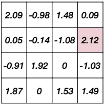
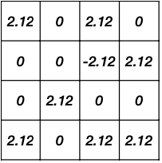
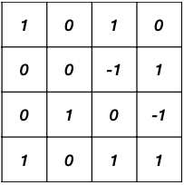
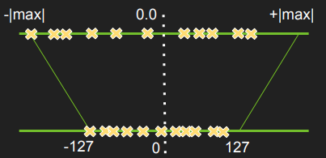
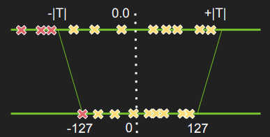
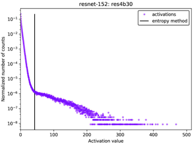
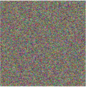
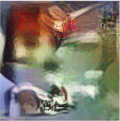

# Lecture 06 - Quantization (Part II)

> [Lecture 06 - Quantization (Part II) | MIT 6.S965](https://youtu.be/3nqUFSSJYKQ)

> [Neural Network Quantization Technique - Post Training Quantization](https://medium.com/mbeddedwithai/neural-network-quantization-technique-post-training-quantization-ff747ed9aa95)

> [A Comprehensive Survey on Model Quantization for Deep Neural Networks 논문](https://paperswithcode.com/paper/a-comprehensive-survey-on-model-quantization)

---

## 6.1 Post-Training Quantization: Weight Quantization

> [Data-Free Quantization through Weight Equalization and Bias Correction 논문(2019)](https://arxiv.org/abs/1906.04721)

이미 학습된 모델을 양자화하는, **Post-Training Quantization**(PTQ)를 살펴볼 것이다. 다음 그림은 MobileNetV2의 첫 번째 depthwise-separable 레이어가 갖는, 출력 채널별 weight range이다.


위와 같은 상황에서, 다음과 같은 두 PTQ 기법을 고려할 수 있다.

- **Per-Tensor Quantization**

  tensor 32개 전체에, 동일한 scale $S$ 를 사용한다.

  - (-) outlier weight에 영향을 받기 쉽다.

  - (-) 큰 모델은 잘 적용되나, 작은 모델에서는 정확도 하락이 크다.

     주로 output channels의 weight range 차이가 크면(100x 이상) 정확도 하락이 크다.

- **Per-Channel Quantization**

  각 채널별로 scale $S$ 를 사용한다.

  - (-) 지원되지 않은 하드웨어가 있다.

  - (-) 매 채널마다 개별적인 scaling 연산을 적용하기 때문에 overhead가 크다.

---

### 6.1.1 Per-Tensor vs Per-Channel Quantization

한 행렬을 per-tensor quantization, per-channel quantization을 적용하여 어떤 차이가 있는지 알아보자.

| | Per-Tensor | Per-Channel |
| :---: | :---: | :---: |
| |  |  |
| $\|r\|_{max}$ | 2.12 | 2.09 <br/> 2.12 <br/> 1.92 <br/> 1.87 |


- Per-Tensor Quantization

    ```math
    S = {{|r|}_{max} \over {q_{max}}} = {{2.12} \over {2^{2-1} - 1}} = 2.12
    ```

    | Quantized | Reconstructed |
    | :---: | :---: |
    |  |  |

    error는 다음과 같다.

    ```math
    ||W - Sq_{W}||_F = 2.28
    ```

- Per-Channel Quantization

    ```math
    S_0 = {{|r|}_{max} \over {q_{max}}} = {{2.09} \over {2^{2-1} - 1}} = 2.09
    ```

    ```math
    S_1 = {{|r|}_{max} \over {q_{max}}} = {{2.12} \over {2^{2-1} - 1}} = 2.12
    ```

    ```math
    S_2 = {{|r|}_{max} \over {q_{max}}} = {{1.92} \over {2^{2-1} - 1}} = 1.92
    ```

    ```math
    S_3 = {{|r|}_{max} \over {q_{max}}} = {{1.87} \over {2^{2-1} - 1}} = 1.87
    ```

    | Quantized | Reconstructed |
    | :---: | :---: |
    |  |  |

    error는 다음과 같다.

    ```math
    ||W - S \odot q_{W}||_F = 2.08
    ```

---

### 6.1.2 Weight Equalization

> [Data-Free Quantization through Weight Equalization and Bias Correction 논문(2019)](https://arxiv.org/abs/1906.04721)

반면 weight range를 채널별로 비슷하게 조절하여, Per-Tensor weight quantization을 적용하는 접근도 가능하다. (**Weight Equalization**) 

논문에서는 양자화에서 사용하는 scaling factor를 변형해서, weight range를 함께 조절할 수 있다고 주장한다.(scaling equivariance)

1. 두 개 레이어 층을 통과하는 연산을 수식으로 나타내면 다음과 같다.

    - $f$ : activation function

    $$ y = f(W^{(2)} f(W^{(1)}x + b^{(1)})+b^{(2)}) $$

2. (양자화) scaling factor로 구성된 diagonal matrix $S$ 를 식에 포함하면 다음과 같이 변형된다.

    $$ = f(W^{(2)} S \hat{f}(S^{-1}W^{(1)}x + S^{-1}b^{(1)})+b^{(2)}) $$

   이때 $S$ 와 $S^{-1}$ 를 다른 다른 행렬과 묶어서 치환할 수 있다.

   $a. \quad {\widehat{W}}^{(2)} = W^{(2)}S$

   $b. \quad {\widehat{W}}^{(1)} = S^{(-1)}W^{(1)}$

   $c. \quad {\widehat{b}}^{(1)} = S^{(-1)}b^{(1)}S$

$$ = f({\widehat{W}}^{(2)} \hat{f}({\widehat{W}}^{(1)} x + {\widehat{b}}^{(1)})+b^{(2)}) $$

---

#### 6.1.2.1 Equalization ranges over multiple layers

이제 각 channel별 weight range를 바꿔줄 scaling matrix $S$ 를 찾아보자. 논문에서는 각 channel $i$ 별 최적의 범위를 알기 위해, precision $\hat{p_i}$ 를 둔다.

- ${\hat{p_i}}^{(1)}$ : $\quad {\widehat{W}}^{(1)}$ 의 channel $i$ 가 갖는 quantization range

- ${\hat{R}}^{(1)}$ : $\quad {\widehat{W}}^{(1)}$ 의 total range

$$ {\hat{p_i}}^{(1)} = {{{\hat{r_i}}^{(1)}} \over {{\hat{R}}^{(1)}}} $$

이제 최적의 $S$ 를 찾는 문제는 다음과 같이 나타낼 수 있다.

$$ \max_{S} \sum_{i} {\hat{p_i}}^{(1)} {\hat{p_i}}^{(2)} $$

여기서 symmetric quantization으로 생각하면, 다음과 같이 precision을 계산할 수 있다.

- ${\hat{r_i}}^{(1)} = 2 \cdot \max_{j} |{\widehat{W}_{ij}^{(1)}}|$

- ${\hat{R}}^{(1)} = 2 \cdot \max_{ij} |{\widehat{W}_{ij}^{(1)}}|$

논문에서는 최적의 $S$ setting을 다음과 같이 도출해 낸다.

$$ s_i = {{1} \over {r_{i}^{(2)}}}\sqrt{r_{i}^{(1)}r_{i}^{(2)}} $$

---

### 6.1.3 Adaptive Rounding

> [Up or Down? Adaptive Rounding for Post-Training Quantization 논문](https://arxiv.org/abs/2004.10568)

양자화에서 정확도를 잃는 가장 큰 원인 중 하나가 바로 **rounding**(반올림)이다. 따라서 rounding으로 잃는 성능을 최소화하기 위해 **Adaptive Rounding**이라는 방법이 제안되었다.


AdaRound 논문은 학습 가능한 parameter를 두어, weight에 내림( $\lfloor W \rfloor$ )과 올림( $\lceil W \rceil$ )을 적용할지 결정한다.

- quantized value $\tilde{W}$ 

- weight에 $\triangle w = \delta$ (perturbation)을 추가하여, 어느 방향의 rounding이 더 좋은지 판단한다.

$$ \tilde{W} = \lfloor | W | + \delta \rceil , \, \delta \in [0,1] $$

훈련은 다음과 같은 함수를 최적화하는 과정을 거친다.

$$ \mathbb{E} [\mathcal{L}(x,y,w + \triangle w) - \mathcal{L}(x,y,w)] $$

Taylor series로 근사 시 다음과 같이 나타낼 수 있다.

```math
\mathrm{argmin}_{V} {|| Wx - \tilde{W}x ||}^{2}_{F} + \lambda f_{reg}(V)
```

```math
\mathrm{argmin}_{V} {|| Wx - \lfloor \lfloor {W} \rfloor + h(V)\rceil x ||}^{2}_{F} + \lambda f_{reg}(V)
```

- $x$ : 입력, 

- $V$ : 입력과 동일한 형태의 random variable

- $h()$ : (0, 1) 사이 값으로 mapping하는 함수 

  > 예를 들면 rectified sigmoid가 될 수 있다.

- $f_{reg}(V)$ :  regularization

  $h(V)$ 가 binary 값이 될 수 있도록 encourage한다.

---

## 6.2 Post-Training Quantization: Activation Quantization

이번에는 **Activation Quantization**에 대해 알아보자.

- "weight" vs "activation"

    - weight: static하므로 범위를 정하기 쉽다.
    
    - activation: 입력(image)가 달라지면 activation 값도 천차만별로 달라진다.(**dynamic range**)

activation quantization을 위해서는, dynamic activation range에서 최적의 **clipping range**를 탐색할 필요가 있다.


---

### 6.2.1 During training

먼저 모델의 훈련 중 statistics을 모아두는 방식으로, clipping range를 결정할 수 있다.

- 훈련 중 activation을 관찰하고 $[a;b]$ range를 기록한다.

- smoothing parameter가 1에 가까운 **Exponential Moving Averages**(EMA)를 통해 clipping range를 집계한다.

```math
{\hat{r}}^{(t)}_{max, min} = \alpha \cdot {r}^{(t)}_{max, min} + (1-\alpha) \cdot {\hat{r}}^{(t-1)}_{max, min}
```

단, activation range가 급격하게 변하는 훈련 초기(5만 ~ 200만 step)에는, computation overhead를 고려하여 EMA를 적용하지 않는다.

---

### 6.2.2 Calibation

> [Integer Quantization for Deep Learning Inference: Principles and Empirical Evaluation 논문(2020)](https://arxiv.org/abs/2004.09602)

훈련 데이터셋을 샘플링하여 calibation batch를 만든 뒤, 이를 추론하며 dynamic range를 기록한다. 대표적으로 다음과 같은 방법이 있다.

- **min-max** 

  가장 단순한 방법에 해당된다.
  
  - activation range의 min/max를 기록한 뒤, 최종적으로 평균값을 사용한다. 
  
  - (-) outlier에 취약하다.

- **percentile-based**

  min/max 대신, i번째 largest/smallest 값을 range로 사용한다.

  - 예를 들어 99% calibration의 경우, 가장 큰 1% 값은 모두 clip한다.

  - (+) min-max보다 outlier에 덜 민감하다.

- **Kullback-Leibler divergence** (KL-divergence)

  entropy를 기반으로, 양자화 이전과 이후의 분포 차이를 최소화한다.

- **Mean Squared Error** (MSE)

  위 세 가지 방법(activation histogram)과 다르게, 양자화 전/후의 입력을 비교 후 차이를 최소화한다.

다음은 ResNet-50의 세 번째 레이어의 input activation의 histogram으로, 3가지 방법의 calibration range를 비교한 그림이다.


---

### 6.2.3 Calibration: Minimize Loss of Information

> [NVIDIA: 8-bit Inference with TensorRT](https://on-demand.gputechconf.com/gtc/2017/presentation/s7310-8-bit-inference-with-tensorrt.pdf): 현대 GPU에서 가장 많이 사용되는 방법이다.

min-max의 단점을 보완하기 위해서는, 최적의 **threshold**를 찾아서 clipping할 필요가 있다.

| No saturate | Saturate |
| :---: | :---: |
|  |  |
| FP32 \|max\| $\rightarrow$ INT8 127 | FP32 \|threshold\| $\rightarrow$ INT8 127 |

최적의 clipping range를 찾기 위해서, FP32 입력 및 INT 입력에 따른 activation 분포(entropy) 차이를 **KL divergence**를 기반으로 최소화한다.

1. 여러 calibration batch를 FP32 model에서 추론하여, activation histograms를 얻는다.

2. 다양한 saturation thresholds를 사용하여, **quantized distributions**를 생성한다.

3. KL divergence를 최소화하는, 최적의 threshold를 탐색한다.

```math
D_{KL}(P||Q) = {\sum}_{i}^{N}P(x_{i})\log{{P(x_{i})} \over {Q(x_{i})}}
```

다음은 ResNet의 특정 레이어에서, saturation 전/후의 histogram을 비교한 그림이다.

| No saturate | Saturate |
| :---: | :---: |
|  |  |

---

### 6.2.4 Calibration: Minimize MSE

양자화 이전 입력과, 양자화 이후의 입력에 주목하여, 두 입력의 차이(**mean-square-error**)를 최소화하는 접근도 가능하다.

- $X$ : input

- $Q(X)$ : quantized imput

$$ \underset{{|r|}_{max}}{\min} \mathbb{E}[{(X - Q(X))}^{2}] $$

입력을 Laplace(혹은 Gaussian) distribution으로 가정하면, Laplace $(0, b)$ distribution에서 최적의 clipping values는 다음과 같다.

- $b$ : calibration input distribution에서 estimate할 수 있다.

- 2, 3, 4 bits에서 각각의 최적 clipping value

$$ |r|_{max} = 2.83, 3.89b, 5.03b $$

---

## 6.3 Post-Training Quantization: Bias Quantization

> [Data-Free Quantization through Weight Equalization and Bias Correction 논문](https://arxiv.org/abs/1906.04721)

> calibration data가 없고 모델이 **Batch Normalization**을 쓰는 경우, 유용하게 사용할 수 있다.

weight quantization error는, 잇따라 output activation의 분포를 shifting시키는 문제를 낳을 수 있다.(**biased error**)

- weight quantization error

$$ \epsilon = Q(W) - W $$

- biased error

$$ \mathbb{E}[\tilde{y_j} - y_j] \approx {{1} \over {N}} \sum_{n}{(Q(W)\mathrm{x_n})_j - (W\mathrm{x_n})_j} $$

biased error는 FP32 model과 quantized model의 결과를 비교하는 것으로 알 수 있다.

$$ \mathbb{E}[y] = \mathbb{E}[W\mathrm{x}] + \mathbb{E}[\epsilon\mathrm{x}] - \mathbb{E}[\epsilon\mathrm{x}] $$

$$ \quad = \mathbb{E}[(\tilde{y})\mathrm{x}] - \mathbb{E}[\epsilon\mathrm{x}] $$

---

### 6.3.1 Bias Correction

**bias correction** 절차는 다음과 같이 진행된다.

1. $\mathbb{E}[y]$ 를 계산한다.

    FP32 model을 N개 example에 대해 추론하고, 레이어별 per-channel pre-activation mean( $\mathbb{E}[y]$ )을 획득한다.

2. $\mathbb{E}[\tilde{y}]$ 를 계산한다.

    quantized model의 레이어마다 $\mathbb{E}[\tilde{y}]$ 를 획득한다.

3. per-channel biased quantization error를 계산한다.

$$\mathbb{E}[\epsilon] = \mathbb{E}[\tilde{y}] - \mathbb{E}[y]$$

4. 레이어별 bias correction을 수행한다.

   레이어마다 $\mathbb{E}[\epsilon]$ 를 빼주는 것으로 bias correction을 수행한다.

아래 그림은 MobileNetV2 모델의 두 번째 depthwise-separable convolution layer에서, bias correction 전/후 biased output error의 분포를 나타낸 그림이다.

| Before Correction | After Correction |
| :---: | :---: |
|  |  |


---

## 6.4 Post-Training INT8 Linear Quantization

하지만 large model과 비교해서, 모델이 작을수록 PTQ가 그다지 좋은 성능을 보이지 않는다.


---

## 6.5 Post-Training Quantization: Data Free Quantization

> [ZeroQ: A Novel Zero Shot Quantization Framework 논문(2020)](https://arxiv.org/abs/2001.00281)

ZeroQ 논문은 훈련 데이터셋을 사용하지 않고, distilled data를 만들어 양자화하는 **Zero-Shot Quantization**을 제안했다. 

이전까지는 훈련 데이터셋이 없을 경우, 주로 naive approach로 평균 0과 단위 분산을 갖는 Gaussian distribution $N(0, 1)$ 을 사용했다. 하지만 이러한 방식으로는 activation statistics를 정확히 파악하기 어렵다.

하지만 더 많은 local structure를 가지는 distilled data를 이용하면 문제를 해결할 수 있다. 다음은 논문에서 두 data를 시각화하여 비교한 예시 그림이다.

| Gaussian data | Distilled data |
| :---: | :---: |
|  |   |

> 8-V100 시스템에서 ImageNet 대상으로 훈련한 ResNet-50 기준으로 32개 데이터를 만드는 시간은 3초로, computational overhead가 적다.

---

### 6.5.1 Generation of Distilled Data

ZeroQ에서는 batch normalization 레이어의 statistic을 바탕으로 distilled data를 생성한다. 이때 distilled data를 생성하기 위해, 모델을 추론하며 최적화하는 수식은 다음과 같다.

$$ \min_{x^r} \sum_{i=0}^{L} ||\tilde{\mu}_i^r - {\mu}_{i}||_{2}^{2} + || \tilde{\sigma}_{i}^{r} - \tilde{\sigma}_{i} ||_{2}^{2} $$

- $x^{r}$ : reconstructed (ditilled) input data

- $i$ : layer(0~L)

- ${\mu}_i, {\sigma}_i$ : BN 레이어에 저장된 평균, 표준편차

---

### 6.5.2 Sensitivity Analysis for Mixed-Precision Quantization

ZeroQ가 해결하려는 mixed-precision 문제는 레이어별 최적의 bit-width를 고르는 문제의 경우의 수(search space)가 매우 많아서 어렵다. 하지만 KL divergence를 사용하여, 레이어 단위의 quantization sensitivity를 구하여 문제를 단순화 한다.

다음은 ResNet-50에서 2,4,8 bit로 weight quantization을 적용했을 때, 레이어(block)별 sensitivity를 나타낸 그래프다.

- 민감한 레이어는 큰 bit precision를 사용한다.

- 덜 민감한 레이어는 작은 bit precision을 사용한다.


---