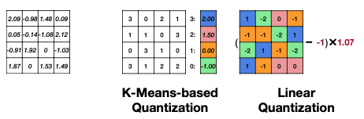
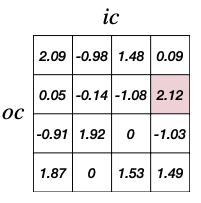
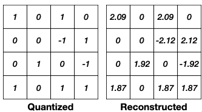
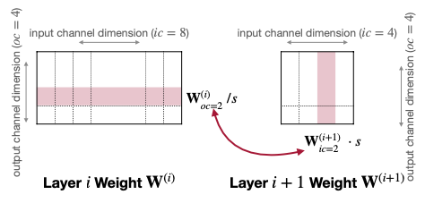
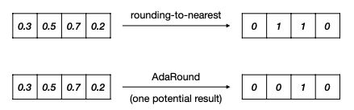
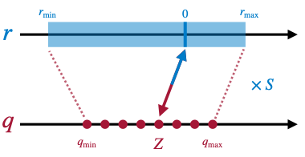
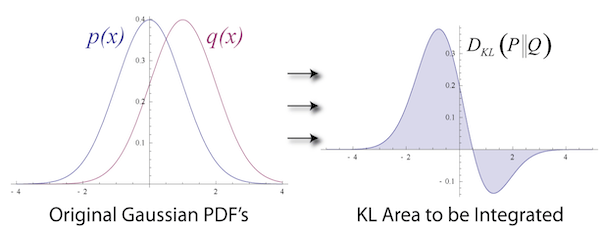
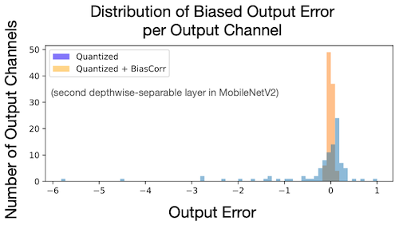
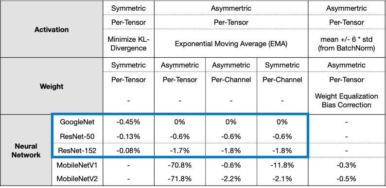

# Lecture 06 - Quantization (Part II)

> [Lecture 06 - Quantization (Part II) | MIT 6.S965](https://youtu.be/3nqUFSSJYKQ)

> [Neural Network Quantization Technique - Post Training Quantization](https://medium.com/mbeddedwithai/neural-network-quantization-technique-post-training-quantization-ff747ed9aa95)

잠시 두 가지 양자화 방법을 복습하자.



| | 양자화 전 | K-means-based | Linear |
| :---: | :---: | :---: | :---: |
| Storage | FP 가중치 | INT 가중치</br>FP 코드북 | INT 가중치 |
| Computation | FP 연산 | FP 연산 | INT 연산 |

이번 정리는 크게 네 가지 양자화 방법을 다룬다.

- **Post-Training Quantization**(PTQ)

    학습된 floating-point 모델을 양자화

    - <U>weight</U> quantization, <U>activation</U> quantization, <U>bias</U> quantization 포함

- **Quantization-Aware Training**(QAT)

    floating-point 모델 내 fake quantization 모듈을 배치한 뒤, 추론을 진행하며 양자화에 의한 변화를 시뮬레이션하는 방법.

    training/fine-tuning 과정에서 QAT를 적용할 수 있으며, QAT가 끝나면 fake quantization 모듈에 기록한 정보를 가지고 모델을 효과적으로 양자화할 수 있다.

- **binary and ternary** quantization

- **mixed-precision** quantization

---

## 6.1 Post-Training Quantization: Weight Quantization

우선 weight quantization에서 성능을 높이기 위해 사용되는 몇 가지 방법을 살펴보자. 

---

### 6.1.1 Per-Channel Quantization

CNN에서 output channel별 weight가 갖는 값의 범위를 나타낸 아래 그림을 살펴보자.(MobileNetV2 첫 번째 depthwise-seperable layer)


- 필터는 32개, 따라서 출력 텐서의 채널도 32개

    > 한 채널 = 입력과 필터 하나를 연산한 결과값에 해당

이처럼 채널별 weight 값의 범위가 다르므로, 모든 채널에 동일한 scaling factor를 적용하면 문제가 생길 수 있다.(**Per-Tensor Quantization**) 이를 해결하기 위한 방법으로 **Per-Channel Quantization**가 등장했다.

보통 Per-Tensor Quantization보다 성능이 좋지만 다음과 같은 단점을 갖는다. 

- Per-Channel Quantization를 지원하지 않는 hardware가 있다.

- 각 채널별 scaling factor를 구해야 하므로 computation overhead가 크다.

### <span style='background-color: #393E46; color: #F7F7F7'>&nbsp;&nbsp;&nbsp;📝 예제 1: Per-Channel Quantization &nbsp;&nbsp;&nbsp;</span>

아래 tensor를 2-bit linear quantization한 결과와 오차를, Per-Tensor Quantization, Per-Channel Quantization 방식별로 구하라.



### <span style='background-color: #C2B2B2; color: #F7F7F7'>&nbsp;&nbsp;&nbsp;🔍 풀이&nbsp;&nbsp;&nbsp;</span>

**Per-Tensor Quantization**

- scaling factor

$$ {|r|}_{max} = 2.12 $$

```math
S = {{|r|}_{max} \over {q_{max}}} = {{2.12} \over {2^{2-1} - 1}} = 2.12
```

- quantized, reconstructed

    

    오차를 구하면 다음과 같다.

$$ {||W-Sq_{W}||}_{F} = 2.28 $$

**Per-Channel Quantization**: 채널별 scaling factor는 다음과 같이 구할 수 있다.

- 1행 

$${|r|}_{max} = 2.09$$

```math
S = {{|r|}_{max} \over {q_{max}}} = {{2.09} \over {2^{2-1} - 1}} = 2.09
```

- 2행

$${|r|}_{max} = 2.12$$

```math
S = {{|r|}_{max} \over {q_{max}}} = {{2.12} \over {2^{2-1} - 1}} = 2.12
```

- 3행

$${|r|}_{max} = 1.92$$

```math
S = {{|r|}_{max} \over {q_{max}}} = {{1.92} \over {2^{2-1} - 1}} = 1.92
```

- 4행

$${|r|}_{max} = 1.87$$

```math
S = {{|r|}_{max} \over {q_{max}}} = {{1.87} \over {2^{2-1} - 1}} = 1.87
```

- quantized, reconstructed

    

    오차를 구하면 다음과 같다.

$$ {||W-S \odot q_{W}||}_{F} = 2.08 $$

---

### 6.1.2 Weight Equalization

> [Data-Free Quantization through Weight Equalization and Bias Correction 논문](https://arxiv.org/abs/1906.04721): re-scaling, re-parameterization

그렇다면 weight range를 채널별로 비슷하게 만들어서 per-tensor weight quantization을 사용하면 안 될까? 이러한 접근법을 **Weight Equalization**이라고 한다.

두 개의 연속된 레이어 $i, i+1$ 가 있다고 하자. 행렬 연산은 다음과 같이 표현할 수 있다.



$$ y^{(i+1)} = f(W^{(i+1)}x^{(i+1)} + b^{(i+1)}) $$

$$ \quad \quad = f(W^{(i+1)} \cdot f(W^{(i)}x^{(i)} + b^{(i)}) + b^{(i+1)}) $$

- $f$ : activation function

이때 rescaling을 수행하는 scaling factor 행렬 $S$ 를 식에 표기해 보자.

$$ \quad \quad = f(W^{(i+1)}S \cdot f(S^{-1}W^{(i)}x^{(i)} + S^{-1}b^{(i)}) + b^{(i+1)}) $$

- $S$ : 대각 행렬 $diag(s)$ 

-  element $s_j$ : output channel $j$ 의 scaling factor

여기서 이전 레이어( $i$ )의 scaling factor가 1보다 작다면 activation 값이 더 커진다.(예: ${{1} \over {0.8}} = 1.25$ ) 그렇다면 bias 값도 자연히 증가하고 range는 점점 커질 것이다. 

따라서 이전 레이어는 스케일을 줄이고, 뒤쪽 레이어는 스케일을 늘려야 한다.

- 레이어 $i$ : output channel $oc = a$ 를 scaling down

- 레이어 $i+1$ : input channel $ic = a$ 를 scaling up

그렇다면 이러한 $s_j$ 값은 어떻게 정해야 할까? 논문에서는 다음과 같은 방식으로 산출한다.

$$ s_j = {{1} \over {r_{ic=j}^{(i+1)}}} \sqrt{r_{oc=j}^{(i)} \cdot r_{ic=j}^{(i+1)}} $$

- $r_{oc=j}^{(i)}$ : 레이어 $i$ output channel $j$ 가 갖는 weight range

- $r_{ic=j}^{(i+1)}$ : 레이어 $i+1$ input channel $j$ 가 갖는 weight range

---

### 6.1.3 Adaptive Rounding

> [Up or Down? Adaptive Rounding for Post-Training Quantization 논문](https://arxiv.org/abs/2004.10568)

양자화에서 정확도를 잃는 가장 큰 원인은 **rounding**(반올림)이다. 따라서 rounding으로 잃는 성능을 최소화하기 위해 **Adaptive Rounding**이라는 방법이 제안되었다.

- 일반적인 반올림( $\lfloor W \rceil$ )이 항상 optimal하지는 않다는 점에서 착안했다.



그렇다면 어떠한 방식으로 weight에 내림( $\lfloor W \rfloor$ )과 올림( $\lceil W \rceil$ )을 적용할까? AdaRound는 학습 가능한 parameter를 두어 결정한다. 

- quantized value $\tilde{W}$ 

$$ \tilde{W} = \lfloor | W | + \delta \rceil , \, \delta \in [0,1] $$

위 양자화 값을 최적화하는 과정을 수행한다.

```math
\mathrm{argmin}_{V} {|| Wx - \tilde{W}x ||}^{2}_{F} + \lambda f_{reg}(V)
```

```math
\mathrm{argmin}_{V} {|| Wx - \lfloor \lfloor {W} \rfloor + h(V)\rceil x ||}^{2}_{F} + \lambda f_{reg}(V)
```

- $x$ : input

- $V$ : 동일한 shape의 random variable

- $h$ : (0, 1) 사이의 값으로 mapping하는 함수(예를 들면 rectified sigmoid)

- $f_{reg}(V)$ : $h(V)$ 가 binary 값이 될 수 있도록 하는 regularization 함수

---

## 6.2 Post-Training Quantization: Activation Quantization

이번에는 activation quantization에 대해 알아보자.

- "weight" vs "activation"

    - weight: static하므로 범위를 정하기 쉽다.
    
    - activation: 입력(image)가 달라지면 activation 값도 천차만별로 달라진다.(**dynamic range**)

---

### 6.2.1 Dynamic Range for Activation Quantization

따라서 activation quantization을 위해서는 적절한 범위를 탐색할 필요가 있다.

- clipping threshold인 $q_{min}$ , $q_{max}$ 값을 파악해야 한다.

- threshold를 설정하면 scaling factor와 zero point를 계산 가능하다. 이를 statistics한 방식으로 찾는다.

   

```math
{\hat{r}}^{(t)}_{max, min} = \alpha \cdot {r}^{(t)}_{max, min} + (1-\alpha) \cdot {\hat{r}}^{(t-1)}_{max, min}
```

이제 각 activation quantization을 위한 패러미터를 구하는 방법을 알아보자.

---

### 6.2.2 During training

학습 도중 패러미터를 구하는 방식으로, training step마다 **Exponential Moving Averages**(EMA, 이동평균)을 갱신한다.(model state 기록)

---

### 6.2.3 calibation batches

모델을 훈련시키며 사용한 train dataset에서 calibation batch를 만들어 추론시키며 패러미터를 구한다. 

- **min-max**

    각 batch마다 계산한 activation의 min/max를 구한 뒤 평균값을 사용한다.

    - activation 특성상 outlier가 나타나는 경우가 많고 영향을 받기 쉬우므로 주의해야 한다.

- **Mean Squared Error**(MSE)

    fp32 입력 $X$ 와 양자화된 입력 $Q(X)$ 을 사용했을 때의 출력값 차이를 비교하며 mean-square-error를 최소화하는 방향으로 진행된다.
    
    - min-max 방식보다 outlier에 덜 민감하다.

$$ \underset{{|r|}_{max}}{\min} \mathbb{E}[{(X - Q(X))}^{2}] $$

- **KL divergence**

    fp32 입력과 양자화 입력에 따른 출력의 분포 차이를 최소화한다. 분포는 **KL divergence**(Kullback-Leibler divergence)를 사용해 측정한다.

    - 이때 특정 threshold 값 이상, 이하의 값은 saturation된다.

    

```math
D_{KL}(P||Q) = {\sum}_{i}^{N}P(x_{i})\log{{P(x_{i})} \over {Q(x_{i})}}
```

---

## 6.3 Post-Training Quantization: Bias Quantization

> [Data-Free Quantization through Weight Equalization and Bias Correction 논문](https://arxiv.org/abs/1906.04721). 6.1.2절과 이어짐

> [Batch Normalization 정리](https://github.com/erectbranch/Neural_Networks_and_Deep_Learning/tree/master/ch03/summary02)

> calibration data가 없고 모델이 **Batch Normalization**을 쓰는 경우 이 방법을 사용할 수 있다.

weight에 의한 quantization error는 잇달아 출력 분포를 shifting시켜서, activation이 잘못된 분포를 갖도록 만들 수 있다. 이를 **biased error**라고 한다.

우선 bias를 더하기 전 단계인 **pre-activation**을 살펴보자. FP32 모델의 pre-activation $y$ , quantization error가 추가된 $\tilde{y}$ 은 다음과 같이 표현할 수 있다.

$$ \tilde{y} = \tilde{W}\mathrm{x} = y + \epsilon \mathrm{x} $$

- $W$ : weight tensor

- $\tilde{W}$ : quantized weight

- $\mathrm{x}$ : input activation

- $\epsilon = \tilde{W} - W$ : quantization error

따라서 **biased error**는 다음과 같이 나타낼 수 있다.

$$ \mathbb{E}[\tilde{y_j} - y_j] \approx {{1} \over {N}} \sum_{n}{(Q(W)\mathrm{x_n})_j - (W\mathrm{x_n})_j} $$

아래 그림은 MobileNetV2 모델의 depthwise-separable convolution layer의 채널별 bias quantization error를 나타낸다.



error는 다음과 같이 correction할 수 있다.

$$ \mathbb{E}[y] = \mathbb{E}[W\mathrm{x_n}] + \mathbb{E}[\epsilon\mathrm{x}] - \mathbb{E}[\epsilon\mathrm{x}] $$

$$ \quad = \mathbb{E}[Q(W)\mathrm{x}] - \epsilon \mathbb{E}[\mathrm{x}] $$

- input distributions $\mathbb{E}[x]$ 는 Batch Normalization을 통해 얻어진다.

즉, BatchNorm statistics에 quantization error를 곱하는 것으로 bias를 보정할 수 있다.

---

## 6.4 Post-Training INT8 Linear Quantization



large model과 MobileNetV1, MobileNetV2를 비교하면, 작은 모델일수록 PTQ가 그다지 좋은 성능을 보이지 않는 것을 알 수 있다.

---