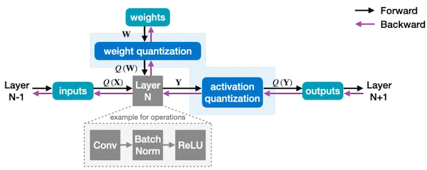
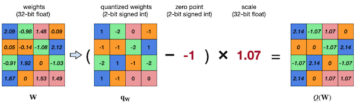
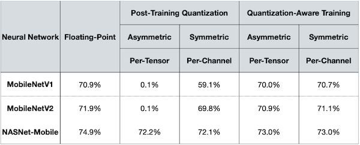
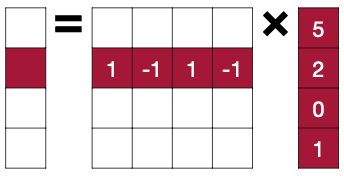
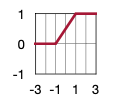
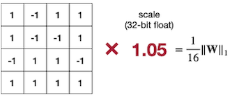
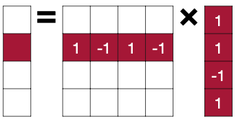
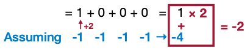

# Lecture 06 - Quantization (Part II)

## 6.5 Quantization-Aware Training(QAT)

**Quantization-Aware Training**(QAT)이란 training 혹은 re-training(fine-tuning)을 거쳐 최적의 quantization scheme을 찾는 방법이다.

| | PTQ | QAT |
| :---: | :---: | :---: |
| 속도 | 대체로 빠르다 | 느리다 |
| re-training 여부 | 불필요 | 학습 혹은 finetune 필요 |
| Plug and Play | 가능 | re-training이 필요 |
| accuracy | 정확도 하락을 조절하기 힘들다. | 비교적 정확도 하락을 조절할 수 있다. |

> Plug and Play(PnP): 별다른 설정없이 바로 적용이 가능하면 PnP라고 한다.

> PTQ는 data, backpropagation도 필요하지 않고 구조의 변화도 없어서 편리하다.

---

### 6.5.1 Considerations for QAT

> [Deep Compression: Compressing Deep Neural Networks with Pruning, Trained Quantization and Huffman Coding 논문(2015)](https://arxiv.org/abs/1510.00149)

우선 K-means-based quantization, linear quantization 방식의 forward 과정과 backward 과정을 복습해 보자.

- K-means-based quantization

    

    - forward, backward 과정을 거치며 centroids를 fine-tuning한다. 
    
    - weight가 어떤 cluster에 속하는가에 따라 그룹으로 분류한 뒤 평균값으로 update가 진행되다.

- linear quantization

    

    - Activation quantization

        input range [a, b]의 Exponential Moving Averages(이동 평균)을 기록한다.

        forward pass에서는 EMA를 참고해 scaling factor를 도출하여 양자화한다.

    - Weight quantization

        min-max 방법으로 양자화한다.

그런데 위 linear quantization 과정에서 weight quantization, activation quantization 단계는, **fake quantization**(simulated quantization) 방법을 통해 다양한 조건을 실험할 수 있다.

- full precision 복사본은 그대로 유지한 채, simulation하면서 quantization 성능을 검증한다. 

> 단, 학습 초기(초기 5만~200만 step)에는 fake quantization을 하지 않는 편이 좋다.

---

### 6.5.2 Simulated/Fake Quantization

linear quantization은 다음과 같이 표현할 수 있다.

$$ r = S(q-Z) $$

이때 linear quantization은 integer를 real number로 변환하는 affine mapping으로도 볼 수 있었다.



- Weight quantization

$$ W \rightarrow S_{W}(q_{W} - Z_{W}) = Q(W) $$

- Activation quantization

$$ Y \rightarrow S_{Y}(q_{Y} - Z_{Y}) = Q(Y) $$

---

### 6.5.3 Straight-Through Estimator(STE)

> [Estimating or Propagating Gradients Through Stochastic Neurons for Conditional Computation 논문(2013)](https://arxiv.org/abs/1308.3432)

> [UNDERSTANDING STRAIGHT-THROUGH ESTIMATOR IN TRAINING ACTIVATION QUANTIZED NEURAL NETS 논문(2019)](https://arxiv.org/abs/1903.05662)

그렇다면 (simulated) quantization에서 gradient backpropagation을 어떻게 수행해야 할까? 예시로 아래의 weight quantization를 보면 거의 모든 구간에서 gradient가 0인 것을 알 수 있다.


$$ {{\partial Q(W)} \over {\partial W}} = 0 $$

- gradient가 0이므로 backpropagation도 수행할 수 없다.

$$ g_{W} = {{\partial L} \over {\partial W}} = {{\partial L} \over {\partial Q(W)}} \cdot {{\partial Q(W)} \over {\partial W}} = 0 $$

이러한 문제를 해결하기 위해 **Straight-Through Estimator**(STE)을 도입한다. 위 backpropagation에서 quantization(threshold function)의 derivative(도함수)를 무시하고, 마치 identity function처럼 동작하도록 한다. 

$$ g_{W} = {{\partial L} \over {\partial W}} = {{\partial L} \over {\partial Q(W)}} $$

---

### 6.5.2 INT8 Linear Quantization-Aware Training

> [Quantizing deep convolutional networks for efficient inference: A whitepaper 논문(2017)](https://arxiv.org/abs/1806.08342)

작은 모델에서 INT8 linear QAT을 수행한 결과를 보면, PTQ보다 더 accuracy를 회복한 것을 알 수 있다.



게다가 quantization으로 인해 accuracy는 감소했지만, latency 측면에서 우수해지는 trade-off를 얻을 수 있다.


---

## 6.6 Binary Quantization

**Binary Quantization**은 더 나아가 1 bit만을 사용하는 양자화 방식이다. memory storage 측면이나 단순한 computation을 사용할 수 있다는 점에서 굉장히 큰 이점을 가진다. 

| | FP32 | K-Means-based<br/>Quantization | Linear<br/>Quantization | Binary/Ternary<br/>Quantization |
| :---: | :---: |  :---: |  :---: |  :---: | 
| Storage | FP | INT weights<br/>FP Codebook | INT weights | Binary/Ternary<br/>weights |
| Computation | FP | FP | INT | Bit Operations |

### <span style='background-color: #393E46; color: #F7F7F7'>&nbsp;&nbsp;&nbsp;📝 예제 1: Binary Weight Quantization &nbsp;&nbsp;&nbsp;</span>


$$ y_i = \sum_{j}{W_{ij} \cdot x_{j}} $$

위와 같은 행렬 연산이 있다. 다음 real number, binary quantization 경우의 memory, computation을 비교하라.

- real number

    

- binary quantization

    

### <span style='background-color: #C2B2B2; color: #F7F7F7'>&nbsp;&nbsp;&nbsp;🔍 풀이&nbsp;&nbsp;&nbsp;</span>

- real number

$$ 8 \times 5 + (-3) \times 2 + 5 \times 0 + (-1) \times 1 $$

- binary quantization

$$ 5 - 2 + 0 - 1 $$

| input | weight | operations | memory | computation |
| :---: | :---: | :---: | :---: | :---: |
| $\mathbb{R}$ | $\mathbb{R}$ | + x | 1x | 1x |
| $\mathbb{R}$ | $\mathbb{B}$ | + - | ~32x less | ~2x less |

---

### 6.6.1 Binarization

> [BinaryConnect: Training Deep Neural Networks with binary weights during propagations 논문(2015)](https://arxiv.org/abs/1511.00363)

**Binarization**은 크게 두 가지 방법으로 나뉜다.

- **Deterministic Binarization**

    정해둔 threshold에 따라 같거나 높은 값은 1, 낮은 값은 -1로 quantize한다.

```math
q = sign(r) = \begin{cases} +1, & r \ge 0 \\ -1, & r < 0 \end{cases}
```

- **Stochastic Binarization**

    global statistics 혹은 input data 값을 바탕으로 -1, +1이 될 probability를 결정한다.

    - 예를 들어 BinaryConnection 논문에서는, probability를 **hard sigmoid**를 이용해서 결정한다.( $\sigma (r)$ ) 

      

```math
q = \begin{cases} +1, & with \, probability \, p = \sigma(r) \\ -1, & with \, probability \, 1 - p \end{cases}
```

$$ \sigma (r) = \min (\max ({{r+1} \over {2}}), 1) $$

---

### 6.6.2 Binarize the weights and activations

> [XNOR-Net: ImageNet Classification Using Binary Convolutional Neural Networks 논문(2016)](https://arxiv.org/abs/1603.05279)

그러나 binarization은 특성상 error가 클 수밖에 없다. 다음 weight tensor(`fp32`)를 binaryconnection 논문 방식으로 binarization한 예시를 보자.


$$ W \approx \alpha W^{\mathbb{B}} $$

- scaling factor $\alpha$

$$ \alpha = {1 \over n}||W||_1 $$

> 연산이 끝난 feature map은 다시 scaling factor $\alpha$ 를 곱해진 값을 사용한다.

- quantization error

```math
|| W - W^{\mathbb{B}} |{|}^{2}_{F} = 9.28
```

> ImageNet 대상 AlexNet에서 Top1 accuracy는 -21.2%p 감소한다.

XNOR-Net 논문에서는 input feature map에도 마찬가지로 binarization을 도입하여 quantization error를 줄였다.(따라서 input을 위한 scaling factor $\beta$ 도 사용한다.)

$$ \beta = {1 \over n}||X||_1 $$



> ImageNet 대상 AlexNet에서 Top1 accuracy가 오히려 0.2%p 증가한다.

### <span style='background-color: #393E46; color: #F7F7F7'>&nbsp;&nbsp;&nbsp;📝 예제 2: XNOR-Net &nbsp;&nbsp;&nbsp;</span>

weight, activation에 binary quantization을 적용한 행렬 연산을 수행하고, 가능한 연산의 진리표를 작성하라.



### <span style='background-color: #C2B2B2; color: #F7F7F7'>&nbsp;&nbsp;&nbsp;🔍 풀이&nbsp;&nbsp;&nbsp;</span>

$$ y_i = \sum_{j}{W_{ij} \cdot x_{j}} $$

$$ = 1 \times 1 + (-1) \times 1 + 1 \times (-1) + (-1) \times 1 = -2 $$

가능한 연산의 진리표를 작성하면 다음과 같다.

| W | X | Y=WX |
| :---: | :---: | :---: |
| 1 | 1 | 1 |
| 1 | -1 | -1 |
| -1 | -1 | 1 |
| -1 | 1 | -1 |

위 진리표의 값을 치환하면 XNOR 연산과 완전히 일치한다.

| $b_w$ | $b_x$ | XNOR( $b_w, b_x$ ) |
| :---: | :---: | :---: |
| 1 | 1 | 1 |
| 1 | 0 | 0 |
| 0 | 0 | 1 |
| 0 | 1 | 0 |

앞서 수행한 계산을 xnor로 표현하면 다음과 같다.

$$ = 1 \, \mathrm{xnor} \, 0 + 0 \, \mathrm{xnor} \, 1 + 1  \, \mathrm{xnor} \, 0 + 0 \, \mathrm{xnor} \, 1 = 1 $$

> 원소 중 1의 개수가 얼마나 있는지(**popcount** 연산)로 대신할 수 있다.

그런데 이러한 경우 정답이 -2와 1로 일치하지 않게 되므로 보정이 필요하다.

$$ y_i = -n + 2 \cdot \sum_{j} W_{ij} \, \mathrm{xnor} \, x_j $$

$$ = -4 + 2 \times (1 \, \mathrm{xnor} \, 0 + 0 \, \mathrm{xnor} \, 1 + 1  \, \mathrm{xnor} \, 0 + 0 \, \mathrm{xnor} \, 1) $$

$$ -4 + 2 \times (1 + 0 + 0 + 0) = -2 $$



| input | weight | operations | memory | computation |
| :---: | :---: | :---: | :---: | :---: |
| $\mathbb{R}$ | $\mathbb{R}$ | + x | 1x | 1x |
| $\mathbb{R}$ | $\mathbb{B}$ | + - | ~32x less | ~2x less |
| $\mathbb{B}$ | $\mathbb{B}$ | xnor, popcount | ~32x less | ~58x less |

---

### 6.6.3 Accuracy Degradation of Binarization

binarization에 따른 정확도 하락을 정리한 도표를 살펴보자.


- BWN: **Binary Weight Network** with scale for weight binarization

- BNN: **Binarized Neural Network** without scale factors

---
