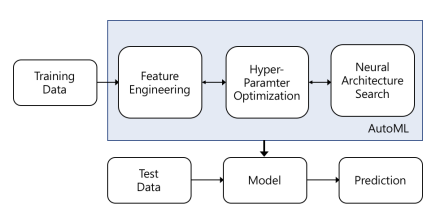
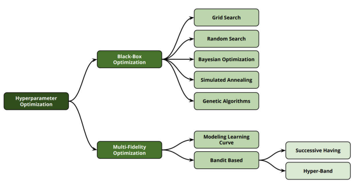
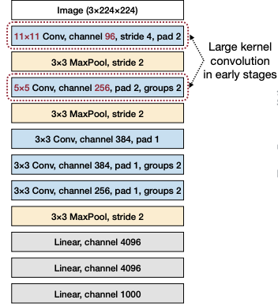
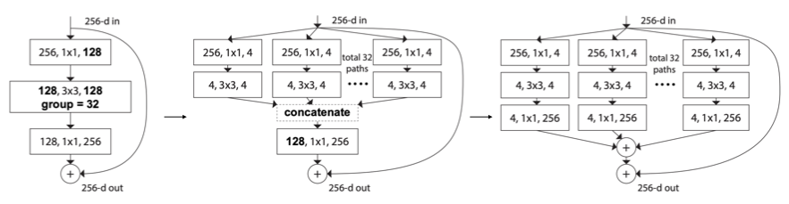

# 7 Neural Architecture Search (Part I)

> [Lecture 07 - Neural Architecture Search (Part I) | MIT 6.S965](https://www.youtube.com/watch?v=NQj5TkqX48Q)

> [AutoML 기술 동향](https://ettrends.etri.re.kr/ettrends/178/0905178004/34-4_32-42.pdf2)

AutoML(자동기계학습)에서는 다음과 같은 process를 자동화하는 데 중점을 두고 있다.

- **feature engineering**

    data와 관련 있는 domain knowledge를 이용하여 feature를 만드는 과정이다.

    > ML model을 위한 data table의 column을 생성하거나 선택하는 작업을 의미한다.

- **HPO**(Hyper-Parameter Optimization)

    

    model training이 고정된 hyperparameter 상에서 model parameter를 학습하는 것과 달리, HPO는 **meta-optimization**으로 hyper-parameter 자체를 학습한다.

    > hyperparameter로는 learning rate, lr scheduling 방법, loss function, epoch, weight initialization 방법, normalization 방법, layer depth 등이 해당된다.
    
    > 그런데 hyper-parameter를 변경할 경우, model weight를 초기화하고 처음부터 다시 훈련을 수행해야 한다. 따라서 이를 방지하기 위한 Hyperband 등의 방식이 제안됐다.

- **NAS**(Neural Architecture Search)

    target data와 task를 가지고, 가장 efficient하게 training될 수 있는 neural network를 탐색 대상으로 삼는다.

    - Evolutionary Algorithms(진화 알고리즘) 기반 탐색(AmeobaNet 등)
    
    - Reinforcement Learning(강화 학습) 기반 탐색(NASNet 등)

    - Gradient Descent 기반 탐색

---

## 7.1 Basic Concepts

neural network architecture는 보통 input stem, head, 그리고 여러 stage들로 구성되어 있다.

- input stem: 보통 receptive field를 크게 갖기 위해 large kernel을 사용한다. high **resolution**( pixel의 개수. $224 \times 224$ )을 갖는다.

  - channel 수가 3개로 매우 적기 때문에, 비교적 계산이 많이 필요하지는 않다.

  - resolution을 ( $56 \times 56$ )으로 downsampling한다.

- stage: 위 그림에서 4개가 존재하며, 각 stage 내부에서는 resolution이 동일하다.

- head: detection head, segmentation head 등 task 목적에 따라 위치하게 된다.

보통 각 stage의 first block에서 resolution을 줄이는 **feature map downsampling**이 적용된다.(stride convolution이나 pooling으로 구현)

그림의 stage 내부를 자세히 보면 input과 output dimension이 동일하므로 **residual/skip connection**을 적용해 준 부분을 확인할 수 있다. 

> 더 낮은 error rate를 얻기 위해 capacity를 늘리고 싶지만, layer 수가 늘어난다고 해서 error가 감소하지는 않고 실제로는 증가하기도 한다. 따라서 residual/skip connection으로 optimization이 가능하다.

다음은 여러 manually-design된 neural network의 예시다.

---

### 7.1.1 manually-designed neural network

- **AlexNet**(2012)

    

    AlexNet은 image가 3개의 적은 channel( $3 \times 224 \times 224$ )을 가지므로, 시작 stage에서 큰 kernel을 도입했다.( $11 \times 11$ (channel 96) , 그 다음은 $5 \times 5$ (channel 256) )

- **VGGNet**(2014)

    

    여러 개의 kernel을 쌓는 편이 큰 kernel을 하나 사용하는 것보다 더 효율적이지 않을까?라는 가정에서 시작한다.(즉, "parameter 수가 적은 network가 더 유용하다"는 가정이다.)

    VGGNet은 오직 $3 \times 3$ convolution을 사용한다. 이를 한 stage에서 두 번 사용하는 것이( $3 \times 3 + 3 \times 3 = 18$ parameters ),  $5 \times 5$ (=25 parameters) 를 한 번 적용하는 것보다 computational cost가 적게 들면서도 더 나은 성능을 보였다.

    > 하지만 layer, kernel call, activation load/store 수가 늘어나므로 memory efficiency는 더 나빠지게 된다. 

    

    또한 $(3 \times 3)$ convolution이 bottleneck을 유발하는 지점이 된다.

- **SqueezeNet**(2016)

    

    SqueezeNet은 $3 \times 3$ convolution을 **fire module**로 교체했다. 또한 head 지점에서 **global average pooling**(1차원 vector로 변경)을 적용해서, head 부분의 cost를 줄였다.

    > 큰 activation map을 가지고 있을수록 성능이 좋기 때문에, SqueezeNet에서는 후반부에서 집중적으로 downsampilng을 적용한다.

    > layer 하나의 filter 연산에 필요한 parameter의 총 개수는 (input channel 수) * (filter 개수) * ( grid(3*3) )였다. 따라서 filter의 수를 줄이고, input channel의 수를 줄여서 parameter 수를 줄이는 전략을 사용한 것이다.

    fire module은 총 두 가지 layer로 구성된다.

    

    > [1x1 convolution이란?](https://euneestella.github.io/research/2021-10-14-why-we-use-1x1-convolution-at-deep-learning/): resolution은 변하지 않고, channel의 수만 더 적은 크기로 조절된다.(feature map의 차원이 $1 \times 1$ filter의 개수로 축소된다.), 반대로 $1 \times 1$ convolution을 이용해 feature map 차원을 늘릴 수도 있다.
 
    1. squeeze convolution layer: $3 \times 3$ convolution filter 대신 $1 \times 1$ filter로 교체해서 수행한다.(parameter가 9x 감소하는 효과) 수행한 뒤 ReLU activation을 거친다.

    2. expand convolution layer: $1 \times 1$ , $3 \times 3$ filter를 사용한다. 마찬가지로 ReLU activation을 적용한다.

    
    
    이때 squeeze convolution layer의 $1 \times 1$ filter 개수 $s_{1 \times 1}$ 를, expand convolution layer의 $1 \times 1$ , $3 \times 3$ filter 개수인 $e_{1 \times 1}, e_{3 \times 3}$ 의 합보다 작게 설정해서 $3 \times 3$ filter로 들어가는 channel 수를 제한한다.

    > fire9 이후 dropout 50%를 적용한다. 
    
    > 또한 SqueezeNet에 deep compression을 적용해도, model size가 510개 가량 줄어들지만 성능은 크게 차이가 나지 않는 유연함을 보인다.

---

### 7.1.2 ResNet50: bottleneck block

ResNet에서 소개된 개념으로, **bypass layer**를 적용하는 개선으로 bottleneck을 줄일 수 있다.

다음은 **Residual Block**의 구조를 나타낸 그림이다.

1. $1 \times 1$ convolution을 사용해서 channel 수를 4배 줄인다.(이 다음 batch normalization과 ReLU를 거친다.)

2. channel 개수가 줄어든 feature map에 $3 \times 3$ convolution을 적용한다.(이 다음 batch normalization과 ReLU를 거친다.)

3. $1 \times 1$ convolution을 사용해서 chennel 수를 다시 4배 늘려서 맞춰 준다.

> 총 8.5배 연산이 줄어든다. input을 $x$ 라고 하고 1~3 과정을 거친 output을 $F(x)$ 로 표현한다.

4. input과 output의 channel 수가 같으므로, $F(x) + x$ 를 수행하여 shortcut을 구현한다.

> shortcut을 만드는 이유는 다음과 같다. 예를 들어 정사각형 발판 위에 서커스 코끼리가 서 있는 image가 있다고 하면, 정사각형 발판에 해당되는 input은 낮은 수준의 non-linearity로 해결할 수 있다. 

> 따라서 이러한 shortcut은 복잡도가 다른 요소들이 서로 다른 경로를 통해 학습되며, 적절한 non-linearity를 선택할 수 있게 된다.(정사각형 발판은 코끼리보다 더 많은 층을 뛰어넘는 짧은 경로로 진행될 것이다.) 이런 방식을 **residual learning**(잔차 학습)이라고 지칭한다.

---

### 7.2.2 ResNeXt: grouped convolution

ResNeXt(2017)에서는 $3 \times 3$ convolution을 $3 \times 3$ **grouped convolution**으로 대체한다. 차원을 줄이고 **cardinality**를 늘려서 효율을 높인 것이다.

> hyperparameter로 쓰인 cardinality는 convolution을 몇 개의 그룹으로 분할했는지 나타낸다. 수학에서 쓰이는 cardinality는 두 개체간의 관계(일대일, 일대다, 다대다)를 나타낸다.

다음은 결과는 동일하지만 과정은 다른 세 가지 방식의 grouped convolution을 나타낸 그림이다.(cardinality = 32)

- 왼쪽 이미지

  - $3 \times 3$ convolution을, 32 path의 4차원 $3 \times 3$ convolution으로 수행한다.

- 중간 이미지

  - $3 \times 3$ convolution보다 먼저 128차원의 $1 \times 1$ convolution을, 32 path의 4차원 $1 \times 1$ convolution으로 수행한 뒤 **concatenate**(연결)한다.

- 오른쪽 이미지

  - 더 나아가서 expand 과정도 group별로 나눠서 수행한 뒤 32 path를 모두 합산한다.

이 중에서는 맨 왼쪽 방식이 parallel cost가 더 적기 때문에 hardware-friendly하다.

> 사실 중간이 제일 먼저 제안된 ResNeXt block이다. 왼쪽이 그 다음 등장했으며 구현이 가장 간단하면서도 효율적인 구조이다.(GPU와 관련이 깊다.)

> 이런 복잡한 computational graph을 자동으로 mapping할 수 있는 방법들이 여럿 제시됐다.

---
