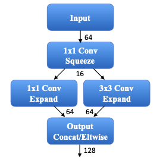
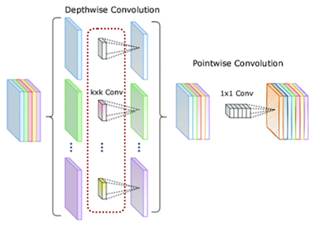

# 7 Neural Architecture Search (Part I)

> [Lecture 07 - Neural Architecture Search (Part I) | MIT 6.S965](https://www.youtube.com/watch?v=NQj5TkqX48Q)

> [AutoML 기술 동향](https://ettrends.etri.re.kr/ettrends/178/0905178004/34-4_32-42.pdf2)

AutoML(자동기계학습)에서는 크게 세 가지 process를 자동화하는 데 중점을 둔다.

- **feature engineering**

    domain knowledge를 바탕으로 feature를 만드는 과정이다.

- **Hyper-Parameter Optimization**(HPO)

    HPO는 **meta-optimization**으로, hyperparameter 자체를 자동으로 optimization한다.

    > hyperparameter: learning rate, lr scheduling, loss function, epoch, weight initialization, normalization, \#layers 등

- **Neural Architecture Search**(NAS)

  최적의 model architecture를 자동으로 탐색한다.

  - Evolutionary Algorithms(진화 알고리즘) 기반 탐색(AmeobaNet 등)
  
  - Reinforcement Learning(강화 학습) 기반 탐색(NASNet 등)

  - Gradient Descent 기반 탐색

이중에서도 Neural Architecture Search(NAS)를 중점적으로 살펴볼 것이다.

---

## 7.1 Basic Concepts

---

### 7.1.1 Stages

Neural Network architecture는 input stem, head, 그리고 여러 stage로 나눌 수 있다.

- **Input Stem** 

  가장 큰 resolution input을 갖는 부분으로, aggressive하게 downsampling을 수행한다.
  
  예시에서는 resolution을 ( $56 \times 56$ )으로 downsampling한다.

  - 큰 receptive field를 얻기 위해, 대체로 large kernel( $7 \times 7$ )을 사용한다.

  - channel 수가 3개로 매우 적기 때문에, 계산이 많이 필요하지는 않다.

- **Stage**

  각 stage 내부에서는 input resolution이 동일하다.

  - early stage: large feature map size를 갖는다.(activation memory가 많이 필요하다.)

  - late stage: small feature map size를 갖는다.

    따라서 그만큼 width(\#channels)를 늘릴 수 있다.

- **head**

  **application-specific**한 부분으로 detection head, segmentation head 등이 위치하게 된다.

---

### 7.1.2 Downsampling, Residual/Skip connection

- 대체로 각 stage의 first block에서 **feature map downsampling**을 수행한다. 

  stride convolution 혹은 pooling을 통해 downsampling을 수행한다.

- 나머지 blocks에서는 input, output dimensions이 동일하므로 **residual/skip connection**을 더해줄 수 있다.

---

## 7.2 manually-designed neural network

---

### 7.2.1 AlexNet, VGGNet

- **AlexNet**(2012)

  

  특징으로 ealry stage에서 큰 kernel을 사용한다.
  
  - $11 \times 11$ (channel 96) , 그 다음은 $5 \times 5$ (channel 256)

- **VGGNet**(2014)

  반면 VGGNet은 early stage에서 작은 kernel을 여러 개 쌓아서 더 나은 성능을 얻었다.

  

  - 오직 $3 \times 3$ convolution을 사용한다. 
  
  - 한 stage에서 $3 \times 3$ 레이어를 두 개 쌓는 것이( $3 \times 3 + 3 \times 3 = 18$ parameters ),  $5 \times 5$ (=25 parameters) 레이어 하나보다 computational cost가 적게 들면서도 더 나은 성능을 보였다.

  - 단, layer, kernel call, activation load/store 수가 늘어나므로, memory efficiency 측면에서는 더 비효율적이다. 

    특히 VGGNet의 $(3 \times 3)$ convolution은 bottleneck을 유발하는 지점이 되었다.

    

---

### 7.2.2 SqueezeNet

> [SqueezeNet: AlexNet-level accuracy with 50x fewer parameters and <0.5MB model size 논문(2016)](https://arxiv.org/pdf/1602.07360)

**SqueezeNet**은 $3 \times 3$ convolution을 **fire module**이라는 연산으로 교체하여, 더 적은 parameter로 효율적으로 연산을 구현했다. 

- head

  **global average pooling**을 사용하여 cost를 줄인다.

- fire module

  $1 \times 1$ convolution(**squeeze**)과 $3 \times 3$ convolution(**expand**)을 함께 사용하여 효과적으로 연산을 수행한다.

  > [1x1 convolution이란?](https://euneestella.github.io/research/2021-10-14-why-we-use-1x1-convolution-at-deep-learning/)
  
  > $1 \times 1$ convolution을 이용하면 resolution 변화 없이 input feature map의 \#channels를 조절할 수 있다. **pointwise convolution**이라고도 지칭한다.

fire module의 단계별 과정을 더 자세히 살펴보자.

- Squeeze

    1x1 convolution으로 channel을 압축한다.

    

- expand

  1x1 convolution, 일부는 3x3 convolution 연산을 수행한다.

- concatenate
  
  1x1 convolution output, 3x3 convolution output을 합친다.

---

### 7.2.3 ResNet50: bottleneck block

> [Deep Residual Learning for Image Recognition 논문(2015)](https://arxiv.org/abs/1512.03385)

ResNet50에서는 **bottleneck block**을 도입한다.

1. $1 \times 1$ convolution

    \#channels: $2048 \rightarrow 512$

2. $3 \times 3$ convolution

    > batch normalization, ReLU 적용

3. $1 \times 1$ convolution

    \#channels: $512 \rightarrow 2048$

4. shortcut

    $F(x) + x$ 

### &nbsp;&nbsp;&nbsp;📝 예제 1: bottleneck block MACs &nbsp;&nbsp;&nbsp;

위 bottleneck block 예시에서 얼마나 \#MACs 연산이 줄었는지를 구하라.

### &nbsp;&nbsp;&nbsp;🔍 풀이&nbsp;&nbsp;&nbsp;

- 기존(\#channels 2048, \#kernels 9)

$$ 2048 \times 2048 \times H \times W \times 9 = 512 \times 512 \times H \times W \times 144 $$

- bottleneck block

$$ 2048 \times 512 \times H \times W \times 1 $$

$$ + 512 \times 512 \times H \times W \times 9 $$

$$ + 2048 \times 512 \times H \times W \times 1 $$

$$ = 512 \times 512 \times H \times W \times 17 $$

총 8.5배 \#MACs 연산이 줄어든다.

---

### 7.2.4 ResNeXt: grouped convolution

> [Aggregated Residual Transformations for Deep Neural Networks 논문(2017)](https://arxiv.org/abs/1611.05431)

**ResNeXt**(2017)에서는 **grouped convolution**을 도입한다. 다음은 결과는 동일하지만 과정은 다른 세 가지 방식의 grouped convolution 예시다.

- 왼쪽

  - input(dimension 256)에 $1 \times 1$ convolution을 적용하여 128 dimension으로 압축한다.
  
  - 32개 group으로 나눠 $3 \times 3$ group convolution을 수행한다.

- 중간

  - input(dimension 256)을 32개 group으로 먼저 나눈 뒤, $1 \times 1$ convolution을 적용하여 각각 4 dimension으로 압축한다.
  
  - $3 \times 3$ group convolution을 수행 후 concatenation한다.

- 오른쪽

  - concatenation 대신 $1 \times 1$ convolution으로 256 dimension으로 확장한 뒤 합산한다.

맨 왼쪽 방식이 parallel cost가 더 적기 때문에 hardware-friendly하고 GPU 가속에 유리하다.

> 사실 중간이 제일 먼저 제안된 ResNeXt block이다.

---

### 7.2.5 MobileNet: depthwise-separable block

> [MobileNets: Efficient Convolutional Neural Networks for Mobile Vision Applications 논문(2017)](https://arxiv.org/abs/1704.04861)

> [depthwise-separable convolution 정리](https://velog.io/@woojinn8/LightWeight-Deep-Learning-5.-MobileNet)

**MobileNet**(2017)은 depthwise-separable convolution, pointwise convolution 두 가지 layer로 구성된 **depthwise-separable block**을 제안했다. 

> \#channels = \#groups인 group convolution의 극단적인 형태로도 볼 수 있다.

- **depthwise-seperable convolution**

  input의 모든 channel을 분리하고, spatial information capture를 위한 convolution을 수행한다.

- **pointwise convolution**

  channel별로 수행된 결과물을 다시 합친 뒤, pointwise convolution을 통해 channel 사이의 information을 fuse한다.

추가로 activation function으로 ReLU6를 사용하여 연산량을 더욱 줄인다.

> depthwise-separable convolution은 Xception이란 논문에서 먼저 제안된 방식이다. 하지만 Xception 논문은 accuracy 향상을 위한 목적이었지만 MobileNet은 경량화를 위해서 사용한다.

---

#### 7.2.5.1  Width Multiplier, Resolution Multiplier

또한 MobileNet에서는 model shrinking을 위한 두 가지 parameter를 추가로 도입했다.

- **Width Multiplier** $\alpha$

  각 layer가 갖는 \#channels를 uniform하게 scaling하는 parameter이다.
  
  - \#input channels: $M \rightarrow {\alpha}M$
  
  - \#output channels $N \rightarrow {\alpha}N$

  - $\alpha \in (0, 1]$ 

  > 주로 1, 0.75, 0.5, 0.25 값을 사용한다.

- **Resolution Multiplier** $\rho$

  input resolution을 줄이는 parameter. 결과적으로 모든 layer의 internal representation이 동일한 비율로 감소하게 된다.

  - $\rho \in (0, 1]$

---

### 7.2.6 MobileNetV2: inverted bottleneck block

> [MobileNetV2: Inverted Residuals and Linear Bottlenecks 논문(2018)](https://arxiv.org/pdf/1801.04381.pdf)

**MobileNetV2**(2018)는 depthwise-separable block의 정보 손실을 compensate할 수 있는 **inverted bottleneck block** 방법을 제시한다. 

- 특히 ReLU를 activation function으로 사용할 때, input/output channel이 많을수록 정보 손실이 적다는 점을 이용한다.

  

  > 더 낮은 차원의 subspace로 mapping되는 information을 **maniford**라고 지칭한다.

inverted bottleneck block에서는 ReLU로 인한 정보 손실을 막기 위해, 먼저 $1 \times 1$ convolution을 이용해 input channel 수를 늘린다.

- MobileNetV2 stride=1 block

  inverted bottleneck block과 skip connection을 적용한다.

  

- MobileNetV2 stride=2 block

  inverted bottleneck block 연산과 downsampling을 수행한다.

논문에서 제시한 MobileNetV2의 architecture는 다음과 같다.

- $t$ : expansion factor(주로 5~10)

- $c$ : \#output channels

- $n$ : \#blocks

- $s$ : stride

- spatial convolution은 모두 3x3 kernel만을 사용한다.

---

### 7.2.7 ShuffleNet: 1x1 group convolution & channel shuffle

> [ShuffleNet: An Extremely Efficient Convolutional Neural Network for Mobile Devices 논문(2018)](https://arxiv.org/abs/1707.01083)
 
ShuffleNet에서는 다른 group의 channel information를 교환하기 위한 **channel shuffle** 기법을 제안했다.

---

### 7.2.8 SENet: Squeeze-and-Excitation block

> [Squeeze-and-Excitation Networks 논문(2017)](https://arxiv.org/pdf/1709.01507.pdf)

SENet은 **Squeeze-and-Excitation**(**SE**) block을 도입하여 ILSVRC 2017에서 우승한 model이다. 

- SE block의 목적은 feature map의 <U>각 channel의 정보가 얼마나 중요한지를 판단</U>하는 것이다. 

SE block은 다른 CNN model(VGG, ResNet 등)의 어디든 부착할 수 있다. block은 크게 squeeze, excitation 단계로 나뉜다.

- **Squeeze**(압축)

  spatial information을 $1 \times 1$ 로 압축(depth인 channel 개수는 유지). global average pooling 연산을 이용한다.

  - $F_{sq}(\cdot)$ : Squeeze(global average pooling)

  - $u_{c}$ : channel $c$ 의 feature map( $H \times W$ )

$$ z = F_{sq}(u_{c}) = {{1} \over {H \times W}} {\sum_{i=1}^{H}}{\sum_{j=1}^{W}}{u_{c}(i, j)} $$

- **Excitation**(재조정)

  squeeze로 얻은 1차원 벡터를 normalize한 뒤 가중치 벡터로 사용한다. 
  
  normalize는 FC1 - ReLU - FC2 - Sigmoid 순서로 진행된다.

  - $W_{1}, W_{2}$ : FC layer weight matrix

    - reduction ratio $r$ 을 둬서 노드 수를 조절한다.

    - $W_{1} \in \mathbb{R}^{{C \over r} \times C}$ , $W_{2} \in \mathbb{R}^{C \times {C \over r}}$

  - sigmoid function을 이용해 0과 1 사이의 값으로 normalize한다.

  

$$ s = F_{ex}(z, W) = {\sigma}(W_{2} {\delta}(W_{1} z)) $$

> $\delta$ : ReLU 연산, $\sigma$ : Sigmoid 연산

> reduction ratio $r$ 은 \#parameters(계산 복잡도)에 영향을 미친다. 따라서 $r$ 을 바꿔가며 최적의 값을 찾는 과정이 필요하다.(물론 SE block을 추가해서 \#parameters가 크게 늘어나지는 않는다.)

이렇게 구한 가중치 벡터 $s$ 를 원래 feature map $u$ 에 곱해서 중요한 channel 정보를 강조한다.

$$ F_{scale}(u_{c}, s_{c}) = s_{c} \cdot u_{c} $$

---

### 7.2.9 MobileNetV3

> [Searching for MobileNetV3 논문(2019)](https://arxiv.org/pdf/1905.02244.pdf)

**MobileNetV3**(2019)는 MobileNetV2의 후속 논문으로, NetAdapt algorithm + hardware-aware NAS를 이용해 찾은 개선된 architecture이다. 논문에서는 model size가 다른 두 가지 버전을 제안한다.

- MobileNetV3-Large

  

- MobileNetV3-Small

  

앞서 본 MobileNetV2와 비교하면 더 많은 layer를 가지면서도 다양한 kernel size를 사용한다. 

- SE: Squeeze-and-Excitation block

- NL: type of nonlinearity used

  - HS: h-swish

  - RE: ReLU

- NBN: batch normalization

---

#### 7.2.9.1 MobileNetV2 vs MobileNetV3

특히 MbV2의 expensive layers와 nonlinearity function을 보완한 구조를 갖고 있다.

- redesign expensive layers(last stage)

  

  - Original Last Stage(MobileNetV2)

    1x1 conv를 사용해 feature를 7x7x1280으로 만든 뒤 avgpool을 적용했다. 
    
    덕분에 rich feature를 얻을 수는 있었지만 cost가 다른 layer에 비해서 너무 컸다.

  - Efficient Last Stage(MobileNetV3)

    먼저 avgpool을 적용해서 feature를 추출한 뒤 1x1 conv를 통해 channel 수를 늘린다. 

- nonlinearity(activation function)으로 **h-swish**를 함께 사용한다.

  > 단독으로 h-swish만을 사용하기보다는 ReLU와 함께 사용하는 편이 더 좋은 성능을 보인다.

---

#### 7.2.9.2 swish, h-swish

우선 ReLU를 대체하기 위한 nonlinearity인 **swish**는 다음과 같은 형태를 갖는다.

$$ \mathrm{swish} \, x = x \cdot {\sigma}(x) $$

$$ {\sigma}(x) = {{1} \over {1 + e^{-x}}} $$

- sigmoid function( ${\sigma}(x)$ )을 사용한다.

- 하지만 ReLU와 달리 어느 정도 음수를 허용하며 직선이 아닌 곡선 형태를 갖는다.

- 미분해서 상수 값이 아니다.

하지만 sigmoid 연산은 복잡한 연산이며 hardware에 따라 제약이 있기 때문에 이를 보완하는 **h-swish**가 등장했다.

$$ x{{\mathrm{ReLU}6(x+3)} \over {6}} $$

---

### 7.2.10 accuracy-efficiency trade-off on ImageNet

다음은 ImageNet 데이터셋으로 훈련한 여러 model의 MACs와 accuracy를 나타낸 도표다.

> 단, 실제 downstream(산업)에서 활용할 때는 benchmark만 믿어서는 안 된다. 성능이 benchmark와 일치한다는 보장은 없다.

---