# 7 Neural Architecture Search (Part I)

> [Lecture 07 - Neural Architecture Search (Part I) | MIT 6.S965](https://www.youtube.com/watch?v=NQj5TkqX48Q)

> [AutoML 기술 동향](https://ettrends.etri.re.kr/ettrends/178/0905178004/34-4_32-42.pdf2)

AutoML(자동기계학습)에서는 다음과 같은 process를 자동화하는 데 중점을 두고 있다.

- **feature engineering**

    data와 관련 있는 domain knowledge를 이용하여 feature를 만드는 과정이다.

    > ML model을 위한 data table의 column을 생성하거나 선택하는 작업을 의미한다.

- **HPO**(Hyper-Parameter Optimization)

    

    model training이 고정된 hyperparameter 상에서 model parameter를 학습하는 것과 달리, HPO는 **meta-optimization**으로 hyperparameter 자체를 학습한다.

    > hyperparameter로는 learning rate, lr scheduling 방법, loss function, epoch, weight initialization 방법, normalization 방법, layer depth 등이 해당된다.
    
    > 그런데 hyperparameter를 변경할 경우, model weight를 초기화하고 처음부터 다시 훈련을 수행해야 한다. 따라서 이를 방지하기 위한 Hyperband 등의 방식이 제안됐다.

- **NAS**(Neural Architecture Search)

    target data와 task를 가지고, 가장 efficient하게 training될 수 있는 neural network를 탐색 대상으로 삼는다.

    - Evolutionary Algorithms(진화 알고리즘) 기반 탐색(AmeobaNet 등)
    
    - Reinforcement Learning(강화 학습) 기반 탐색(NASNet 등)

    - Gradient Descent 기반 탐색

---

## 7.1 Basic Concepts

neural network architecture는 보통 input stem, head, 그리고 여러 stage들로 구성되어 있다.

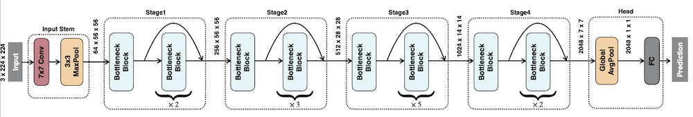

- input stem: 보통 receptive field를 크게 갖기 위해 large kernel을 사용한다. high **resolution**( pixel의 개수. $224 \times 224$ )을 갖는다.

  - channel 수가 3개로 매우 적기 때문에, 비교적 계산이 많이 필요하지는 않다.

  - resolution을 ( $56 \times 56$ )으로 downsampling한다.

- stage: 위 그림에서 4개가 존재하며, 각 stage 내부에서는 resolution이 동일하다.

- head: detection head, segmentation head 등 task 목적에 따라 위치하게 된다.

보통 각 stage의 first block에서 resolution을 줄이는 **feature map downsampling**이 적용된다.(stride convolution이나 pooling으로 구현)

그림의 stage 내부를 자세히 보면 input과 output dimension이 동일하므로 **residual/skip connection**을 적용해 준 부분을 확인할 수 있다. 

> 더 낮은 error rate를 얻기 위해 capacity를 늘리고 싶지만, layer 수가 늘어난다고 해서 error가 감소하지는 않고 실제로는 증가하기도 한다. 따라서 residual/skip connection으로 optimization이 가능하다.

다음은 여러 manually-design된 neural network의 예시다.

---

## 7.2 manually-designed neural network

---

### 7.2.1 AlexNet, VGGNet

- **AlexNet**(2012)

    

    AlexNet은 image가 3개의 적은 channel( $3 \times 224 \times 224$ )을 가지므로, 시작 stage에서 큰 kernel을 도입했다.( $11 \times 11$ (channel 96) , 그 다음은 $5 \times 5$ (channel 256) )

- **VGGNet**(2014)

    

    여러 개의 kernel을 쌓는 편이 큰 kernel을 하나 사용하는 것보다 더 효율적이지 않을까?라는 가정에서 시작한다.(즉, "parameter 수가 적은 network가 더 유용하다"는 가정이다.)

    VGGNet은 오직 $3 \times 3$ convolution을 사용한다. 이를 한 stage에서 두 번 사용하는 것이( $3 \times 3 + 3 \times 3 = 18$ parameters ),  $5 \times 5$ (=25 parameters) 를 한 번 적용하는 것보다 computational cost가 적게 들면서도 더 나은 성능을 보였다.

    > 하지만 layer, kernel call, activation load/store 수가 늘어나므로 memory efficiency는 더 나빠지게 된다. 

    

    또한 $(3 \times 3)$ convolution이 bottleneck을 유발하는 지점이 된다.

---

### 7.2.2 SqueezeNet

> [SqueezeNet 논문](https://arxiv.org/pdf/1602.07360)

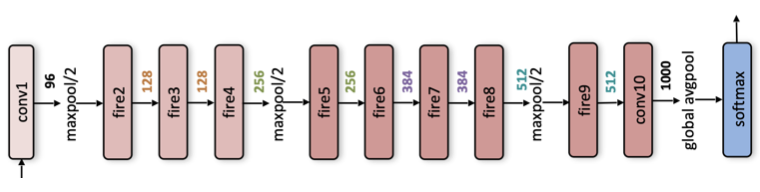

**SqueezeNet**(2016)은 $3 \times 3$ convolution을 **fire module**이라는 연산으로 교체해서 수행한다. 

또한 head 지점에서 **global average pooling**(1차원 vector로 변경)을 적용해서 head 부분의 cost를 줄인다.

우선 SqueezeNet의 fire module은 'layer 하나당 3x3 filter 연산에 필요한 parameter의 양'을 줄이고자 하는 시도다. 

필요한 parameter 개수를 잠시 계산해 보자. input image (150, 150, 3)에 (3, 3) filter 32개(=output channel 수)를 적용하면 필요한 parameter 갯수는 다음과 같다.

- $3 \times 3$ (filter size) $\times 3$ (input channel) $\times 32$ (filter 개수)

> bias가 있을 때는 이 식에 bias 개수를 단순히 더하면 된다.

SqueezeNet은 다음과 같은 방법으로 parameter 수를 줄인다.

1. 3x3 filter(9개 parameter) 대신 
**1x1 filter**(1개 parameter)를 사용해서 parameter 수를 9배 줄인다. 

    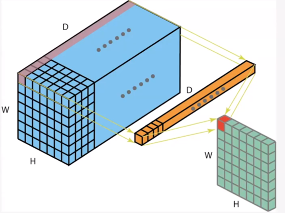

2. input channel 수를 **squeeze**하여 parameter 수를 줄인다.

   > 마찬가지로 1x1 filter convolution으로 channel 수를 줄일 수 있다. [1x1 convolution이란?](https://euneestella.github.io/research/2021-10-14-why-we-use-1x1-convolution-at-deep-learning/): resolution은 변하지 않고, channel의 수만 더 적은 크기로 조절된다.(feature map의 차원이 $1 \times 1$ filter의 개수로 축소된다.), 반대로 $1 \times 1$ convolution을 이용해 feature map 차원을 늘릴 수도 있다. 이를 **pointwise convolution**이라고 지칭한다.

3. 초반부는 큰 activation map을 갖도록 network를 구성해서 최대한 압축에 의한 정보 손실을 막고, **후반부에 가서 집중적으로 downsampling**을 수행한다.

> 이렇게 parameter 수를 줄이면 (1) distributed training이 더 용이해지고 (2) overhead가 줄어서 학습도 빨라지며, (3) embedded system에서 수행할 수준으로 작은 model로 만들 수 있다.

fire module은 **squeeze**, **expand** 두 가지 단계로 진행된다. 아래 128개 channel을 갖는 input이 있을 때 fire module을 거치는 과정을 표현한 예시를 보며 파악해 보자.

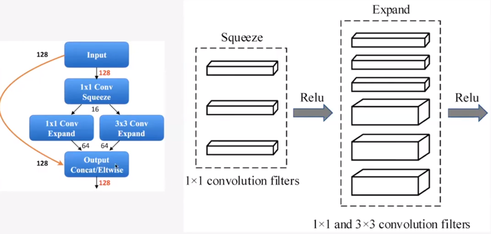

1. **squeeze**: (128개 channel을 가진 input이) 1x1 filter에 의해 16개 channel을 갖게 squeeze된다.

2. **expand**: squeeze된 16개 channel을 갖는 input에 각각 1x1 filter와 3x3 filter 연산을 수행한다.

    - 1x1 filter: 64개 channel을 갖는 output을 만든다.

    - 3x3 filter: 64개 channel을 갖는 output을 만든다.

    - 1x1 filter와 3x3 filter의 output을 **concatenate**하면 총 128개 channel을 갖는 output이 생긴다.

위 예시는 input의 channel 수와 output의 channel 수가 동일하지만 fire module마다 이 비율을 조절할 수 있다. 이제 fire module들로 구성된 3가지 SqueezeNet 구조를 살펴보자.

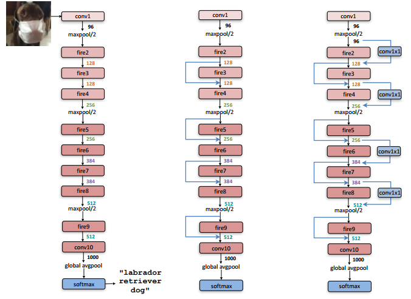

- 왼쪽: 기본 구조

- 가운데: 기본 구조 + simple bypass

- 오른쪽: 기본 구조 + complex bypass

> bypass는 아래 7.2.3절(ResNet)에서 소개할 개념으로 skip connection으로 불리는 방법이다. bypass를 이용하면 fire module이 갖는 bottleneck 문제를 일정 부분 해결할 수 있다.

bypass를 적용하기 위해서는 중요한 조건이 있다. 바로 **input channel 수와 output channel 수가 동일**해야 한다는 점이다. 가운데 구조는 이런 조건에 맞춰서 가능한 구간만 skip connection을 적용한 것이며, 오른쪽은 conv 1x1로 channel 수를 맞춰서 bypass를 적용해준 것이다.

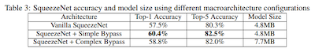

하지만 실험을 수행한 결과를 보면, 가운데 simple bypass가 더 model size도 작은데 accuracy가 더 높은 수치를 기록했다. 따라서 적절한 수준으로 bypass를 적용하는 것이 중요하다.

---

### 7.2.3 ResNet50: bottleneck block

ResNet에서는 **bypass layer**라는 연산량을 줄일 수 있는 개념을 소개한다.

다음은 **Residual Block**에서 연산량을 줄인 **bottleneck block**의 구조를 나타낸 그림이다.

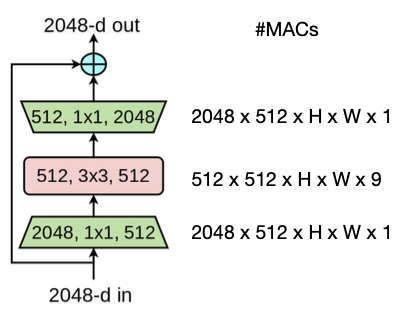

1. $1 \times 1$ convolution을 사용해서 channel 수를 4배 줄인다.(이 다음 batch normalization과 ReLU를 거친다.)

2. channel 개수가 줄어든 feature map에 $3 \times 3$ convolution을 적용한다.(이 다음 batch normalization과 ReLU를 거친다.)

3. $1 \times 1$ convolution을 사용해서 channel 수를 다시 4배 늘려서 맞춰 준다.

> 총 8.5배 연산이 줄어든다. input을 $x$ 라고 하고 1~3 과정을 거친 output을 $F(x)$ 로 표현한다.

4. input과 output의 channel 수가 같으므로, $F(x) + x$ 를 수행하여 shortcut을 구현한다.

> shortcut을 만드는 이유는 다음과 같다. 예를 들어 정사각형 발판 위에 서커스 코끼리가 서 있는 image가 있다고 하면, 정사각형 발판에 해당되는 input은 낮은 수준의 non-linearity로 해결할 수 있다. 

> 따라서 이러한 shortcut은 복잡도가 다른 요소들이 서로 다른 경로를 통해 학습되며, 적절한 non-linearity를 선택할 수 있게 된다.(정사각형 발판은 코끼리보다 더 많은 층을 뛰어넘는 짧은 경로로 진행될 것이다.) 이런 방식을 **residual learning**(잔차 학습)이라고 지칭한다.

---

### 7.2.4 ResNeXt: grouped convolution

**ResNeXt**(2017)에서는 $3 \times 3$ convolution을 $3 \times 3$ **grouped convolution**으로 대체한다. 차원을 줄이고 **cardinality**를 늘려서 효율을 높인 것이다.

> hyperparameter로 쓰인 cardinality는 convolution을 몇 개의 그룹으로 분할했는지 나타낸다. 수학에서 쓰이는 cardinality는 두 개체간의 관계(일대일, 일대다, 다대다)를 나타낸다.

다음은 결과는 동일하지만 과정은 다른 세 가지 방식의 grouped convolution을 나타낸 그림이다.(cardinality = 32)

- 왼쪽 이미지

  - $3 \times 3$ convolution을, 32 path의 4차원 $3 \times 3$ convolution으로 수행한다.

- 중간 이미지

  - $3 \times 3$ convolution보다 먼저 128차원의 $1 \times 1$ convolution을, 32 path의 4차원 $1 \times 1$ convolution으로 수행한 뒤 **concatenate**(연결)한다.

- 오른쪽 이미지

  - 더 나아가서 expand 과정도 group별로 나눠서 수행한 뒤 32 path를 모두 합산한다.

이 중에서는 맨 왼쪽 방식이 parallel cost가 더 적기 때문에 hardware-friendly하다.

> 사실 중간이 제일 먼저 제안된 ResNeXt block이다. 왼쪽이 그 다음 등장했으며 구현이 가장 간단하면서도 효율적인 구조이다.(GPU와 관련이 깊다.)

> 이런 복잡한 computational graph을 자동으로 mapping할 수 있는 방법들이 여럿 제시됐다.

---

### 7.2.5 MobileNet: depthwise-separable block

> [MobileNet 논문](https://arxiv.org/pdf/1704.04861.pdf)

> [depthwise-separable convolution](https://velog.io/@woojinn8/LightWeight-Deep-Learning-5.-MobileNet), [MobileNet](https://velog.io/@woojinn8/LightWeight-Deep-Learning-6.-MobileNet-2-MobileNet%EC%9D%98-%EA%B5%AC%EC%A1%B0-%EB%B0%8F-%EC%84%B1%EB%8A%A5)

**MobileNet**(2017)은 특정 조건을 만족하는 group convolution에 적용할 수 있는 **depthwise-separable convolution**, **pointwise convolution** 두 가지 layer로 구성된 depthwise-separable block을 제안한다. 

> depthwise-separable convolution은 Xception이란 논문에서 먼저 제안된 방식이다. 하지만 Xception이 이를 이용해 accuracy를 개선하려고 했다면, MobileNet은 model의 경량화를 위해서 사용했다.

- depthwise-seperable convolution은 input channel을 분리하고, channel information과 spatial information을 각각 별개로 취급해서 연산을 수행한다. 

- channel별로 수행된 결과물을 이은 뒤, pointwise convolution을 이용해서 channel들의 정보를 합친다.

아래 그림을 보며 MobileNet의 block 구조를 살펴보자.

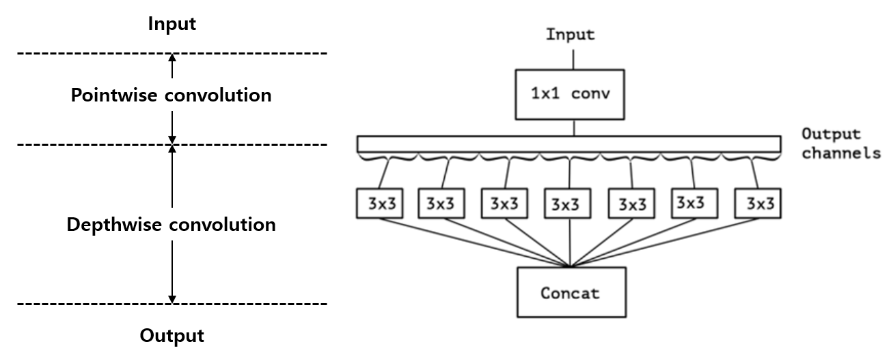

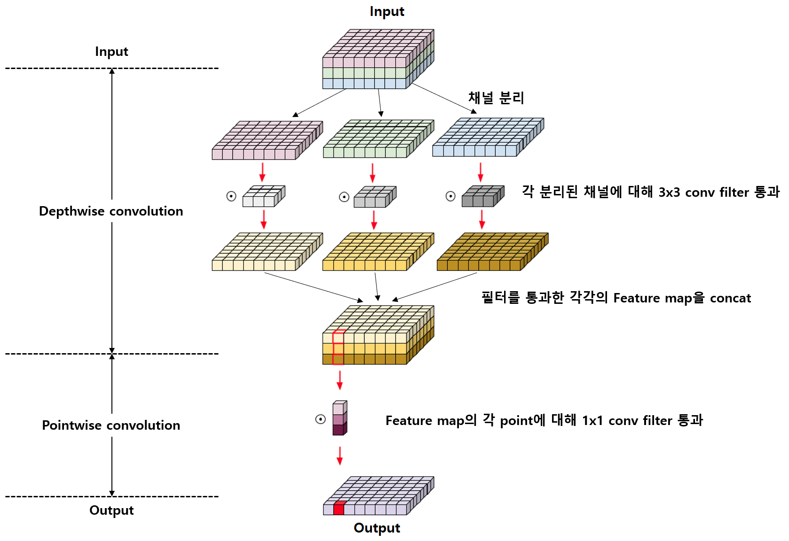

1. input channel을 모두 분리한다. 

   > 따라서 channel 수만큼 group이 생기는 **group convolution**로도 볼 수 있다.

2. 각 group마다 convolution을 수행한다.(이 과정에서 spatial information이 capture된다.)

   - activation function으로는 ReLU6를 사용한다.

3. channel(group)들을 다시 concat(연결)한 뒤, $1 \times 1$ convolution을 이용해서 각 channel이 갖는 spatial information을 합친다.

   - activation function으로는 ReLU6를 사용한다.

> 이처럼 ReLU가 아닌 ReLU6를 사용해서 연산량을 더욱 줄인다.

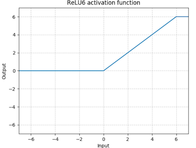

---

#### 7.2.5.1 MobileNetV1: Width Multiplier, Resolution Multiplier

또한 MobileNet에서는 model shrinking을 위해 다음 두 가지 하이퍼파라미터를 도입했다. {accuracy}와 {latency, size}의 tradeoff가 발생한다.

> TinyNAS(lec11)에서 더 자세히 볼 예정

- **Width Multiplier** $\alpha$

  - network의 각 layer마다 단순히 uniform하게 곱해주는 파라미터다. 어느 layer의 input channel의 수 $M$ 은 ${\alpha}M$ , output channel의 수 $N$ 은 ${\alpha}N$ 이 된다.

  - model shrinking을 위한 하이퍼파라미터이므로 $\alpha \in (0, 1]$ 범위에 속한다.

  > 주로 1, 0.75, 0.5, 0.25 등의 값을 사용하며, $\alpha = 1$ 일 때가 baseline MobileNet, $\alpha < 1$ 일 때가 reduced MobileNet이다.

- **Resolution Multiplier** $\rho$

  - input image의 resolution을 줄이는 파라미터로, 결과적으로 모든 layer의 internal representation이 동일한 비율로 감소하게 된다.

  - model shrinking을 위한 하이퍼파라미터이므로 $\rho \in (0, 1]$ 범위에 속한다.

  > baseline MobileNet이 주로 224, 192, 160, 128 resolution이었으며, 여기에 $\rho$ 를 곱해주면 reduced MobileNet이 된다.

Width Multiplier는 flash에 저장되는 filter의 channel 수를 조절하므로(model weight들), flash memory usage를 줄이기 위해 사용할 수 있다. 반면 Resolution Multiplier는 input/output activation 파라미터 수를 조절하므로, SRAM usage를 줄이기 위해 사용할 수 있다.

---

### 7.2.6 MobileNetV2: inverted bottleneck block

> [MobileNetV2: Inverted Residuals and Linear Bottlenecks 논문](https://arxiv.org/pdf/1801.04381.pdf)

하지만 depthwise-separable block를 적용해서 연산량과 model size는 줄일 수 있었지만, 기존보다 낮은 capacity를 갖게 되었다.

**MobileNetV2**(2018)는 기존 방법에서 정보 손실을 최대한 compensate할 수 있는 발전된 방법을 제시한다. 특히 ReLU를 activation으로 사용할 때, input/output channel이 많을수록 정보 손실이 적다는 사실을 이용한다.

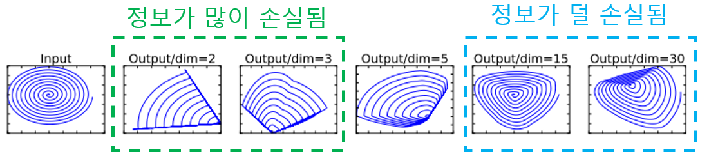

> 참고로 더 낮은 차원의 subspace로 mapping되면서 갖는 information을 **maniford**라고 지칭한다.

이제 MobileNet과 MobileNetV2 block의 차이를 그림으로 보면서 파악해 보자. MobileNetV2는 ReLU에 의한 정보 손실이 적게끔 input channel 수를 (1x1 convolution으로) 더 많이 늘려서 연산을 수행한다.

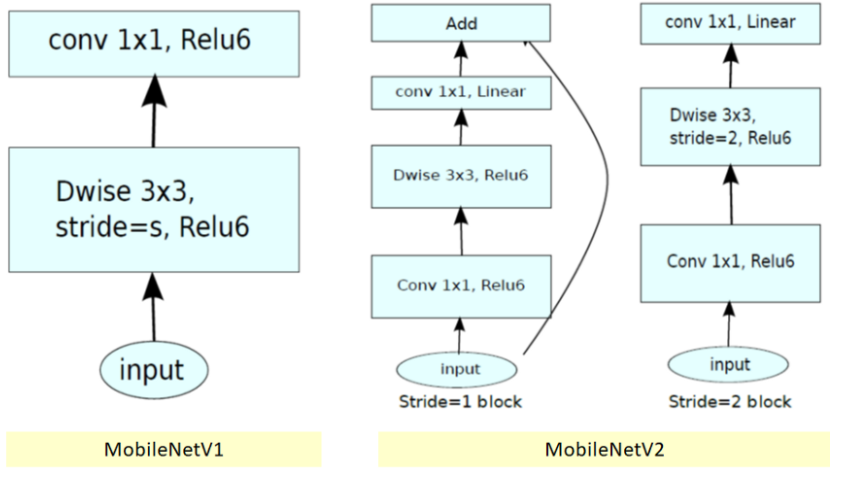

- (가운데) MbV2 block을 보면 **inverted residuals**를 적용한다.

  -  기존 ResNet의 bottleneck block이 input channel 수를 줄인 다음 다시 맞춰서 bypass를 적용한 것과 다르게, MbV2는 <U>input channel 수를 늘린 다음 다시 줄여서 bypass를 적용</U>한다.

  > 이러한 반대되는 모습 때문에 inverted residual block이라고 부른다.

- (오른쪽) stride=2는 downsampling을 위해 사용하는 block이다. 

> layer내 몇몇 구간에서 ReLU에 의한 정보 손실을 방지하기 위해 activation으로 linear function을 쓴다. ReLU는 (non-linear하며) 기본적으로 음수에서는 0을 반환하지만, <U>양수에서는 자기 자신을 반환하는 linear transform으로 볼 수 있다</U>는 점을 생각하면 고친 것이 어색하지 않다.

> 실제로 이렇게 linear function을 써서 정보 손실을 줄인 편이 performance 면에서 더 좋은 결과를 보였다.

이번에는 다른 그림으로도 살펴 보자.

1. input channel 수를 1x1 convolution을 이용해서 늘린다.

   - activation function으로는 ReLU6를 사용한다.

2. depthwise convolution을 수행한다.

   - activation function으로는 ReLU6를 사용한다.

3. 이들을 concat한 뒤, pointwise convolution으로 channel의 정보를 합친다.

   - activation function으로는 linear를 사용한다.

4. skip connection(inverted residual)을 적용한다.

논문에서 드는 MobileNetV2 architecture 예시를 보며 operator를 어떻게 표기하는지 파악하자.

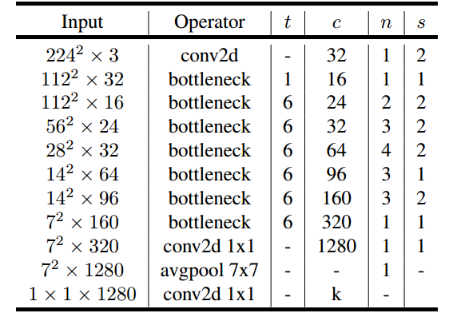

- $t$ : expansion factor(주로 5~10)

- $c$ : output channel 수

- $n$ : 반복 횟수

- $s$ : stride(2이면 downsampling)

- 모든 spatial convolution은 3x3 kernel을 사용했다.

---

### 7.2.7 ShuffleNet: 1x1 group convolution & channel shuffle

하지만 group마다 convolution이 적용되는 탓에, 서로 다른 group에 있는 channel이 feature information을 공유하지 못했다. 

ShuffleNet(2017)은 **channel shuffle** 기법을 제안하며 이 부분을 추가로 compensate한다.

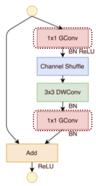

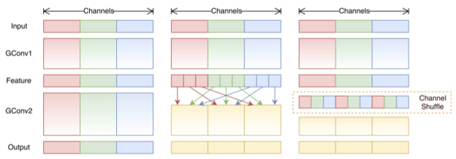

---

### 7.2.8 SENet: Squeeze-and-Excitation block

> [Squeeze-and-Excitation Networks 논문](https://arxiv.org/pdf/1709.01507.pdf)

SENet(2017)은 ILSVRC 2017에서 우승한 model로 **Squeeze-and-Excitation**(**SE**) block을 사용한다. 

SE block의 목적은 여러 channel을 가진 feature map에서 <U>각 channel의 정보가 얼마나 중요한지를 판단</U>하는 것이다. 

- 3차원 feature map에서 spatial 부분을 $1 \times 1$ 로 압축(depth인 channel 개수는 유지). 압축은 global average pooling 연산을 이용한 1차원 벡터화.(Squeeze. **압축**)

- 1차원 벡터를 normalize한 값을 가중치처럼 사용.(Excitation. **재조정**)

이런 특징 때문에 SE block은 다른 CNN model(VGG, ResNet 등)의 어디든 부착할 수 있다. 아래가 바로 SE block을 나타낸 그림이다.

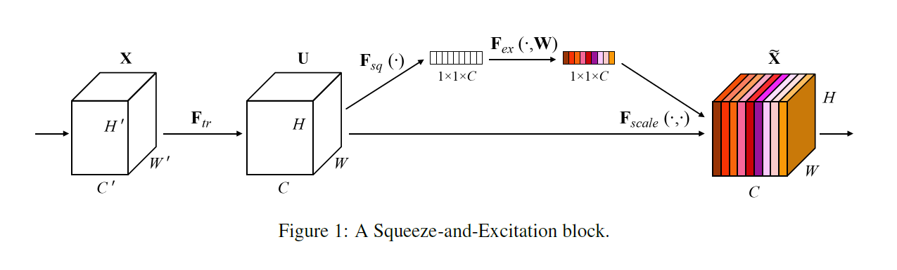

- $F_{sq}(\cdot)$ : Squeeze 연산.(global average pooling)

$$ z = F_{sq}(u_{c}) = {{1} \over {H \times W}} {\sum_{i=1}^{H}}{\sum_{j=1}^{W}}{u_{c}(i, j)} $$

> $u_{c}$ 는 channel $c$번째에 있는 feature map( $H \times W$ )이다.

- $F_{ex}(\cdot)$ : Excitation 연산.(normalize). squeeze로 만들어진 1차원 벡터 $z$ 를 normalize하는데, FC1 - ReLU - FC2 - Sigmoid 순서로 진행된다. 결과는 가중치 벡터 $s$ 가 된다.

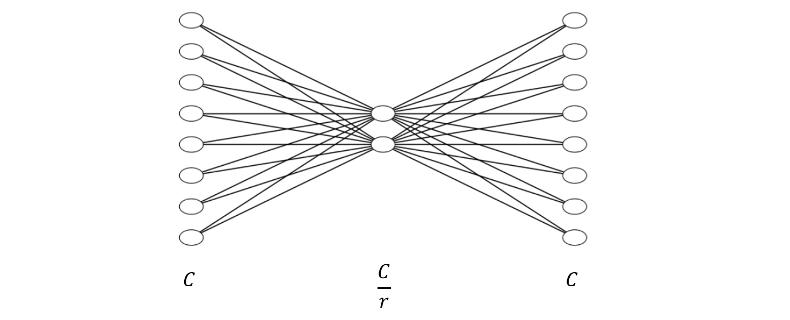

$$ s = F_{ex}(z, W) = {\sigma}(W_{2} {\delta}(W_{1} z)) $$

- $z$ : 앞서 squeeze해서 만들어진 1차원 벡터

- $W_{1}, W_{2}$ : Fully-connected layer의 weight matrix. reduction ratio $r$ 을 둬서 노드 수를 조절한다. $W_{1} \in \mathbb{R}^{{C \over r} \times C}$ , $W_{2} \in \mathbb{R}^{C \times {C \over r}}$

  - 위 식에서 $\mathbb{R}$ 을 보면 알겠지만, $C$ 차원 벡터 input $z$ 는 $W_{1}$ 과 만나 $C \over r$ 차원 벡터가 된다.(activation으로 ReLU 적용)
  
  - 그리고 이 $C \over r$ 차원 벡터는 $W_{2}$ 와 만나 $C$ 차원 벡터로 변환된다. 이를 sigmoid 연산을 통해 0과 1 사이의 값으로 normalize한다.

> $\delta$ : ReLU 연산, $\sigma$ : Sigmoid 연산

> reduction ratio $r$ 은 총 연산량에 추가되는 parameter 수(계산 복잡도)에 영향을 미친다. $r$ 을 바꿔가며 model마다 최적의 값을 찾는 과정이 필요하다.

이렇게 구한 가중치 벡터 $s$ 를 원래 feature map $u$ 에 곱해준다.

$$ F_{scale}(u_{c}, s_{c}) = s_{c} \cdot u_{c} $$

SE block을 추가해도 parameter 수가 크게 늘어나지는 않는다. 따라서 적은 연산량 증가로도 performance 향상을 기대할 수 있는 방법론이 바로 SE block이다.

---

### 7.2.9 MobileNetV3

> [Searching for MobileNetV3 논문](https://arxiv.org/pdf/1905.02244.pdf)

**MobileNetV3**(2019)는 MobileNetV2의 후속 논문으로, NetAdapt algorithm으로 보완한 hardware-aware NAS를 이용해 더 개선된 architecture를 제안한다.

또한 논문에서는 target resource에 따라 사용할 수 있도록 크기가 다른 두 가지 버전을 제안한다.

- MobileNetV3-Large

  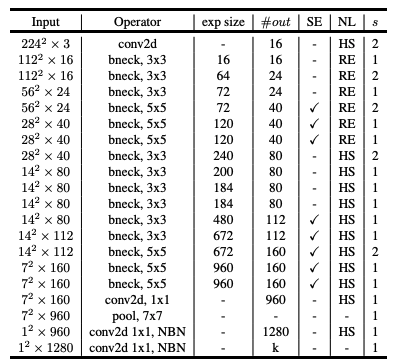

- MobileNetV3-Small

  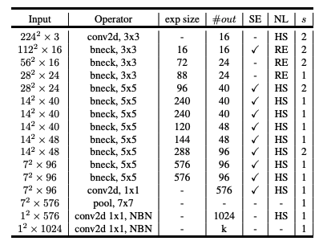

앞서 본 MobileNetV2와 비교하면 더 많은 layer를 가지면서도 다양한 kernel size를 사용하는 것을 볼 수 있다. 또한 MbV2에서 볼 수 없었던 몇 가지 기호가 있다.

- SE: Squeeze-and-Excitation block

- NL: type of nonlinearity used

  - HS: h-swish

  - RE: ReLU

- NBN: batch normalization

NAS를 통해 찾은 MbV3 architecture는, MbV2에서 expensive layers(연산량이 많은 layer. 특히 last stage)와 nonlinearity function'을 보완한 형태를 갖고 있다.

1. redesign expensive layers(last stage)

   가령 MbV2 예시에서는 1x1 conv로 channel 수를 늘린 7x7x1280에서 avgpool을 적용해서 feature를 추출했었다. 덕분에 rich feature를 얻을 수는 있었지만, 이 과정에서 드는 cost가 다른 layer에 비해서 너무 큰 편이었다.

   따라서 MbV3은 이 과정을 나눠서 상호작용하는 식으로 feature는 보존하면서 latency는 줄인 구조를 제시했다.

    

    - 1x1 conv로 channel 수를 늘리지 않고 먼저 avgpool을 적용해서 feature를 추출한 뒤, 1x1 conv로 channel 수를 늘린다. 
    
    - 결과에 다시 1x1 conv를 적용해서 channel 수를 맞춘다.

2. nonlinearity(activation function)으로 ReLU 대신 **h-swish**를 섞어서 사용한다.

    > 섞어서 사용하는 편이 더 좋은 성능을 보인다.

h-swish를 알기 위해서는, 우선 ReLU 대신 사용하도록 제안된 nonlinearity인 **swish**부터 알아야 한다.

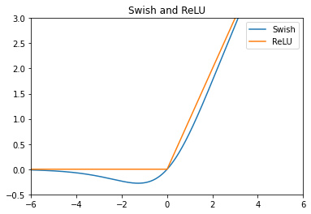

$$ \mathrm{swish} \, x = x \cdot {\sigma}(x) $$

$$ {\sigma}(x) = {{1} \over {1 + e^{-x}}} $$

이처럼 swish는 sigmoid function( ${\sigma}(x)$ )을 사용한 nonlinearity로 ReLU와 비슷한 특성을 갖는다. 하지만 ReLU와 달리 어느 정도 음수를 허용하며 직선이 아닌 곡선의 형태를 갖는다.(미분해서 상수 값이 아니다.)

하지만 sigmoid 연산은 연산량을 많이 사용하기 때문에 다음과 같이 swish를 수정한 **h-swish**를 사용한다.

$$ x{{\mathrm{ReLU}6(x+3)} \over {6}} $$

---

### 7.2.10 MobileNet quantization

> [mixed-precision neural network quantization via learned layer-wise importance 논문](https://arxiv.org/abs/2203.08368)

> [Guide to Deep Learning Model Quantization and Quantization-Aware Training](https://deci.ai/quantization-and-quantization-aware-training/)

IoT device, 특히 MCU에 neural network를 deploy하기 위해서는 quantization이 사실상 필수적이다. 하지만 MobileNet은 layer마다 다른 특징을 지니는 바람에 quantization이 어렵다. 

> MobileNetV2를 실행하기 위해서는 5.6M SRAM peak memory와 13.5M flash memory가 필요하지만, 대표적인 MCU인 ARM Cortex-M7의 경우 512kB SRAM, 2MB flash memory를 갖고 있어서 memory가 턱없이 부족하다.

게다가 layer마다 quantization의 **sensitivity**가 달라서, 모든 layer에 동일한 bit-width를 적용하는 **fixed-precision quantization** 방법은 accuracy를 많이 손실하는 결과를 낳게 된다.

따라서 **mixed-precision quantization**을 적용하는 방법들이 등장했는데, 이 방법은 layer의 quantization sensitivity마다 다른 bit-width를 적용하는 quantization 방법이다. 덕분에 더 유연하게 accuracy-efficiency trade-off를 조절할 수 있다.

- quantization-insensitive layers: quantization에 큰 영향을 받지 않는 layer

- quantization setsitive layers: quantization non-friendly layers

보통 mixed-precision quantization은 search-based 방법을 사용하며, fine-grained quantization인 만큼 더 큰 search space를 갖게 된다. 예를 들어 $L$ 개 layer를 갖는 network가 있고, 각 layer가 bit를 n개 선택할 수 있다면, search space의 크기는 $n^{2L}$ 이 된다.

> 즉, NAS 알고리즘인 만큼 search에 소요되는 시간을 줄이기 위해 search space를 수동으로 제한해야 한다. 대표적으로 HAQ, AutoQ와 같은 방법이 있다.

MobileNet의 주요 layer를 세부적으로 살펴보자. 우선 DW-conv은 PW-conv에 비해 parameter 수가 적다. 그리고 DW-conv가 PW-conv에 비해 quantization에 더 susceptible하다. 그렇다면 DW-convs와 PW-convs가 4 bits quantization일 때와, 더 낮은 bit-width인 2 bits quantization로 줄였을 때의 accuracy 저하를 비교하면 어떻게 될까?

- DW-conv를 2 bit로 줄였을 때가, PW-conv를 2 bit로 줄였을 때보다 훨씬 accuracy degradation이 크다.

- 따라서 quantization에서 DW-conv의 importance score(중요도 점수)를 높게 설정해야 한다.

---

### 7.2.11 accuracy-efficiency trade-off on ImageNet

다음은 ImageNet에서 여러 model이 갖는 MACs(efficiency)와 accuracy를 나타낸 도표다.

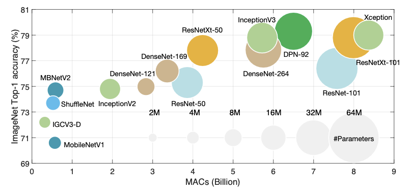

> 하지만 ImageNet에서의 benchmark만 믿어서는 안 된다. 실제 downstream(산업)에서 활용하고자 할 때는 이런 benchmark와 일치하는 결과를 보여준다는 보장은 없다.

---