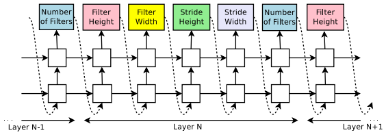

# 7 Neural Architecture Search (Part I)

다음은 7.2절에서 살핀 benchmark에 AutoML로 찾아낸 neural architecture를 추가한 것이다. AutoML로 찾아낸 neural architecture가 훨씬 적은 연산량으로도 더 좋은 accuracy를 보이는 것을 확인할 수 있다. 

---

## 7.3 illustration of NAS

NAS(Neural Architecture Search)의 목표는 search space(탐색 공간)에서 최적의 neural network architecture를 찾는 것이다.

- **Search Space**(탐색 공간): 가능한 neural network architecture를 정의한다. 

  > 적절한 domain 지식을 접목하여, search space의 크기를 줄이고 search를 단순화시킬 수 있다.

- **Search Strategy**(탐색 전략): 말 그대로 search space를 어떻게 search할지를 결정한다. 

  > 이때 최적이 아닌 구조로 조기 수렴하는 사태는 피해야 하므로, 고전적인 exploration-exploitation(탐험-활용) tradeoff가 적용된다.

- **Performance Estimation Strategy**(성과 평가 전략): performance를 estimate(추정)하는 과정을 뜻한다. 

  - 가장 간단한 방법은 data를 이용하여 표준 training과 validation을 수행하는 것이지만, 이는 search cost와 hardware efficiency 측면에서 굉장히 손해를 보게 된다.

NAS의 바탕이 된 "Neural Architecture Search with Reinforcement Learning”(2017) 논문에서는, 새로운 neural architecture를 (gradient 기반으로) 찾아내는 방법을 제시했다.

그 방법은 다음과 같은 통찰에서 시작했다. 'neural network의 structure와 connectivity를 가변 길이의 configuration string으로 다룰 수 있으니까, 이를 training에 이용할 수 있지 않을까'란 발상이었다. 예를 들어 다음과 같이 한 layer의 구조를 문자열로 나타낼 수 있다.

- ["Filter Width: 5", "Filter Height: 3", "Num Filters: 24"]

그리고 이 data에 가변 길이의 input 및 string의 처리로 적합한 RNN(**controller**)을 적용하여, <U>configuration string을 generate하도록 만든다.</U> 다시 말해 controller가 architecture의 hyperparameter를 계속해서 생성하게 된다. 

- $i$ 번째 layer $L_{i}$ 는 layer $i-1$ 에서 input을 받고, 또 layer $L_{i}$ 의 output은 layer $L_{i+1}$ 의 input으로 사용된다.

- (CNN) filter의 height/width, stride의 height/width, filter 개수와 같은 hyperparameter를 output으로 반환한다.

> search space는 (1) 최대 layer 수 n개, (2) 모든 계층이 실행할 수 있는 operation 유형(pooling, convolution, depthwise separable convolution 등), (3) 연산과 관련된 hyperparameter(filter 수, kernel size, stride 등)을 search한다.

> 이때 (3)번의 hyperparameter들은 (2)번 유형에 따라 결정된다는 점에 주의하자.

이렇게 generate된 hyperparameter를 바탕으로 만들어진 새 model(**child network**)을 training하고, 여기에 validation data set을 적용해서 accuracy를 얻는다. 

이때 이전 architecture의 평균 accuracy를 이용해서 reinforcement learning을 수행한다.

하지만 이렇게 새 child network를 만든 뒤, training을 거쳐 accuracy를 측정하는 과정은 시간이 너무 소요된다. 따라서 논문에서는 distributed training(분산 학습)을 이용해서 진행한다.

> 기존 방법에서 더 나아가서 최신 연구에서는 multi-branch network를 구축할 수 있는 skip connection과 같은 설계 요소도 NAS에서 search한다.

> 이 경우 layer $i$ 의 input은, 이전 layer output을 조합한 function $g_{i}(L_{i-1}^{out},...,L_{0}^{out})$ 으로 표현된다.

---

## 7.4 cell-level search space

search space 탐색의 비효율적인 면을 개선하기 위해 **cell-level search space**이 제안되었다. RNN controller과 reinforcement learning을 이용해서 효율적인 reduction cell과 normal cell을 찾아낸다.

- normal cell: stride = 1. 즉, input의 resolution을 보존하는 cell이다.

- reduction cell: stride > 1. 즉, input의 resolution이 감소하는 cell이다.(receptive field는 증가한다.)

이처럼 전체 구조가 아닌 cell 단위로 탐색을 하기 때문에 search space의 크기가 크게 줄어든다.

RNN controller는 총 다섯 단계를 거쳐서 candidate cell를 generate한다.

1. 첫 번째 hidden state를 generate한다.

2. 두 번째 hidden state를 generate한다.

3. 첫 번째 hidden state의 operation(예를 들면 convolution/pooling/identity)을 고른다.

4. 두 번째 hidden state의 operation을 고른다.

5. hidden state를 합칠 방법을 고른다.(add, concatenate 등)

이해를 돕기 위해 문제를 하나 풀어보자. 다음 조건에서는 search space의 크기(design space의 유형 수)는 총 몇 개가 될까? architecture의 layer는 총 B개로 구성되어 있다고 하자.

- 2개의 input 유형

- M개의 input을 transform할 operation

- N개의 hidden state를 결합할 operation

정답은 $(2 \times 2 \times M \times M \times N)^{B} = 4^{B}M^{2B}N^{B}$ 이다.

때문에 NAS는 **search cost**와 **hardware efficiency** 관점에서 이보다 더 효율적으로 수행할 수 있는 방법이 필요해졌다.

- feedback을 위해 너무 많은 neural network가 필요하다.

- 많은 branch의 dependency를 유지해야 하므로, 쉽게 memory를 free시킬 수 없다.

> 또한 **meta-architecture**(메타 구조)를 선택해서 NAS를 수행하기 때문에, cell search의 복잡성이 대부분 meta-architecture에 의해 설명되지 않도록 새로운 설계 방법이 필요했다.

> 최선의 방법은 meta-architecture 역시 NAS가 스스로 최적화할 수 있게 설계하는 것이다. 

---

## 7.5 network-level search space

**network-level search space**에서는 자주 쓰이는 pattern을 고정하고, 오직 각 stage에서 쌓는 block 개수(depth)를 search한다.

예를 들어 image segmantation model에서 resolution의 downsampling, upsampling strategy를 다음과 같이 나타낼 수 있다.

또한 image 내 다양한 resolution을 가진 물체를 인식하는 model인 FPN(Feature Pyramid Networks for Object Detection)에 NAS를 적용한 예시를 살펴보자.

> AP: average precision(평균 정밀도)

결과를 보면 사람이 design한 strategy와 상당히 다른 것을 볼 수 있다. 하지만 높은 accuracy와 irregularity 사이에서 균형을 맞춰야 한다. irregularity topology는 hardware상으로 구현하기 어려우며, 또한 parallize하기도 어렵기 때문이다.

---

## 7.6 Design the Search Space

더 효율적인 search space를 선택하기 위해, 예를 들어 ResNet에서는 cumulative error distribution을 지표로 사용할 수 있다. 아래가 ResNet의 cumulative error distribution가 그려진 도표이다.

- 파란색 곡선에 해당되는 search space: 38.9%의 model이 49.4%가 넘는 error를 가졌다.

- 주황색 곡선에 해당되는 search space: 38.7%의 model이 43.2%가 넘는 error를 가졌다.

  > 이 둘 중에서는 주황색 곡선의 design space가 더 낫다. 

하지만 이처럼 cumulative error distribution을 측정하려면 굉장히 긴 시간동안 training을 거쳐야 한다. 또한 memory나 storage 제약을 갖는 장치에서는 수행할 수 없는 방법과 다름없다. computation은 저렴하지만 memory는 비싸다는 기본 원칙을 상기하자.

따라서 hardware 제약이 있는 기기에서 NAS를 수행할 수 있도록, TinyNAS에서는 다음과 같은 과정을 거친다.

1. Automated search space optimization

2. Resource-constrained model specialization

model training으로 많은 resource를 낭비하는 대신, 다른 방식으로 최적의 model을 찾고자 시도한다. 바로 동일한 memory 제약에서는 <U>FLOPs가 클수록 큰 model capacity를 가지며, 이는 곧 높은 accuracy로 이어진다는 heuristic</U>이다.

---

## 7.7 Search Strategy

---

### 7.7.1 Grid Search

가장 간단한 방법으로 **grid search**가 있다. 간단한 예시로 다음과 같이 Width나 Resolution에서 몇 가지 point를 지정한다.(width 3개, resolution 3개로 총 9개의 조합이 나온 예다.)

- latency constraint를 만족하면 파란색, 만족하지 못하면 빨간색으로 표시했다.

하지만 이런 간단한 예시와는 다르게 실제 응용에서는 선택지와 dimension이 훨씬 커지게 된다. 범위를 넓게, step을 작게 설정할수록 최적해를 찾을 가능성은 커지지만 시간이 오래 걸리게 된다.

> 대체로 넓은 범위와 큰 step으로 설정한 뒤, 범위를 좁히는 방식을 사용한다.

이런 방법을 사용하는 model은 대표적으로 EfficientNet가 있다. EfficientNet은 depth, width, resolution이 관계가 있다는 사실을 바탕으로 **compound scaling** 방법을 제안한다. 

- w, d, r이 일정 값 이상이 되면 accuracy가 빠르게 saturate된다. 따라서 이들을 함께 고려할 필요가 있다.

아래가 이런 관측을 바탕으로 한 compound scaling을 나타낸 그림이다.

- 기존에 수동으로 하나씩 width scaling, depth scaling, resolution scaling을 적용한 것과 다르게, compound scaling은 width/depth/resolution을 함께 고려하며 scaling한다.

EfficientNet은 각 layer가 수행하는 연산(F)를 고정하고, width, depth, resolution만을 변수로 search space를 탐색한다.

$$ \underset{d,w,r}{\max} \quad Accuracy(N(d,w,r)) $$

---

### 7.7.2 random search

Grid Search의 문제를 개선한 방법으로 **random search**가 제안되었다. random search는 정해진 범위 내에서 말 그대로 임의로 선택하며 수행하며, grid search보다 상대적으로 더 빠르고 효율적이다.

> random search는 차원이 적을 때 최선의 parameter search strategy일 가능성이 크다. 

grid search보다 더 효율적인 이유는 직관적으로도 이해할 수 있다. 종종 일부 parameter는 다른 parameter보다 performance에 큰 영향을 미친다. 가령 model이 hyperparameter 1에 매우 민감하고, hyperparameter 2에는 민감하지 않다고 하자.

grid search는 {hyperparameter 1 3개} * {hyperparameter 2 3개}를 시도한다. 반면 random search의 경우에는 hyperparameter 1 9개의 다른 값(혹은 hyperparameter 2 9개의 다른 값)을 시도할 수 있다. 따라서 더 나은 결과를 얻을 수 있다.

또한 Single-Path-One-Shot(SPOS)에서는 random search가 다른 advance된 방법들(예를 들면 evolutionary architecture search)보다 좋은 baseline을 제공할 수 있다.

SPOS란 말 그대로 single path와 one-shot 접근법을 사용하는 NAS이다. 이 방법은 architecture search를 탐색하기 위해, reinforcement learning 또는 evolutionary algorithm를 사용하지 않고 **uniform sampling**을 사용하는 방법이다.

one-shot NAS는 모든 candidate architecture를 포함하며 weight를 공유하는 **supernet**에서 search space를 탐색한다. 덕분에 resource가 덜 필요하다는 비용 절감적 장점을 지닌다. 하지만 각 architecture를 개별적으로 train하고 evaluate하는 기존 NAS보다는 performance가 낮다.

---
 
