# 7 Neural Architecture Search (Part I)

> [Lecture 07 - Neural Architecture Search (Part I) | MIT 6.S965](https://www.youtube.com/watch?v=NQj5TkqX48Q)

> [Exploring the Implementation of Network Architecture Search(NAS) for TinyML Application](http://essay.utwente.nl/89778/1/nieuwenhuis_MA_EEMCS.pdf)

다음은 7.2절 benchmark에 NAS를 이용해 찾아낸 neural architecture를 추가한 것이다. 

- NAS를 이용해 찾아낸 neural architecture는 훨씬 적은 연산량(MACs)으로도 manually-designed model보다 더 높은 accuracy를 갖는다.

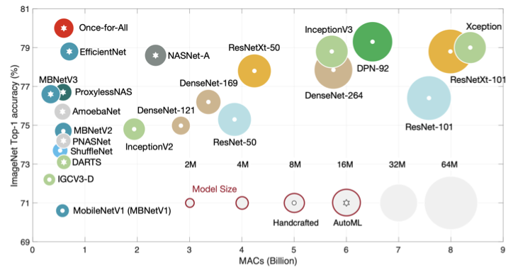

---

## 7.3 Neural Architecture Search

**Neural Architecture Search**(NAS)의 목표는 **Search Space**(탐색 공간)에서 특정 전략을 통해 최적의 neural network architecture를 찾는 것이다.

> 목표로 하는 성능은 accuracy, efficiency, latency 등이 될 수 있다.

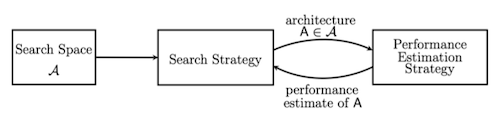

- **Search Space**(탐색 공간) 

  탐색할 neural network architecture이 정의된 공간이다.

  > 적절한 domain 지식을 접목하면 search space 크기를 줄일 수 있다. 학습 시간의 단축과 accuracy 향상에 도움이 된다.

- **Search Strategy**(탐색 전략)

  search space를 어떻게 탐색할지 결정한다. 

- **Performance Estimation Strategy**(성과 평가 전략)

  성능을 측정할 방법을 결정한다. 

---

## 7.4 Search Space

모델 구조를 찾기 위해서는 search space를 먼저 정의해야 한다. search space 내 모델은 다양한 옵션을 가지게 된다. 아래는 대표적인 예시다.

- 다양한 레이어

  convolution layer, fully connected layer, pooling layer 등

- 레이어가 갖는 특징

  \#neurons, kernel size, activation function 등 

또한 search space를 어떤 단위로 구성하는가에 따라, 크게 **cell-level search space**와 **network-level search space**로 나눌 수 있다.

---

### 7.4.1 Cell-level Search Space

> [Learning Transferable Architectures for Scalable Image Recognition 논문(2017)](https://arxiv.org/abs/1707.07012)

ImageNet 데이터셋을 입력으로 받는 CNN 구조 예시를 보자.


- Reduction Cell: 해상도를 줄인다.(stride > 2)

- Normal Cell: 해상도가 유지된다.(stride = 1)

논문(NASNet)에서는 RNN controller를 이용하여 candidate cell를 생성한다. 총 다섯 단계로 구성된 단계를 설명하는 아래 그림을 살펴보자.

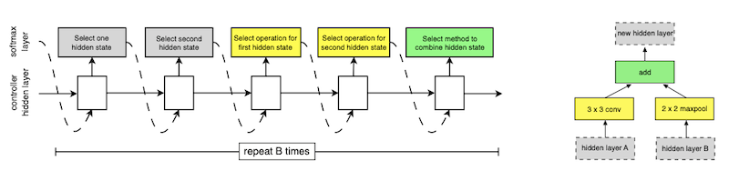

- $h_{i+1}$ 을 만들기 위한 input candidate: $h_i$ hidden layer 혹은 $h_{i-1}$ hidden layer를 사용할 수 있다.

1. hidden layer A: 첫 번째 hidden state를 생성한다.

2. hidden layer B: 두 번째 hidden state를 생성한다.

3. hidden layer A가 가질 operation을 고른다.(`3x3 conv`)

   > 예를 들면 convolution/pooling/identity와 같은 레이어가 될 수 있다.

4. hidden layer B가 가질 operation을 고른다.(`2x2 maxpool`)

5. A와 B를 합칠 방법을 고른다.(`add`)

다음은 NASNet을 설명하는 도식이다.

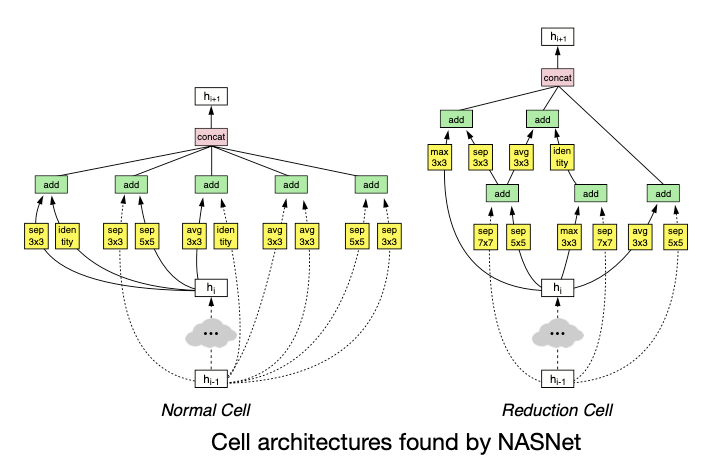

하지만 너무 큰 search space로 인해, **search cost**와 **hardware efficiency**면에서 더 효율적으로 수행할 수 있는 방법이 필요해졌다.

### <span style='background-color: #393E46; color: #F7F7F7'>&nbsp;&nbsp;&nbsp;📝 예제 1: Cell-level Search Space size &nbsp;&nbsp;&nbsp;</span>

다음 조건에서 NASNet의 search space size를 구하라.

- 2 candidate input

- M input transform operations

- N combine hidden states operations

- B \#layers

### <span style='background-color: #C2B2B2; color: #F7F7F7'>&nbsp;&nbsp;&nbsp;🔍 풀이&nbsp;&nbsp;&nbsp;</span>

search space size는 다음과 같다.

$$(2 \times 2 \times M \times M \times N)^{B} = 4^{B}M^{2B}N^{B}$$

> $M=5, N=2, B=5$ 라고 하면 search space 크기는 $3.2 \times 10^{11}$ 이 된다.

---

### 7.4.2 Network-Level Search Space

> [MnasNet: Platform-Aware Neural Architecture Search for Mobile 논문(2018)](https://arxiv.org/abs/1807.11626)

> [Once-for-All: Train One Network and Specialize it for Efficient Deployment 논문(2019)](https://arxiv.org/abs/1908.09791)

**network-level search space**은 흔히 쓰이는 pattern은 고정하고, 오직 각 stage가 갖는 blocks을 변화시키는 방법이다.

---

#### 7.4.2.1 Network-Level Search Space for Image Segmantation

> [Auto-DeepLab: Hierarchical Neural Architecture Search for Semantic Image Segmentation 논문(2019)](https://arxiv.org/abs/1901.02985)

**Image Segmentation** domain에서 network-level search space를 구성한 Auto-DeepLab 논문에서는, layer별 upsampling/downsampling을 search space로 사용한다. 

> Image Segmentation: image를 여러 픽셀 집합으로 나누는 task

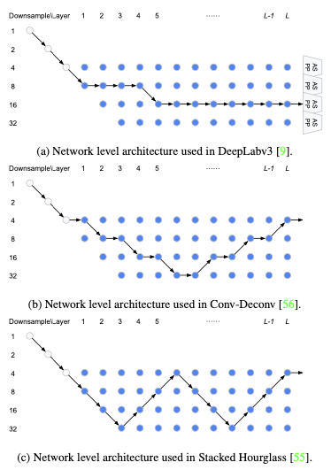

- 가로: \#layers, 세로 Downsample(해상도가 줄어든다.)

- 파란색 nodes를 연결하는 path가 candidate architecture가 된다.

---

#### 7.4.2.2 Network-Level Search Space for Object Detection

> [NAS-FPN: Learning Scalable Feature Pyramid Architecture for Object Detection](https://arxiv.org/abs/1904.07392)

NAS-FPN 논문에서는 **Object Detection** domain에서 흔히 쓰이는 FPN(Feature Pyramid Networks for Object Detection) 모델을 Network-Level Search Space로 구성한다.


> AP: average precision(평균 정밀도)

이처럼 NAS를 통해 얻은 최적 network architecture는 사람이 디자인한 구조와 상당히 다른 것을 볼 수 있다. 

> 하지만 accuracy와 irregularity 사이에서 균형을 맞춰야 한다. irregularity topology는 hardware상으로 구현하기 힘들고, 또한 parallelism의 이점을 살리기 어렵기 때문이다.

---

## 7.5 Design the Search Space

그렇다면 효율적인 search space는 어떤 기준으로 선택해야 할까?

---

### 7.5.1 Cumulative Error Distribution

> [On Network Design Spaces for Visual Recognition 논문(2019)](https://arxiv.org/abs/1905.13214)

논문(RegNet)에서는 **cumulative error distribution**을 지표로 사용한다.

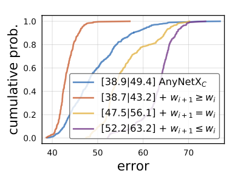

- 파란색 곡선: 38.9% model이 49.4%가 넘는 error를 가진다.

- 주황색 곡선: 38.7% model이 43.2%가 넘는 error를 가진다.

  파란색 곡선보다 error가 적으므로 더 우수한 search space이다.

하지만 cumulative error distribution을 측정하기 위해서 굉장히 긴 시간동안 training을 수행해야 하는 단점이 있다.

---

### 7.5.2 FLOPs distribution

> [MCUNet: Tiny Deep Learning on IoT Devices 논문(2020)](https://arxiv.org/abs/2007.10319)

MCUNet 논문의 TinyNAS는 MCU 제약조건에 알맞은 search space를 찾기 위해, 다음과 같은 최적화 과정을 거친다.

1. Automated search space optimization

2. Resource-constrained model specialization


이러한 최적화 과정에서 제일 핵심이 되는 heuristic은 다음과 같다.

- 동일한 memory constraint에서는 <U>FLOPs가 클수록 큰 model capacity를 갖는다.</U>

- 큰 model capacity는 높은 accuracy와 직결된다. 


---

## 7.6 Search Strategy

---

### 7.6.1 Grid Search

> [EfficientNet: Rethinking Model Scaling for Convolutional Neural Networks 논문(2019)](https://arxiv.org/abs/1905.11946)

가장 간단한 탐색 방법으로는 **grid search**가 있다. 

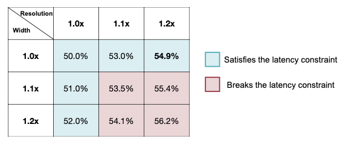

- resolution, width 조건을 설정한다.

- latency constraint: 파란색은 만족 / 빨간색은 불만족

하지만 위 예시와 다르게 실제 응용에서는 선택지와 이에 따른 차원이 굉장히 커지게 된다. 넓은 범위에 step을 작게 설정할수록 optimal을 찾을 가능성은 커지지만 시간이 오래 걸린다.

> 대체로 넓은 범위와 큰 step으로 설정한 뒤, 서서히 줄여나가는 방식을 사용한다.

grid search를 사용한 대표적인 논문으로는 **EfficientNet**가 있다. 

- depth, width, resolution을 함께 **compound scaling**한다.

  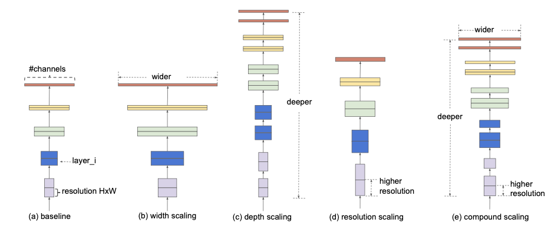

  - $\phi$ : compound scaling parameter

  - $\alpha \ge 1, \beta \ge 1, \gamma \ge 1$

$$ depth = d = {\alpha}^{\phi} $$

$$ width = w = {\beta}^{\phi} $$

$$ resolution = r = {\gamma}^{\phi} $$

$$ \mathrm{s.t.} \, \alpha \cdot {\beta}^2 \cdot {\gamma}^2 \approx 2 $$

다음은 **depth**, **width**, **resolution**가 각각 accuracy에 어떠한 영향을 미치는지 나타낸 도표다.(ImageNet 데이터셋 사용 ResNet 기반 search space)

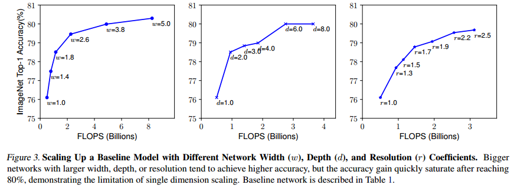

- **depth**( $d$ )

  $d$ 가 커지면 다음과 같은 변화가 나타난다.
  
  - model capacity가 커진다.

  - \#parameters가 커진다. 따라서 memory footprint가 늘어난다.

  - \#FLOPs가 커지며 accuracy가 향상되지만, latency도 늘어난다.

  - vanishing gradient 문제를 겪을 가능성이 크다.
  
    > skip connection이나 batch normalization과 같은 방법으로 방지한다.

- **width**( $w$ )

  $w$ 가 커지면 다음과 같은 변화가 나타난다.

  - 더 fine-grained feature를 가지며 training이 용이해진다.

  > 참고로 width scaling은 주로 tiny model에서 사용한다. 넓기만 하고 얕은 network에서는 high level feature를 얻기 힘들기 때문이다.

- **resolution**( $r$ )

  $r$ 이 커지면 다음과 같은 변화가 나타난다.

  - 보다 fine-grained feature를 얻을 수 있다.

  > 예를 들어 GPipe에서는 기존보다 훨씬 큰 480x480 resolution을 사용하여 SOTA accuracy를 얻은 적 있다. 하지만 너무 큰 resolution은 반대로 accuracy gain이 줄어드는 부작용을 낳을 수 있다.

---

### 7.6.2 Random Search

> [Single Path One-Shot Neural Architecture Search with Uniform Sampling 논문(2019)](https://arxiv.org/abs/1904.00420): SPOS로 지칭

혹은 grid search의 단점을 개선한 **random search**을 사용할 수 있다.

- 특히 차원이 적을수록 최선의 parameter search strategy일 가능성이 있다.


예를 들어 SPOS 논문에서는 좋은 search space를 가진다면, evolutionary search와 같은 advanced method보다도 random search가 굉장히 좋은 **baseline**을 제공할 수 있다고 주장한다.

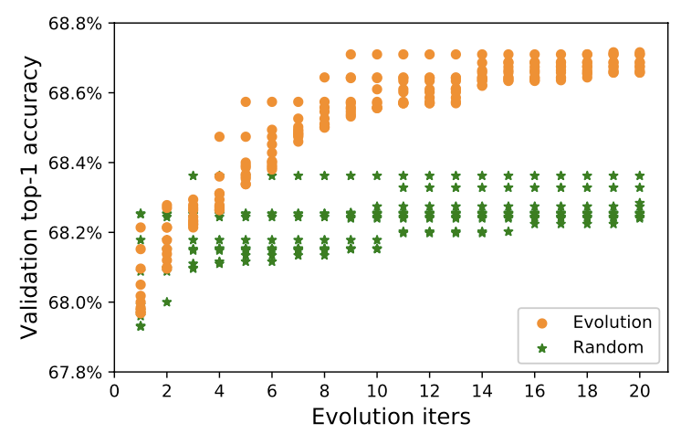

---
 
### 7.6.3 Reinforcement Learning

> [Neural Architecture Search with Reinforcement Learning 논문(2016)](https://arxiv.org/abs/1611.01578)

> [Introduction to Neural Architecture Search (Reinforcement Learning approach)](https://smartlabai.medium.com/introduction-to-neural-architecture-search-reinforcement-learning-approach-55604772f173)

> [Policy Gradient Algorithms](https://talkingaboutme.tistory.com/entry/RL-Policy-Gradient-Algorithms)

이보다 advanced method로 RNN controller를 사용하는 **Reinforcement Learning** 접근법을 들 수 있다. 

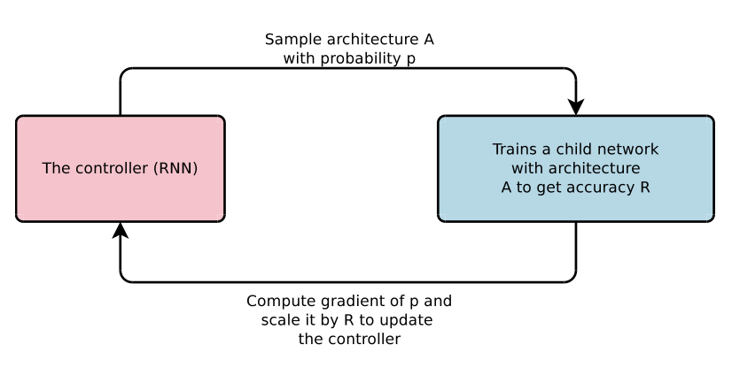

- controller(RNN)이 sample architecture(child network)를 생성한다.

- child network training 후, validation accuracy를 얻는다.

- accuracy를 바탕으로 controller policy를 update한다.

그런데 문제는 update를 위한 R(accuracy)은 미분 가능하지 않다.

```math
J({\theta}_{c}) = E_{P(a_{1:T};{\theta}_{c})}[R]
```

- $\theta$ : validation accuracy

- $a$ : **action** 

  controller가 sample network가 갖는 hyperparameter 하나를 예측하는 과정. 
  
  > 여러 action을 거쳐서 하나의 sample network architecture가 생성된다.

- $a_{1}:T$ : sample을 생성하는 데 발생한 action list

```math
J({\theta}_{c}) = E_{P(a_{1:T};{\theta}_{c})}[R]
```

따라서 다음과 같이 policy gradient method를 이용하여 미분 가능하도록 식을 수정한다.

```math
{\nabla}_{{\theta}_{c}}J({\theta}_{c}) = \sum_{t=1}^{T}{E_{P(a_{1:T};{\theta}_{c})}[{\nabla}_{{\theta}_{c}} {\log}P({\alpha}_{t}|{\alpha}_{(t-1):1};{\theta}_{c})R]}
```

> 실제로는 더 approximate하며 baseline이 추가된 식을 사용한다. baseline은 지난 architecture의 평균 accuracy로 산출한다.

---

#### 7.6.3.1 ProxylessNAS

> [ProxylessNAS: Direct Neural Architecture Search on Target Task and Hardware 논문(2018)](https://arxiv.org/abs/1812.00332)

> 더 자세한 정리는 8.3.1절 참조

RL-based search strategy를 사용하는 대표적인 NAS로 ProxylessNAS가 있다. 


- **gate**

  0과 1로 이루어진 binary vector(**probability**)로, architecture path의 활성화/비활성화를 제어한다.

  - 0: prune, 1: keep

  - 활성화된 path만을 memory에 유지하면 된다. 

```math
g = \mathrm{binarize}(p_1, \cdots , p_N) = \begin{cases} [1, 0, \cdots, 0] & \mathrm{with} \, \mathrm{probability} \, p_1 \\ \cdots \\ [0, 0, \cdots, 1] & \mathrm{with} \, \mathrm{probability} \, p_N \end{cases}
```

- architecture parameters를 이용한 근사식으로 gradient update가 가능하다.

---

### 7.6.4 Bayesian optimization

> [Neural Architecture Search with Bayesian Optimisation and Optimal Transport 논문(2018)](https://arxiv.org/abs/1802.07191)

> [3Blue1Brown youtube: Bayes theorem](https://youtu.be/HZGCoVF3YvM)

> [exploration(탐색)과 exploitation(활용) 개념 정리](https://github.com/erectbranch/Neural_Networks_and_Deep_Learning/tree/master/ch09)

사전확률을 이용해 사후확률을 구할 수 있는 Bayes' theorem(베이즈 정리)는 다음과 같이 정의했다.

$$ P(B|A) = {{P(A|B)P(B)} \over {P(A)}} $$

논문에서는 exploitation과 exploration 중 어떤 것을 수행할지 **Bayesian optimization**을 적용해서 결정한다.

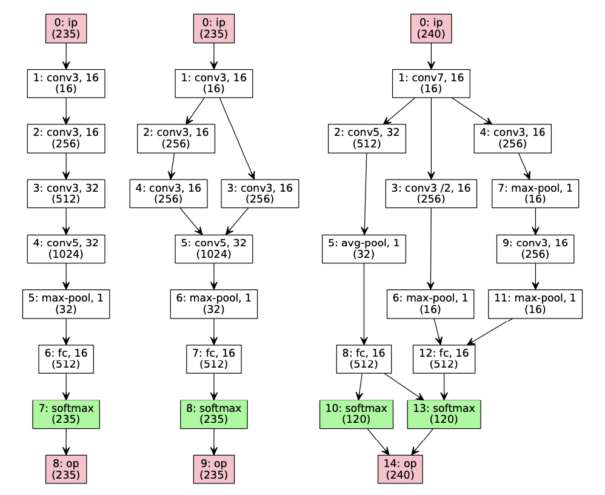

- exploration(탐색) 우선: 1번째에서 3번째를 수행한다.

- exploitation(활용) 우선: 1번째에서 2번째를 수행한다.

---

### 7.6.5 Gradient-based Search

> [DARTS: Differentiable Architecture Search 논문(2018)](https://arxiv.org/abs/1806.09055)

> [DARTS 논문 리뷰](https://www.kc-ml2.com/posts/blog_DARTS)

DARTS  논문에서는 gradient descent가 가능하도록 미분 가능한 근사식을 정의한 NAS를 제안한다.


- (a): 0, 1, 2, 3으로 이어질 probability가 존재한다.

  > 일직선만이 아니라 skip connection과 같은 다양한 연결을 표현할 수 있어야 한다.

- 각 path는 operation candidate set을 가지고 있다.(**mixed operation**)

  > convolution, avgpool, maxpool 등

  - operation $i$ : 선택할 확률 ${\alpha}_i$ 를 갖는다.

    최종적으로 path에서는 높은 ${\alpha}_i$ 를 갖는 operation이 선택된다.

$$ \sum_{i=1}^{n}{\alpha}_i = 1 $$

- edge $(i, j)$ 에서의 mixed operation은 다음과 같은 수식으로 표현할 수 있다.

```math
{\bar{o}}^{(i,j)}(x) = \sum_{o \in \mathcal{O}} {{\exp({\alpha}_{o}^{(i,j)})} \over {\sum_{o' \in \mathcal{O}}{\exp({\alpha}_{o'}^{(i,j)})}}}o(x)
```

하지만 gradient를 저장하기 위해 굉장히 많은 memory를 소모하게 되면서, ProxlessNAS와 같은 대안이 등장하게 된다.

---

### 7.6.6 Evolutionary search

> [Once-for-All: Train One Network and Specialize it for Efficient Deployment 논문(2019)](https://arxiv.org/abs/1908.09791)

**Evolutionary Search**, 세부적으로는 **Genetic Algorithm**는 주어진 network architecture에 **mutation**, **crossover**와 같은 알고리즘을 적용하여 더 나은 network를 찾는 방법이다.

> MB{n}: expansion ratio가 n인 inverted bottleneck.

- **mutation**

  depth, width, operator 등을 변화시킬 수 있다.

  

  - stage 1: depth가 3에서 2로 mutate

  - stage 2: depth가 3에서 4로 mutate

  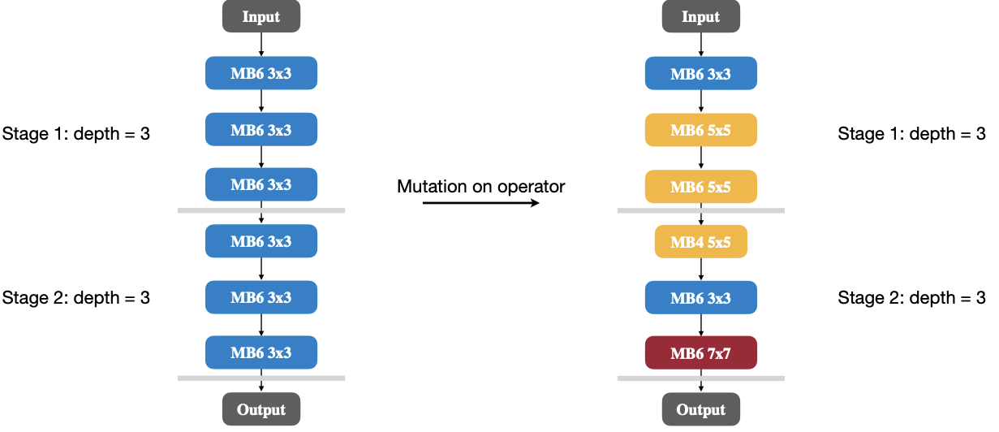

  - stage 1: 두 operator가 3x3에서 5x5 kernel로 mutate

  - stage 2: 세 operator의 kernel과 expansion ratio가 mutate

- **crossover**

  각 레이어마다 parent network의 operator를 임의로 가져와서 네트워크 구조를 생성한다.

  

---