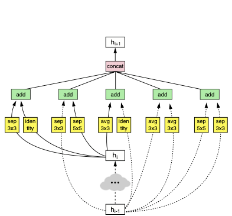
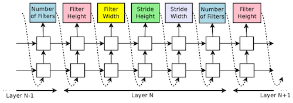

# 7 Neural Architecture Search (Part I)

> [Lecture 07 - Neural Architecture Search (Part I) | MIT 6.S965](https://www.youtube.com/watch?v=NQj5TkqX48Q)

다음은 수동으로 설계한 신경망에, 추가로 **Neural Architecture Search**(NAS)를 통해 찾은 신경망을 비교한 결과다. 

- NAS 최적 신경망: 더 적은 연산량(MACs)으로 (수동으로 설계한 신경망보다) 더 좋은 정확도를 획득했다.

NAS의 목표는 탐색 전략과 성능 평가 전략을 통해, 탐색 공간에서 최적의 신경망 구조를 획득하는 것이다.

> 성능은 accuracy, efficiency, latency 등 다양한 지표가 될 수 있다.

---

## 7.4 Search Space

> [Neural Architecture Search: Insights from 1000 Papers 논문(2023)](https://arxiv.org/abs/2301.08727)

최적 모델 구조를 찾기 위해서는, 먼저 탐색할 탐색 공간을 먼저 정의해야 한다. 다음은 대표적인 탐색 공간의 종류와, 해당 탐색 공간에서 찾는 하이퍼파라미터를 나타낸 도표다.

| Search Space (Structure) | Operation types | DAG topology | macro hyperparameters | cell topology | e.g. |
| :---: | :---: | :---: | :---: | :---: | --- |
| Macro (DAG) | O | O | O | - | NASBOT(Kandasamy et al., 2018) EfficientNet(Tan and Le, 2019) |
| Chain-Structured (Chain) | O | - | O | - | MobileNetV2(Sandler et al., 2018) ProxylessNAS(Cai et al, 2019) | 
| Cell-based (Duplicated Cells) | O | - | - | O | DARTS(Liu et al., 2019c) |
| Hierarchical (Varied) | O | O | O | O | MNASNet(Tan et al, 2019) Auto-DeepLab(Liu et al., 2019b) |

---

### 7.4.1 Cell-based Search Space

> [Learning Transferable Architectures for Scalable Image Recognition 논문(2017)](https://arxiv.org/abs/1707.07012)

다음은 NASNet에서 정의한 **cell-based search space**이다.

| | Normal Cell | Reduction Cell |
| :---: | :---: | :---: |
| 역할 | 해상도가 유지된다. | 해상도가 줄어든다. |
| 예시 |  |  |

- Reduction Cell: 해상도를 줄인다.(stride > 2)

- Normal Cell: 해상도가 유지된다.(stride = 1)

이때, RNN controller를 이용하여 candidate cell를 생성한다. 

| | RNN controller |
| :---: | :---: |
| 강화 학습 방식 |  |
| 추론 |  |

### &nbsp;&nbsp;&nbsp;📝 예제 1: Cell-level Search Space size &nbsp;&nbsp;&nbsp;

다음 조건에서 NASNet의 search space size를 구하라.

- 2 candidate input

- $M$ input transform operations

- $N$ combine hidden states operations

- $B$ \#layers

### &nbsp;&nbsp;&nbsp;🔍 풀이&nbsp;&nbsp;&nbsp;

탐색 공간의 크기는 다음과 같다. 이처럼 cell-based search space는 exponential하게 커지는 문제점을 갖는다.

$$(2 \times 2 \times M \times M \times N)^{B} = 4^{B}M^{2B}N^{B}$$

> $M=5, N=2, B=5$ 라고 하면 search space 크기는 $3.2 \times 10^{11}$ 이 된다.

---

### 7.4.2 Hierarchical Search Space: Network-Level

> [MnasNet: Platform-Aware Neural Architecture Search for Mobile 논문(2018)](https://arxiv.org/abs/1807.11626)

> [Trilevel Neural Architecture Search for Efficient Single Image Super-Resolution 논문(2021)](https://arxiv.org/abs/2101.06658)

**hierarchical search space**란, 여러 계층으로 나누어진 탐색 공간을 의미한다. 

- two level: cell or chain-structured space + macro-level architecture hyperparameters

  > 대표적으로 MobileNetV2를 백본으로 사용하는 MNasNet이 있다.

- three level: 추가로 kernel hyperparameter 등을 탐색한다.

---

#### 7.4.2.1 Network-Level Search Space for Image Segmantation

> [Auto-DeepLab: Hierarchical Neural Architecture Search for Semantic Image Segmentation 논문(2019)](https://arxiv.org/abs/1901.02985)

**Image Segmentation** 도메인을 다루는 Auto-DeepLab 논문에서는, 레이어의 upsampling/downsampling 설정을 탐색한다.

- 가로: \#layers, 세로 Downsample(해상도가 줄어든다.)

- 파란색 nodes를 연결하는 path가 candidate architecture가 된다.

---

#### 7.4.2.2 Network-Level Search Space for Object Detection

> [NAS-FPN: Learning Scalable Feature Pyramid Architecture for Object Detection 논문(2019)](https://arxiv.org/abs/1904.07392)

**Object Detection** 도메인을 다루는 NAS-FPN 논문에서는, FPN 모델을 기반으로 탐색 공간을 구성한다.

> AP: average precision(평균 정밀도)

NAS로 찾은 최적 모델은 수동으로 설계한 모델과 매우 다른 양상을 보였다. 하지만 정확도와 irregularity 사이에서 균형을 맞출 필요가 있는데, 하드웨어 구현이 어렵고 병렬화의 이점을 누리는 것이 힘들기 때문이다.

---

## 7.5 Design the Search Space

보다 효율적인 탐색 공간을 찾으려는 연구도 진행되어 왔다.

---

### 7.5.1 RegNet: Cumulative Error Distribution

> [On Network Design Spaces for Visual Recognition 논문(2019)](https://arxiv.org/abs/1905.13214)

RegNet 논문에서는 **cumulative error distribution**을 기반으로, 최적의 탐색 공간을 설계했다.

- 파란색 곡선: 38.9% model이 49.4%가 넘는 error를 가진다.

- 주황색 곡선: 38.7% model이 43.2%가 넘는 error를 가진다.

하지만 수많은 모델을 직접 학습하고 평가해야 하는 문제가 있다.

---

### 7.5.2 MCUNetV1: FLOPs distribution

> [MCUNet: Tiny Deep Learning on IoT Devices 논문(2020)](https://arxiv.org/abs/2007.10319)

MCUNetV1 논문의 TinyNAS에서는 MCU 제약조건에 최적인 탐색 공간을 찾기 위해, 슈퍼넷에 포함된 서브넷의 연산량(FLOPs)를 관찰하여 비교했다.

- 동일한 memory constraint에서는 <U>FLOPs가 클수록 큰 model capacity를 갖는다.</U>

- 큰 model capacity는 높은 accuracy와 직결된다. 

---
