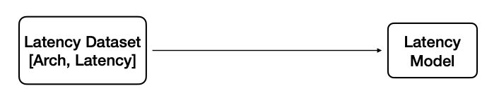
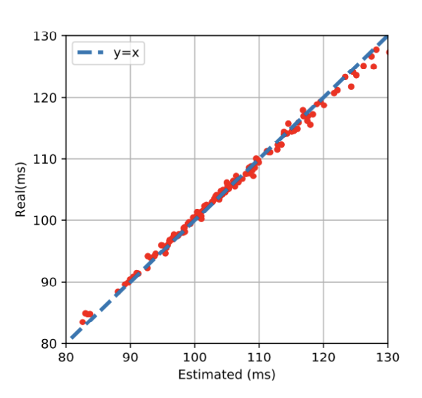
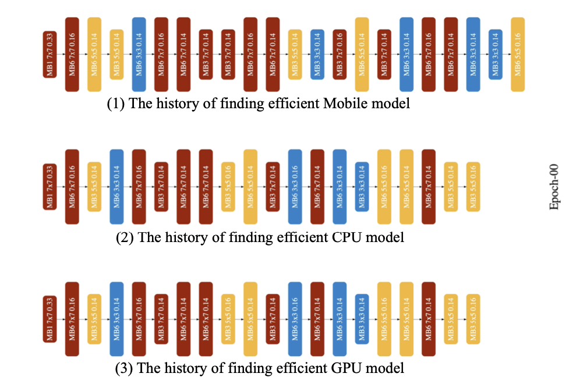
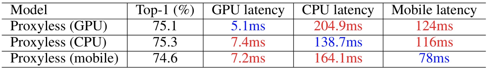

# 8 Neural Architecture Search (Part II)

> [Lecture 08 - Neural Architecture Search (Part II) | MIT 6.S965](https://www.youtube.com/watch?v=PFitZnPIKoc)

강의 정리 일부 생략. Search for Efficient Model 슬라이드부터 정리 시작.

---

## 8.1 Search for Efficient Model

아래 MACs(왼쪽), FLOPs(오른쪽)와 latency를 나타낸 도표를 보면, MACs(혹은 FLOPs)가 latency를 나타내는 좋은 지표가 아닌 것을 알 수 있다.


- MobileNetV2(파란색), NASNet-A(주황색), AmoebaNet-A(녹색)은 비슷한 수준의 MACs를 가지고 있지만, latency는 약 140ms, 180ms, 190ms로 차이가 크다.

- 오른쪽 사진 역시 FLOPs는 비슷하나 latency 차이가 크다.(layer 개수 scaling )

이번에는 다른 hardware에서 측정한 FLOPs에 따른 latency를 보자.


- 라즈베리 파이는 hidden dim이 늘어나면(FLOPs도 증가) latency도 증가했지만, GPU는 large parallelism을 가지므로 크게 영향을 받지 않는다.

그렇다면 latency를 측정하려면 어떻게 할까? 만약 training 중에 latency를 측정하려고 한다면, 매우 빈번하게 latency 측정이 일어나면서 cost를 많이 잡아먹게 된다.



따라서 training마다 직접 측정하기보다는 **latency predictor**을 이용한다. <U>[model architecture, latency]</U> 정보가 담긴 latency dataset을 가지고, latency model을 만들어서 latency를 예측하는 것이다.


이렇게 측정한 latency를 loss function 항에 추가하여 NAS를 수행하면, 더 빠른 model architecture를 얻을 수 있다.


---

### 8.1.1 layer-wise latency profiling

latency prediction을 수행하기 위한 접근법은 여러가지가 있다. 우선 layer 단위로 latency lookup table을 구성하는 **layer-wise latency profiling**을 보자.


dataset은 architecture와 layer Operation(Op. convolution, pooling 등)마다의 latency로 구성된다. 이를 통해 lookup table을 구성해 두면, 다음에 동일한 연산을 수행하는 layer operation에서 이 latency를 재사용할 수 있다.

아래는 **ProxylessNAS**LatencyTable에서의 parameter 설명이다.

```
:param l_type:
        Layer 종류는 다음 중 하나에 해당되어야 한다.
        1. `Conv`: stride 2를 갖는 initial 3x3 conv.
        2. `Conv_1`: feature_mix_layer
        3. `Logits`: `Conv_1` 다음 진행되는 모든 operation.
        4. `expanded_conv`: MobileInvertedResidual
:param input_shape: input shape (h, w, channels 개수)
:param output_shape: output shape (h, w, channels 개수)
:param expand: expansion ratio
:param ks: kernel size
:param stride:
:param id_skip: residual connection 여부를 나타낸다(없으면 0, 있으면 1)
```

> id_skip은 ResNet에서 본 [skip connection](https://github.com/erectbranch/TinyML_and_Efficient_DLC/tree/master/lec07/summary01)을 의미한다.

다음이 layer-wise latency profiling 예시 사진이다.


- 첫 번째는 (112x112) resolution에 24개의 channel을 갖는 input을 받아서,  3x3 kernel 연산을 적용해 24개 output을 만들어 낸다. 

- predicted latency를 mean(평균)과 std(표준 편차)로 나타낸다.

다음이 ProxylessNAS의 실제 latency와 predicted latency를 비교한 도표이다. 



---

### 8.1.2 network-wise latency profiling

특정 작업에서 model이 layer operation마다 걸리는 latency 대신, 전체 network 단위의 latency를 가늠해야 하는 경우도 있다.

각 layer마다 갖는 kernel size, width, resolution 등의 정보를 input으로 하여 latency predictor를 만들 수 있다.


---

### 8.1.3 specialized models for different hardware

이제 NAS를 바탕으로 특정 hardware에 최적화된 model architecture가 어떻게 형성되었는지 살펴보자. GPU, CPU, mobile 세 가지 hardware 조건에 맞춰서 생성된 model architecture이다.

> [Lecture 08](https://www.youtube.com/watch?v=PFitZnPIKoc)의 39분부터 보면 epoch마다 model architecture가 변화하는 모습을 확인할 수 있다.



> layer에 색상에 따라 kernel size가 다르다. 빨간색(7x7), 주황색(5x5), 파란색(3x3)

- 1번: mobile에서 제일 효율적인 model architecture이다.

- 2번: CPU에서 제일 효율적인 model architecture이다.

- 3번: GPU에서 제일 효율적인 model architecture이다. 

차이는 CPU와 GPU model을 비교했을 때 극명하다. GPU는 large parallelism을 가지므로 NAS training이 진행될수록 kernel call이 줄어드는 것을 확인할 수 있다. 반면 CPU는 작은 3x3 kernel을 이용한 convolution을 여러 차례 진행한다.

결과를 보면 각 hardware platform에 맞는 model architecture가 생성되었다는 것을 알 수 있다.



그러나 이런 hardware도 제각각 다양한 모델을 갖는다. device마다 성능 제약도 다르기 때문에 이 모든 device에 대응하는 NAS model architecture를 만들기는 어렵다.

따라서 once-for-all network를 training해서, supernet에서 specialized model architecture를 선택하는 방법을 사용한다.

> 예를 들어 한 supernet에서 snapdragon 8 gen 1, snapdragon 888, qualcomm 855에 각각 specialized model architecture를 선택해 낼 수 있다.

> 이런 식으로 한 supernet을 이용해서 다양한 hardware constraints를 만족할 수 있다. 가령 full battery mode, low battery mode, battery-saving mode에 맞는 model들도 제약 조건에 따라 얻을 수 있다.

---

## 8.2 Once-for-All Network

Once-for-All network에서는 progressive하게 kernel size, depth, resolution을 prune하는 **progressive shrinking**(PS)을 사용한다.

우선 maximum kernel size(예시는 7), depth(예시는 4), width(예시는 6)을 갖는 largest neural network를 training한다. 그 다음 더 작은 subnet을 support할 수 있도록, 아래와 같이 progressive하게 network를 fine-tune해 나간다.

- progressive shrinking: kernel size

    

    예시는 7x7 kernel로 시작한다. 그 다음 이 kernel에 transform matrix를 적용하여 5x5 kernel로 만들어 training한다. 이를 3x3 kernel까지 반복한다.(따라서 동일한 weight를 share한다고 할 수 있다.)

- progressive shrinking: layer 개수

    

    예시는 layer 4개에서 시작한다. 그 다음 layer 3개로 training하고, 그 다음은 2개로 train한다.(depth가 계속해서 줄어든다.) 따라서 제일 작은 model이 갖는 layer D개는 제일 큰 model과도 share한다.

- progressive shrinking: channel 개수

    

    처음은 channel 4개를 가지고 train하다가, 중요하지 않은 것으로 판단되는 channel은 pruning한다. 그래도 제일 important한 channel들의 weight들은 계속 share된다.

이렇게 largest network의 training이 끝이 나면, depth와 width의 max 조건을 고정한 채, 각 layer의 kernel size를 elastic하게 선택할 수 있다.(3, 5, 7)

> 이보다 앞서 input image의 size를 elastic하게 선택할 수 있다.(elastic resolution) 이 경우 각 batch에서 random하게 image size를 sampling한다.

그 다음은 elastic depth, elastic width를 순차적으로 진행한다.

---