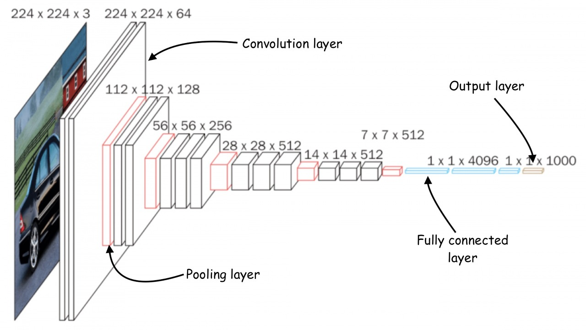
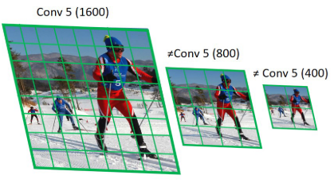

# 8 Neural Architecture Search (Part II)

> [Lecture 08 - Neural Architecture Search (Part II) | MIT 6.S965](https://www.youtube.com/watch?v=PFitZnPIKoc)

강의 정리 일부 생략. Search for Efficient Model 슬라이드부터 정리 시작.

---

## 8.1 Search for Efficient Model

만약 NAS 과정에서 미리 모델의 latency를 예측할 수 있다면, search cost를 줄이면서 latency constraint를 만족하는 효율적인 모델을 찾을 수 있을 것이다.

그렇다면 다양한 모델의 latency를 바로 예측할 수 있는 지표로 무엇이 있을까? 우선 모델의 연산량을 나타내는 MACs와 FLOPs를 생각해 볼 수 있다. 하지만 아래 'x축으로는 MACs나 FLOPs를 두고 y축으로는 latency를 둔 그래프'를 보면, 이는 그다지 좋은 생각이 아닌 것을 알 수 있다.


> 왼쪽은 MACs(x)와 latency(y), 오른쪽은 FLOPs(x, M)와 latency(y, ms)를 나타낸 그래프다. 

- 왼쪽 사진: MobileNetV2(파란색), NASNet-A(주황색), AmoebaNet-A(녹색)은 비슷한 수준의 MACs를 가지고 있지만, latency는 약 140ms, 180ms, 190ms로 차이가 크다.

- 오른쪽 사진: FLOPs는 비슷해도, 모델을 어떻게 scaling했는가에 따라 latency 차이가 크다.

    - 파란색: block 내부 layer 개수를 줄였다.

    - 주황색: hidden dim scaling으로 텐서의 차원 수를 줄였다.

이번에는 다른 hardware에서 scaling 방법 차이에 따른 latency 변화를 살펴보자.


- Raspberry Pi(ARM CPU): hidden dim이 늘어나면서 latency가 늘어났다.

- GPU: hidden dim을 늘려도 GPU의 large parallelism 덕분에 크게 영향을 받지 않는다.

---

### 8.1.1 layer-wise latency profiling

그렇다면 모델의 latency를 측정하기 위해서는 어떤 방법을 써야 할까? **OFA**(Once-For-All) NAS에서는 **latency predictor**(지연시간 예측기)를 만들어서 latency를 예측하는 방법을 사용한다.


우선 그 중에서도 layer(혹은 특정한 기능을 수행하는 여러 layer를 조합한 block) 단위로 latency lookup table을 구성하는 **layer-wise latency profiling**을 보자.


- [Arch(모델 아키텍처 정보), Latency]로 구성된 LUT(lookup table)을 만들어 둔다.

- search algorithm에서는 위 LUT를 참고해서, subnet이 latency constraint를 만족하는지 파악한다.

아래는 note10+에서 측정한 (특정 해상도 이미지를 입력으로 받는) MbV3 subnet이 가지는 layer 정보와, layer마다의 latency를 나타낸 LUT의 일부분이다.


- expanded_conv: MobileNet의 Inverted Bottleneck Block을 나타낸다.

    - input activation은 (112,112,24), output activation은 (56,56,32) 차원을 갖는다.

    - expand ratio = 6을 사용해서, DWConv는 144개 채널을 갖는 입력에 convolution을 수행한다.

    - DWConv는 3x3 Convolution을 사용하고 stride는 1이다.(stride는 input/output activation의 resolution을 비교해 보면 1인지 2인지 알 수 있다.)

    - skip connection을 사용한다.(idskip:1)

    - SENet의 SE Block을 사용하지 않으며(se:0), non-linearity로 ReLU를 사용한다(hs:0)

    > hs:1이면 h-swish를 사용한다.

예시를 잘 보면 여러 번 측정하여 구한 latency의 평균 값을 사용하는 것을 알 수 있다. 

아래는 NAS로 도출한 ProxylessNAS subnet의 실제 latency와, LUT에서 참조한 predicted latency를 비교한 도표다. LUT를 사용한 latency predictor가 유효한 방법인 것을 알 수 있다.


아래는 실제 OFA 코드에서 layer type에 대해 적어둔 설명을 번역한 것이다.

```
:param l_type:
        Layer 종류는 다음 중 하나에 해당되어야 한다.
        1. `Conv`: stride 2를 갖는 initial 3x3 conv.
        2. `Conv_1`: feature_mix_layer
        3. `Logits`: `Conv_1` 다음 진행되는 모든 operation.
        4. `expanded_conv`: MobileInvertedResidual
:param input_shape: input shape (h, w, channels 개수)
:param output_shape: output shape (h, w, channels 개수)
:param expand: expansion ratio
:param ks: kernel size
:param stride:
:param id_skip: residual connection 여부를 나타낸다(없으면 0, 있으면 1)
```

---

### 8.1.2 network-wise latency profiling

> [HAT: Hardware-Aware Transformers for Efficient Natural Language Processing 논문](https://arxiv.org/pdf/2005.14187.pdf)

특정 NAS(특히 Transformer 모델)에서는 layer-wise latency profiling 대신, 전체 network 단위로 latency를 가늠해야 하는 경우도 있다.

가령 위 HAT 논문에서는 [SubTransformer architecture, measured latency]의 페어로 dataset을 만들어서 latency predictor를 training시켰다.

아래는 network-wise latency profiling 방법으로 구축한 latency predictor의 예측값과, 실제 subnet의 latency를 비교한 그래프다. 마찬가지로 유효한 방법인 것을 알 수 있다.


---

### 8.2 specialized models for different hardware

이제 NAS에서 어떻게 특정 hardware에 최적화된 model architecture를 추출하는지 살펴보자. 다음은 GPU, CPU, mobile 세 가지 hardware constraint에 맞춰서 생성된 model architecture이다.

> [Lecture 08](https://www.youtube.com/watch?v=PFitZnPIKoc)의 39분부터 보면 epoch마다 model architecture가 변화하는 모습을 확인할 수 있다.


> layer에 색상에 따라 kernel size가 다르다. 빨간색(7x7), 주황색(5x5), 파란색(3x3)

- 1번: mobile에서 제일 효율적인 model architecture이다.

- 2번: CPU에서 제일 효율적인 model architecture이다.

- 3번: GPU에서 제일 효율적인 model architecture이다. 

차이는 CPU와 GPU model을 비교했을 때 극명하다. 

- GPU는 large parallelism을 가지므로, NAS training이 진행될수록 parallelism은 최대한 활용하면서 kernel call을 줄이는 방향으로 바뀐다.

- 반면 CPU는 3x3 kernel을 이용해 convolution을 여러 차례 진행한다.

이렇게 constraints를 만족하는 best subnet architecture을 찾으면, pretrained supernet을 deepcopy한 뒤, subnet architecture configuration대로 subnet을 추출하는 것이다.

> 다시 말하면 search algorithm에서는 실제로 subnet을 추출하는 과정은 없고, subnet architecture configuration을 바탕으로 predictor가 예측한 결과가 constraints를 만족하는지만 파악하는 것이다.

결과를 보면 각 hardware platform에 맞는 model architecture를 제대로 추출했다는 사실을 알 수 있다.


그러나 GPU, CPU, Mobile도 범주 안에서 굉장히 다양한 사양이 존재한다. 이 모든 device에 대응하는 NAS model architecture를 만들기는 어렵다.

따라서 OFA NAS는 하나의 큰 supernet을 training하고, 해당 pretrained supernet에서 subnet(specialized model architecture)를 추출하는 방법을 제시한다. 

- 특정 hardware에 맞는 constraint만 조건으로 제시하면, pretrained supernet에서 제일 알맞는 subnet을 찾아낸다.

- 따라서 supernet training 단계 딱 한 번만 큰 GPU cost를 부담하면, 그 다음부터는 search algorithm 수행만으로 특정 hardware에 맞는 model architecture를 추출할 수 있는 것이다. 

> 예를 들어 한 supernet에서 snapdragon 8 gen 1, snapdragon 888, qualcomm 855에 각각 specialized model architecture subnet을 추출할 수 있다.

동일한 hardware도 여러 상황을 고려한 constraints 버전으로 subnet을 추출할 수도 있다. 가령 full battery mode, low battery mode, battery-saving mode에 맞는 model들도 제약 조건을 설정해서 얻어낼 수 있다.

---

## 8.3 Once-for-All NAS

> [ONCE-FOR-ALL 논문](https://arxiv.org/pdf/1908.09791.pdf)

> [ONCE-FOR-ALL github](https://github.com/mit-han-lab/once-for-all)

Once-for-All NAS에서 사용하는 supernet training에는 굉장히 많은 GPU cost가 필요하다. 따라서 **progressive shrinking**(PS)라는 방법을 이용해서, cost면에서 더 효율적으로 supernet training을 진행한다.


> 이렇게 얻어낸 pretrained supernet을 가지고, search algorithm은 kernel size, depth, width가 다른 여러 subnet 중에서 constraint를 만족하는 subnet architecture를 찾는 것이다. 

---

### 8.3.1 Progressive Shrinking: CNN architecture

잠시 일반적인 CNN architecture를 보자. OFA의 supernet training을 위한 PS에서는 다음 조건들을 바꿔가며 진행하게 된다.



> 조건 옆에 있는 수치는 예시.

- image resolution: {128, 132, ..., 220, 224} (128~224 범위로 제한)

- kernel size: filter size. {3(3x3), 5(5x5), 7(7x7)} (3가지 옵션)

- depth: layer 개수. {2, 3, 4} (3가지 옵션)

- width: DW Conv에서 계산하는 input activation의 channel 개수.

---

### 8.3.2 Progressive Shrinking: Elastic Resolution

그런데 <U>CNN model의 input data는 고정된 resolution을 가져야 한다.</U> 그렇다면 OFA는 어떻게 PS에서 여러 image resolution으로 training할 수 있을까?

> [Object Detection CNN model의 입력 해상도 제한](https://eehoeskrap.tistory.com/584)

> [An Analysis of Scale Invariance in Object Detection  논문](https://arxiv.org/pdf/1711.08189.pdf)

원래 대부분의 CNN model은 다양한 resolution을 갖는 input data를 처리하기 위해, model input으로 data를 사용하기 전 image preprocessing을 수행하는 코드를 만들어 둔다. (혹은 CNN model 내부에서 Convolution - spatial pooling을 수행하는 방식으로도 resolution을 맞출 수 있다.)


resolution을 맞추기 위해서는 보통 위 그림과 같이 대체로 crop이나 warp 방법을 사용한다. 하지만 crop은 전체 object를 포함하지 못할 수 있고, warp는 기하학적 왜곡이 심하게 일어날 수 있다는 단점이 있다.

> preprocessing에서 일어나는 문제를 방지하기 위해, 대체로 dataset 자체 input resolution을 특정 범위 내로 제한시키는 경우가 많다.

그렇다면 일괄적으로 resize하는 방법도 떠올릴 수도 있다. 하지만 서로 다른 scale에 동일한 convolution layer를 적용했을 때, semantic region이 다르게 mapping이 일어나게 된다.

아래는 filter size 5x5 Convolution을 수행했을 때, 1600, 800, 400 scale image에서 생긴 semantic regions를 나타낸 그림이다.



- high resolution(1600): largh object를 탐지하기 힘들다.

- small resolution(400): small object를 탐지하기 힘들다.

OFA의 PS에서 input resolution을 어떻게 처리하는지는 [train_ofa_net.py](https://github.com/mit-han-lab/once-for-all/blob/master/train_ofa_net.py), [progressive_shrinking.py](https://github.com/mit-han-lab/once-for-all/blob/a5381c1924d93e582e4a321b3432579507bf3d22/ofa/imagenet_classification/elastic_nn/training/progressive_shrinking.py). [my_random_resize_crop](https://github.com/mit-han-lab/once-for-all/blob/a5381c1924d93e582e4a321b3432579507bf3d22/ofa/utils/my_dataloader/my_random_resize_crop.py) 코드를 보면 알 수 있다.

- `train_ofa_net.py`: supernet training 코드

    - `MyRandomResizedCrop.CONTINUOUS`를 `True`, `False` 둘 중 하나로 선택할 수 있다.

- `progressive_shrinking.py`: training을 위한 progressive shrinking이 구현된 코드.

- `MyRandomResizedCrop` 클래스: `my_random_resize_crop.py`(image resolution 조정 코드)에 정의되어 있다.

    > `IMAGE_SIZE_LIST` 리스트 값에 유의한다.(default: `IMAGE_SIZE_LIST = [224]`)

    > `IMAGE_SIZE_SEG` 값에 유의한다.(default: `IMAGE_SIZE_SEG = 4`)

    - 1: `MyRandomResizedCrop` 인스턴스가 호출되면 `__call__` 메서드가 실행된다.

    - 2: `resized_crop()` 함수에 의해 `MyRandomResizedCrop.ACTIVE_SIZE`(default = 224) size로 image가 crop된다.

    - `sample_image_size()` 메서드를 사용하면 `MyRandomResizedCrop.ACTIVE_SIZE`가 바뀌게 된다.(인자로 batch_id 인덱스를 받아서 random seed 역할로 사용한다.)

    - 이때 `get_candidate_image_size()` 메서드가 `candidate_sizes`라는 리스트에 resolution 후보를 담게 되며, `sample_image_size()` 메서드가 후보 중에서 random하게 하나를 고르게 된다. 

    - `MyRandomResizedCrop.CONTINUOUS = True`: `IMAGE_SIZE_LIST` 리스트의 {min 원소 값, max 원소 값} 범위 내 모든 정수를 iteration하며, `MyRandomResizedCrop.IMAGE_SIZE_SEG`(default: `IMAGE_SIZE_SEG = 4`)로 나눠서 0이 되는 값을 `candidate_sizes` 리스트에 담는다.

    - `MyRandomResizedCrop.CONTINUOUS = False`: `IMAGE_SIZE_LIST` 원소를 `candidate_sizes` 리스트에 그대로 옮겨 담는다.

---

### 8.3.3 Progressive Shrinking

우선 maximum kernel size(예시는 7), depth(예시는 4), width(예시는 6)을 갖는 largest neural network를 training한다. 그 다음 더 작은 subnet을 support할 수 있도록, 아래와 같이 progressive하게 network를 fine-tune해 나간다.

- progressive shrinking: **kernel size**

    

    예시는 7x7 kernel로 시작한다. 그 다음 이 kernel에 transform matrix를 적용하여 5x5 kernel로 만들어 training한다. 이를 3x3 kernel까지 반복한다.

- progressive shrinking: **depth**(layer 개수)

    

    예시는 layer 4개에서 시작한다. 그 다음 layer 3개로 training하고, 그 다음은 2개로 train한다.(depth가 계속해서 줄어든다.)

- progressive shrinking: **width**(channel 개수)

    

    처음은 channel 4개를 가지고 train하다가, 중요하지 않은 것으로 판단되는 channel은 pruning한다. 

> 이런 과정을 통해 supernet과 subnet이 모두 weight를 sharing할 수 있는 것이다.

이렇게 supernet의 training이 끝이 나면, NAS도 progressive shrinking에서 사용한 조건들을 이용해서 subnet을 탐색한다.

---