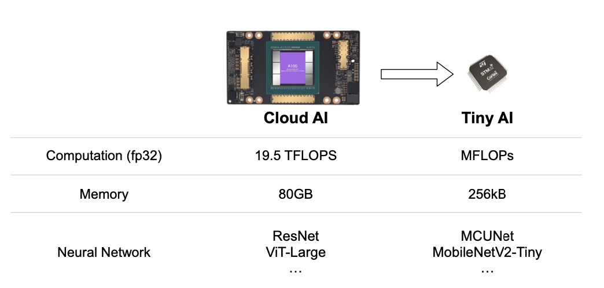
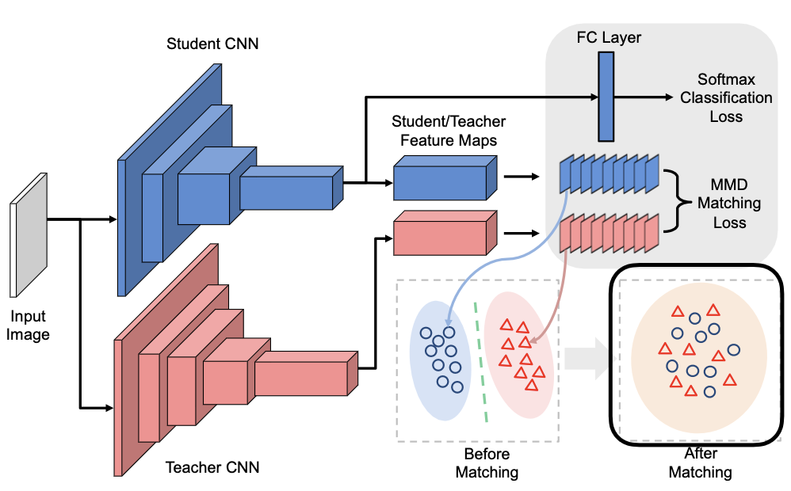

# 10 Knowledge Distillation

> [Lecture 10 - Knowledge Distillation | MIT 6.S965](https://youtu.be/IIqf-oUTHe0)

큰 computation 능력과 memory를 가진 cloud 기반 model에서, edge에서 사용할 수 있는 model로 **knowledge distillation**을 진행하려면 어떻게 해야 할까?

cloud AI와 tiny AI의 training curve 차이를 보자.

- cloud model(ResNet50): epoch가 늘면서 training accuracy가 80%가 넘는 결과를 보인다..

- edge model(MobileNetV2-Tiny): epoch가 늘어도 training accuracy가 50% 정도에 가까운 결과를 보인다.

---

## 10.1 summary of knowledge distillation

> [distiller documentation: knowledge distillation](https://intellabs.github.io/distiller/knowledge_distillation.html)

knowledge distillation은 2015년 발표된 논문으로, knowledge를 teacher network에서 student network로 transfer하는 방법이다.

> 예를 들어 student network는 MCU나 라즈베리 파이와 같은 embedded device에서 사용할 model일 수 있다.

- input(예: 이미지, 자연어, 음성)은 teacher network와 student network에 모두에 입력된다. 

- teacher model과 student model의 prediction logits를 **distillation loss**에 반영한다.

  > cross entropy loss( $E(-p_{t}\log{p_{s}})$ )나 L2 loss( $E({|| p_{t} - p_{s} ||}_{2}^{2})$ )를 사용할 수 있다.

위 그림의 classification loss에서 볼 수 있듯 distillation은 class 예측 확률을 바탕으로 한다. 그러나 teacher model에서 accuracy가 높을수록 정답이 아닌 다른 class에 해당될 확률은 0에 매우 가깝게 된다. 따라서 다른 class에 해당될 확률 정보가 사라지는 문제가 발생한다.

이를 해결하기 위해 논문에서는 **softmax temperature** 개념을 도입한다.

$$ p_{i} = {{\exp({z_{i} \over T})} \over {\sum_{j}{\exp({z_{i} \over T})}}} $$

- $p_{i}$: class $i$에 해당될 확률

- $z_{i}$: class $i$에 해당될 확률을 계산하기 위한 logits

- $T$ = 1이면 원래의 softmax와 동일하다. $T$ 가 커질수록 softmax의 확률 분포가 더 soft해져서, teacher의 prediction 정보를 student에게 더 잘 전달할 수 있다.

> 논문에서는 이렇게 student에게 전달하는 information을 
**dark knowledge**라고 부른다.

또한 동시에 student model은 (teacher model의 soft-labels)와 더불어 정답에 해당되는 label을 찾도록 train된다. 이는 student model의 loss, 다시 말해 student's predicted class probabilities와 ground-truth labels 간의 **standard loss**( $T = 1$ 인 일반 softmax )도 계산한다는 뜻이다.

> **ground-truth**란 실험자가 정한 '정답'으로, 실험자가 model이 답으로 내놓기를 원하는 정답이다. 예를 들어 data가 '고양이 분장을 한 사람' 사진이라도, 이 data의 ground-truth 값은 '고양이'로 정할 수 있는 것이다.(hard labels/targets로 부르기도 한다.)

위 distillation loss와 student loss를 종합한 전체 loss function은 다음과 같이 나타낼 수 있다.

$$ \mathcal{L}(x; W) = {\alpha} * \mathcal{H}(z_{s}; T = 1) + {\beta} * \mathcal{H}({\sigma}(z_{t};T = {\tau}), {\sigma}(z_{s};T = {\tau})) $$

- $x$ 는 input, $W$ 는 student model parameter를 나타낸다.

- $z_{s}$ , $z_{t}$ : 각각 student model과 teacher model의 logits

- $\mathcal{H}$ : cross-entropy loss

- $\sigma$ : softmax function

- knowledge distillation에서 추가로 생긴 parameter는 다음과 같다.

  - $\alpha$ : weight for student loss

  - $\beta$ : weight for distillation loss

  - $\tau$ : temperature for distillation loss

  > temperature로는 주로 1 ~ 20 사이의 값을 사용한다. 
  
  > 다만 <U>teacher model과 student model의 크기 차이가 크면 대체로 온도가 낮을수록 효과가 좋다.</U> 온도가 높을수록 teacher model의 information은 많아지지만, 매우 작은 model에서 이 모든 정보를 capture하지 못하기 때문이다. 

위 식에서 본 것처럼 knowledge distillation에서는 $\alpha$ 와 $\beta$ parameter를 통해 distillation loss와 student loss의 가중치를 둬서 loss 반영을 조절한다.( 가중 평균으로 $\beta = 1 - \alpha$ 관계. ) 일반적으로 distillation loss의 가중치, 즉 $\beta$ 가 $\alpha$ 보다 훨씬 클 때 최적의 결과를 얻는다.

---

### 10.1.1 intuition of knowledge distillation

이제 예시를 보며 knowledge distillation이 어떻게 진행되는지 파악해 보자. 아래는 고양이 그림을 입력으로 주었을 때 teacher model과 student model의 prediction 결과를 보여준다.(개 고양이의 binary classification 문제)

- teacher: cat의 logits는 5, dog의 logits는 1로, softmax를 적용하면 cat의 probability는 0.982이다.

- student: cat의 logits는 3, dog의 logits는 2으로, softmax를 적용하면 cat의 probability는 0.731이다.

예시에서 student model은 teacher에 비해 input image가 cat이라는 confidence가 부족하다. 이를 teacher model의 information을 받아 해결할 것이다.

teacher model의 probabilities에 softmax temperature를 적용해 보자.

- $T = 1$ : 이전과 동일한 standard softmax이다.

- $T = 10$ : softmax의 확률 분포가 더 soft해져서, teacher의 prediction information이 더 담기게 된다.

---

## 10.2 matching intermediate weights

반면 final prediction을 matching시키기보다, intermediate weights(혹은 intermediate feature map)를 matching시키는 방법도 있다. 

- teacher model의 각 layer는 student model의 각 layer와 match된다. 

- match 대상은 weight가 될 수 있고, activation, gradient 등이 될 수도 있다.

그 중에서 intermediate weights를 matching시키는 한 방법을 살펴보자. 앞서 prediction을 바탕으로 cross-entropy distillation loss을 적용한 것과 달리, teacher weights와 student weights 사이에 **L2 loss**를 적용한다.

> (보통 student model의 dimension이 더 작기 때문에) dimensionalities를 맞추기 위해 linear transform도 적용된다.(projection)

- dimensionalities를 맞추기 위해 projection을 진행한 뒤, teacher과 student의 weights 사이에 L2 loss를 적용한다.

---

## 10.2 matching intermediate features

teacher model과 student model은 서로 비슷한 feature distribution을 가져야 되기 때문에, feature distribution을 비교해서 knowledge distillation을 진행하는 방법이다.

- before matching(distillation 전): teacher model과 student model의 feature distribution이 매우 다르다.

- after matching(distillation 후): teacher model과 student model의 feature distribution이 비슷해진다.

feature map 간의 평균 discrepancy(불일치)를 줄이기 위해서는 기본적으로 cosine distance를 줄이면 된다.

> [cosine distance 소개](https://seongkyun.github.io/study/2019/04/01/cosine_distance/)

feature map이 가까울수록(cosine distance가 작을수록) teacher feature map과 student feature map이 유사해진다.

---