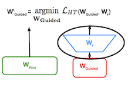
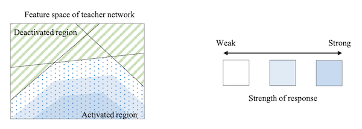

# 10 Knowledge Distillation

> [Lecture 10 - Knowledge Distillation | MIT 6.S965](https://youtu.be/IIqf-oUTHe0)

**knowledge transfer**이란 복잡한 모델(cloud model)을 이용해 단순한 모델(edge model)을 훈련시킴으로써, <U>generalization과 accuracy 성능이 복잡한 모델에 근접한 단순한 모델을 얻어내는 방법</U>이다.


cloud model과 tiny model의 training curve 차이를 보자.


> 가로: epoch, 세로: accuracy

- ResNet50(cloud model)
 
  training accuracy가 80%를 넘는다.

- edge model(MobileNetV2-Tiny)

  training accuracy가 50% 정도에 가깝다. 
  
  edge model은 작은 capacity를 갖는 만큼 높은 정확도를 얻기 힘들다.

또한 작은 capacity를 갖기 때문에, edge model에서 overfitting을 방지하기 위한 몇 가지 학습 기법은 오히려 역효과를 가져올 수 있다.

- **data augmentation**(데이터 증강), **dropout**(드롭아웃) 등

> data augmentation란 기존 데이터를 가지고 여러 방법으로 데이터를 늘리는 방법이다. mirroring, random cropping, rotation, shearing, local wrapping 등

---

## 10.1 Knowledge Distillation

> [Distilling the Knowledge in a Neural Network 논문(2015)](https://arxiv.org/abs/1503.02531)

> [distiller documentation: knowledge distillation](https://intellabs.github.io/distiller/knowledge_distillation.html)

**Knowledge Distillation**(KD, 지식 증류)란 커다란 teacher network를 이용한 학습을 통해, teacher가 갖고 있는 knowledge를 student network로 전달하는 방법이다.


- Input (예: 이미지, 자연어, 음성)

  teacher network와 student network 양쪽에 전달된다. 이를 바탕으로 각각 predication logits을 산출한다.

- Classification Loss

  일반적으로 산출하는 classification loss.
  
  즉, student's predicted class probabilities와 ground-truth labels 간의 standard loss이다.
  
  > ground-truth: 실험자가 정한 '정답'이다.(model이 답으로 내놓기를 원하는 class). hard labels/targets로 구분해서 부르기도 한다.

- **Distillation Loss**

  teacher model과 student model 각각 예측한 logits를 바탕으로 **distillation loss**를 산정한다.
  
  대표적으로 cross-entropy loss나 L2 loss를 바탕으로 계산한다.

  - cross-entropy loss: $E(-p_{t}\log{p_{s}})$ 

  - L2 loss: $E({|| p_{t} - p_{s} ||}_{2}^{2})$

---

### 10.1.1 intuition of knowledge distillation

아래는 개 고양이의 binary classification 문제에서 고양이 그림을 입력으로 주었을 때, teacher model과 student model 각각의 prediction 결과을 나타낸다.


- Teacher

  - cat: logits 5

  - dog: logits 1
  
  - softmax를 적용하면 cat의 probability는 0.982이다.

$${{e^5} \over {e^5 + e^1}} = 0.982$$

- Student

  - cat: logits 3, 
  
  - dog: logits 2
  
  - softmax를 적용하면 cat의 probability는 0.731이다.

$${{e^3} \over {e^3 + e^2}} = 0.731$$

결과를 보면 student model은 예측은 맞았지만, teacher에 비하면 input image가 cat이라는 confidence가 부족하다. 이를 teacher model의 information을 받아 해결할 것이다.

> teacher model이 갖는 information을 논문에서는 **dark knowledge**라고 지칭한다.

---

### 10.1.2 Softmax Temperatrue

하지만 teacher model의 confidence가 높을수록, 정답이 아닌 다른 class에 해당될 확률에 대한 information가 0에 매우 가깝게 된다. 따라서 다른 class에 해당될 information을 보존하기 위해 **temperature**라는 개념이 등장한다.

$$ p(z_i, T) = {{\exp({z_{i} \over T})} \over {\sum_{j}{\exp({z_{j} \over T})}}} $$

- $z_{i}$: logits

- $i, j = 0, 1, 2, ..., C - 1$

  - $C$ : \#classes

- $T$ : temperature

  - $T$ 가 클수록 distribution이 soft하게 변한다.

  - $T=1$ 일 때 standard softmax이다.

teacher model과 student model의 모델 사이즈 차이가 크다면, 대체로 낮은 temperature가 더 효율적이다. 매우 작은 model이 teacher model의 모든 information을 capture하지 못하기 때문이다.


### <span style='background-color: #393E46; color: #F7F7F7'>&nbsp;&nbsp;&nbsp;📝 예제 1: Softmax Temperature &nbsp;&nbsp;&nbsp;</span>

10.1.1절 예시에서 Teacher가 입력을 cat으로 예측한 확률을, softmax temperature를 이용하여 $T=1 , T=10$ 일 때를 각각 구하라.

### <span style='background-color: #C2B2B2; color: #F7F7F7'>&nbsp;&nbsp;&nbsp;🔍 풀이&nbsp;&nbsp;&nbsp;</span>


- $T = 1$

  **standard softmax**이다. 고양이일 확률은 다음과 같다.

$${{e^{5 \over 1}} \over {e^{5 \over 1} + e^{1 \over 1}}} = 0.982$$

- $T = 10$

  고양이일 확률은 다음과 같다.

$${{e^{5 \over 10}} \over {e^{5 \over 10} + e^{1 \over 10}}} = 0.599$$

---

## 10.2 What to match?

10.1절의 KD는 teacher, student 사이의 output logits를 match하는 것으로, student의 less confidence 문제를 해결했다. 하지만 logits이 아닌 다른 종류의 정보도 teacher와 student 사이에서 match시킬 수 있다.

---

### 10.2.1 Matching intermediate weights

> [FitNets: Hints for Thin Deep Nets 논문(2015)](https://arxiv.org/abs/1412.6550)

intermediate weights를 match하는 방법을 살펴보자. teacher, student의 각 레이어가 서로 match된다.


대표적으로 FitNets 논문에서는 teacher model와 이보다 더 깊고 폭이 좁은 student model(FitNet) 사이에서 intermediate weights를 match시킨다.


> 논문에서는 intermediate hidden layers를 줄여 hints로 지칭한다.

- teacher model이 더 넓은 모델이기 때문에, student보다 더 많은 output을 갖는다.

  이러한 teacher, student shape 차이를 보정하기 위한 regressor를 추가한다.(FC layer로 구현. layer weight $W_r$ 도 함께 학습된다.)

  

- 이후 teacher, student weights 사이에서 L2 loss를 산출한다.

---

### 10.2.2 Matching intermediate features

> [Like What You Like: Knowledge Distill via Neuron Selectivity Transfer 논문(2017)](https://arxiv.org/abs/1707.01219)

teacher model과 student model은 서로 비슷한 feature distribution을 가져야 할 것이라는 직관에 따른 방법이다.

---

#### 10.2.2.1 Minimizing Maximum Mean Discrepancy

Like What You Like 논문에서는 loss function으로 **MMD**(Maximum Mean Discrepancy. 최대 평균 불일치)를 사용하여 teacher, student feature map 사이의 discrepancy를 사용한다.


- after matching: teacher model과 student model의 feature distribution이 비슷해진다.

이때 MMD란, teacher와 student의 feature map distribution을 **Reproducing Kernel Hilbert Space**(RKHS)로 mapping한 뒤, 둘의 distance를 바탕으로 discrepancy를 측정하는 방법이다.


---

#### 10.2.2.2 Minimizing the L2 distance

> [Paraphrasing Complex Network: Network Compression via Factor Transfer 논문(2018)](https://arxiv.org/abs/1802.04977)

> [NAVER Engineeraing: paraphrasing complex network 세미나](https://tv.naver.com/v/5440966)

혹은 feature maps 사이의 L2 distance를 계산하는 접근법을 사용할 수 있다.


- **Paraphraser**

  teacher network 마지막 feature map에 추가되는 convolution node.

  기존 output dimension(channel) $m$ 을, $k$ (일반적으로 0.5)를 곱한 $m \times k$ 로 줄인다. 이 과정에서 좋은 feature map을 추출한다.

  > Paraphraser는 선생님의 입장에서 학생에게 쉽게 설명하는 것으로 비유한다.

  - 원래 $m$ 차원 output과의 reconstruction loss를 바탕으로 supervise된다.

  - Translator와 차이를 구한 뒤 다시 $m$ 차원으로 복원한다.

- **Translator**

  student network 마지막 feature map에 추가되는 1 layer MLP node.

  마찬가지로 $m \times k$ 차원으로 줄어든다.(factor를 얻기 위함)

  > Translator는 학생 입장에서 선생님의 말을 이해하는 것으로 비유한다.

Paraphraser와 Translator 사이의 factor(L1 loss)를 줄여나가는 방향으로 학습을 진행한다.

> 논문에서는 Factor Transfer(FT)라는 명칭을 쓴다. autoencoder와 비슷하게 볼 수 있다.

---

### 10.2.3 Matching intermediate attention maps

> [Paying More Attention to Attention 논문(2017)](https://arxiv.org/abs/1612.03928)

feature maps의 gradient는 **attention map**으로 해석할 수 있다. 따라서 attention map을 이용하면 teacher와 student의 gradient를 match할 수 있다.


- 3D grid activation tensor

$$A \in R^{C \times H \times W}$$

- 2D attention map

  

  3D grid activation tensor를 입력으로 받아, mapping function을 거쳐 spatial activation map을 출력한다.

$$ \mathcal{F} : R^{C \times H \times W} \rightarrow R^{H \times W} $$

- CNN feature map $x$ 의 attention을 수식으로 표현하면 다음과 같다.

  - $L$ : learning objective

$$ {{\partial L} \over {\partial x_{i,j}}} $$

- 만약 position $i, j$ 에서의 attention이 크다면, 자그만한 $x_{i, j}$ 변화도 final output에 큰 영향을 미칠 것이다. 

attention을 바탕으로 한 transfer objective는 다음과 같은 수식으로 정의된다.


```math
{{\beta} \over {2}} || J_S - J_T||_{2}^{2}
```

- $J_S$ : student attention map

- $J_T$ : teacher attention map

---

#### 10.2.3.1 Spatial Attention Mapping Function

논문에서는 spatial attention mapping function으로 아래 3가지 방법을 소개하고 있다.

- 채널별 절댓값의 합

```math
F_{sum}(A) = {\sum}_{i=1}^{C}{|A_{i}|}
```

- 채널별 절댓값의 p 거듭제곱 합( 이때 $p > 1$ )

```math
F_{sum}^{p}(A) = {\sum}_{i=1}^{C}{|A_{i}|}^{p}
```

- 채널별 절댓값의 p 거듭제곱 값 중 최댓값:( 이때 $p > 1$ )

```math
F_{max}^{p}(A) = \max_{i=1,c}{|A_{i}|}^{p}
```

참고로 동일한 입력 이미지를 사용했을 때, high accuracy model(perfomant model)들의 activation map은 비슷한 경향을 보인다.


- accuracy가 높은 ResNet34와 ResNet101은 비슷한 activation map을 갖는다.

---

### 10.2.4 Matching sparsity pattern

> [Knowledge Transfer via Distillation of Activation Boundaries Formed by Hidden Neurons 논문(2019)](https://arxiv.org/abs/1811.03233)

한편, **sparsity** pattern을 match시킬 수도 있다. teacher model과 student model 모두 ReLU activation을 거치면서 비슷한 sparsity pattern을 가져야 한다는 직관에서 출발한다.

- sparsity pattern은 **indicator function**을 사용해서 나타낼 수 있다.

$$ \rho(x) = 1[x > 0] $$

- 따라서 loss function은 다음과 같이 정의할 수 있다.

$$ \mathcal{L}(I) = {|| \rho({{T}(I)}) - \rho({{S}(I)}) ||}_{1} $$

다음은 teacher model의 **activation boundary**를 시각화한 그림이다.



- 파란색일수록 response strength가 높다.

- classification 성능을 좌우하는 **decision boundary**는, activation boundary와 큰 연관성을 갖는다.

---

### 10.2.5 Matching relational information

---

#### 10.2.5.1 Relations between different layers

> [A Gift from Knowledge Distillation: Fast Optimization, Network Minimization and Transfer Learning 논문(2017)](https://openaccess.thecvf.com/content_cvpr_2017/papers/Yim_A_Gift_From_CVPR_2017_paper.pdf)


- teacher, student 사이 \#layers는 다르지만 \#channels는 같다.

- relational information으로는 $C_{in}$ , $C_{out}$ 의 내적을 사용한다.

  > 즉, spatial dimensions 정보는 사용하지 않는다.

$$ C_{in} \times C_{out} $$

---

#### 10.2.5.2 Relations between different samples

> [Relational Knowledge Distillation 논문(2019)](https://arxiv.org/abs/1904.05068)

기존 KD는 오직 1개의 input에서 features, logits 등을 matching했으나, **Relational Knowledge Distillation**(RKD)는 multiple inputs에서의 intermediate features 사이 관계를 분석한다.


가령 $n$ 개의 sample이 있다고 할 때, relation은 다음과 같은 수식으로 나타낼 수 있다.


$$ \Psi (s_1, s_2, ..., s_n) = (||s_1 - s_2||_{2}^{2}, ||s_1 - s_3||_{2}^{2}, ..., ||s_1 - s_n||_{2}^{2}, ..., ||s_{n-1} - s_n||_{2}^{2} )  $$

---