# 10 Knowledge Distillation

> [Lecture 10 - Knowledge Distillation | MIT 6.S965](https://youtu.be/IIqf-oUTHe0)

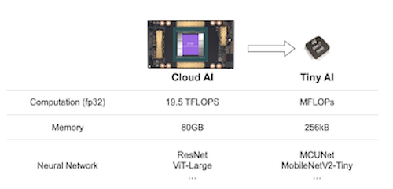

큰 computation 능력과 memory를 가진 cloud 기반 model에서, edge에서 사용할 수 있는 model로 **knowledge transfer**을 진행하려면 어떻게 해야 할까?

---

## 10.1 cloud AI vs tiny AI: NetAug

cloud AI와 tiny AI의 training curve 차이를 보자.

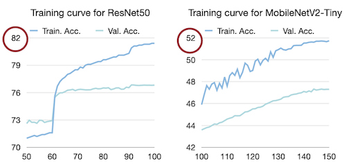

> [NETWORK AUGMENTATION FOR TINY DEEP LEARNING(2022)](https://arxiv.org/pdf/2110.08890.pdf)

> 가로 축은 epoch, 세로 축은 accuracy

- cloud model(ResNet50): epoch가 늘면서 training accuracy가 80%가 넘는 결과를 보인다..

- edge model(MobileNetV2-Tiny): epoch가 늘어도 training accuracy가 50% 정도에 가까운 결과를 보인다.

들어가기 앞서 잠시 위 그림이 나온 논문을 설명하고 넘어간다. 논문에서는 over-fitting을 방지하기 위한 regulation 테크닉, 예를 들면 **data augmentation**(데이터 증강), **dropout**과 같은 기법이 large neural network에서는 효과적이지만 tiny neural network에서는 오히려 역효과가 발생한다고 주장한다.

> data augmentation은 dataset을 여러가지 방법을 통해 augment하는 방법이다. mirroring, random cropping, rotation, shearing, local wrapping 등

따라서 noise를 추가하여 capacity를 잡아먹는 data augmentation보다는 model을 augment(reverse dropout)하는 것이 필요하다. tiny model은 반대로 capacity의 제약으로 인해 under-fitting이 자주 발생하기 때문이다. 논문에서는 Network Augmentation을 **NetAug**로 지칭하며 소개한다.

예시로 model training 단순히 standard stochastic gradient descent를 이용한다고 가정해 보자. training은 loss function $L$ 이 최소가 되는 $W_{t}$ 를 찾아나가는 과정이다.

$$ {W_{t}}^{n+1} = {W_{t}}^{n} - {\eta}{{{\partial}{\mathcal{L}}({W_{t}}^{n})} \over {{\partial}({W_{t}}^{n})}} $$

- ${\eta}$ : learning rate

하지만 tiny neural network에서는 capacity의 제약 때문에, large neural network보다 local mimimums에 stuck될 가능성이 크다.

여기에 NetAug 버전의 augmented loss function ${\mathcal{L}}_{aug}$ 은 다음과 같다.

$$ {\mathcal{L}}_{aug} = {\mathcal{L}}(W_{t}) + {\alpha}_{1}{\mathcal{L}}([W_{t}, W_{1}] + \cdots + {\alpha}_{i}{\mathcal{L}}([W_{t}, W_{i}])) $$

- ${\mathcal{L}}(W_{t})$ : base supervision(기존 model이 training을 진행하면서 제공하는 어떠한 label(정답))

- 나머지 항 : auxiliary(보조) supervision. 일종의 sub-model처럼 작동한다.

  - $[W_{t}, W_{i}]$ : tiny neural network의 weight $W_{t}$ 와 새 weights $W_{i}$ 를 포함하는 augmented model을 의미한다.

  - ${\alpha}_{i}$ : augmented model마다 loss 영향을 조절하는 scaling hyper-parameter

이때 모든 augmented model의 weight를 sharing하며, 제일 큰 largest augmented model만 계속 유지한다.(one-shot NAS와 마찬가지로 weight-sharing 전략을 사용하는 것이다.)

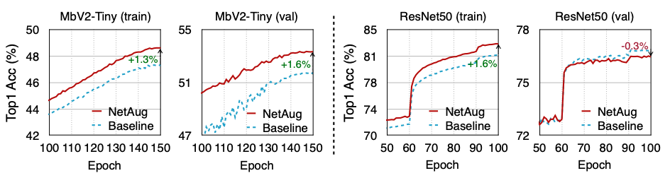

> 파란색 점선: NetAug를 적용하지 않은 기존 learning curve

> 빨간색 실선: NetAug를 적용한 learning curve

- MbV2-Tiny에서 NetAug를 적용한 결과를 보면, 해당 기법이 under-fitting을 줄이고 training과 validation accuracy를 높인 걸 알 수 있다.

- 하지만 반대로 ResNet50과 같은 큰 model에서는 over-fitting을 발생시킨다.(높은 training accuracy, 낮은 validation accuracy)

---

## 10.2 summary of knowledge distillation

> [distiller documentation: knowledge distillation](https://intellabs.github.io/distiller/knowledge_distillation.html)

> 처음 **Knowledge Transfer**(KT)라는 개념이 존재하던 때는 얕은 model밖에 transfer가 불가능했지만, **Knowledge Distillation**(KD)가 등장하고 나서부터 큰 teacher model에서 작은 student model로 knowledge를 transfer할 수 있게 되었다.

knowledge distillation은 2015년 발표된 논문으로, knowledge를 teacher network에서 student network로 transfer하는 방법이다.

> 예를 들어 student network는 MCU나 라즈베리 파이와 같은 embedded device에서 사용할 model일 수 있다.

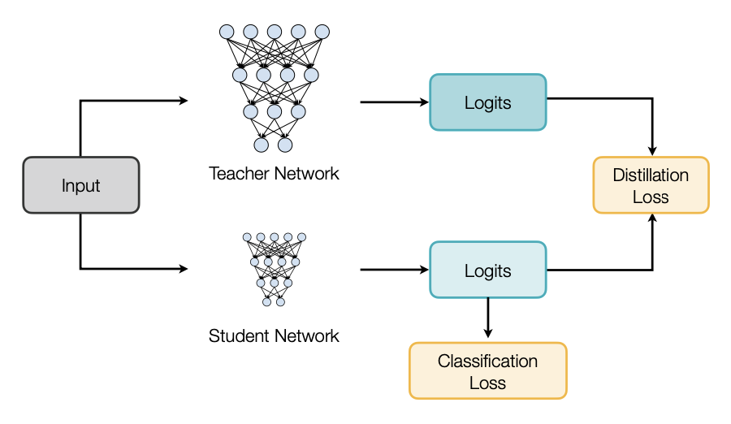

- input(예: 이미지, 자연어, 음성)은 teacher network와 student network에 모두에 입력된다. 

- teacher model과 student model의 prediction logits를 **distillation loss**에 반영한다.

  > cross entropy loss( $E(-p_{t}\log{p_{s}})$ )나 L2 loss( $E({|| p_{t} - p_{s} ||}_{2}^{2})$ )를 사용할 수 있다.

위 그림의 classification loss에서 볼 수 있듯 distillation은 class 예측 확률을 바탕으로 한다. 그러나 teacher model에서 accuracy가 높을수록 정답이 아닌 다른 class에 해당될 확률은 0에 매우 가깝게 된다. 따라서 다른 class에 해당될 확률 정보가 사라지는 문제가 발생한다.

이를 해결하기 위해 논문에서는 **softmax temperature** 개념을 도입한다.

$$ p_{i} = {{\exp({z_{i} \over T})} \over {\sum_{j}{\exp({z_{i} \over T})}}} $$

- $p_{i}$: class $i$에 해당될 확률

- $z_{i}$: class $i$에 해당될 확률을 계산하기 위한 logits

- $T$ = 1이면 원래의 softmax와 동일하다. $T$ 가 커질수록 softmax의 확률 분포가 더 soft해져서, teacher의 prediction 정보를 student에게 더 잘 전달할 수 있다.

> 논문에서는 이렇게 student에게 전달하는 information을 
**dark knowledge**라고 부른다.

또한 동시에 student model은 (teacher model의 soft-labels)와 더불어 정답에 해당되는 label을 찾도록 train된다. 이는 student model의 loss, 다시 말해 student's predicted class probabilities와 ground-truth labels 간의 **standard loss**( $T = 1$ 인 일반 softmax )도 계산한다는 뜻이다.

> **ground-truth**란 실험자가 정한 '정답'으로, 실험자가 model이 답으로 내놓기를 원하는 정답이다. 예를 들어 data가 '고양이 분장을 한 사람' 사진이라도, 이 data의 ground-truth 값은 '고양이'로 정할 수 있는 것이다.(hard labels/targets로 부르기도 한다.)

위 distillation loss와 student loss를 종합한 전체 loss function은 다음과 같이 나타낼 수 있다.

$$ \mathcal{L}(x; W) = {\alpha} * \mathcal{H}(z_{s}; T = 1) + {\beta} * \mathcal{H}({\sigma}(z_{t};T = {\tau}), {\sigma}(z_{s};T = {\tau})) $$

- $x$ 는 input, $W$ 는 student model parameter를 나타낸다.

- $z_{s}$ , $z_{t}$ : 각각 student model과 teacher model의 logits

- $\mathcal{H}$ : cross-entropy loss

- $\sigma$ : softmax function

- knowledge distillation에서 추가로 생긴 parameter는 다음과 같다.

  - $\alpha$ : weight for student loss

  - $\beta$ : weight for distillation loss

  - $\tau$ : temperature for distillation loss

  > temperature로는 주로 1 ~ 20 사이의 값을 사용한다. 
  
  > 다만 <U>teacher model과 student model의 크기 차이가 크면 대체로 온도가 낮을수록 효과가 좋다.</U> 온도가 높을수록 teacher model의 information은 많아지지만, 매우 작은 model에서 이 모든 정보를 capture하지 못하기 때문이다. 

위 식에서 본 것처럼 knowledge distillation에서는 $\alpha$ 와 $\beta$ parameter를 통해 distillation loss와 student loss의 가중치를 둬서 loss 반영을 조절한다.( 가중 평균으로 $\beta = 1 - \alpha$ 관계. ) 일반적으로 distillation loss의 가중치, 즉 $\beta$ 가 $\alpha$ 보다 훨씬 클 때 최적의 결과를 얻는다.

---

### 10.2.1 intuition of knowledge distillation

이제 예시를 보며 knowledge distillation이 어떻게 진행되는지 파악해 보자. 아래는 고양이 그림을 입력으로 주었을 때 teacher model과 student model의 prediction 결과를 보여준다.(개 고양이의 binary classification 문제)

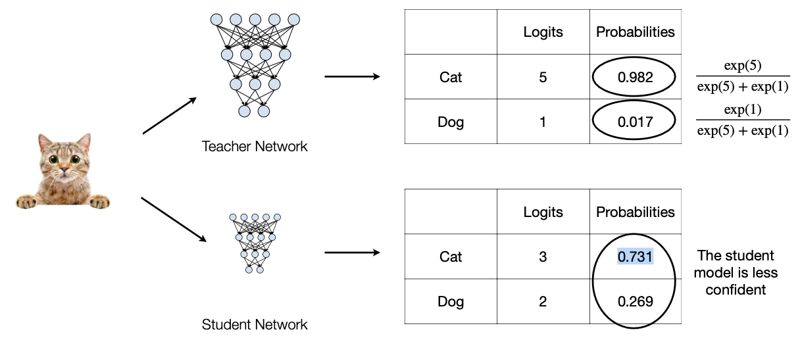

- teacher: cat의 logits는 5, dog의 logits는 1로, softmax를 적용하면 cat의 probability는 0.982이다.

- student: cat의 logits는 3, dog의 logits는 2으로, softmax를 적용하면 cat의 probability는 0.731이다.

예시에서 student model은 teacher에 비해 input image가 cat이라는 confidence가 부족하다. 이를 teacher model의 information을 받아 해결할 것이다.

teacher model의 probabilities에 softmax temperature를 적용해 보자.

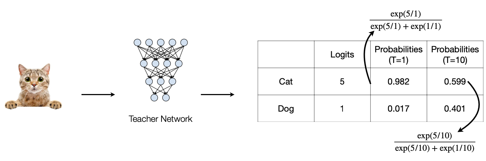

- $T = 1$ : 이전과 동일한 standard softmax이다.

- $T = 10$ : softmax의 확률 분포가 더 soft해져서, teacher의 prediction information이 더 담기게 된다.

---

## 10.3 matching intermediate weights

반면 final prediction을 matching시키기보다, intermediate weights(혹은 intermediate feature map)를 matching시키는 방법도 있다. 

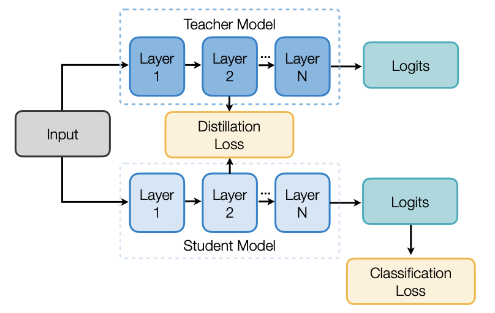

- teacher model의 각 layer는 student model의 각 layer와 match된다. 

- match 대상은 weight가 될 수 있고, activation, gradient 등이 될 수도 있다.

그 중에서 intermediate weights를 matching시키는 한 방법을 살펴보자. 앞서 prediction을 바탕으로 cross-entropy distillation loss을 적용한 것과 달리, teacher weights와 student weights 사이에 **L2 loss**를 적용한다.

> (보통 student model의 dimension이 더 작기 때문에) dimensionalities를 맞추기 위해 linear transform도 적용된다.(projection)

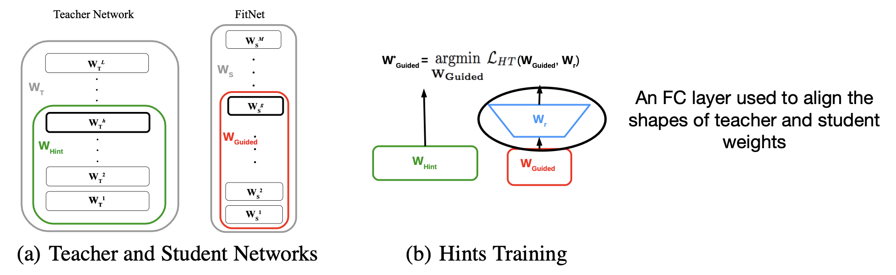

- dimensionalities를 맞추기 위해 projection을 진행한 뒤, teacher과 student의 weights 사이에 L2 loss를 적용한다.

---

## 10.4 matching intermediate features

teacher model과 student model은 서로 비슷한 feature distribution을 가져야 되기 때문에, feature distribution을 비교해서 knowledge transfer을 진행하는 방법이다.

아래는 loss function을 **MMD**(Maximum Mean Discrepancy. 최대 평균 불일치)를 사용하는 Like What You Like(2017) 논문 내용이다. 아래와 같이 두 distribution가 있을 때, 이 둘의 거리를 잴 수 있다.

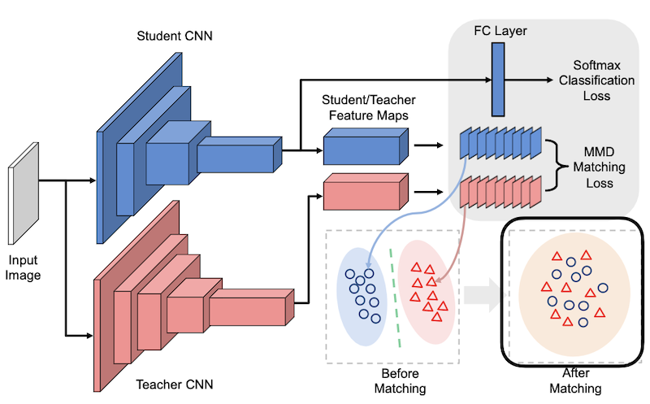

- before matching(distillation 전): teacher model과 student model의 feature distribution이 매우 다르다.

- after matching(distillation 후): teacher model과 student model의 feature distribution이 비슷해진다.

feature map 간의 평균 discrepancy(불일치)를 줄이기 위해서는 기본적으로 cosine distance를 줄이면 된다.

> [cosine distance 소개](https://seongkyun.github.io/study/2019/04/01/cosine_distance/)

feature map이 가까울수록(cosine distance가 작을수록) teacher feature map과 student feature map이 유사해진다.

> [MMD와 kernel trick](https://www.youtube.com/watch?v=kT4MtGfRcN0)

> 아래 식을 보면 알 수 있듯, sample들을 추출해서 평균을 낸 다음 teacher sample과 student sample 둘의 차이를 구해서 거리를 잰다.

혹은 다른 방법으로 feature maps 사이의 L2 distance를 최소화할 수 있다. Paraphrasing Complex Network 논문(2018)에서는 다음과 같이 feature map을 비교한다.

> [paraphrasing complex network 세미나](https://tv.naver.com/v/5440966)

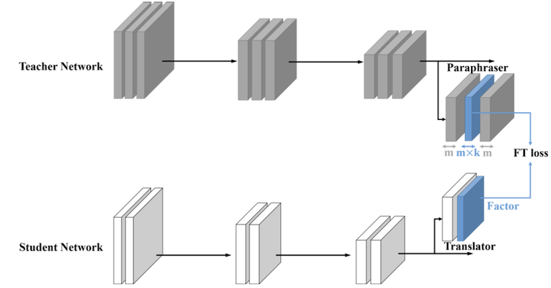

- teacher network의 마지막 feature map 이후에 Paraphraser라는 convolution node를 추가해서 feature map을 다른 차원으로 projection한다.

  - $m \rightarrow m \times k$ ( $k$ 는 일반적으로 0.5 ) 만큼 channel 수를 squeeze한다.

- student network 마지막 feature map 이후에 Translator라는 node를 추가해서 이 결과를 위와 비교한다.

> 논문에서는 Factor Transfer(FT)라는 명칭을 쓴다. autoencoder와 비슷하게 볼 수 있다.

> 이름의 유래는 Paraphraser는 선생님의 입장에서 학생에게 쉽게 설명하는 것이고, Translator는 학생 입장에서 선생님의 말을 이해하는 것이다.

---

## 10.5 matching intermediate attention maps

> [Paying More Attention to Attention](https://arxiv.org/abs/1612.03928)

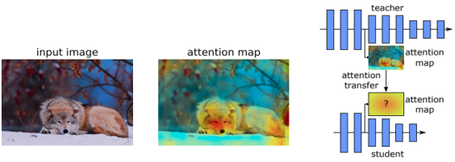

feature map을 이용하기 때문에 어떠한 mapping function을 정의해서 feature map을 통과시킨다. 각각 teacher model과 student model에서 통과시킨 결과물에 L2 loss를 적용해서 차이를 구한다.

그렇다면 어떻게 mapping이 되는지 한 번 살펴보자. CNN에서는 3차원 grid 구조(channel 수, height, weight 값을 갖는)인 activation tensor $A \in R^{C \times H \times W} $ 가 있다. 이 중에서도 예를 들어 image $32 \times 32$ 처럼 두 차원으로 **spatial dependence**를 표현하고, 마지막 차원이 각 channel( $C$ )의 independent한 성질을 나타내는 것이다.

따라서 activation-based mapping function $\mathcal{F}$ 는 3D tensor를 input으로 받고, output으로 다음과 같이 flatten된 2D tensor를 반환한다.

$$ \mathcal{F} : R^{C \times H \times W} \rightarrow R^{H \times W} $$

이러한 spatial attention mapping function은 다양하게 정의할 수 있는데, 논문에서도 아래 3가지 방법을 소개하고 있다.

- 절댓값의 합: $F_{sum}(A) = {\sum}_{i=1}^{C}{|A_{i}|}$

- 절댓값의 p 거듭제곱 합: $F_{sum}^{p}(A) = {\sum}_{i=1}^{C}{|A_{i}|}^{p}$ ( 이때 $p > 1$ )

- 절댓값의 p 거듭제곱 값 중 최댓값: $F_{max}^{p}(A) = \max_{i=1,c}{|A_{i}|}^{p}$ ( 이때 $p > 1$ )

> $i$ 는 channel index, $p$ 는 승수로 연산 후에 더해준다는 의미이다. 수학적으로 거듭제곱을 **power**라는 단어로 표현한다.

이를 바탕으로 attention map을 이용해 loss를 정의하고, 이 loss를 최소화하는 방법으로 knowledge transfer를 진행한다.

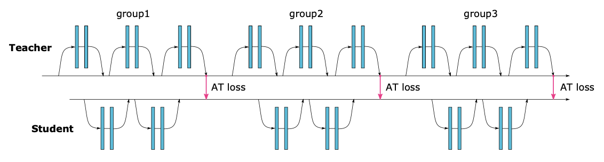

흥미롭게도 동일한 input에서 accuracy가 높은 model(perfomant model)들의 activation map이 비슷한 점을 확인할 수 있다.

- accuracy가 비교적 작은 NIN model과 다르게, accuracy가 높은 ResNet34와 ResNet101이 비슷한 activation map을 갖는다.

---

## 10.6 matching sparsity pattern

match할 수 있는 또 다른 요소로 **sparsity** pattern이 있다. teacher model과 student model은 ReLU activation을 거치면 비슷한 sparsity pattern을 가져야 할 것이다.

> ReLU activation을 거치면 음수 값은 모두 0이 되었다.

따라서 **indicator funcion** $\rho(x) = 1[x > 0]$ 을 사용해서, sparsity pattern을 match시킬 수 있다.

아래는 'Knowledge Transfer via Distillation of Activation Boundaries Formed by Hidden Neurons' 논문(2018)에서 sparsity map을 나타낸 그림이다.

> [Knowledge Transfer via Distillation of Activation Boundaries Formed by Hidden Neurons](https://arxiv.org/abs/1811.03233)

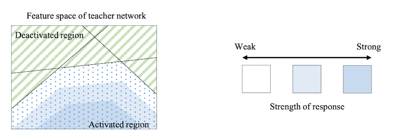

- 흰색 ~ 파란색: activated region이다. 파란색일수록 response strength가 높다.

기본적으로 classification에서 model이 학습하는 것은 feature space 내 **decision boundary**이다.(위 그림처럼 decision boundary는 activation boundary와 큰 연관성을 갖는다.)

> decision boundary는 feature space를 여러 class로 나누는 hyperplane처럼 생각하면 쉽다.

수식으로 정리하면 loss function은 다음과 같다. 우선 knowledge transfer의 목적은 다음과 같이 나타낼 수 있다.

$$ \mathcal{L}(I) = {|| \sigma({\mathcal{T}(I)}) - \sigma({\mathcal{S}(I)}) ||}^{2}_{2} $$

- $I$ : input image

- $\mathcal{T}$ : input image를 받는 teacher network의 layer

- $\mathcal{S}$ : input image를 받는 student network의 layer

- $\sigma(x)$ : ReLU ( = $max(0, x)$ )

이를 indicator function을 이용하면 다음과 같은 수식이 된다.

$$ \mathcal{L}(I) = {|| \rho({\mathcal{T}(I)}) - \rho({\mathcal{S}(I)}) ||}_{1} $$

---