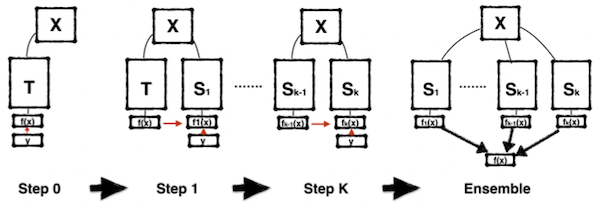
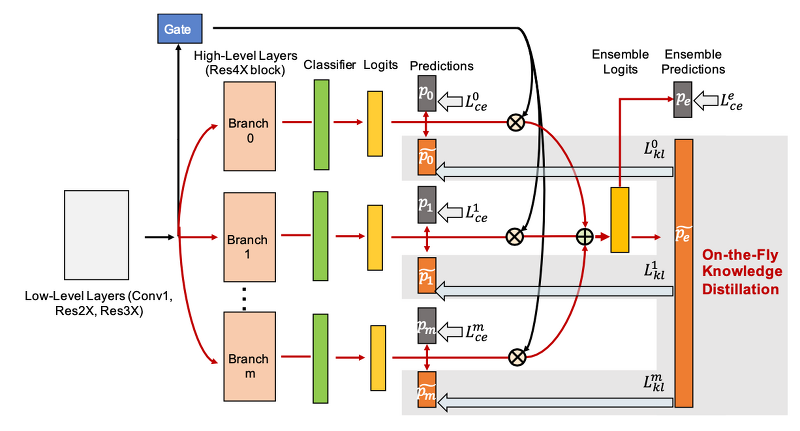
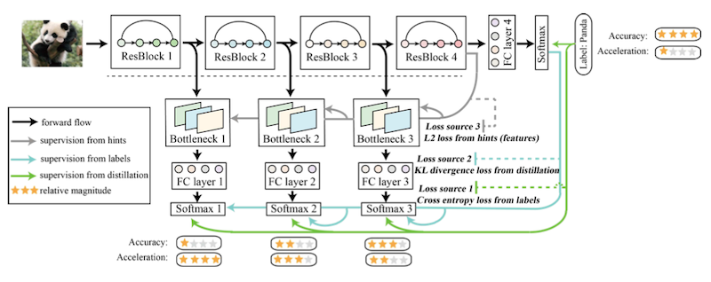
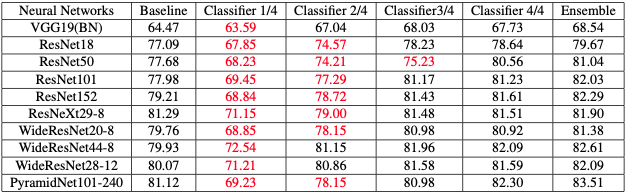
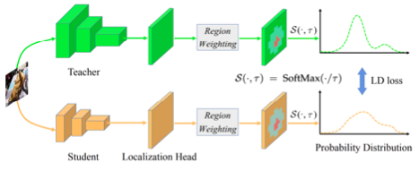

# 10 Knowledge Distillation

> [Lecture 10 - Knowledge Distillation | MIT 6.S965](https://www.youtube.com/watch?v=tT9Lnt6stwA)

---

## 10.3 Self Distillation

> [Born Again Neural Networks 논문(2018)](https://arxiv.org/abs/1805.04770)

보통 teacher model은 student보다 큰 fixed model을 사용한다. 그런데 fixed large teacher를 사용함으로 생기는 단점은 없을까?

Born Again Neural Networks 논문에서는 $k$ 번 iterative training stages를 도입해서, stage별로 얻은 student 모델이 다음 stage의 teacher model이 되도록 훈련한다.

- Teacher model $T$

  단계별로 다음과 같이 바뀐다.

$$ T = S_1 = S_2 = ... = S_k $$



- Step 0

  학습의 목표는 function $f(x)$ 를 $x \rightarrow y$ 하도록 fitting시키는 것이다.

  - $f(x)$ : input $x$ 를 통과시키는 function

  - $y$ : label(정답)

- Step 1

  student $S_1$ 을 학습시키기 위해 Step 0 model을 Teacher $T$ 로 사용한다.

  - 이때 $S_1$ , $T$ 는 정확히 동일한 구조를 갖는다.(가중치가 다르다.)

- 과정을 Step K까지 반복한다.

  student model은 총 $K$ 개 생성된다.

  step이 늘어나면서 accuracy은 점점 증가한다.

$$ T < S_1 < S_2 < ... < S_k $$

- 마지막으로 각 stage model이 예측한 결과값을 **ensemble**한다.

---

## 10.4 Online Distillation

> [Deep Mutual Learning 논문(2018)](https://arxiv.org/abs/1706.00384)

Deep Mutual Learning 논문에서는 <U>Teacher model 없이</U>, 오로지 두 Student model이 **from scratch**로 학습하며 서로 정보를 교환하는 방식으로 접근한다.


- pretrained teacher model $T$ 없이 더 좋은 성능을 얻을 수 있다.

- 두 모델이 같은 구조를 갖든, 다른 구조를 갖든 상관없다.

  > 단, 하나의 모델을 얻기 위해 두 모델을 학습해야 한다는 단점이 있다.

학습에서 distillation은 output distribution 차이를 최소화하는 방향으로 진행한다.

$$ L(S) = \mathrm{CrossEntropy}(S(I), y) + KL(S(I), T(I)) $$

$$ L(T) = \mathrm{CrossEntropy}(T(I), y) + KL(T(I), S(I)) $$

> 하지만 논문에서는 소규모 데이터셋에서 실험 후 보고했기 때문에 주의

---

## 10.5 Combining Online and Self-Distillation

---

### 10.5.1 ONE: Multiple Branches + ensemble

> [Knowledge Distillation by On-the-Fly Native Ensemble 논문(2018)](https://arxiv.org/abs/1806.04606)

ONE 논문에서는 Teacher model을 두기보다, 다양한 branch를 두어서 **ensemble**하는 방식으로 KD를 구현한다.



- 다양한 branch를 둬서 multiple output probability distributions을 얻는다.

- **Gate**: 여러 branches에서의 logits를 ensemble한다.

  - ensemble 결과: KD의 target distribution

---

### 10.5.2 Be Your Own Teacher: Deep Supervision + Distillation

> [Be Your Own Teacher: Improve the Performance of Convolutional Neural Networks via Self Distillation 논문(2019)](https://arxiv.org/abs/1905.08094)

Be Your Onw Teacher 논문에서는 deep supervision과 distillation을 결합한 방법을 제안한다.



- 깊은 레이어(예: ResBlock4)에서 더 얕은 레이어(ResBlock 3)에게 KD가 이루어진다.

- 간단한 input이라면, ResBlock 1 결과만으로도 충분한 confidence를 얻을 수 있다.

  따라서 ResBlock 1 결과에서 exit할 수 있다면, 비록 accuracy는 떨어져도 **acceleration**면에서 큰 이점이 있다.(trade-off)

따라서 얕은 레이어에서도 baseline accuracy를 얻을 수 있도록 성능을 향상시켜서 모델의 효율성을 높인다.



---

## 10.6 Distillation for other applications

---

### 10.6.1 KD for Object Detection

> [Learning Efficient Object Detection Models with Knowledge Distillation 논문(2017)](https://proceedings.neurips.cc/paper_files/paper/2017/file/e1e32e235eee1f970470a3a6658dfdd5-Paper.pdf)

application 영역에서 object detection은 자율 주행 등에서 사용되는 중요한 task이다.


- **Adaptation**

  상대적으로 teacher보다 output channel이 적은 student model에서, 1x1 convolution를 이용해서 feature channel 수를 맞춘다.

```math
L_{Hint}(V, Z) = ||V-Z||_{2}^{2}
```

- **Detection head**

  classification, regression 결과를 모두 도출한 뒤 loss를 계산한다.

  - forefround, background class에 다른 weights를 사용하여 class imbalance 문제를 해결한다.

- Weighted Cross Entropy Loss

$$ L_{soft}(P_{s}, P_{t}) = - \sum {w_c P_t \log P_s} $$

- Bounded Regression Loss

```math
L_{b}(R_{s}, R_{t}, y) = - \begin{cases} ||R_{s}-y||_{2}^{2}, & if \, ||R_{s}-y||_{2}^{2} + m > || R_t - y ||_{2}^{2} \\ 0, & \mathrm{otherwise} \end{cases}
```

이때 teacher model의 예측은 student 성능의 upper bound로 사용된다. 만약 student 성능 + margin $m$ 이 teacher 성능을 넘어선다면 loss는 zero가 된다.

---

### 10.6.2 Convert bounding box regression to classification

> [Localization Distillation for Dense Object Detection 논문(2022)](https://arxiv.org/abs/2102.12252)

bounding box regression 문제를 classification 문제로 바꿔서 접근할 수 있다.


- x축을 6개 구간으로 나누고, y축을 6개 구간으로 나눈다.

- 각 구간이 class가 된다.

그 다음 각 class probability distribution을 비교하며 KD를 진행한다.



---

### 10.6.3 KD for Semantic Segmentation

> [Structured Knowledge Distillation for Semantic Segmentation 논문(2019)](https://openaccess.thecvf.com/content_CVPR_2019/papers/Liu_Structured_Knowledge_Distillation_for_Semantic_Segmentation_CVPR_2019_paper.pdf)

**semantic segmentation**란 입력에서 특정 위치의 정보를 추출하는 task를 의미한다.


- feature imitation

  classification, detection과 매우 유사하다.

- **discriminator**

  discriminator network를 추가하여, student model이 discriminator를 속일 수 있도록 학습시킨다.

---

### 10.6.4 KD for GAN

> [GAN Compression: Efficient Architectures for Interactive Conditional GANs(2020)](https://arxiv.org/abs/2003.08936)

(생략)

---

### 10.6.5 KD for NLP

> [MobileBERT: a Compact Task-Agnostic BERT for Resource-Limited Devices 논문(2020)](https://arxiv.org/abs/2004.02984)

(생략)

---

## 10.7 Network Augmentation

> [NETWORK AUGMENTATION FOR TINY DEEP LEARNING(2022)](https://arxiv.org/pdf/2110.08890.pdf)

large model에서는 overfitting을 피하기 위한 방법으로, **data augmentation**, **dropout**과 같은 방법을 종종 사용한다.

- data augmentation

  

  - cutout, mixup, rotation, flip 등

    > 이외 대표적으로 AutoAugment 논문이 있다. [AutoAugment: Learning Augmentation Policies from Data 논문(2018)](https://arxiv.org/abs/1805.09501)

- dropout

  

하지만 이러한 방법을 tiny model에 적용하면, 성능을 굉장히 저하시키는 요인으로 작용한다. 아래는 large model(ResNet50)과 tiny model(MobileNetV2-Tiny)의 성능 변화를 보여주는 예시다.


---

### 10.7.1 NetAug: Training Process

**NetAug**는 **augmented model**을 만들어서 tiny model의 성능을 높이는 방법이다.(reverse dropout) NetAug training을 step별로 살펴보자.

- augment model

  tiny model의 각 레이어가 갖는 \#channels을 늘린 뒤 **weight sharing**한다.

- Step 1

  훈련 중 forward, backward 과정이 original, augmented model 모두 진행된다.

  

  > 좌: original tiny model, 우: augmented model

  loss function은 base supervision, auxiliary supervision 두 항의 결합으로 표현된다. 이때 scaling factor $\alpha$ 를 이용해 auxiliary supervision가 loss에 미치는 영향을 조절한다.

```math
{\mathcal{L}}_{aug} = {\mathcal{L}}(W_{base}) + {\alpha}{\mathcal{L}}([W_{base}, W_{aug}])
```

다음은 ImageNet 데이터셋을 이용한 학습에서 NetAug를 적용했을 때의 성능을 나타낸 그림이다.


- tiny model(MbV2-Tiny): under-fitting을 막고 성능을 향상시킨다.

- large model(ResNet50): over-fitting을 유발한다.

---