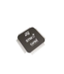
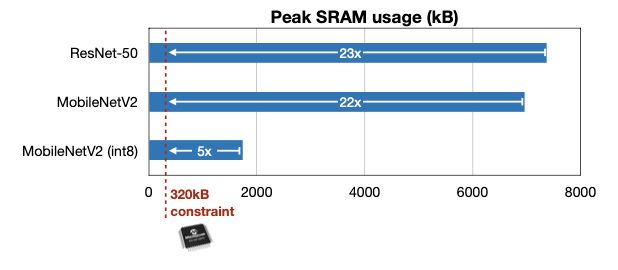
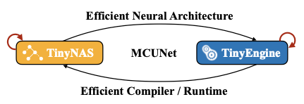
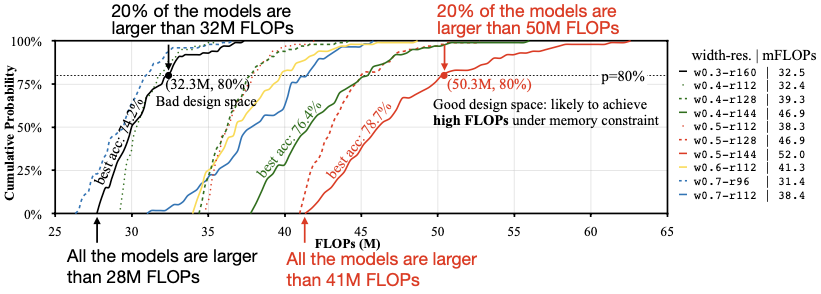
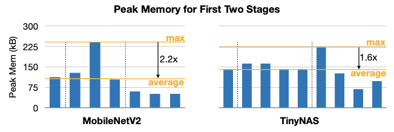
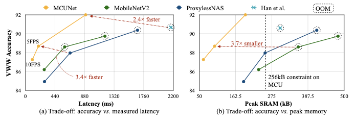
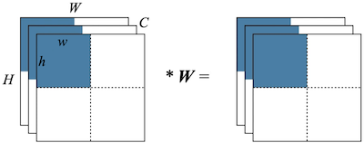
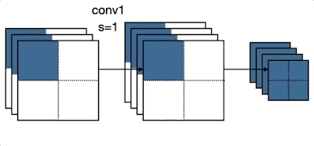
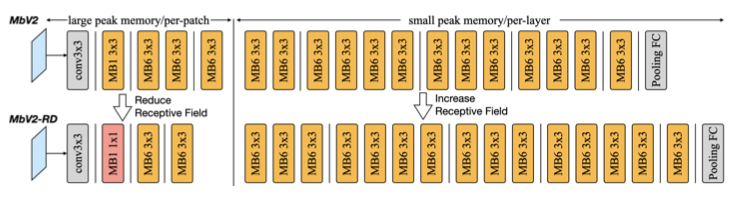
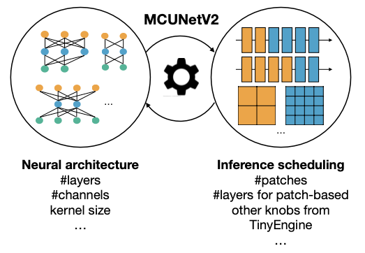

# 11 MCUNet: Tiny Neural Network Design for Microcontrollers

> [Lecture 11 - MCUNet: Tiny Neural Network Design for Microcontrollers | MIT 6.S965](https://www.youtube.com/watch?v=Hi4I0ZtPsbY)

TinyML이란 **MCU**(microcontroller unit) 수준의 장치에서 DNN을 사용하려는 시도다. 

| | Cloud AI | Mobile AI | Tiny AI |
| :---: | :---: | :---: | :---: |
| |  |  |  |
| Memory (Activation) | 32GB | 4GB | 320kB |
| Storage (Weights) | ~TB/PB | 256GB | 1MB | 

하지만 TinyML의 하드웨어는 다른 하드웨어에 비해 매우 엄걱한 제약조건을 가지며, 특히 메모리 사용량(SRAM, flash memory)을 만족시키기 어렵다. 위 예시처럼 Mobile AI와 비교하여 16,000배, Cloud AI와 비교하여 약 100,000배 작은 메모리 제약조건을 갖는다.

---

## 11.1 Running CNNs on Microcontrollers

conv layer 연산에서 memory access가 어떻게 일어나는지 살펴보자.

| | input/output activation | kernel(weights) |
| :---: | :---: | :---: |
| 저장 메모리 | read/write가 가능한 SRAM에 저장된다. | 가중치는 static하므로 ROM이나 flash에 저장된다. |

---

### 11.1.1 Peak SRAM Memory Usages

MCU 수준의 하드웨어에서는, 특히 모델의 SRAM 사용량이 만족시키기 어려운 제약조건으로 작용한다. 다음은 3가지 CNN 모델의 최대 SRAM 사용량을 비교한 도표다.

- int8 양자화된 MobileNetV2 모델마저, MCU의 SRAM 제약보다 더 많은 메모리 사용량을 갖는다.

또한, MobileNetV2 모델은 ResNet-18과 대비해 약 4.6배 작은 모델 사이즈를 갖지만, 최대 SRAM 사용량은 오히려 ResNet보다 더 많은 사용량을 갖는다. 다음은 int8 양자회된 두 모델의 메모리 사용량을 비교한 도표다.

---

## 11.2 MCUNet: System-Algorithm Co-design

> [MCUNet: Tiny Deep Learning on IoT Devices 논문(2020)](https://arxiv.org/abs/2007.10319)

MCUNet은 신경망을 자동으로 탐색(NAS)하는 TinyNAS와, 추론을 수행하는 추론 엔진 TinyEngine을 공동으로 설계한 논문이다.

---

### 11.2.1 TinyNAS: Two-Stage NAS for Tiny Memory Constraint

TinyNAS는 다음과 같이 모바일 디바이스 관점에서 사용되는 search space를 수정하여, MCU 수준의 최적 search space를 설계한 뒤 탐색하는 과정을 거친다. (Search Space Optimization)

- MBNet-alike space에서, **resolution** $R$ 과 **width multiplier** $W$ 의 최적 값을 설정한다. 

  > 예를 들면 Cloud AI에서는 $R=260, W=1.4$ , Mobile AI에서는 $R=224, W=1.0$ 를 최적의 search space로 두고 탐색할 수 있다.

이때 search space의 성능을 체크하기 위해, MCUNetV1에서는 다양한 $R, W$ 조건에서 **FLOPs distribution**을 확인한다.

---

#### 11.2.1.1 Automated search space optimization

그렇다면 어떻게 automated search space optimization을 수행하는지 살펴보자. 다음은 다른 $W$ 와 $R$ 값에 따라, 어느 정도의 FLOPs가 필요한지를 나타낸 도표다.

- 빨간색 실선(w=0.5, r=144)

  모든 서브넷이 최소 41M FLOPs를 갖는다. (더 좋은 정확도를 갖는 서브넷들을 포함한다.)

- 검은색 실선(w=0.3, r=160)

  모든 서브넷이 최소 28M FLOPs를 갖는다.

실험을 통해 검증한 결과, 연산량이 큰 서브넷을 많이 포함한 search space에서, 최적의 정확도를 갖는 서브넷을 획득할 수 있었다. (하지만, 대체로 연산량이 높은 서브넷이, 추론 지연시간도 크다는 단점에 주의해야 한다.)

---

### 11.2.2 Resource-Constrained Model Specialization

이를 통해 얻어낸 최적 서브넷(TinyNAS design network)은, MobileNetV2와 비교해 더 균일한 메모리 사용량을 가는 것을 확인할 수 있었다.

또한 지연시간-정확도 그래프, 최대 SRAM 사용량-정확도 그래프에서, 타 모델 대비 우수한 성능을 획득했다.

> VWW(Visual Wake Words) 데이터셋에서 학습한 모델 비교

---

## 11.3 MCUNetV2: Patch-based Inference

> [MCUNetV2: Memory-Efficient Patch-based Inference for Tiny Deep Learning 논문(2021)](https://arxiv.org/abs/2110.15352)

MCUNetV2에서는 최대 SRAM 사용량을 추가로 줄이기 위해서, TinyEngine에서 **patch-based inference**(패치 기반 추론)를 도입한다. 다음은 per-layer 추론과, patch-based 추론(입력을 2x2 chunk로 나눈 예제)을 비교한 예시다.

| | per-layer inference | per-patch inference |
| :---: | :---: | :---: |
| |  |  | 
| |  |  |
| Peak SRAM Memory | $2WHC$ | $2whC$ |

> 예시는 2x2로 나눴으나, 3x3 chunk 등 다양한 설정으로 나눌 수 있다. 이 경우 peak SRAM memory usage는 더 작아지는 대신, 지연시간은 늘어나게 된다.

다음은 patch-based inference를 적용했을 때, MobileNetV2의 SRAM 메모리 사용량을 나타낸 도표다.

> 점선 per-layer 추론 기준의 SRAM 메모리 사용량

---

### 11.3.2 MobileNetV2-RD: Network Redistribution

하지만 이러한 패치 기반 추론은 중복되는 연산을 가질 수 있다. 입력을 2x2 patch로 나눴을 때의, receptive field를 살펴보자.

- receptive field가 overlap된 영역: 연산을 중복해서 수행하게 된다.

MCUNetV2에서는 이러한 overhead를 줄이기 위해, MobileNetV2에서 receptive field를 **redistribution**(재분배)한 MobileNetV2-RD 구조를 제안한다.

- MobileNetV2: 첫 번째 inverted residual block(MBConv) 블록에서 spatial downsampling을 수행한다.

- MobileNetV2-RD(MCUNetV2): 해당 블록을 제거하고, 1x1 conv을 통한 projection만 수행한다. (이후 후반부 레이어를 늘려서, 이를 보상한다.)

---

### 11.3.3 Joint Automated Search for Optimization

또한 MCUNetV2의 탐색 과정에서는, 최적의 성능을 갖는 신경망과 추론 정책을 공동으로 탐색한다.

---
