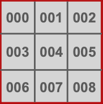
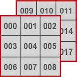
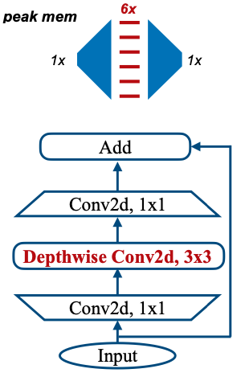
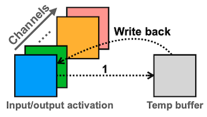

# Lecture 17 - TinyEngine - Efficient Training and Inference on Microcontrollers

> [Lecture 17 - TinyEngine - Efficient Training and Inference on Microcontrollers | MIT 6.S965](https://youtu.be/oCMnJXH0c50)

---

## 17.1 Microcontroller(MCU)

**microcontroller**(MCU)는 다양한 application으로 사용되는 small computer이다.

> vehicles, robots, office machines, medical devices, mobile radio transceivers, vending machines, home appliances...

OS를 포함하지 않는 **Bare Metal**(베어메탈) 장치이며, 다음과 같은 특징을 갖는다.

- 장점: cost-effective, low power, small chip area

- 단점: low computational capability, small memory/storage space, limited instructionset

MCU를 생산하는 대표적인 기업과 제품을 잠시 살펴보자.

- STMicroelectronics

  STM8(8-bit), ST10(16-bit), STM32(32-bit)

- Texas Instruments

  TI MSP430(16-bit), MSP432(32-bit), C2000(32-bit)

- Microchip Technology

  Atmel AVR(8-bit), AVR32(32-bit), AT91SAM(32-bit)

---

### 17.1.1 Basic Structure of Microcontrollers

MCU는 다음과 같은 구조로 이루어진다.

- CPUs

- Volatile memory (SRAM)

- Non-volatile memory (ROM, Flash memory)

- Serial input/output (serial ports(UARTs))

- Peripherals (timers, event counters and watchdog)

- Analog-to-digital converters (ADCs)

- Digital-to-analog converters (DACs)

STM32F746 MCU(Arm Cortex-M7)와 Apple MacBook Pro(M1 Ultra) 성능의 차이를 한 번 비교하면, 얼마나 MCU가 제약적인 성능을 가지고 있는지 알 수 있다.


- MCU는 **L1 cache**만 가지고 있기 때문에, 이를 최대한 효율적으로 사용해야 한다.

---

### 17.1.2 Memory Hierarchy

> [Neural networks on microcontrollers: saving memory at inference via operator reordering 논문(2019)](https://arxiv.org/abs/1910.05110)

일반적인 컴퓨터와 MCU의 memory hierarchy를 비교하면 다음과 같다.


MCU에서 딥러닝 모델을 추론 목적으로 배포한다면, 다음과 같이 memory를 사용하게 된다.

- Flash

  오직 읽기 전용이므로 weight를 저장한다.

- SRAM

  읽기 쓰기가 가능해야 하는 activation을 저장한다.(input activation, output activation 크기를 동시에 고려해야 함)

---

## 17.2 Primary Data Layouts

MCU에서 bottleneck을 일으키는 주요한 원인은 **memory**이다. data layouts를 바꾸는 것만으로도 보다 효율적으로 tensor(weight, activation)를 저장할 수 있다.

convolution 연산은 일반적으로 4차원 텐서를 입출력으로 한다.

- **N**: 얼마나 많은 feature maps/kernels을 갖는지를 의미

- **C**: channel 수

- spatial domain

  - **H**: height

  - **W**: width

---

### 17.2.1 NCHW, NHWC, CHWN

> [Understanding Memory Formats, oneDNN](https://oneapi-src.github.io/oneDNN/dev_guide_understanding_memory_formats.html)

> 다양한 상황에서 제일 유리한 memory format을 선택하는 것이 중요하다.

다음 예시를 바탕으로 세 가지 memory format이 어떻게 데이터를 저장하는지 살펴보자. convolution 구현에서의 중첩 loop문을 떠올리면서 살펴보자.

- HxW: 3x3

- C: 10

- N: 2


- **NCHW**

  ONNX, Caffe에서 default로 사용하는 memory format이다. 

  - HW가 inner loop / C가 중간에 위치한 loop / N이 제일 outer loop가 된다.

  - spatial locality 활용에 유리하다.

    예를 들면 depthwise convolution 연산에서 유리하다.

  - pointer를 1 움직이면, 실제로는 다음 W 차원으로 이동하는 것과 같다.

    > W 차원의 마지막에 도달하면, 다음 H 차원으로 이동한다.

    예: 000 $\rightarrow$ 001

    

| 000 | 001 | 002 | 003 | ... | 009 | 010 | ... | 089 | 090 | 091 | ... | 177 | 178 | 179 |
| :---: | :---: | :---: | :---: | :---: | :---: | :---: | :---: | :---: | :---: | :---: | :---: | :---: | :---: | :---: |

- **NHWC**

  TensorFlow에서 default로 사용하는 memory format이다.

  - C가 inner loop / HW가 중간에 위치한 loop / N이 제일 outer loop가 된다.

  - channel-wise reduction에 유리하다.

    예를 들면 pointwise convolution 연산에서 유리하다.

  - pointer를 1 움직이면, 실제로는 다음 C 차원으로 이동한다.

    예: 000 $\rightarrow$ 009

    

| 000 | 009 | 018 | ... | 081 | 001 | 010 | ... | 089 | 090 | 099 | ... | 163 | 170 | 179 |
| :---: | :---: | :---: | :---: | :---: | :---: | :---: | :---: | :---: | :---: | :---: | :---: | :---: | :---: | :---: |

- **CHWN**

  매우 드물게 사용하는 memory format이다.

  - N이 inner loop / HW가 중간에 위치한 loop / C가 제일 outer loop가 된다.

  - pointer를 1 움직이면, 다음 N 차원으로 이동하게 된다.

    예: 000 $\rightarrow$ 090

    

| 000 | 090 | 001 | 091 | ... | 008 | 098 | 009 | 099 | ... | 177 | 088 | 178 | 089 | 179 |
| :---: | :---: | :---: | :---: | :---: | :---: | :---: | :---: | :---: | :---: | :---: | :---: | :---: | :---: | :---: |

---

## 17.3 Optimization Techniques in TinyEngine

> [MCUNet: Tiny Deep Learning on IoT Devices 논문(2020)](https://arxiv.org/abs/2007.10319)

> [github: mit-han-lab/tinyengine](https://github.com/mit-han-lab/tinyengine)

다음은 **TinyEngine**에서 적용된 다양한 최적화 기법이다.

- loop unrolling

- loop reordering

- loop tiling

- SIMD(Single Instruction Multiple Data) programming

- Im2col(Image to Column) convolution

- In-place depth-wise convolution

- NHWC pointwise convolution, NCHW depthwise convolution

- Winograd convolution

---

### 17.3.1 Loop Unrolling

**loop unrolling**은 branching overhead를 줄일 수 있는 기법이다. loop control에서 발생하는 overheads는 다음과 같은 요소가 있다.

- pointer와 관련된 arithmetic operation

  코드에서 자주 i, j, k로 두는 변수를 계산해야 한다.

- end of loop

  예를 들어 k < N를 만족하는지 확인해야 한다.

- branch prediction

> 예시 코드는 Python을 기반으로 하지만, TinyEngine은 C/C++에서 구현한다.

다음과 같은 평범한 loop문이 있다고 하자.

```Python
for i in range(0, N):
  for j in range(0, N):
    for k in range(0, N):
      C[i][j] += A[i][k] * B[k][j]
```

이를 4 step으로 unrolling한 코드를 살펴보자. 비록 코드 수는 늘어났지만 다음과 같은 장점을 갖는다.

> 각 코드 1줄은 32bit(4 bytes)를 차지할 것이다. MCU의 Flash 용량은 매우 제약적이므로, unrolling으로 늘어나는 용량도 주의해야 한다.

- pointer와 관련된 arithmetic operation

$$N^3 \rightarrow {1 \over 4} N^3$$

- loop test

$$N^3 \rightarrow {1 \over 4} N^3$$

```Python
for i in range(0, N):
  for j in range(0, N):
    for k in range(0, N, 4):    # step size=4
      c[i][j] += a[i][k] * b[k][j]
      c[i][j] += a[i][k+1] * b[k+1][j]
      c[i][j] += a[i][k+2] * b[k+2][j]
      c[i][j] += a[i][k+3] * b[k+3][j]
```

---

### 17.3.2 Loop Reordering

**loop reordering**은 cache에서 data locality를 높이는 기법이다.

> 한 번에 cache line을 fetch하는데, 접근이 많을수록 cache miss라는 비싼 대가를 치를 가능성도 높아진다.

다음과 같은 loop문이 있다고 하자.

```Python
for i in range(0, N):
  for j in range(0, N):
    for k in range(0, N):
      C[i][j] += A[i][j] * B[k][j]
```

row-major order로 데이터를 가져와서 저장한다고 할 때, 위 코드에서 행렬 A는 locality 활용이 가능하지만, 행렬 B는 locality 활용이 어렵다.


이는 loop를 다음과 같이 바꾸는 것으로 locality를 우수하게 만들 수 있다.

$$ (i, j, k) \rightarrow (i, k, j) $$

```Python
for i in range(0, N):
  for k in range(0, N):     # j, k 순서 변경
    for j in range(0, N):
      C[i][j] += A[i][j] * B[k][j]
```


---

### 17.3.3 Loop Tiling

만약 data 크기가 cache size보다 훨씬 크다면, cache에 가져온 data는 reuse되기 전에 대체(evict)될 가능성이 높다.

**loop tiling**은 loop iteration space를 작은 tile로 분할하면서, loop에서 접근하는 element(data)를 cache size에 맞도록 조절하여 reuse가 용이하도록 만든다. 

loop tiling 전 다음과 같은 loop문이 있다고 하자.

- accessed elements: $B: N^2$

```Python
for i in range(0, N):
  for k in range(0, N): 
    for j in range(0, N):
      C[i][j] += A[i][j] * B[k][j]
```


이를 TILE_SIZE $T_j$ 로 분할하면 다음과 같다.

- accessed elements: $B: N \times \mathrm{TILE}\_\mathrm{SIZE}$

  > 하지만 N이 크면, 이와 같은 tiling으로도 충분하지 않을 수 있다.

```Python
for j_t in range(0, N, T_j):
  for i in range(0, N): 
    for k in range(0, N):
      for j in range(j_t, j_t + T_j):
          C[i][j] += A[i][j] * B[k][j]
```


N의 영향을 줄일 수 있도록, accessed elements를 $\mathrm{TILE}\_\mathrm{SIZE}^2$ 로 코드를 작성할 수 있다.

- A, B, C accessed elements: $\mathrm{TILE}\_\mathrm{SIZE}^2$ 

```Python
# T_j = T_k = T_i = TILE_SIZE
for i_t in range(0, N, T_i):
  for k_t in range(0, N, T_k):
    for j_t in range(0, N, T_j):
      for i in range(i_t, i_t + T_i):: 
        for k in range(k_t, k_t + T_k):
          for j in range(j_t, j_t + T_j):
            C[i][j] += A[i][j] * B[k][j]
```

> 여기에 L2 cache가 있다면, 추가로 multi-level tiling을 적용할 수 있다. (L1, L2 cache 크기를 동시에 고려하여 작성)

---

### 17.3.4 SIMD Programming

현재 나오는 대부분의 processor(ARM Cortex-M7 등)은 **SIMD** instruction을 지원한다. 하나의 instruction을 여러 data vector에 한번에 적용하여 연산한다. 


SIMD programming을 위해서는 다음과 같은 요소를 활용할 수 있다.

- loops 내 data-level parallelism

- quantization

다음은 128 bit SIMD instructions 버전의 loop문 예시다.

```Python
for i in range(0, N):
  for k in range(0, N/4):    # N -> N/4
    for j in range(0, N):
      C[i][j] += doc_vec4(A[i][K*4], B[K*4][j])
```

---

### 17.3.5 Im2col Convolution

**Im2col**은 convolution 연산을 matrix multiplication으로 바꾸는 기법이다.

convolution 연산을 direct하게 만든다면, 다음 예시에서 kernel 0과 input activation 사이의 convolution을 6개의 중첩 loop문으로 구현해야 한다.


하지만 Im2col을 사용해서 tensor를 flatten하게 만들면(예를 들어 3x3은 9x1 연산으로 바뀐다.), kernel 0과 input activation의 convolution을 3개의 중첩 loop문으로 구현할 수 있게 된다.

> 위 예시에서 a,b,c,...,k,l,m이 어떻게 나열됐는지 주목하자.


하지만 element가 중복되기 때문에, memory footprint 면에서 9배를 더 차지하게 된다.(window 개수가 9개임을 생각하자)

> 이 문제를 해결하기 위해 주로 **implicit GEMM**을 사용한다.

---

### 17.3.6 In-place Depth-wise Convolution

**In-place depth-wise convolution**은 말 그대로 depth-wise convolution 연산을 in-place로 구현한 기법이다.

먼저 기존의 inverted residual block을 살펴보자.(expansion ratio은 6으로 가정)



depthwise convolution(입출력 채널 수가 같다.)을 단순히 계산한다면, peak memory는 다음과 같다.

- peak memory: $2 \times C \times H \times W$

  

하지만 input activation의 channel 1에 해당되는 값의 계산이 끝났다면, 더 이상 이 값을 유지할 필요가 없다. 다시 말해 temp buffer를 사용하여 연산이 끝나면 결과값을 덮어쓰는 방식으로 peak memory를 줄일 수 있다.

- peak memory: $(1+C) \times H \times W$

  

---

### 17.3.7 NHWC Pointwise Convolution, NCHW Depthwise Convolution

먼저 pointwise convolution에서 NCHW, NHWC의 data access sequence를 비교해 보자.

- NHWC format이 locality를 활용하기에 더 유리하다.

  

다음은 depthwise convolution의 경우를 보자.

- NCHW format이 locality를 활용하기에 더 유리하다.

  

---

### 17.3.8 Winograd Convolution

(생략)

---