# Lecture 17 - TinyEngine - Efficient Training and Inference on Microcontrollers

> [Lecture 17 - TinyEngine - Efficient Training and Inference on Microcontrollers | MIT 6.S965](https://youtu.be/oCMnJXH0c50)

> [EfficientML.ai Lecture 11 - TinyEngine and Parallel Processing (MIT 6.5940, Fall 2023, Zoom)](https://youtu.be/gGcbn0ISOJM)

TinyEngine은 다음과 같은 커널 최적화 기법을 도입하여, 효율적으로 MCU 상에서 딥러닝 모델을 추론한다.

- Parallel Computing Techniques

  - loop unrolling

  - loop reordering

  - loop tiling

  - SIMD(Single Instruction Multiple Data) programming

- Inference Optimizations

  - Im2col(Image to Column) convolution

  - In-place depth-wise convolution

  - NHWC pointwise convolution, NCHW depthwise convolution

  - Winograd convolution

---

## 17.1 Microcontroller(MCU)

MCU는 다음과 같은 특징을 갖는 SoC(System on Chip)이다.

| 특징 | 상세 |
| --- | --- |
| 구성 요소 | CPUs, SRAM, ROM, Flash memory, serial ports, timers, event counters, watchdog, ADCs, DACs 등 |
| 장점 | cost-effective, low power, small chip area |
| 단점 | computational capability, small memory/storage space, limited instruction set |

다음은 MCU를 생산하는 대표적인 기업과 라인업이다.

| 기업 | 제품 |
| --- | --- |
| STMicroelectronics | STM8(8-bit), ST10(16-bit), STM32(32-bit) |
| Texas Instruments | TI MSP430(16-bit), MSP432(32-bit), C2000(32-bit) |
| Microchip Technology | Atmel AVR(8-bit), AVR32(32-bit), AT91SAM(32-bit) |

---

### 17.1.1 Memory Hierarchy

> [Neural networks on microcontrollers: saving memory at inference via operator reordering 논문(2019)](https://arxiv.org/abs/1910.05110)

일반적인 컴퓨터와 MCU의 memory hierarchy를 비교하면 다음과 같다.

| Computer | MCU |
| :---: | :---: |
|  | 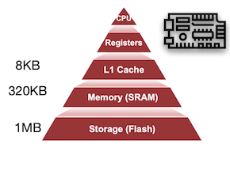 |

> MCU는 **L1 cache**(약 8KB 미만)만 가지고 있으며, 이를 최대한 효율적으로 사용해야 한다.

MCU에서의 딥러닝 추론 시, Memory(SRAM)와 Storage(Flash)은 보편적으로 다음과 같은 용도로 사용한다.

| 메모리 종류 | 용도 |
| --- | --- |
| Flash | 읽기 전용인 만큼 weight를 저장한다. |
| SRAM | 읽기, 쓰기가 가능한 만큼 input/output activation을 저장한다. |

STM32F746 MCU(Arm Cortex-M7)와 Apple MacBook Pro(M1 Ultra) 성능의 차이를 한 번 비교하면, 얼마나 MCU가 제약적인 성능을 가지고 있는지 알 수 있다.

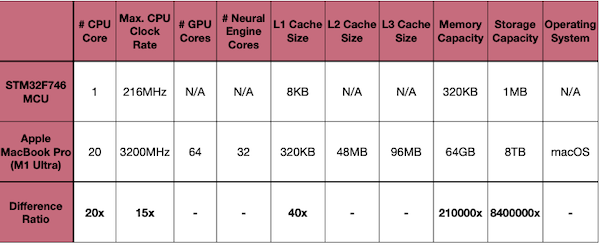

---

## 17.2 Primary Data Layouts: NCHW, NHWC, CHWN

> [Understanding Memory Formats, oneDNN](https://oneapi-src.github.io/oneDNN/dev_guide_understanding_memory_formats.html)

다음 예시를 바탕으로 세 가지 memory format이 어떻게 데이터를 저장하는지 살펴보자. 다양한 연산별로 가장 유리한 memory format를 취하면서 시스템 성능을 향상시킬 수 있다.

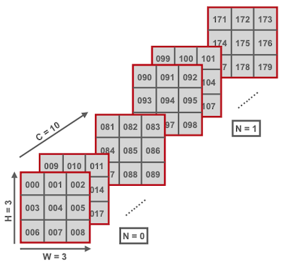

> H: 3, W: 3, C: 10, N: 2

| format | | | | | | | | | | | | | | | |
| :---: | :---: | :---: | :---: | :---: | :---: | :---: | :---: | :---: | :---: | :---: | :---: | :---: | :---: | :---: | :---: |
| **NCHW** | 000 | 001 | 002 | 003 | ... | 009 | 010 | ... | 089 | 090 | 091 | ... | 177 | 178 | 179 |
| **NHWC** | 000 | 009 | 018 | ... | 081 | 001 | 010 | ... | 089 | 090 | 099 | ... | 163 | 170 | 179 |
| **CHWN** | 000 | 090 | 001 | 091 | ... | 008 | 098 | 009 | 099 | ... | 177 | 088 | 178 | 089 | 179 |

다음은 각 포맷의 장단점을 비교한 도표이다.

| format | pros and cons | pointer[i+1] | Framework |
| --- | --- | --- | --- |
| **NCHW** | (+) spatial locality(e.g., depthwise conv)<br/>(-) channel-wise reduction | W 차원에서 오른쪽으로 이동<br/>(e.g., 002 $\rightarrow$ 003 ) | ONNX, Caffe, PyTorch default |
| **NHWC** | (+) channel-wise reduction(e.g., pointwise conv)<br/>(-) spatial locality | C 차원에서 오른쪽으로 이동<br/>(e.g., 002 $\rightarrow$ 011) | TensorFlow, numpy default |
| **CHWN** | (+) 배치 단위 연산에서 유용<br/>(-) 실시간 추론 배치 크기는 일반적으로 1 | N 차원에서 오른쪽으로 이동<br/>(e.g., 002 $\rightarrow$ 092) | 매우 드물게 사용 |

---

## 17.3 Loop Optimization Techniques

> [MCUNet: Tiny Deep Learning on IoT Devices 논문(2020)](https://arxiv.org/abs/2007.10319)

> [On-Device Training Under 256KB Memory 논문(2022)](https://arxiv.org/abs/2206.15472)

loop문을 소프트웨어 방법으로 최적화하여, 딥러닝 모델을 효율적으로 추론할 수 있다. 다음은 대표적인 최적화 기법이다.

| 최적화 | 효과 |
| --- | --- |
| **Loop Reordering** | loop 중첩의 순서를 바꾸는 방식으로 locality를 최대한 활용 |
| **Loop Tiling** | loop내 iteration space를 타일 단위로 분해하여, memory access를 감축 |
| **Loop Unrolling** | binary size에 맞춰서 명령을 수행하는 것으로, branching overhead를 감축 |

---

### 17.3.1 Loop Reordering: Improve Data Locality

행렬 데이터가 row-major order로 저장되어 있다고 하자. cache도 마찬가지로 데이터를 row-major order로 가져오기 때문에, locality를 잘 활용하기 위해서는 loop문의 순서를 바꿔야 한다.

> 아래 예시: i, `j`, `k` $\rightarrow$ i, `k`, `j`

> Intel Xeon 4114 테스트: 24296 ms $\rightarrow$ 1979 ms (12x speed up)

| | | |
| --- | --- | --- |
| Poor Locality | 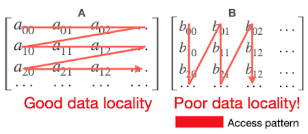 |  for i in range(0, N):<br/> $\quad$ for `j` in range(0, N):<br/> $\quad \quad$ for `k` in range(0, N):<br/> $\quad \quad \quad$ C[i][j] += A[i][j] \* B[k][j] |
| Good Locality | 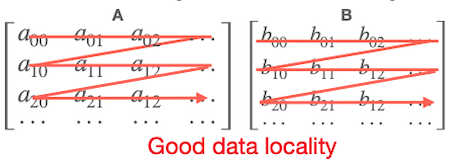 | for i in range(0, N):<br/> $\quad$ for `k` in range(0, N):<br/> $\quad \quad$ for `j` in range(0, N):<br/> $\quad \quad \quad$ C[i][j] += A[i][j] \* B[k][j] |

---

### 17.3.2 Loop Tiling: Reduce Cache Misses

**loop tiling**이란, loop iteration space를 작은 tile로 분할하여 cache miss를 줄이는 최적화 기법이다.

- `data >> cache size`: (fetching한) 데이터가 재사용되기 전에 자주 대체(evict)될 수 있다.

> Intel Xeon 4114 테스트: 24296 ms $\rightarrow$ 1269 ms (19x speed up)

| | | accessed data | |
| --- | --- | :---: | --- |
| Original | 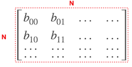 | $A = N^2$ <br/> $B = N^2$ | for i in range(0, N):<br/> $\quad$ for k in range(0, N):<br/> $\quad \quad$ for `j` in range(0, N):<br/> $\quad \quad \quad$ C[i][j] += A[i][j] \* B[k][j] |
| Tiled<br/>(loop `j`) | 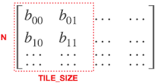 | $A = N^2$ <br/> $B = N \times tile \ size$ | ( `T_j` : TILE_SIZE )<br/>for `j_t` in range(0, N, `T_j`):<br/> $\quad$ for i in range(0, N):<br/> $\quad \quad$ for k in range(0, N):<br/> $\quad \quad \quad$ for `j` in range(`j_t`, `j_t + T_j`):<br/> $\quad \quad \quad \quad$ C[i][j] += A[i][j] \* B[k][j] |
| Tiled<br/>(loop `k`) | 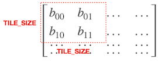 | $A = N^2$ <br/> $B = tile \ {size}^2$ | ( `T_j`=`T_k` : TILE_SIZE )<br/>for `k_t` in range(0, N, `T_k`):<br/> $\quad$ for `j_t` in range(0, N, `T_j`):<br/> $\quad \quad$ for i in range(0, N):<br/> $\quad \quad \quad$ for `k` in range(`k_t`, `k_t + T_j`):<br/> $\quad \quad \quad \quad$ for `j` in range(`j_t`, `j_t + T_j`):<br/> $\quad \quad \quad \quad \quad$ C[i][j] += A[i][j] \* B[k][j] |
| Tiled<br/>(loop `i`) | 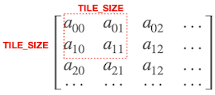 | $A = tile \ {size}^2$ <br/> $B = tile \ {size}^2$ | ( `T_j`=`T_k`=`T_i` : TILE_SIZE )<br/>for `i_t` in range(0, N, `T_i`):<br/> $\quad$ for `k_t` in range(0, N, `T_k`):<br/> $\quad \quad$ for `j_t` in range(0, N, `T_j`):<br/> $\quad \quad \quad$ for `i` in range(`i_t`, `i_t + T_i`):<br/> $\quad \quad \quad \quad$ for `k` in range(`k_t`, `k_t + T_k`):<br/> $\quad \quad \quad \quad \quad$ for `j` in range(`j_t`, `j_t + T_j`):<br/> $\quad \quad \quad \quad \quad \quad$ C[i][j] += A[i][j] \* B[k][j] |

---

### 17.3.3 Loop Unrolling: Reducing Branch Overhead

**loop unrolling**이란, loop control에서 발생하는 overhead를 줄이기 위한 최적화 기법이다.

| overhead(loop control) | example |
| --- | --- |
| arithmetic operations for pointer | e.g., i++, j++, k++ |
| end of loop test | e.g., k < N |
| branch prediction | e.g., if-else |

다음은 loop unrolling을 수행한 코드 예시다.

> Intel Xeon 4114 테스트: 24296 ms $\rightarrow$ 8512 ms (2.85x speed up)

| | | Arithmetic for pointer | \#loop test | Code size |
| --- | --- | :---: | :---: | :---: |
| Original | for i in range(0, N):<br/> $\quad$ for j in range(0, N):<br/> $\quad \quad$ for k in range(0, N):<br/> $\quad \quad \quad$ c[i][j] += A[i][k] \* B[k][j] | $N^3$ | $N^3$ | 1 |
| Unrolled(by 4) | for i in range(0, N):<br/> $\quad$ for j in range(0, N):<br/> $\quad \quad$ for k in range(0, N, `4`):<br/> $\quad \quad \quad$ c[i][j] += A[i][k] \* B[k][j]<br/> $\quad \quad \quad$ c[i][j] += A[i][k+`1`] \* B[k+`1`][j]<br/> $\quad \quad \quad$ c[i][j] += A[i][k+`2`] \* B[k+`2`][j]<br/> $\quad \quad \quad$ c[i][j] += A[i][k+`3`] \* B[k+`3`][j] | ${{1} \over {4}}N^3$ | ${{1} \over {4}}N^3$ | 4 |

---

## 17.4 SIMD Programming

많은 현대 processor(ARM Cortex-M4, M7 포함)에서, 병렬적으로 명령을 처리할 수 있는 **SIMD**(Single Instruction Multiple Data) instruction을 지원한다.

| Single Instruction<br/>Single Data | Single Instruction<br/>Multiple Data(SIMD) |
| :---: | :---: |
|  |  |

SIMD programming을 위해서 **vector register**와 **vector operation**을 제공하고 있으며, 이를 기반으로 추론 효율을 향상시킬 수 있다.

---

### 17.4.1 SIMD Programming: ARM NEON Example

다음은 128 bit SIMD instructions 버전의 loop문 예시다.

- `vld1q_f32`/`vmulq_f32`/`vaddq_f32`

  - `v`: vector, `ld/mul/add`: load/multiply/add, `1`: number of vector, `q`: quadword(128 bits)

```cpp
preprocessing();    // Intialize A, B, C and transpose B as transpose tmp

for (i = 0; i < C->row; i++)
    for (j = 0; j < C->column; j++) {
        float accumulators[4] = {0, 0, 0, 0};
        float32x4_t *acc = (float32x4_t *)accumulators;    // initialize accumulators (four 32-bit vectors)
        for (k = 0; k < A->column; k += 4) {
          float32x4_t val = vmlq_f32(vld1q_f32(&A[i][k]), vld1q_f32(&transpose_tmp[j][k]));    // load A[i][k] and tmp[j][k], multiply them
          *acc = vaddq_f32(*acc, val);    // add the result to accumulators
        }
        c[i][j] = accumulators[0] + accumulators[1] + accumulators[2] + accumulators[3];    // store the result
    }
```

---

### 17.4.2 SIMD Programming: ARM Cortex-M Example

> [CMSIS-NN: Efficient Neural Network Kernels for Arm Cortex-M CPUs 논문(2018)](https://arxiv.org/abs/1801.06601)

Cortex-M 프로세서는 16 bit SIMD instructions을 지원한다. 8bit로 양자화된 데이터가 있다고 가정하고, 다음의 16 bit MAC 명령어를 활용하는 예시를 살펴보자.(operand: 16bit, output: 32bit)

- 먼저, 8bit 데이터를 16bit로 변환하는 과정을 수행한다. (`arm_q7_to_q15` 함수)

  - `ROR`: rotate right, `SXTB16`: sign extend and pack to 16 bits, `PKHTB`: pack high half to bottom, `PKHBT`: pack high to bottom

  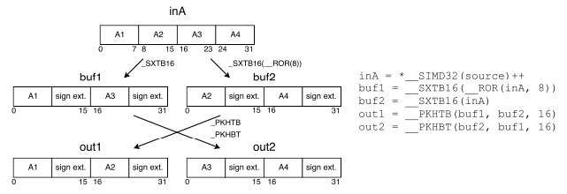

  ```cpp
  inA = *__SIMD32(source)++
  buf1 = __SXTB16(__ROR(inA, 8))    // A1, A3
  buf2 = __SXTB16(inA)              // A2, A4
  // data reordering (경우에 따라 생략 가능)
  out1 = __PKHTB(buf1, buf2, 16)
  out2 = __PKHBT(buf2, buf1, 16)
  ```

- 이러한 변환 후, matrix mutiplication을 수행한다. (2x2 kernel로 구현된다.)

  - `SMLAD`: signed multiply accumulate dual

  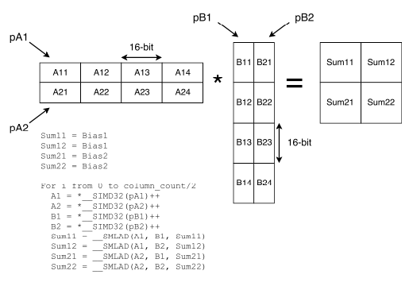

  ```cpp
  Sum11 = Bias1
  Sum12 = Bias1
  Sum21 = Bias2
  Sum22 = Bias2

  For i from 0 to column count/2
    A1 = *__SIMD32(pA1)++
    A2 = *__SIMD32(pA2)++
    B1 = *__SIMD32(pB1)++
    B2 = *__SIMD32(pB2)++
    Sum11 = __SMLAD(A1, B1, Sum11)    // (1,1)
    Sum12 = __SMLAD(A1, B2, Sum12)    // (1,2)
    Sum21 = __SMLAD(A2, B1, Sum21)    // (2,1)
    Sum22 = __SMLAD(A2, B2, Sum22)    // (2,2)
  ```

참고로 입력과 가중치가 동일한 `q_7t`유형일 경우, 첫 번째 단계에서 재정렬이 필요하지 않다.


혹은, 한 번의 point access로 weight를 읽어올 수 있도록, 처음부터 row data를 interleaving한 배치로 메모리에 저장할 수 있다.(**weight reordering**)


---

## 17.5 Im2col Convolution

**Im2col**은 convolution 연산을 matrix multiplication으로 바꾸는 기법이다.


convolution 연산을 direct하게 만든다면, 다음 예시에서 kernel 0과 input activation 사이의 convolution을 6개의 중첩 loop문으로 구현해야 한다.

| | | |
| :---: | :---: | :---: |
| Direct Convolution |  | 6개 중첩 loop |
| Im2Col |  | 3개 중첩 loop |

하지만 element가 중복되기 때문에, memory footprint 면에서 9배를 더 차지하게 된다.(window 개수가 9개임을 생각하자)

> 이 문제를 해결하기 위해 주로 **implicit GEMM**을 사용한다.

---

## 17.6 In-place Depth-wise Convolution

**In-place depth-wise convolution**은 depth-wise convolution 연산에서, 결과가 입력 메모리를 대체(in-place)하는 최적화 기법이다.

| General depth-wise convolution | In-place depth-wise convolution |
| :---: | :---: |
| 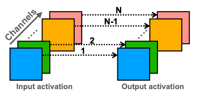 |  |
| peak mem: $2 \times C \times H \times W$ | peak mem: $(1 + C) \times H \times W$ |

---

## 17.7 Choosing Appropriate Data Layouts

| | | |
| :---: | :---: | :---: |
| pointwise |  | NHWC 유리 |
| depthwise |  | NCHW 유리 |

---

## 17.8 Winograd Convolution

(생략)

---