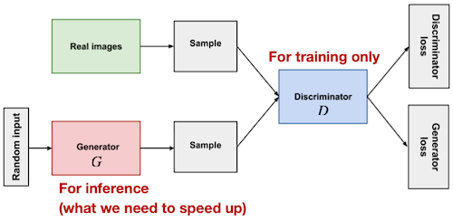
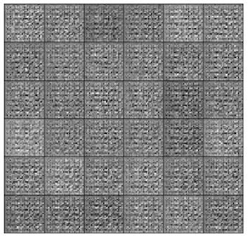
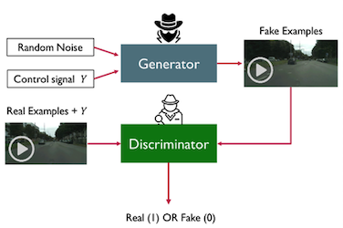
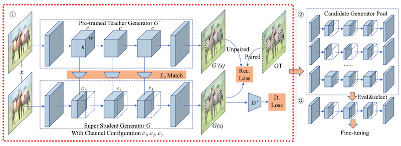
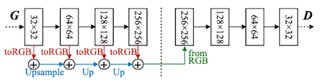
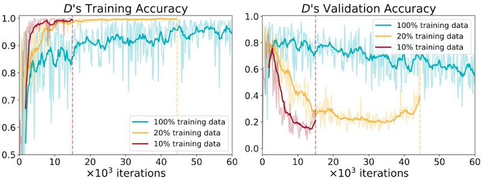
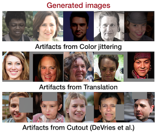
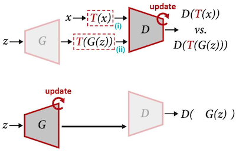
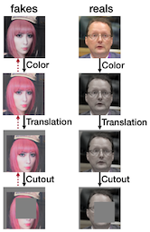

# 19 Efficient Video Understanding and Generative Models

> [Lecture 19 - Efficient Video Understanding and Generative Models | MIT 6.S965](https://youtu.be/0WZSzStMgLk?si=Kez32e0mNPgiZhjn)

> [EfficientML.ai Lecture 15 - GAN, Video, and Point Cloud (MIT 6.5940, Fall 2023, Zoom)](https://youtu.be/WU7tpyesm68?si=iRrWKkupS0KMkgUp)

---

## 19.5 Generative Adversarial Networks (GANs)

> [Generative Adversarial Networks 논문(2014)](https://arxiv.org/abs/1406.2661)

> [Thalles' blog: A Short Introduction to Generative Adversarial Networks](https://sthalles.github.io/intro-to-gans/)

Generative Adversarial Networks(GANs)은, 크게 **Generator**(생성자)와 **Discriminator**(판별자) 두 가지 모델 기반으로 구성된다.

- 목표

  - **Discriminator** $D$ : fake image를 최대한 판별

  - **Generator** $G$ : Discriminator $D$ 가 fake image를 최대한 판별하지 못하도록 샘플 생성

다음은 GANs을 나타낸 도식도다.



- Discriminator $D$ 는 두 가지 입력을 받는다.

  - real image
  
  - random input을 받아서 Generator $G$ 가 생성한 fake image

- GAN의 objective function는 다음과 같다.

$$ \underset{\mathrm{real \ sample}}{E_x[\log(D(x))]} + \underset{\mathrm{fake \ sample}}{E_z[\log(1-D(G(z)))]} $$

다음은 MNIST 데이터셋을 이용하여 GANs을 학습할 때, generator가 생성한 입력 샘플을 시각화한 그림이다.

| random initialization | training |
| :---: | :---: |
|  |  |

> GAN 성능 평가지표는, IS(Inception Score) 혹은 FID(Frechat Inception Distance)을 주로 사용한다.

---

### 19.5.1 Conditional vs Unconditional GANs

> [Polygon generation and video-to-video translation for time-series prediction 논문(2022)](https://www.researchgate.net/figure/A-simplified-schematic-of-a-unconditional-GAN-and-b-conditional-GAN-Both-unconditional_fig3_363818922)

| Conditional GANs(CGAN) | Unconditional GANs |
| :---: | :---: |
|  |  |
| $G$ 가 random noise를 입력으로 받는다. | $D$ 와 $G$ 가 **labels**를 따른다.<br/>(class label, segmantation map, strokes, ...) |

---

### 19.5.2 Difficulties in GANs

하지만 GANs는 recognition 모델에 비해서, 더 많은 비용이 필요하다.


---

## 19.6 GAN Compression: Compress Generators

> [GAN Compression: Efficient Architectures for Conditional GANs 논문(2020)](https://arxiv.org/abs/2003.08936)

GAN Compression 논문에서는, NAS와 Distillation 기법을 사용해 GANs의 효율성을 높인다.



이때, NAS 기반으로 (슈퍼넷과 유사한 성격의, 여러 채널을 갖는) Super Generator를 학습한다. (①)

- 사전 학습된 교사 Generator를 통한 지식 증류를 사용한다.

  > 각 레이어마다 intermediate representation를 매칭하며, 이때 교사와 학생 차원이 일치하도록 projection 과정을 거친다.

$$ \mathcal{L}_{distill} = \sum^n_{k=1}{||G_k(x) - f_k({G'}_k(x))||} $$

- 교사 모델의 출력을 함께 사용하면 성능에 도움이 된다. (unpaired to paired learning)

```math
\mathcal{L}_{recon} = \begin{cases} ||G(x)- y|| & \mathrm{paired} \ \mathrm{cGANs} \\ ||G(x) - G'(x) || & \mathrm{unpaired} \ \mathrm{cGANs} \end{cases}
```

최종적으로 objective function은 다음과 같다.

$$ \mathcal{L}(x) = \mathcal{L}_{cGAN}(x) + {\lambda}_{recon}\mathcal{L}_{recon}(x) + {\lambda}_{distill}\mathcal{L}_{distill}(x) $$

탐색 시, Evolutionary Search(진화 탐색)를 기반으로 하여, 최적의 latency-accuracy trade-off 설정을 찾는다.(②) 이후 fine-tuning을 거친다.(③)

---

## 19.7 Anycost GANs: Dynamic Cost vs Quality

> [Anycost GANs for Interactive Image Synthesis and Editing 논문(2021)](https://arxiv.org/abs/2103.03243)

사용자에게 제공할 preview 생성 등의 목적으로, 다소 quality를 희생하더라도 latency를 줄여야 하는 경우가 있다. (dynamic cost) Anycost GANs 논문은 동적 신경망(해상도 및 채널 수 조절)을 기반으로 이를 구현했다.

- **Dynamic Resolution**

    다음은 다양한 입력 해상도를 사용하는 GANs 모델과, Anycost GANs 모델을 비교한 그림이다.

    | StyleGAN2 | MSG-GAN | Anycost GANs |
    | :---: | :---: | :---: |
    |  |  |  |
    | 오직 최대 해상도를 사용한다.<br/>(upsampling 적용) | 레이어마다 모든 해상도를 사용한다. | 입력 해상도에 맞게 서브넷 샘플링 후 사용한다. |

- **Dynamic Channels**

  서브넷이 다양한 channel 설정을 갖도록 학습한다.

  - 이때 Distillation을 적용하여, 채널 수가 적은 서브넷의 성능을 높인다.

  - 다양한 서브넷을 포함할 때, 모두 동일한 Discriminator를 사용해 학습하면, 일부 서브넷에서 성능 저하가 발생할 수 있다.

    이를 방지하기 위해, Generator 구조를 원-핫 인코딩한 뒤 Discriminator의 condition으로 사용하여, 서브넷 사이에 발생하는 성능 저하를 방지한다.

  

---

## 19.8 Data-Efficient GANs

> [Differentiable Augmentation for Data-Efficient GAN Training 논문(2020)](https://arxiv.org/abs/2006.10738)

좋은 성능을 갖는 GAN을 획득하기 위해서는, 굉장히 많은 데이터가 필요하다. 위 논문에서는 학습에 필요한 데이터를 줄일 수 있는, 효율적인 augmentation 기법을 제안한다.

이때, less data 학습 중 Discriminator에서 overfitting이 발생하면, Generator의 성능 저하로 이어지는 현상에 주목한다.



따라서, Discriminator의 overfitting을 방지하기 위해, **data augmentation** 기법을 사용할 수 있다. 다음은 GAN에서 주로 사용되는 data augmentation 기법을 비교한 도표다.

- **Differentiable Augmenatation** (Data-Efficient GANs 제안 방식)

  많은 augmentation 기법이 differentiable한 특징을 이용하여, backpropagation 과정에서 augmentation을 포함한 계산으로 업데이트를 수행한다. 

| Approach | Model | Note(example) |
| :---: | :---: | :---: |
| Real Images |  | <br/>생성된 결과 이미지에 동일한 artifacts가 반영되는 문제가 발생한다. |
| Discriminator's Reals & Fakes |  | <br/>augmentation을 적용하지 않으면, 정상적으로 사용할 수 없는 성능을 획득한다. |
| DiffAugment |  |  |

---